* unhinged diffusion                                                  :TOC_4:
- [[#introduction][Introduction]]
- [[#results][Results]]
- [[#getting-started][Getting started]]
- [[#configuration][Configuration]]
- [[#status-and-implementation-details][Status and implementation details]]

* Introduction

This is unhinged diffusion - the attempt make LLMs cosplay as stable diffusion in Emacs.

What stable diffusion does is simplified this:

- phase 1: setup and encoding
  - CLIP encodes your prompt into embeddings
  - Creates some random noise to get started. When starting with an image, also create an embedding via VAE encoder
- phase 2: denoising loop
  - noise prediction: tries to find shapes in the noise
  - noise removal: removes some of the predicted noice, cleaning up the latent grid
- phase 3: output
  - VAE decoder converts the latent grid back into an image

What we're doing is:

- phase 1: setup and encoding
  - we generate noise in a canvas; the canvas size controls the image size
  - we 'encode' by converting the canvas into an image, and uploading it to the LLM with a modified prompt ("Refine this into a a cat. You're at step n/50")
- phase 2: denoising loop
  - the LLM uses tools for denoising/sharpening/... to improve the canvas
  - we sample by taking a new snapshot, and send it back with an updated prompt

Our cosplayer is at a slight disadvantage - stable diffusion got trained "given this prompt and this noisy latent, here's what a less noisy version looks like". Not only does our LLM not have this information - it also needs to cross text and vision encoding barriers for each single step, while stable diffusion gets to chill in U-Net space and happily hallucinate structure into noise.

To even the playing field we provide some simple drawing primitives for lines, circles and rectangles. If you think that's unfair you can filter those tools out, though.

* Results

Complete sample runs are available in the [[./runs/][runs]] directory.

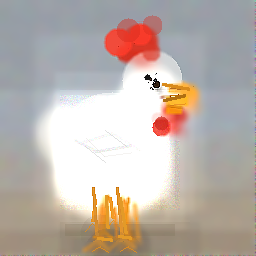 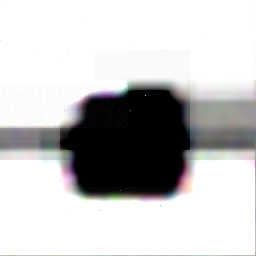 [[./img/results/unhinged-diffusion-a8481a.png]]
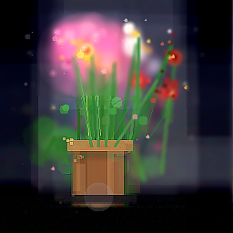 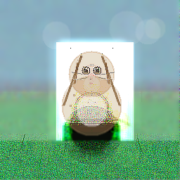 [[./img/results/unhinged-diffusion-5b1ebc.png]]
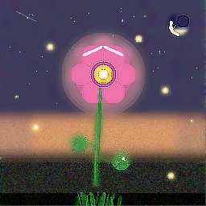 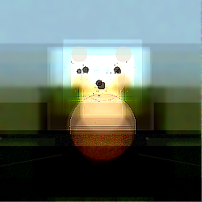 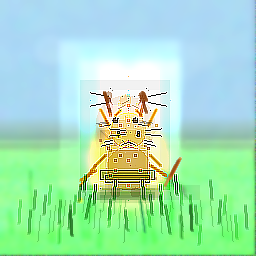
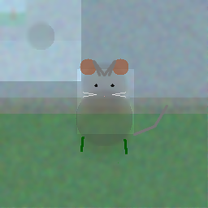 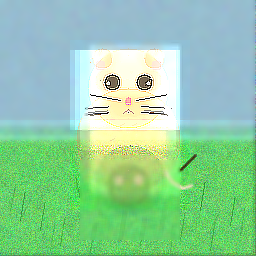 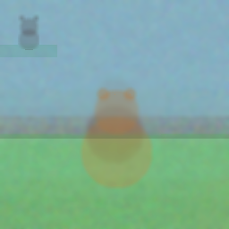

* Getting started

You'll need Emacs with canvas support. This means either unstable Emacs, or Emacs 31 with [[https://github.com/minad/emacs-canvas-patch][canvas patch]]. The patch there may not apply against the release tarball - but [[./canvas-31.patch]] does. You can use the above repository to check if it works.

Next you'll need to install and configure [[https://github.com/aard-fi/eai-tool-library][eai-tool-library]] and [[https://github.com/karthink/gptel][gptel.]]

And finally, you'll need to clone this repository, add it to your loadpath, and =(require 'unhinged-diffusion)=.

You can interactively start a run with =M-x unhinged-diffusion=, though at this stage I'd recommend starting it from a buffer, like this:

#+BEGIN_SRC elisp
(unhinged-diffusion-generate "a cat sitting on green grass" 10 256 256
                             (cons "ollama-mac" 'kimi-k2.6:cloud)
                             'full)
#+END_SRC

This will create a new run, in a new buffer, for an image with a size of 256x256 pixels, and try to have kimi on the =ollama-mac= gptel backend use all available tools to draw a cat. Expect this to take about 30 minutes. Tool calls, step images as well as commentary what it is trying to achieve will be added to this buffer.

You can follow along in the =*unhinged-diffusion-debug*= buffer, if you want to see what's going on behind the scenes.

* Configuration

To keep the results you can set =unhinged-diffusion-output-directory= to the path of a directory. This will move the step images from a temporary location to a run specific subdirectory there, export the final canvas to =final.png=, and save the org-file with the original prompt as the filename.

To compensate for having to re-interpret the latent from scratch every run we allow passing composition notes. To disable that (which results in a less tight composition) you can set =unhinged-diffusion-pass-commentary= to =nil= to disable passing the models commentary about the last step forward, and =unhinged-diffusion-allow-step-notes= to =nil= to disable saving a note persisting over all steps.

=unhinged-diffusion-notes-max-length= can limit the maximum allowed length of text passing, it defaults to =1000=.

* Status and implementation details

This started about two weeks ago as experiment to see if I could get a LLM to cosplay as stable diffusion. I didn't expect this to work at all. So, to keep effort low I just implemented the various filters on rectangular selections. This is somewhat limiting, but did show that it tried to actually compose something:

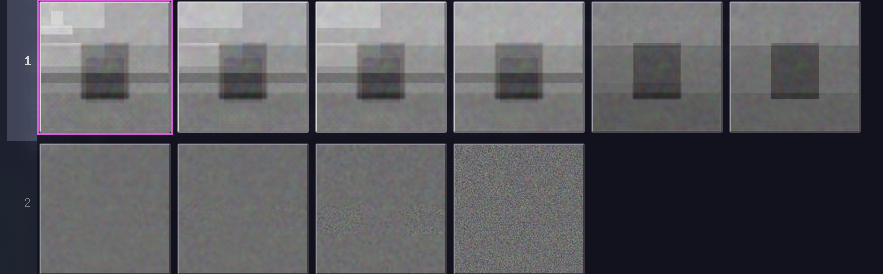

It also shows in its responses how it is planning things out, though it is a bit overconfident in its abilities:

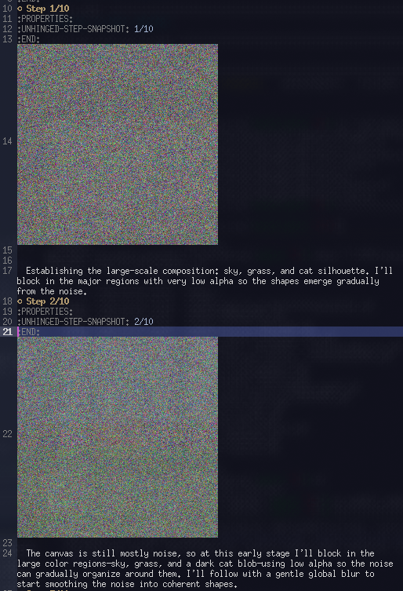

So next it gained some drawing primitives (reasoning explained above), which lead to this run eventually resulting in this:

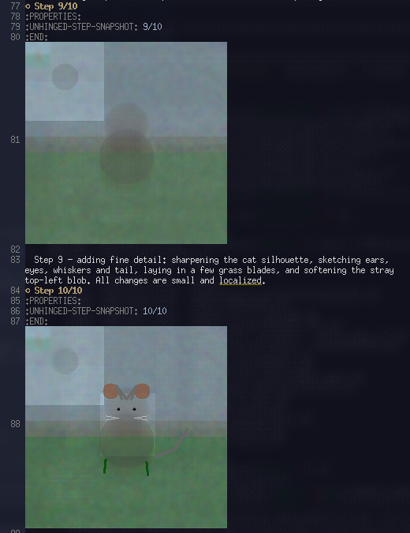

The "thumbnail" in the top left is an interesting artifact, caused by us not telling it how big the canvas is. It is aware that stable diffusion often operates on smaller images, and then gets scaled up, so sometimes it is assuming this is the case here as well, and adjusts its coordinates for that. We now always tell it the actual canvas dimensions to prevent this.

Having that fixed directly resulted in promising detail in another run:

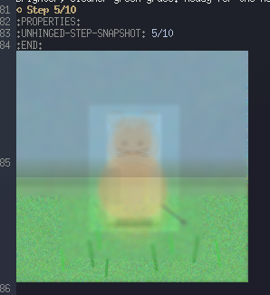

But then it forgot where it started the cat:

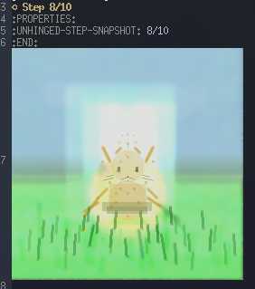

And remembered it again just when finishing:

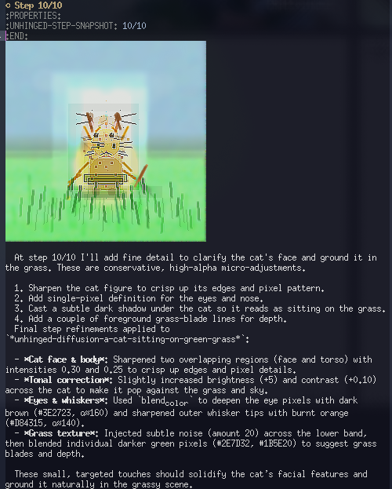

All those pictures show quite well that the rectangle only operation is a problem, so the next big thing would be implementing more flexible area selection for those tools.
