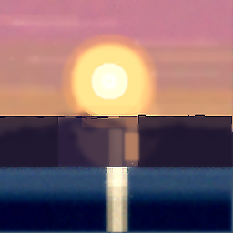
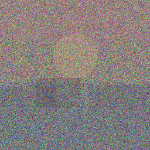
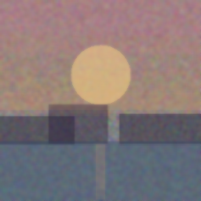
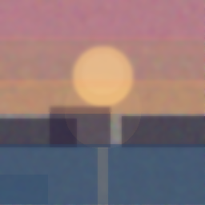
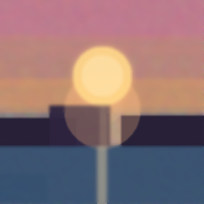
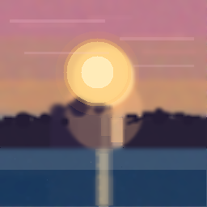
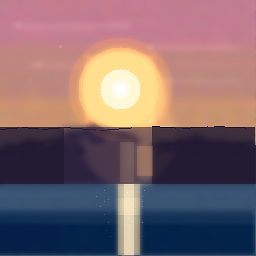
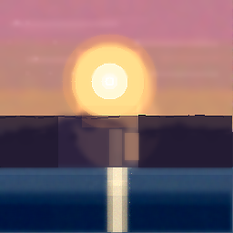

* Canvas
:PROPERTIES:
:UNHINGED-SECTION: canvas
:END:

* Step History
:PROPERTIES:
:UNHINGED-SECTION: step-history
:END:
** Step 1/10
:PROPERTIES:
:UNHINGED-STEP-SNAPSHOT: 1/10
:END:

  The target is open-ended, so I'll commit to a scene: a dramatic sunset — glowing sun low over layered mountain silhouettes with water below. Step 1 is composition: I'll block in the sky, sun, mountains, and water as large low-alpha regions over the noise.
  The canvas already has the sunset bones from the noise — I'll reinforce the existing structures: the sky gradient, sun disc, mountain band, and water, then smooth the noise into coherent forms.

  **Step 1a — lay in the composition blocks (low alpha, conservative):**
** Step 2/10
:PROPERTIES:
:UNHINGED-STEP-SNAPSHOT: 2/10
:END:

  I'll continue refining the sunset composition that was started in step 1. The blocks are in place — now I'll reinforce the sky gradient (it needs to warm toward orange near the horizon), strengthen the water band, and gently smooth the noise grain.
  Continuing the sunset composition: I'll first smooth the grain with a light global blur, then reinforce the sky gradient bands (pink→orange toward the horizon), the horizon glow, the sun disc, the mountain silhouettes, the water band, and the sun's reflection column — all at low-to-medium alpha so they blend gently.
** Step 3/10
:PROPERTIES:
:UNHINGED-STEP-SNAPSHOT: 3/10
:END:

  The sunset composition is emerging nicely — sun disc, mountains, and water are all in place from the notes. This step I'll consolidate: smooth the grainy sky into a proper gradient, clean up the noisy bottom-left of the water, then reinforce glow, sun, mountains, and the reflection column in place.
  Consolidating the sunset now. First, I'll smooth the grainy sky and clean up the noisy water with blur passes, then rebuild the gradient and structures on top.
** Step 4/10
:PROPERTIES:
:UNHINGED-STEP-SNAPSHOT: 4/10
:END:

  Step 4, refinement. The composition is in place — now I'll smooth the remaining grain, then add the finer structures noted: jagged mountain peaks, sun rim, water ripples, and subtle clouds. First, gentle blur passes to consolidate the regions before drawing detail on top.
  Continuing the refinement plan: first the gentle blur passes to consolidate the sky, mountain silhouettes, and water — then I'll draw the peaks, sun rim, ripples, and clouds on top of the smoothed base.
** Step 5/10
:PROPERTIES:
:UNHINGED-STEP-SNAPSHOT: 5/10
:END:

  Looking at the current state: the base composition is in place (sky gradient, sun, mountain silhouettes, water) but everything is soft. This refinement step will smooth the noisy regions, then re-assert the sun rim/core, cloud streaks, crisp mountain edges, ripple texture, and the reflection column on top.
  The composition is blocked in; now I'll execute the refinement pass I planned: first smooth the noisy regions, then re-assert the sun, glow, gap light, and reflection column on top.
** Step 6/10
:PROPERTIES:
:UNHINGED-STEP-SNAPSHOT: 6/10
:END:

  I'm at step 6, refinement phase. Following my plan from the notes: first smooth the noisy regions with gentle blurs, then re-assert the key light structures (sun, gap glow, reflection column) on top of the smoothed base.
  Continuing from the plan: first the gentle smoothing passes, then re-asserting the light structures on the cleaned base.
** Step 7/10
:PROPERTIES:
:UNHINGED-STEP-SNAPSHOT: 7/10
:END:

  Continuing from the plan: the base is clean, so now I'll add the remaining light details — the sun's hot sparkle core, shimmer streaks flanking the reflection column, and crisp up the sun rim — all as small, controlled touches.
  I'll now apply the planned step-7 refinements: subtle cloud tints on the sky streaks, extra ripple texture in the water flanks, and a re-asserted sun sparkle core.
** Step 8/10
:PROPERTIES:
:UNHINGED-STEP-SNAPSHOT: 8/10
:END:

  Step 8, detail phase. The sunset composition is well established — sun disc, mountain band, water with reflection column. Per the notes, this is a cleanup pass: crisp the sun rim and horizon edges, balance tonal values slightly (deepen lower water, boost the bright column top), and sharpen the mountain silhouette. No new structures.
  Continuing the step‑8 cleanup pass on the sunset: I'll add the warm glow tint through the mountain gap, set a crisp horizon line, apply the tonal balance (deepen lower water, boost column top), and lay in light water/sky texture noise first — then place the fine flecks and sharpening on top so they stay crisp.
** Step 9/10
:PROPERTIES:
:UNHINGED-STEP-SNAPSHOT: 9/10
:END:

  Step 9, detail phase — I'll add only micro-refinements to the existing sunset: a warm tint nudge on the four cloud streaks, crisp rim/sparkle pixels on the sun, one-pixel ripple glints on the shimmer lines and the mountain-gap glow. No new structures.
  Step 9 micro-refinements applied — all changes were small, in-place nudges to existing structures:

  **Cloud streaks (sky y0–142):** Four very low-alpha warm rectangles (#FFC79A / #FFD2A6, alpha 22–26) tinted the existing streaks at (0,16), (150,56), (0,92), and (170,114) — no new shapes, just a gentle sunset warmth shift.

  **Sun (120,89):** Re-crisped the core sparkle with a radius-3 near-white disc (#FFF7DC, alpha 190) and added two rim glint pixels at (106,75) and (134,103) on the upper-left/lower-right of the disc edge.

  **Water column (x118–140):** Five single-pixel glints placed down the shimmer line at y192, 205, 219, 231 (fading alpha 120→85, slightly warm off-whites so they read as light catching ripples), plus re-nudged the side flecks at (116,200) and (144,215). A light 0.18 sharpen over (116,184)–(142,246) crisped the column edges so the new glints don't blur.

  **Mountain gap (x138–152):** Two warm pixels (#FFB27A, #FF9E63) at (144,175) and (148,181) intensify the glow betwe …
** Step 10/10
:PROPERTIES:
:UNHINGED-STEP-SNAPSHOT: 10/10
:END:

  Final step (10/10) — per my notes, this is cleanup only: crisp the horizon and mountain ridge, gently calm the residual grain, and a whisper of global contrast. No new structures.
  Grain is calmed in sky, mountains, and water. Now crisping the key edges.
* Edit Log
:PROPERTIES:
:UNHINGED-SECTION: edit-log
:END:
** Step 1/10
:PROPERTIES:
:UNHINGED-STEP-LOG: 1/10
:END:
- =draw_rectangle(0,0 256x140, #FF9E5E, α:28)=

- =draw_rectangle(0,0 256x70, #E8749C, α:24)=
- =draw_circle(128,95 r:38, #FFD98A, α:40)=
- =draw_rectangle(0,148 95x35, #2E2440, α:32)=
- =draw_rectangle(62,133 75x50, #241C33, α:36)=
- =draw_rectangle(152,145 104x38, #2E2440, α:32)=
- =draw_rectangle(0,180 256x76, #2C4A6E, α:35)=
- =notes: Sunset scene 256x256. Sky band y=0-140 (pink #E8749C at top blending to orange #FF9E5E). Sun disc centered ~(128,95) r~38 (#FFD98A). Mountain silhouettes: left peak x=0-95 y=148-183, center peak x=62-137 y=133-183, right peak x=152-256 y=145-183 (#241C33/#2E2440). Water band y=180-256 (#2C4A6E) with future sun reflection near x~128.=
- =blur_region(0,0→256,256, r:2)=
- =draw_rectangle(0,0 256x45, #E8749C, α:26)=
- =draw_rectangle(0,45 256x55, #F48B7C, α:20)=
- =draw_rectangle(0,100 256x45, #FF9E5E, α:22)=
- =draw_circle(128,95 r:38, #FFD98A, α:70)=
- =draw_rectangle(0,148 95x36, #241C33, α:60)=
- =draw_rectangle(62,133 76x51, #2E2440, α:60)=
- =draw_rectangle(152,145 104x39, #241C33, α:60)=
- =draw_rectangle(0,180 256x76, #2C4A6E, α:60)=
- =draw_rectangle(121,182 14x60, #FFB27A, α:26)=
** Step 2/10
:PROPERTIES:
:UNHINGED-STEP-LOG: 2/10
:END:
- =blur_region(0,0→255,140, r:2)=

- =blur_region(0,133→255,183, r:1)=
- =blur_region(0,180→255,255, r:2)=
- =notes: Sunset scene 256x256. Sky gradient y=0-140: pink #E8749C top blending to orange #FF9E5E near y=100-140. Sun disc centered (128,95) r~38 #FFD98A. Mountain silhouettes (dark purple): left x=0-95 y=148-183, center x=62-137 y=133-183 (#2E2440), right x=152-256 y=145-183 (#241C33). Water y=180-256 #2C4A6E with vertical sun-reflection streak x~121-135 starting y=182.=
- =notes: Sunset 256x256: sky gradient y=0-140, pink #E8749C top blending to orange #FF9E5E near y=140; sun disc center (128,95) r~38 #FFD98A; mountains: left (0-95, 148-183), center (62-137, 133-183), right (152-256, 145-183), dark #241C33/#2E2440; water y=180-256 #2C4A6E; sun reflection column x~122-134 from y=184 down.=
- =draw_rectangle(0,0 256x45, #E8749C, α:22)=
- =draw_rectangle(0,45 256x45, #F2897B, α:18)=
- =draw_rectangle(0,90 256x50, #FF9E5E, α:18)=
- =draw_rectangle(0,118 256x30, #FFAE6B, α:12)=
- =draw_circle(128,95 r:38, #FFD98A, α:55)=
- =draw_rectangle(0,148 95x36, #241C33, α:45)=
- =draw_rectangle(62,133 75x50, #2E2440, α:45)=
- =draw_rectangle(152,145 104x38, #241C33, α:45)=
- =draw_rectangle(0,180 256x76, #2C4A6E, α:35)=
- =draw_rectangle(122,184 12x70, #F2A15E, α:20)=
- =blur_region(0,0→255,138, r:2)=
- =blur_region(0,128→255,186, r:2)=
- =blur_region(0,182→255,255, r:2)=
- =blur_region(0,0→255,255, r:2)=
- =draw_rectangle(0,0 256x52, #E8749C, α:26)=
- =draw_rectangle(0,56 256x48, #F0877A, α:22)=
- =draw_rectangle(0,100 256x42, #FF9E5E, α:30)=
- =draw_circle(128,138 r:48, #FFC27A, α:22)=
- =draw_circle(128,95 r:37, #FFD98A, α:75)=
- =draw_circle(128,92 r:26, #FFE9BC, α:35)=
- =draw_rectangle(0,180 256x76, #2C4A6E, α:60)=
- =draw_rectangle(0,148 96x36, #241C33, α:60)=
- =draw_rectangle(62,133 76x51, #2E2440, α:60)=
- =draw_rectangle(152,145 104x39, #241C33, α:60)=
- =draw_rectangle(122,184 13x72, #F2C98A, α:40)=
- =notes: Sunset 256x256: sky y=0-140 gradient, pink #E8749C top → #F0877A mid (y~56-104) → orange #FF9E5E (y=100-140); horizon glow circle r~48 at (128,138); sun disc center (128,95) r~37 #FFD98A with lighter core r~26; mountains left (0-95,148-183) #241C33, center (62-137,133-183) #2E2440, right (152-255,145-183) #241C33; water y=180-255 #2C4A6E; sun reflection column x=122-134, y=184-255.=
** Step 3/10
:PROPERTIES:
:UNHINGED-STEP-LOG: 3/10
:END:
- =blur_region(0,0→255,140, r:2)=

- =draw_rectangle(0,0 256x50, #E8749C, α:35)=
- =draw_rectangle(0,45 256x65, #F0877A, α:30)=
- =draw_rectangle(0,100 256x42, #FF9E5E, α:30)=
- =draw_rectangle(0,180 256x75, #2C4A6E, α:70)=
- =draw_rectangle(0,218 60x37, #2C4A6E, α:80)=
- =blur_region(0,40→255,115, r:2)=
- =draw_circle(128,138 r:48, #FFB27A, α:40)=
- =draw_circle(128,130 r:26, #FFCE96, α:35)=
- =draw_circle(128,95 r:37, #FFD98A, α:75)=
- =draw_circle(128,93 r:25, #FFE8B8, α:55)=
- =draw_rectangle(0,148 95x35, #241C33, α:85)=
- =draw_rectangle(62,133 75x50, #2E2440, α:85)=
- =draw_rectangle(152,145 103x38, #241C33, α:90)=
- =draw_rectangle(122,184 12x71, #E8C79A, α:45)=
- =blur_region(0,180→255,255, r:1)=
- =blur_region(116,182→140,255, r:2)=
- =notes: Sunset 256x256: sky y=0-140 gradient pink #E8749C (top) → #F0877A (y~45-110) → orange #FF9E5E (y=100-140); horizon glow circle r~48 at (128,138); sun disc center (128,95) r~37 #FFD98A, lighter core r~25; mountains left (0-95,148-183) #241C33, center (62-137,133-183) #2E2440, right (152-255,145-183) #241C33; water y=180-255 #2C4A6E; sun reflection column x=122-134 y=184-255 #E8C79A (soft). Next: refine mountain top edges (jagged), add sun rim, water ripple texture, subtle clouds.=
- =blur_region(0,0→255,132, r:2)=
- =blur_region(0,183→255,255, r:2)=
** Step 4/10
:PROPERTIES:
:UNHINGED-STEP-LOG: 4/10
:END:
- =draw_rectangle(0,0 256x44, #E8749C, α:50)=

- =draw_rectangle(0,44 256x54, #F0877A, α:40)=
- =draw_rectangle(0,98 256x36, #FF9E5E, α:45)=
- =draw_rectangle(0,148 96x36, #241C33, α:220)=
- =draw_rectangle(62,133 76x51, #2E2440, α:220)=
- =draw_rectangle(152,145 104x39, #241C33, α:220)=
- =draw_rectangle(0,183 256x73, #2C4A6E, α:110)=
- =blur_region(0,0→255,133, r:2)=
- =draw_circle(128,138 r:48, #FFC08A, α:70)=
- =draw_circle(128,95 r:37, #FFD98A, α:200)=
- =draw_circle(128,95 r:26, #FFE9BC, α:110)=
- =draw_rectangle(122,184 12x72, #F2D8A8, α:90)=
- =draw_rectangle(125,133 10x52, #F2D8A8, α:40)=
- =blur_region(117,130→141,255, r:2)=
- =notes: Sunset 256x256: sky y=0-133 smooth gradient #E8749C (top) → #F0877A (y44-97) → #FF9E5E (y98-133), seams blurred; sun disc center (128,95) r~37 #FFD98A with lighter core r~26 #FFE9BC; horizon glow r~48 at (128,138) #FFC08A; mountains left (0-95,148-183) #241C33, center (62-137,133-183) #2E2440, right (152-255,145-183) #241C33; water y=183-255 #2C4A6E; sun reflection column x~122-140 full height y~133-255 (soft wisp over center-mountain right edge, brighter y184+), edges blurred.=
- =blur_region(0,0→255,142, r:2)=
- =blur_region(0,130→255,184, r:1)=
- =blur_region(0,182→255,255, r:2)=
- =draw_rectangle(4,144 12x6, #241C33, α:255)=
- =draw_rectangle(22,141 10x8, #241C33, α:255)=
- =draw_rectangle(40,145 12x5, #241C33, α:255)=
- =draw_rectangle(54,142 10x7, #241C33, α:255)=
- =draw_rectangle(66,129 12x5, #2E2440, α:255)=
- =draw_rectangle(84,126 14x7, #2E2440, α:255)=
- =draw_rectangle(102,130 12x4, #2E2440, α:255)=
- =draw_rectangle(118,127 12x6, #2E2440, α:255)=
- =draw_rectangle(130,131 8x3, #2E2440, α:255)=
- =draw_rectangle(156,141 14x5, #241C33, α:255)=
- =draw_rectangle(176,138 12x7, #241C33, α:255)=
- =draw_rectangle(196,142 14x5, #241C33, α:255)=
- =draw_rectangle(216,139 12x6, #241C33, α:255)=
- =draw_rectangle(234,143 14x4, #241C33, α:255)=
- =draw_circle(120,89 r:40, #F2B96E, α:55)=
- =draw_circle(120,89 r:22, #FFE7B4, α:55)=
- =draw_rectangle(137,146 16x30, #FFBE85, α:70)=
- =draw_circle(142,136 r:10, #FFB979, α:50)=
- =draw_line(20,26→105,26, #F2A8B8, α:40, w:3)=
- =draw_line(150,48→238,48, #EE9C92, α:38, w:3)=
- =draw_line(30,66→115,66, #E794A4, α:32, w:2)=
- =draw_line(158,80→235,80, #F09A82, α:30, w:2)=
- =draw_line(12,194→58,194, #4A6E93, α:45, w:2)=
- =draw_line(92,200→150,200, #4A6E93, α:45, w:2)=
- =draw_line(168,208→232,208, #4A6E93, α:45, w:2)=
- =draw_line(26,220→88,220, #4A6E93, α:45, w:2)=
- =draw_line(148,232→212,232, #4A6E93, α:45, w:2)=
- =draw_line(60,244→124,244, #4A6E93, α:45, w:2)=
- =draw_line(108,206→152,206, #22405E, α:40, w:1)=
- =draw_line(12,236→70,236, #22405E, α:40, w:1)=
- =draw_line(140,218→196,218, #22405E, α:40, w:1)=
- =draw_line(190,250→246,250, #22405E, α:40, w:1)=
- =draw_rectangle(117,218 24x37, #E2BD90, α:30)=
- =sharpen_region(0,126→255,150, i:0.20)=
- =sharpen_region(0,178→255,188, i:0.20)=
- =notes: Sunset 256x256: sky y=0-140 gradient pink #E8749C → orange #FF9E5E, cloud streaks y~26,48,66,80; sun disc ~(120,89) r~39 #FFD98A with rim + light core r~22; glow circle r~48 at (128,138), gap glow x=137-153 y=146-176; jagged mountains: left (0-95,141-183) #241C33, center (62-137,126-183) #2E2440, right (152-255,138-183) #241C33; water y=180-255 #2C4A6E with light/dark ripple streaks; reflection column x~117-141 y=184-255 soft #E8C79A. Next: deepen water toward bottom, warm glow bloom around sun, finer ripple texture, final edge cleanup.=
- =blur_region(0,0→255,55, r:2)=
- =blur_region(0,56→88,134, r:2)=
- =blur_region(168,56→255,134, r:2)=
- =blur_region(0,148→95,185, r:2)=
- =blur_region(62,133→137,185, r:2)=
- =blur_region(152,145→255,185, r:2)=
- =blur_region(0,186→255,255, r:2)=
** Step 5/10
:PROPERTIES:
:UNHINGED-STEP-LOG: 5/10
:END:
- =draw_circle(28,148 r:10, #241C33, α:255)=

- =draw_circle(55,146 r:7, #241C33, α:255)=
- =draw_circle(80,150 r:5, #241C33, α:255)=
- =draw_circle(10,152 r:4, #241C33, α:255)=
- =draw_circle(97,133 r:11, #2E2440, α:255)=
- =draw_circle(97,124 r:5, #2E2440, α:255)=
- =draw_circle(122,134 r:7, #2E2440, α:255)=
- =draw_circle(74,134 r:4, #2E2440, α:255)=
- =draw_circle(196,145 r:9, #241C33, α:255)=
- =draw_circle(196,138 r:5, #241C33, α:255)=
- =draw_circle(232,148 r:7, #241C33, α:255)=
- =draw_circle(168,148 r:4, #241C33, α:255)=
- =draw_line(28,140→28,140, #241C33, α:255, w:2)=
- =draw_line(59,151→60,151, #241C33, α:255, w:2)=
- =draw_line(97,121→97,121, #2E2440, α:255, w:2)=
- =draw_line(126,132→127,132, #2E2440, α:255, w:2)=
- =draw_line(195,137→196,137, #241C33, α:255, w:2)=
- =draw_line(232,147→233,147, #241C33, α:255, w:2)=
- =draw_circle(128,95 r:38, #FFE9BC, α:70)=
- =draw_rectangle(24,28 70x6, #F2A3AC, α:35)=
- =draw_rectangle(150,42 78x5, #F2A3AC, α:30)=
- =draw_rectangle(108,20 56x4, #F2A3AC, α:25)=
- =draw_rectangle(36,66 52x5, #E88A96, α:30)=
- =draw_rectangle(176,62 66x5, #E88A96, α:28)=
- =draw_rectangle(125,138 12x30, #E8B080, α:35)=
- =draw_line(36,198→78,198, #46688C, α:55, w:2)=
- =draw_line(156,201→206,201, #46688C, α:55, w:2)=
- =draw_line(26,214→64,214, #46688C, α:55, w:2)=
- =draw_line(166,217→212,217, #46688C, α:55, w:2)=
- =draw_line(58,229→104,229, #46688C, α:55, w:2)=
- =draw_line(152,233→210,233, #46688C, α:55, w:2)=
- =draw_line(34,245→86,245, #46688C, α:55, w:2)=
- =draw_line(172,247→224,247, #46688C, α:55, w:2)=
- =draw_line(120,190→142,190, #FFD98A, α:90, w:2)=
- =draw_line(121,204→141,204, #FFD98A, α:80, w:2)=
- =draw_line(122,218→140,218, #FFD98A, α:70, w:2)=
- =draw_line(123,232→139,232, #FFD98A, α:60, w:2)=
- =draw_line(124,246→138,246, #FFD98A, α:55, w:2)=
- =blur_region(0,118→95,162, r:2)=
- =blur_region(62,112→137,146, r:2)=
- =blur_region(152,128→255,160, r:2)=
- =blur_region(16,22→240,56, r:2)=
- =sharpen_region(96,58→160,130, i:0.25)=
- =sharpen_region(0,116→255,192, i:0.15)=
- =notes: Sunset 256x256: sky y0-133 gradient #E8749C→#FF9E5E with soft pink cloud bands (y28, y42, y62-71); sun disc (128,95) r37 #FFD98A, core r26 #FFE9BC, light rim r38 #FFE9BC; horizon glow r48 at (128,138) #FFC08A; mountains with jagged peaks: left range apexes (28,140),(55,146),(80,150) #241C33; center peak apex (97,121), bump (122,134) #2E2440; right peaks (196,137),(232,141) #241C33; water y183-255 #2C4A6E with light ripple lines; sun reflection column x~120-142 with bright ripple highlights y190-246.=
- =blur_region(0,0→255,142, r:2)=
- =blur_region(0,180→255,255, r:2)=
- =adjust_bc(0,210→255,255, b:-16, c:0.18)=
- =draw_circle(120,90 r:52, #FFA85E, α:22)=
- =draw_circle(120,89 r:42, #FFC05E, α:70)=
- =draw_circle(120,89 r:38, #FFD98A, α:150)=
- =draw_circle(120,89 r:20, #FFEFC2, α:210)=
- =draw_rectangle(12,24 118x4, #F9BCCF, α:55)=
- =draw_rectangle(148,46 92x4, #F9BCCF, α:50)=
- =draw_rectangle(30,64 105x3, #FBC7D6, α:45)=
- =draw_rectangle(165,80 75x3, #FBC7D6, α:40)=
- =draw_rectangle(138,148 14x28, #FFC98F, α:35)=
- =draw_line(0,182→137,182, #15102A, α:170, w:1)=
- =draw_line(152,182→255,182, #15102A, α:170, w:1)=
- =draw_line(18,196→88,196, #4A6C92, α:130, w:1)=
- =draw_line(150,206→232,206, #1F3A57, α:130, w:1)=
- =draw_line(112,200→146,200, #E8C79A, α:60, w:1)=
- =draw_line(58,222→126,222, #44658B, α:110, w:1)=
- =draw_line(168,236→238,236, #1F3A57, α:110, w:1)=
- =draw_rectangle(118,184 22x70, #E8C79A, α:30)=
- =draw_rectangle(123,190 11x62, #F2D9AE, α:40)=
- =sharpen_region(0,124→255,188, i:0.25)=
- =sharpen_region(85,55→160,128, i:0.25)=
- =notes: Sunset 256x256 refined: sky y=0-142 pink #E8749C→orange #FF9E5E with cloud streaks y~24,46,64,80; sun disc (120,89) r~38 rim r~42 core r~20, warm glow r~52; mountains left (0-95,141-183) #241C33, center (62-137,126-183) #2E2440, right (152-255,138-183) #241C33, gap glow x=137-153 y=146-176, horizon line y=182; water y=180-255 #2C4A6E darkening toward bottom, ripple streaks y~196,200,206,222,236; reflection column x~118-140 y=184-255 #F2D9AE. Remaining: fine ripple shimmer near column, sun sparkle, final edge cleanup.=
- =blur_region(0,0→255,130, r:2)=
- =blur_region(0,124→255,183, r:2)=
- =blur_region(0,184→255,255, r:2)=
- =draw_circle(120,89 r:52, #FFB26A, α:45)=
- =draw_circle(120,89 r:42, #FFC97E, α:200)=
- =draw_circle(120,89 r:38, #FFDC96, α:240)=
- =draw_circle(120,89 r:20, #FFF6DC, α:255)=
- =draw_rectangle(137,146 16x30, #FF9E5E, α:80)=
- =draw_rectangle(120,142 14x40, #F2D9AE, α:50)=
- =draw_rectangle(118,184 22x71, #F2D9AE, α:125)=
- =draw_rectangle(124,192 10x63, #FBEDD2, α:100)=
** Step 6/10
:PROPERTIES:
:UNHINGED-STEP-LOG: 6/10
:END:
- =draw_line(18,24→90,24, #F9CFE0, α:110, w:3)=

- =draw_line(150,46→232,46, #F9CFE0, α:110, w:3)=
- =draw_line(38,64→118,64, #F6BFD4, α:95, w:2)=
- =draw_line(168,80→238,80, #F6BFD4, α:95, w:2)=
- =draw_line(31,144→32,144, #241C33, α:255, w:3)=
- =draw_line(62,137→64,137, #241C33, α:255, w:3)=
- =draw_line(91,127→92,127, #2E2440, α:255, w:3)=
- =draw_line(118,132→120,132, #2E2440, α:255, w:3)=
- =draw_line(137,141→137,141, #2E2440, α:255, w:3)=
- =draw_line(187,140→190,140, #241C33, α:255, w:3)=
- =draw_line(223,145→226,145, #241C33, α:255, w:3)=
- =draw_line(252,141→255,141, #241C33, α:255, w:3)=
- =draw_line(0,183→255,183, #16202E, α:170, w:2)=
- =draw_line(55,196→210,196, #8FB4D4, α:80, w:1)=
- =draw_line(85,201→225,201, #8FB4D4, α:65, w:1)=
- =draw_line(40,206→175,206, #8FB4D4, α:80, w:1)=
- =draw_line(75,222→205,222, #7FA3C4, α:65, w:1)=
- =draw_line(50,236→190,236, #6E93B8, α:55, w:1)=
- =sharpen_region(78,45→165,135, i:0.20)=
- =sharpen_region(0,124→255,186, i:0.25)=
- =sharpen_region(114,182→146,255, i:0.20)=
- =adjust_bc(0,215→255,255, b:-10, c:0.05)=
- =notes: Sunset 256x256 refined: sky y=0-142 pink #E8749C→orange #FF9E5E, cloud streaks y24,46,64,80 redrawn; sun (120,89) glow r52 rim r42 disc r38 core r20 re-asserted, edge sharpened; mountains y~126-183 L(0-64) R(152-255) #241C33 C(64-137 top127) #2E2440, silhouette edges crisped; gap glow x137-153 y146-176 + faint shaft x120-134 y142-182; horizon y183; water y184-255 #2C4A6E darkened below y215, ripples y196,201,206,222,236; column x118-140 y184-255 #F2D9AE core x124-134, sharpened. Remaining: fine ripple shimmer near column, sun sparkle, final edge cleanup.=
- =blur_region(0,0→255,142, r:2)=
- =blur_region(0,118→255,184, r:2)=
- =blur_region(0,183→255,255, r:2)=
- =draw_circle(120,89 r:38, #FFC98C, α:90)=
- =draw_circle(120,89 r:20, #FFF3D6, α:160)=
- =draw_rectangle(137,146 16x30, #FFB27A, α:70)=
- =draw_rectangle(118,184 22x71, #F2D9AE, α:60)=
- =adjust_bc(85,55→155,125, b:10, c:0.15)=
- =sharpen_region(0,174→255,192, i:0.25)=
- =draw_line(16,200→108,200, #7FA3C4, α:60, w:1)=
- =draw_line(150,206→240,206, #7FA3C4, α:60, w:1)=
- =draw_line(30,80→220,80, #F2A9BE, α:50, w:2)=
- =adjust_bc(0,224→255,255, b:-12, c:0.05)=
- =notes: Sunset 256x256: sky y=0-142 pink #E8749C→orange #FF9E5E, cloud streaks y~24,46,64,80 (y=80 refreshed); sun disc (120,89) rim r38 #FFC98C, core r20 #FFF3D6 brightened; warm glow around sun; mountains y~126-183 #241C33/#2E2440, gap glow x=137-153 y=146-176 #FFB27A; horizon y=182 sharpened; water y=180-255 #2C4A6E darker below y=224, ripples y~196,200,206,222,236; reflection column x=118-140 y=184-255 #F2D9AE. Remaining: sun sparkle hot core (r~8-10), shimmer streaks beside column x<118 and x>140, crisp sun rim edge, final cleanup.=
- =blur_region(0,0→255,142, r:2)=
- =blur_region(110,128→160,185, r:2)=
- =blur_region(0,184→255,255, r:2)=
** Step 7/10
:PROPERTIES:
:UNHINGED-STEP-LOG: 7/10
:END:
- =draw_circle(120,89 r:52, #FF9E5E, α:35)=

- =draw_circle(120,89 r:42, #FFC97E, α:80)=
- =draw_circle(120,89 r:38, #FFD98A, α:170)=
- =draw_circle(120,89 r:20, #FFF3D6, α:235)=
- =draw_rectangle(0,127 64x57, #241C33, α:210)=
- =draw_rectangle(152,127 103x57, #241C33, α:210)=
- =draw_rectangle(64,127 88x57, #2E2440, α:140)=
- =draw_rectangle(137,146 16x30, #FFC48A, α:45)=
- =draw_rectangle(120,142 14x40, #FFB87E, α:30)=
- =draw_line(0,183→255,183, #121C2A, α:170, w:1)=
- =draw_rectangle(0,184 255x14, #3C5C82, α:40)=
- =draw_rectangle(0,215 255x41, #223C5C, α:55)=
- =draw_line(0,196→255,196, #3E5E86, α:45, w:1)=
- =draw_line(0,206→255,206, #3E5E86, α:45, w:1)=
- =draw_line(0,222→255,222, #1E3550, α:45, w:1)=
- =draw_line(0,236→255,236, #16283E, α:45, w:1)=
- =draw_rectangle(118,184 22x71, #F2D9AE, α:70)=
- =draw_rectangle(124,184 10x71, #F7E7C6, α:145)=
- =draw_line(17,127→22,127, #241C33, α:255, w:1)=
- =draw_line(38,129→42,129, #241C33, α:255, w:1)=
- =draw_line(59,127→64,127, #241C33, α:255, w:1)=
- =draw_line(175,128→182,128, #241C33, α:255, w:1)=
- =draw_line(207,126→214,126, #241C33, α:255, w:1)=
- =draw_line(245,128→255,128, #241C33, α:255, w:1)=
- =draw_line(95,130→100,130, #2E2440, α:255, w:1)=
- =draw_line(131,127→137,127, #2E2440, α:255, w:1)=
- =draw_line(104,190→114,190, #E8CFA0, α:90, w:1)=
- =draw_line(144,190→154,190, #E8CFA0, α:90, w:1)=
- =draw_line(108,199→118,199, #D9BE92, α:80, w:1)=
- =draw_line(104,214→112,214, #C9AE80, α:70, w:1)=
- =draw_line(142,222→152,222, #C9AE80, α:70, w:1)=
- =draw_line(106,230→114,230, #B29A72, α:60, w:1)=
- =draw_circle(120,87 r:3, #FFFDF2, α:190)=
- =blend_color(117,92, #FFFFFF, α:120)=
- =blend_color(127,192, #FFF6E0, α:140)=
- =blend_color(131,203, #FFF6E0, α:120)=
- =blend_color(128,218, #FFF6E0, α:110)=
- =sharpen_region(68,37→172,142, i:0.20)=
- =sharpen_region(110,184→150,255, i:0.25)=
- =sharpen_region(0,120→70,136, i:0.20)=
- =sharpen_region(146,120→255,136, i:0.20)=
- =adjust_bc(0,0→255,255, b:2, c:0.04)=
- =notes: Sunset 256x256, step 6: sky y0-142 smoothed, sun (120,89) glow r52/rim r42/disc r38/core r20 + sparkle r3 re-asserted; mountains y127-183 L(0-64) R(152-255) #241C33 jagged tops, C(64-137) #2E2440; gap glow x137-153 y146-176 + shaft x120-134 y142-182 low alpha; horizon y183 dark line; water y184-255 lighter band y184-197, deep y215-255, ripple lines y196/206/222/236; column x118-140 core x124-134 y184-255 re-asserted + flecks (127,192)(131,203)(128,218); shimmer streaks beside column y190/199/214/222/230. Remaining steps 7-10: extra ripple texture in water, subtle cloud tint on streaks y24/46/64/80, final edge cleanup, maybe request extra steps if convergence lags.=
- =draw_circle(120,89 r:12, #FFF7DF, α:120)=
- =draw_circle(120,89 r:9, #FFFBEE, α:235)=
- =draw_circle(120,89 r:5, #FFFFFF, α:255)=
- =sharpen_region(80,44→160,60, i:0.25)=
- =sharpen_region(72,58→92,120, i:0.25)=
- =sharpen_region(148,58→168,120, i:0.25)=
- =draw_line(96,196→116,196, #F7E3BC, α:70, w:1)=
- =draw_line(142,196→162,196, #F7E3BC, α:70, w:1)=
- =draw_line(104,201→116,201, #FFEBCC, α:60, w:1)=
- =draw_line(142,201→154,201, #FFEBCC, α:60, w:1)=
- =draw_line(100,206→116,206, #F2D9AE, α:80, w:1)=
- =draw_line(142,206→158,206, #F2D9AE, α:80, w:1)=
- =draw_line(108,222→116,222, #EFD9B0, α:60, w:1)=
- =draw_line(142,222→150,222, #EFD9B0, α:60, w:1)=
- =draw_line(110,236→116,236, #E8D2A8, α:50, w:1)=
- =draw_line(142,236→148,236, #E8D2A8, α:50, w:1)=
- =draw_line(60,46→150,46, #FFD9E8, α:35, w:2)=
- =draw_line(80,80→170,80, #FFD9E8, α:35, w:2)=
- =add_noise(0,184→255,255, amt:8)=
- =draw_rectangle(90,116 60x24, #FF9E5E, α:25)=
- =draw_rectangle(118,184 22x16, #FFE8C4, α:50)=
- =notes: Sunset 256x256 complete structures: sky y=0-142 pink #E8749C→orange #FF9E5E, cloud streaks y~24,46,64,80; sun disc (120,89) rim r38 #FFC98C, core r20 #FFF3D6, hot core r5 #FFFFFF + r9 #FFFBEE sparkle, rim edges sharpened; mountains y~126-183 #241C33/#2E2440 with warm sun spill x=90-150 y=116-140, gap glow x=137-153 y=146-176 #FFB27A; horizon y=182; water y=180-255 #2C4A6E with grain, ripples and shimmer streaks y=196,201,206,222,236 flanking column; reflection column x=118-140 y=184-255 #F2D9AE brightened at top y=184-200. Remaining: final cleanup pass only — check edges, minor contrast/brightness balance, no new structures.=
- =draw_line(30,24→225,24, #F7D3DC, α:30, w:3)=
- =draw_line(10,46→245,46, #F0C2CE, α:25, w:2)=
- =draw_line(40,64→215,64, #F2C6D2, α:22, w:2)=
- =draw_line(55,80→200,80, #EFC0CE, α:20, w:2)=
- =draw_line(30,200→80,200, #7C9CB8, α:30, w:1)=
- =draw_line(160,205→220,205, #7C9CB8, α:28, w:1)=
- =draw_line(90,212→112,212, #A8C2D8, α:30, w:1)=
- =draw_line(150,218→185,218, #9BB6CC, α:25, w:1)=
- =draw_line(50,228→105,228, #35597A, α:30, w:1)=
- =draw_line(165,240→230,240, #2F4E6E, α:28, w:1)=
- =draw_circle(120,89 r:3, #FFFDF2, α:255)=
** Step 8/10
:PROPERTIES:
:UNHINGED-STEP-LOG: 8/10
:END:
- =blur_region(25,20→230,30, r:2)=

- =blur_region(5,42→250,52, r:2)=
- =blur_region(35,60→220,70, r:1)=
- =blur_region(50,76→205,86, r:1)=
- =blur_region(0,184→115,255, r:2)=
- =blur_region(145,184→255,255, r:2)=
- =sharpen_region(78,58→165,132, i:0.20)=
- =notes: Sunset 256x256, step 7 done: sky y0-142 with cloud tints on streaks y24/46/64/80 (blurred soft); sun (120,89) glow r52/rim r42/disc r38/core r20/sparkle r3 re-asserted + rim sharpened; mountains y127-183 L(0-64) R(152-255) #241C33, C(64-137) #2E2440; horizon y183; water y184-255 with ripple texture lines (200/205/212/218/228/240) blurred smooth, flanks x0-115 and x145-255; reflection column x118-140 core x124-134 y184-255 kept crisp; shimmer streaks beside column y190/199/214/222/230. Remaining steps 8-10: extra flecks on column, subtle sun-glow tint on gap x137-153, final edge cleanup (horizon y183, mountain tops), light noise for water texture.=
- =sharpen_region(80,49→160,129, i:0.20)=
- =sharpen_region(0,178→255,186, i:0.20)=
- =sharpen_region(0,122→255,130, i:0.15)=
- =adjust_bc(0,192→255,255, b:-7, c:0.05)=
- =adjust_bc(118,184→140,204, b:8, c:0.04)=
- =draw_circle(120,89 r:5, #FFFBEE, α:90)=
- =draw_circle(120,89 r:2, #FFFFFF, α:100)=
- =draw_rectangle(137,146 16x30, #FFB27A, α:35)=
- =sharpen_region(0,194→255,240, i:0.10)=
- =notes: Sunset 256x256, step 8 cleanup done: sky y=0-142 pink→orange with cloud streaks y~24,46,64,80; sun disc (120,89) rim r38 #FFC98C, core r20 #FFF3D6, sparkle re-asserted r5 #FFFBEE + r2 #FFFFFF; mountain silhouette edge sharpened y=122-130, #241C33/#2E2440 with gap glow x=137-153 y=146-176 #FFB27A re-asserted; horizon y=182 edge sharpened y=178-186; water y=180-255 #2C4A6E darkened/balanced below y=192, shimmer streaks y=196,201,206,222,236 micro-sharpened; reflection column x=118-140 y=184-255 #F2D9AE, top y=184-204 brightened. Remaining steps 9-10: tiny detail only — cloud tint nudge, single-pixel sparkle/rim highlights on sun, one-pixel ripple glints; no new structures.=
- =draw_rectangle(138,130 14x52, #E07B45, α:28)=
- =draw_line(0,183→255,183, #14102A, α:230, w:1)=
- =adjust_bc(0,220→255,255, b:-12, c:0.05)=
- =adjust_bc(118,184→140,205, b:12, c:0.08)=
- =add_noise(0,184→255,255, amt:12)=
- =add_noise(0,0→255,45, amt:7)=
** Step 9/10
:PROPERTIES:
:UNHINGED-STEP-LOG: 9/10
:END:
- =draw_circle(127,196 r:1, #FFF3D4, α:180)=

- =draw_circle(132,207 r:1, #FFE3AC, α:160)=
- =draw_circle(126,218 r:1, #FFF3D4, α:180)=
- =draw_circle(131,229 r:1, #FFE9BE, α:160)=
- =draw_circle(128,241 r:1, #FFEFD0, α:170)=
- =draw_circle(116,200 r:1, #F7D9A8, α:90)=
- =draw_circle(144,215 r:1, #F7D9A8, α:90)=
- =draw_circle(129,185 r:2, #FFF6DC, α:220)=
- =sharpen_region(0,122→255,186, i:0.20)=
- =sharpen_region(75,45→165,133, i:0.15)=
- =sharpen_region(116,184→142,255, i:0.18)=
- =notes: Sunset 256x256, step 8 done: sun (120,89) rim/disc/core crisp via sharpen (75,45)-(165,133); sky y0-142 with light grain y0-45; mountains y127-183 (L 0-64, C 64-137, R 152-255) silhouette sharpened y122-186; warm glow tint in gap x138-152; horizon line y183 #14102A; water y184-255 noise-textured, lower third deepened; reflection column x118-140 core x124-134, top brightened, glint (129,185) r2, flecks y196-241, side flecks (116,200)/(144,215), edges sharpened. Steps 9-10: micro-flecks on column only, re-crisp sun sparkle r3 at (120,89), final edge cleanup horizon/mountain tops, gentle global contrast — no new structures.=
- =draw_line(24,24→96,24, #FFD2A2, α:45, w:2)=
- =draw_line(150,46→232,46, #FFD2A2, α:45, w:2)=
- =draw_line(12,64→84,64, #FFCBA0, α:40, w:2)=
- =draw_line(168,80→244,80, #FFC89E, α:40, w:2)=
- =blend_color(120,51, #FFE9C4, α:160)=
- =blend_color(101,56, #FFE0B6, α:140)=
- =blend_color(139,56, #FFE0B6, α:140)=
- =blend_color(122,74, #FFFFFF, α:230)=
- =blend_color(116,69, #FFFBEE, α:200)=
- =blend_color(128,79, #FFFBEE, α:200)=
- =blend_color(112,79, #FFF3DC, α:170)=
- =blend_color(130,68, #FFF3DC, α:170)=
- =blend_color(145,179, #FFBE8A, α:140)=
- =blend_color(124,196, #F5E2B6, α:220)=
- =blend_color(133,201, #EFD9AC, α:200)=
- =blend_color(121,206, #E8D0A2, α:200)=
- =blend_color(128,222, #DEC498, α:190)=
- =blend_color(126,236, #D4B98E, α:180)=
- =blend_color(52,196, #7FA3C4, α:110)=
- =blend_color(198,206, #7FA3C4, α:100)=
- =blend_color(82,222, #7FA3C4, α:90)=
- =sharpen_region(104,58→140,92, i:0.18)=
- =sharpen_region(116,186→142,212, i:0.14)=
- =notes: Sunset 256x256 near-final: sky y=0-142 pink→orange, cloud streaks y=24,46,64,80 warm-tinted (#FFD2A2 lines); sun center (120,89) rim r38, core white around (122,74) with sparkle pixels (116,69),(128,79),(112,79),(130,68) micro-sharpened; rim highlights (120,51),(101,56),(139,56); mountain silhouette y=122-130 with gap glow x=137-153 y=146-176, gap glint (145,179); horizon y=182; water y=180-255 #2C4A6E; reflection column x=118-140 y=184-255 with glints (124,196),(133,201),(121,206),(128,222),(126,236) + wide glints (52,196),(198,206),(82,222); column top y=186-212 micro-sharpened. Step 10: optional final polish only (residual noise smoothing in water/mountains, last sparkle touch-up) — no new structures, no repositioning.=
- =draw_rectangle(0,16 86x12, #FFC79A, α:26)=
- =draw_rectangle(150,56 106x12, #FFC79A, α:24)=
- =draw_rectangle(0,92 60x12, #FFD2A6, α:22)=
- =draw_rectangle(170,114 86x12, #FFD2A6, α:22)=
- =draw_circle(120,89 r:3, #FFF7DC, α:190)=
- =blend_color(106,75, #FFE9B8, α:130)=
- =blend_color(134,103, #FFE9B8, α:110)=
- =blend_color(127,192, #F2EDDA, α:120)=
- =blend_color(131,205, #EDE7D2, α:105)=
- =blend_color(125,219, #E8E2CC, α:95)=
- =blend_color(132,231, #E2DCC6, α:85)=
- =blend_color(116,200, #E8E2CC, α:90)=
- =blend_color(144,215, #E2DCC6, α:85)=
- =blend_color(144,175, #FFB27A, α:65)=
- =blend_color(148,181, #FF9E63, α:55)=
- =sharpen_region(116,184→142,246, i:0.18)=
- =notes: Sunset 256x256, step 9 done: sun (120,89) sparkle r3 crisp + rim glints (106,75)/(134,103); sky y0-142 with 4 warm-tinted streaks (0,16)(150,56)(0,92)(170,114); mountains y127-183, gap glow x138-152 nudged (144,175)/(148,181); horizon y183; water y184-255, column x118-140 with new glints y192-231, side flecks (116,200)/(144,215), column edges sharpened. Step 10: final horizon/mountain-top edge cleanup, gentle global contrast only — no new structures.=
** Step 10/10
:PROPERTIES:
:UNHINGED-STEP-LOG: 10/10
:END:
- =blur_region(0,0→94,126, r:1)=

- =blur_region(146,0→255,126, r:1)=
- =blur_region(0,186→114,255, r:1)=
- =blur_region(144,186→255,255, r:1)=
- =sharpen_region(0,122→255,137, i:0.22)=
- =draw_line(0,183→137,183, #120E20, α:110, w:1)=
- =draw_line(153,183→255,183, #120E20, α:110, w:1)=
- =adjust_bc(0,0→255,255, b:2, c:0.05)=
- =notes: COMPLETE 256x256 sunset: sun disc (120,89) with crisp sparkle core + rim glints; warm sky y0-126 (grain smoothed r1, sun x95-145 untouched); mountain silhouette y127-183 with sharpened ridge y122-137; horizon y183 drawn dark in two segments (0-137, 153-255) leaving sun-gap glow x138-152 open; water y184-255 with light column x115-143 (glints y192-231 intact) and surrounding grain smoothed r1; global brightness+2/contrast+0.05 applied. No further edits planned.=
- =blur_region(0,0→255,120, r:1)=
- =blur_region(0,136→255,178, r:1)=
- =blur_region(0,190→255,255, r:1)=
