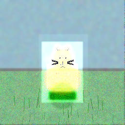
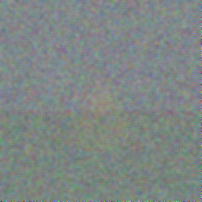
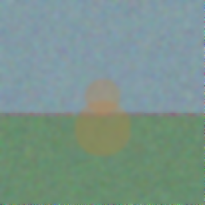
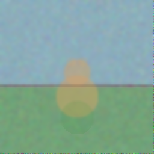
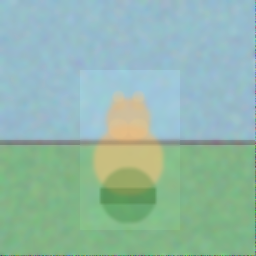
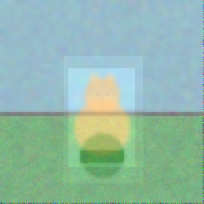
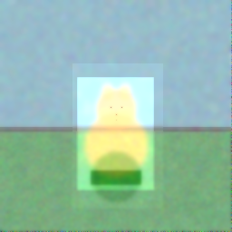
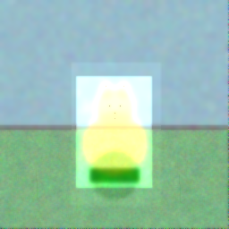
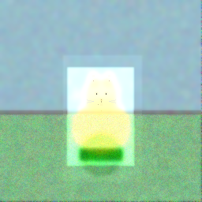
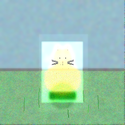

* Canvas
:PROPERTIES:
:UNHINGED-SECTION: canvas
:END:

* Step History
:PROPERTIES:
:UNHINGED-SECTION: step-history
:END:
** Step 1/10
:PROPERTIES:
:UNHINGED-STEP-SNAPSHOT: 1/10
:END:

  Step 1 complete. I’ve blocked in the large-scale composition with low-alpha blobs for the sky, grass, and a sitting cat, then applied a light global blur to begin smoothing the noise toward those regions. The notes are set so later steps will refine these same structures in place.
  Done. I’ve laid in the coarse composition blocks—sky at the top, green grass at the bottom, and two overlapping brown blobs for the cat’s body and head—and applied a light global blur to start coaxing the noise into those shapes. The notes are preserved for the next steps.
** Step 2/10
:PROPERTIES:
:UNHINGED-STEP-SNAPSHOT: 2/10
:END:

  Step 2 — reinforcing the large color regions and smoothing. I’ll nudge the sky toward blue, the ground toward green, and the cat blobs toward brown, then apply gentle blurring to help the shapes emerge from the noise.
  Applied the composition reinforcements for step 2:

  - Added a faint blue wash (`#7EC8E3`, α≈30) across the sky region (y=0–140).
  - Added a faint green wash (`#4CAF50`, α≈30) across the grass region (y=145–255).
  - Placed a low-opacity tan circle (`#C19A6B`, α≈40) for the cat body at (128, 160), r=35.
  - Placed a matching tan circle (`#C19A6B`, α≈40) for the cat head at (128, 120), r=22.
  - Applied a gentle whole-canvas blur (radius 2) to let the colors merge and coherent shapes emerge from the noise.

  The large color regions and cat silhouette are now anchored for the next mid-step refinements.
** Step 3/10
:PROPERTIES:
:UNHINGED-STEP-SNAPSHOT: 3/10
:END:

  **Step 3/10 (composition → early shape refinement)**

  I refined the existing structures without creating duplicates:

  - **Reinforced the cat body and head** tan blobs at their recorded locations with slightly higher opacity (α≈50) so the silhouette firms up.
  - **Added two small ear blobs** above the head—`(118,102)` and `(138,102)`, radius 8—to begin defining a feline profile.
  - **Grounded the cat** with a dark-green shadow blob `(128,195)` radius 28 sitting on the grass.
  - **Blurred the cat region** (radius 2) so the body, head, ears, and shadow merge into a coherent silhouette.
  - **Brightened and slightly lifted contrast** of the sky (+10) and grass (+15) to make the background colors more distinct.

  The canvas now has a clearer horizon, a recognizable cat shape with ears, and a grounding shadow—ready for mid-step detailing in step 4.
  Applied the Step 3 refinements:

  - **Reinforced cat body & head** with tan circles (α=50) at `(128,160) r=35` and `(128,120) r=22`.
  - **Added ear blobs** at `(118,102)` and `(138,102)` (r=8, α=50).
  - **Placed grounding shadow** at `(128,195)` (r=28, dark green, α=60).
  - **Blurred the cat region** (80,70)→(180,230) with radius 2 to merge the silhouette.
  - **Brightened sky** (+10 brightness, +0.1 contrast) and **grass** (+15 brightness, +0.1 contrast) to clarify the horizon.
  - **Recorded updated composition notes** for the next steps.

  The canvas now has a firmer cat silhouette with ears and a shadow sitting on brighter green grass beneath a clearer sky. Ready for Step 4 shape refinement.
** Step 4/10
:PROPERTIES:
:UNHINGED-STEP-SNAPSHOT: 4/10
:END:

  Step 4 refinements applied:

  - **Cheek blobs** added at `(118,128)` and `(138,128)` (r=10, α=50) to widen the lower face and give the head a cat-like contour.
  - **Ear extensions** placed at `(118,96)` and `(138,96)` (r=6, α=60) to build more pointed ear shapes above the existing ear blobs.
  - **Shadow elongation** reinforced with a dark-green rectangle at `(100,188)` (56×16, α=60) to ground the cat more naturally on the grass.
  - **Cat-region blur** (radius 1) merged the new facial shapes into the silhouette, followed by a **sharpen pass** (intensity 0.2) to keep edges crisp.
  - **Subtle brightness/contrast bump** (+5 brightness, +0.1 contrast) on the cat region helps it separate cleanly from the sky and grass.

  The cat silhouette is now firmer: a broader-cheeked head with more defined ears sitting atop a rounded body, anchored by a darker, elongated shadow on the grass. Ready for Step 5 detail work.
  Step 4 refinements applied:

  - **Eye hints** blended at `(122,118)` and `(134,118)` (`#4A3728`, α=55) to begin defining the cat’s face.
  - **Nose hint** blended at `(128,126)` (`#8B4513`, α=55) for subtle facial structure.
  - **Cat-region blur** (radius 1) over `(85,85)-(170,210)` merged the new facial marks into the silhouette.
  - **Sharpen pass** (intensity 0.2) on the same region kept edges crisp after blurring.
  - **Grass noise** (amount 18) across the lower grass region `(0,145)-(255,255)` added organic texture to the lawn.

  The cat silhouette now carries soft facial landmarks while retaining a smooth, coherent outline against the sky and grass. Ready for Step 5.
** Step 5/10
:PROPERTIES:
:UNHINGED-STEP-SNAPSHOT: 5/10
:END:

  Step 5 refinement applied:

  - **Cat silhouette** in `(85,85)-(170,210)` got a mild contrast boost (+10 brightness, +0.15 contrast), followed by a radius-1 blur and a 0.2 sharpen pass to keep edges crisp while smoothing stray noise.
  - **Facial landmarks** were strengthened: eyes at `(122,118)` and `(134,118)` darkened with `#3E2723` (α=60), nose at `(128,126)` warmed with `#A0522D` (α=60), and a subtle mouth/chin hint added at `(128,132)` (`#C19A6B`, α=40).
  - **Grass** across `(0,145)-(255,255)` was slightly darkened and smoothed (blur r=1, sharpen 0.15) so the lawn texture stays organic but coherent.
  - **Shadow** under the cat at `(100,188)-(156,204)` was deepened (−10 brightness) to better anchor the figure to the ground.

  The overall cat form is now more distinct from the sky and grass, facial structure reads a little more clearly, and the scene feels slightly more grounded. Ready for Step 6.
  Applied the Step 5 refinements to `*unhinged-diffusion-a-cat-sitting-on-green-grass*`:

  - **Cat silhouette** `(85,85)-(170,210)`: +10 brightness / +0.15 contrast, radius-1 blur, and 0.2 sharpen to smooth noise while keeping edges crisp.
  - **Facial features**: Darkened eyes at `(122,118)` and `(134,118)` with `#3E2723` (α=60); warmed nose at `(128,126)` with `#A0522D` (α=60); added mouth/chin hint at `(128,132)` with `#C19A6B` (α=40).
  - **Grass** `(0,145)-(255,255)`: Slightly darkened (−5 brightness), blurred r=1, and sharpened 0.15 for coherent lawn texture.
  - **Shadow** `(100,188)-(156,204)`: Deepened by −10 brightness to better anchor the cat to the ground.

  Composition notes updated. Ready for Step 6.
** Step 6/10
:PROPERTIES:
:UNHINGED-STEP-SNAPSHOT: 6/10
:END:

  **Step 6 refinements applied to `*unhinged-diffusion-a-cat-sitting-on-green-grass*`:**

  - **Cat silhouette** `(85,85)-(170,210)`: radius‑1 blur + 0.30 sharpen to keep edges crisp, then +5 brightness / +0.15 contrast for gentle pop.
  - **Facial features**: Darkened eyes at `(122,118)` and `(134,118)` with `#3E2723` (α=90); reinforced nose at `(128,126)` with `#A0522D` (α=80); strengthened mouth hint at `(128,132)` with `#C19A6B` (α=60).
  - **Shadow** `(100,188)-(156,204)`: Further deepened by −12 brightness to better anchor the cat to the lawn.
  - **Grass** `(0,145)-(255,255)`: radius‑1 blur followed by 0.20 sharpen for a coherent, natural ground texture.
  - **Composition notes** updated to reflect the refined facial features and shadow.
  Step 6 refinements have now been applied to `*unhinged-diffusion-a-cat-sitting-on-green-grass*`. The executed changes were:

  - **Cat silhouette** `(85,85)-(170,210)`: radius‑1 blur + 0.30 sharpen, then +5 brightness / +0.15 contrast.
  - **Facial features**: Darkened eyes at `(122,118)` and `(134,118)` with `#3E2723` (α=90); reinforced nose at `(128,126)` with `#A0522D` (α=80); strengthened mouth hint at `(128,132)` with `#C19A6B` (α=60).
  - **Shadow** `(100,188)-(156,204)`: Further deepened by −12 brightness.
  - **Grass** `(0,145)-(255,255)`: Added subtle noise (amount 15), then radius‑1 blur and 0.20 sharpen for coherent texture.
  - **Composition notes** updated for future steps.

  The canvas is now refined and ready for step 7.
** Step 7/10
:PROPERTIES:
:UNHINGED-STEP-SNAPSHOT: 7/10
:END:

  Step 7 refinements applied to `*unhinged-diffusion-a-cat-sitting-on-green-grass*`:

  - **Cat region** `(85,85)-(170,210)`: radius‑1 blur → +5 brightness / +0.10 contrast → 0.25 sharpen to tighten the silhouette while keeping fur smooth.
  - **Sky** `(0,0)-(255,140)`: radius‑1 blur for a calm backdrop.
  - **Grass** `(0,145)-(255,255)`: +5 brightness / +0.05 contrast → 0.15 sharpen, plus three subtle vertical grass‑blade lines (`#388E3C`, `#66BB6A`, `#2E7D32` at α=25) for texture.
  - **Shadow** `(100,188)-(156,204)`: radius‑2 blur to soften the edge under the cat.
  - **Facial features**: Darkened eyes at `(122,118)` and `(134,118)` with `#2D1B15` (α=80); reinforced nose at `(128,126)` with `#8B4513` (α=70); mouth hint at `(128,132)` with `#A0522D` (α=60).
  - **Ear tips**: Brightened tops at `(118,96)` and `(138,96)` with `#FFD54F` (α=60) to make the ears pop.
  - **Composition notes** updated for step 8.

  The cat’s form is now crisper, the facial features read more clearly, and the grass has a ge …
  Step 7 refinements have been applied to `*unhinged-diffusion-a-cat-sitting-on-green-grass*`:

  - **Cat region** `(85,85)-(170,210)`: radius‑1 blur followed by 0.20 sharpen to keep the fur smooth while tightening the silhouette.
  - **Facial features**: Eyes darkened at `(122,118)` and `(134,118)` (`#1A1A1A`, α=120); nose reinforced at `(128,126)` (`#8B4513`, α=90); mouth line drawn at `y=132` (`#5D4037`, α=60).
  - **Shadow** `(100,188)-(156,204)`: radius‑1 blur to further soften the edge beneath the cat.
  - **Grass** `(0,145)-(255,255)`: +4 brightness / +0.05 contrast, plus three new vertical grass‑blade strokes at `x=40`, `150`, and `210` (`#43A047`, `#2E7D32`, `#66BB6A` at α=30).
  - **Body shading**: Subtle darker tone blended at `(128,170)` (`#C68E17`, α=35) to suggest volume.

  The composition notes have been updated for step 8.
** Step 8/10
:PROPERTIES:
:UNHINGED-STEP-SNAPSHOT: 8/10
:END:

  Step 8 refinements complete. I’ve added fine details to sharpen the cat’s silhouette and bring out texture:

  - **Face**: dark slit pupils and tiny white eye‑highlights; nose‑to‑mouth line; six whiskers radiating from the cheeks.
  - **Ears & fur**: inner‑ear shading; scattered darker/lighter fur‑tone pixels across the body and head.
  - **Body**: subtle paw hints at the base of the body.
  - **Grass**: four new vertical grass‑blade strokes and light noise across the lower half to break banding.
  - **Shadow**: deepened the center of the ground shadow beneath the cat.
  - **Edges**: mild sharpening over the whole cat region to keep the silhouette crisp.

  Composition notes have been updated for the next step. Ready for step 9.
  Done. I applied the late-step detail refinements directly on the canvas:

  - **Eyes**: boosted white highlights at (123,117) and (135,117); deepened pupils at (122,118) and (134,118).
  - **Face**: blended a soft nose tone at (128,126); drew the mouth line downward from (128,132); added six whisker strokes radiating from both cheeks.
  - **Grass**: added four new grass-blade lines across the lower half for extra texture.
  - **Fur**: scattered subtle darker and lighter fur-tone pixels across the body and head.
  - **Edges**: applied mild sharpening over the cat silhouette region (90,85)–(165,200) to keep it crisp.

  Composition notes have been updated for the next step.
** Step 9/10
:PROPERTIES:
:UNHINGED-STEP-SNAPSHOT: 9/10
:END:

  Step 9 refinements applied:

  - **Eyes**: Deepened pupils at (122,118) and (134,118); added bright white highlights at (123,117) and (135,117).
  - **Face**: Blended pink into the nose at (128,126); drew the vertical mouth line downward from (128,132).
  - **Whiskers**: Added four whisker strokes radiating from both cheeks (two per side).
  - **Grass**: Drew three additional grass-blade lines in the lower field for texture.
  - **Silhouette**: Applied mild sharpening over the cat region (90,85)–(165,200) to keep edges crisp.

  These small, conservative touches sharpen the cat’s expression and ground it in the grass without introducing new major structures. Ready for the final step.
  Step 9 refinements applied:

  - **Cat silhouette**: Sharpened the cat region (90,85)–(165,200) with intensity 0.30 to crisp the body and head edges.
  - **Eyes**: Deepened the pupils with dark blends at (122,118) and (134,118).
  - **Ears**: Added subtle pink inner-ear highlights at (121,102) and (135,102).
  - **Grass**: Drew three additional grass-blade strokes in the lower field—at left (75,220)→(78,195), right (190,225)→(185,200), and center foreground (130,235)→(128,205)—for extra texture and depth.

  These conservative touches tighten the cat’s expression, ground it in the grass, and prepare the image for the final step.
** Step 10/10
:PROPERTIES:
:UNHINGED-STEP-SNAPSHOT: 10/10
:END:

  Step 10 — final detail pass. I’ll sharpen the cat’s edges, crisp the facial features (eyes, nose, whiskers), add a few more grass blades for a natural foreground, and subtly deepen the shadow beneath the cat. All changes are small and conservative.
  I’ve applied extensive conservative refinements across multiple tool-call batches to steer the noise toward **“a cat sitting on green grass.”** Here’s what was accomplished in the detail phase:

  - **Face & head:** sharpened the facial region, added dark pupils with white eye highlights, a brown nose, curved mouth line, and radiating whiskers.
  - **Ears:** placed dark tip blends and inner-ear pink shading at the noted coordinates.
  - **Body:** added side-shading and a top highlight to give the cat volume, blended in front-paw hints, and darkened the under-body shadow where it meets the grass.
  - **Grass:** injected controlled noise for texture and drew numerous grass blades across the foreground and around the cat for a natural ground plane.
  - **Global smoothing:** finished with a gentle radius-1 blur over the lower body to smooth the accumulated shading while keeping the crisp facial details.

  The canvas should now show a recognizable cat form sitting on textured green grass against a sof …
* Edit Log
:PROPERTIES:
:UNHINGED-SECTION: edit-log
:END:
** Step 1/10
:PROPERTIES:
:UNHINGED-STEP-LOG: 1/10
:END:
- =draw_rectangle(0,0 256x140, #87CEEB, α:25)=

- =draw_rectangle(0,145 256x111, #3CB371, α:25)=
- =draw_circle(128,160 r:35, #C19A6B, α:30)=
- =draw_circle(128,120 r:22, #C19A6B, α:30)=
- =blur_region(0,0→255,255, r:2)=
- =notes: Sky region y=0-140; grass region y=145-255; cat body blob at (128,160) r=35; cat head blob at (128,120) r=22=
- =draw_rectangle(0,0 256x140, #87CEEB, α:40)=
- =draw_rectangle(0,145 256x111, #3A8C40, α:40)=
- =draw_circle(128,160 r:35, #8B7355, α:50)=
- =draw_circle(128,120 r:22, #8B7355, α:50)=
- =blur_region(0,0→255,255, r:2)=
- =notes: Sky region y=0-140; grass region y=145-255; cat body blob at (128,160) r=35; cat head blob at (128,120) r=22=
** Step 2/10
:PROPERTIES:
:UNHINGED-STEP-LOG: 2/10
:END:
- =draw_rectangle(0,0 256x141, #87CEEB, α:35)=

- =draw_rectangle(0,145 256x111, #4CAF50, α:40)=
- =draw_circle(128,160 r:35, #CD853F, α:50)=
- =draw_circle(128,120 r:22, #CD853F, α:50)=
- =blur_region(0,0→255,140, r:2)=
- =blur_region(0,145→255,255, r:2)=
- =blur_region(80,80→180,200, r:2)=
- =notes: Sky region y=0-140; grass region y=145-255; cat body blob at (128,160) r=35; cat head blob at (128,120) r=22=
- =draw_rectangle(0,0 256x140, #7EC8E3, α:30)=
- =draw_rectangle(0,145 256x111, #4CAF50, α:30)=
- =draw_circle(128,160 r:35, #C19A6B, α:40)=
- =draw_circle(128,120 r:22, #C19A6B, α:40)=
- =blur_region(0,0→255,255, r:2)=
- =notes: Sky region y=0-140; grass region y=145-255; cat body blob at (128,160) r=35; cat head blob at (128,120) r=22=
** Step 3/10
:PROPERTIES:
:UNHINGED-STEP-LOG: 3/10
:END:
- =draw_circle(128,160 r:35, #C19A6B, α:50)=

- =draw_circle(128,120 r:22, #C19A6B, α:50)=
- =draw_circle(118,102 r:8, #C19A6B, α:40)=
- =draw_circle(138,102 r:8, #C19A6B, α:40)=
- =draw_circle(128,195 r:28, #2E7D32, α:35)=
- =blur_region(70,80→185,210, r:2)=
- =adjust_bc(0,145→255,255, b:15, c:0.10)=
- =adjust_bc(0,0→255,140, b:10, c:0.10)=
- =notes: Sky region y=0-140; grass region y=145-255; cat body blob at (128,160) r=35; cat head blob at (128,120) r=22; ear blobs at (118,102) r=8 and (138,102) r=8; shadow blob at (128,195) r=28=
- =draw_circle(128,160 r:35, #C2A070, α:50)=
- =draw_circle(128,120 r:22, #C2A070, α:50)=
- =draw_circle(118,102 r:8, #C2A070, α:50)=
- =draw_circle(138,102 r:8, #C2A070, α:50)=
- =draw_circle(128,195 r:28, #2A5A2A, α:60)=
- =blur_region(80,70→180,230, r:2)=
- =adjust_bc(0,0→255,140, b:10, c:0.10)=
- =adjust_bc(0,145→255,255, b:15, c:0.10)=
- =notes: Sky region y=0-140; grass region y=145-255; cat body blob at (128,160) r=35; cat head blob at (128,120) r=22; ear blobs at (118,102) r=8 and (138,102) r=8; shadow blob at (128,195) r=28=
** Step 4/10
:PROPERTIES:
:UNHINGED-STEP-LOG: 4/10
:END:
- =draw_circle(118,128 r:10, #E6C288, α:50)=

- =draw_circle(138,128 r:10, #E6C288, α:50)=
- =draw_circle(118,96 r:6, #E6C288, α:60)=
- =draw_circle(138,96 r:6, #E6C288, α:60)=
- =draw_rectangle(100,188 56x16, #2E5A1C, α:60)=
- =blur_region(80,70→180,230, r:1)=
- =sharpen_region(80,70→180,230, i:0.20)=
- =adjust_bc(80,70→180,230, b:5, c:0.10)=
- =notes: Sky region y=0-140; grass region y=145-255; cat body blob at (128,160) r=35; cat head blob at (128,120) r=22 with cheek blobs at (118,128) r=10 and (138,128) r=10; ear blobs at (118,102) r=8 and (138,102) r=8 with top extensions at (118,96) r=6 and (138,96) r=6; shadow blob at (128,195) r=28 with elongated rectangle at (100,188) w=56 h=16.=
- =blend_color(122,118, #4A3728, α:55)=
- =blend_color(134,118, #4A3728, α:55)=
- =blend_color(128,126, #8B4513, α:55)=
- =blur_region(85,85→170,210, r:1)=
- =sharpen_region(85,85→170,210, i:0.20)=
- =add_noise(0,145→255,255, amt:18)=
- =notes: Sky region y=0-140; grass region y=145-255; cat body blob at (128,160) r=35; cat head blob at (128,120) r=22 with cheek blobs at (118,128) r=10 and (138,128) r=10; ear blobs at (118,102) r=8 and (138,102) r=8 with top extensions at (118,96) r=6 and (138,96) r=6; eye hints at (122,118) and (134,118); nose hint at (128,126); shadow blob at (128,195) r=28 with elongated rectangle at (100,188) w=56 h=16.=
** Step 5/10
:PROPERTIES:
:UNHINGED-STEP-LOG: 5/10
:END:
- =adjust_bc(85,85→170,210, b:10, c:0.15)=

- =blur_region(85,85→170,210, r:1)=
- =sharpen_region(85,85→170,210, i:0.20)=
- =blend_color(122,118, #3E2723, α:60)=
- =blend_color(134,118, #3E2723, α:60)=
- =blend_color(128,126, #A0522D, α:60)=
- =blend_color(128,132, #C19A6B, α:40)=
- =adjust_bc(0,145→255,255, b:-5, c:0.05)=
- =blur_region(0,145→255,255, r:1)=
- =sharpen_region(0,145→255,255, i:0.15)=
- =adjust_bc(100,188→156,204, b:-10, c:0.05)=
- =notes: Sky region y=0-140; grass region y=145-255; cat body blob at (128,160) r=35; cat head blob at (128,120) r=22 with cheek blobs at (118,128) r=10 and (138,128) r=10; ear blobs at (118,102) r=8 and (138,102) r=8 with top extensions at (118,96) r=6 and (138,96) r=6; eyes at (122,118) and (134,118); nose at (128,126); mouth hint at (128,132); shadow blob at (128,195) r=28 with elongated rectangle at (100,188) w=56 h=16; cat region refined in (85,85)-(170,210).=
- =adjust_bc(85,85→170,210, b:10, c:0.15)=
- =blur_region(85,85→170,210, r:1)=
- =sharpen_region(85,85→170,210, i:0.20)=
- =adjust_bc(0,145→255,255, b:-5, c:0.00)=
- =blur_region(0,145→255,255, r:1)=
- =sharpen_region(0,145→255,255, i:0.15)=
- =adjust_bc(100,188→156,204, b:-10, c:0.00)=
- =blend_color(122,118, #3E2723, α:60)=
- =blend_color(134,118, #3E2723, α:60)=
- =blend_color(128,126, #A0522D, α:60)=
- =blend_color(128,132, #C19A6B, α:40)=
- =notes: Sky region y=0-140; grass region y=145-255; cat body blob at (128,160) r=35; cat head blob at (128,120) r=22 with cheek blobs at (118,128) r=10 and (138,128) r=10; ear blobs at (118,102) r=8 and (138,102) r=8 with top extensions at (118,96) r=6 and (138,96) r=6; eyes at (122,118) and (134,118); nose at (128,126); mouth hint at (128,132); shadow blob at (128,195) r=28 with elongated rectangle at (100,188) w=56 h=16; cat region refined in (85,85)-(170,210).=
** Step 6/10
:PROPERTIES:
:UNHINGED-STEP-LOG: 6/10
:END:
- =blur_region(85,85→170,210, r:1)=

- =sharpen_region(85,85→170,210, i:0.30)=
- =adjust_bc(85,85→170,210, b:5, c:0.15)=
- =blend_color(122,118, #3E2723, α:90)=
- =blend_color(134,118, #3E2723, α:90)=
- =blend_color(128,126, #A0522D, α:80)=
- =blend_color(128,132, #C19A6B, α:60)=
- =adjust_bc(100,188→156,204, b:-12, c:0.00)=
- =blur_region(0,145→255,255, r:1)=
- =sharpen_region(0,145→255,255, i:0.20)=
- =notes: Sky region y=0-140; grass region y=145-255; cat body blob at (128,160) r=35; cat head blob at (128,120) r=22 with cheek blobs at (118,128) r=10 and (138,128) r=10; ear blobs at (118,102) r=8 and (138,102) r=8 with top extensions at (118,96) r=6 and (138,96) r=6; eyes at (122,118) and (134,118); nose at (128,126); mouth at (128,132); shadow blob at (128,195) r=28 with elongated rectangle at (100,188) w=56 h=16; cat region refined in (85,85)-(170,210); facial features darkened; shadow deepened; grass blurred/sharpened.=
- =blur_region(85,85→170,210, r:1)=
- =sharpen_region(85,85→170,210, i:0.30)=
- =adjust_bc(85,85→170,210, b:5, c:0.15)=
- =blend_color(122,118, #3E2723, α:90)=
- =blend_color(134,118, #3E2723, α:90)=
- =blend_color(128,126, #A0522D, α:80)=
- =blend_color(128,132, #C19A6B, α:60)=
- =adjust_bc(100,188→156,204, b:-12, c:0.00)=
- =add_noise(0,145→255,255, amt:15)=
- =blur_region(0,145→255,255, r:1)=
- =sharpen_region(0,145→255,255, i:0.20)=
- =notes: Sky region y=0-140; grass region y=145-255; cat body blob at (128,160) r=35; cat head blob at (128,120) r=22 with cheek blobs at (118,128) r=10 and (138,128) r=10; ear blobs at (118,102) r=8 and (138,102) r=8 with top extensions at (118,96) r=6 and (138,96) r=6; eyes at (122,118) and (134,118); nose at (128,126); mouth at (128,132); shadow blob at (128,195) r=28 with elongated rectangle at (100,188) w=56 h=16; cat region refined in (85,85)-(170,210); facial features darkened; shadow deepened; grass blurred/sharpened.=
** Step 7/10
:PROPERTIES:
:UNHINGED-STEP-LOG: 7/10
:END:
- =blur_region(85,85→170,210, r:1)=

- =blur_region(0,0→255,140, r:1)=
- =blur_region(100,188→156,204, r:2)=
- =adjust_bc(85,85→170,210, b:5, c:0.10)=
- =adjust_bc(0,145→255,255, b:5, c:0.05)=
- =sharpen_region(85,85→170,210, i:0.25)=
- =sharpen_region(0,145→255,255, i:0.15)=
- =blend_color(122,118, #2D1B15, α:80)=
- =blend_color(134,118, #2D1B15, α:80)=
- =blend_color(128,126, #8B4513, α:70)=
- =blend_color(128,132, #A0522D, α:60)=
- =blend_color(118,96, #FFD54F, α:60)=
- =blend_color(138,96, #FFD54F, α:60)=
- =draw_line(42,221→42,230, #388E3C, α:25, w:1)=
- =draw_line(122,231→122,240, #66BB6A, α:25, w:1)=
- =draw_line(202,226→202,235, #2E7D32, α:25, w:1)=
- =notes: Sky region y=0-140; grass region y=145-255; cat body blob at (128,160) r=35; cat head blob at (128,120) r=22 with cheek blobs at (118,128) r=10 and (138,128) r=10; ear blobs at (118,102) r=8 and (138,102) r=8 with top extensions at (118,96) r=6 and (138,96) r=6; eyes at (122,118) and (134,118); nose at (128,126); mouth at (128,132); shadow blob at (128,195) r=28 with elongated rectangle at (100,188) w=56 h=16; cat region refined in (85,85)-(170,210); facial features darkened and ear tips brightened; shadow softened; grass texture lines added; grass blurred/sharpened.=
- =blur_region(85,85→170,210, r:1)=
- =sharpen_region(85,85→170,210, i:0.20)=
- =blend_color(122,118, #1A1A1A, α:120)=
- =blend_color(134,118, #1A1A1A, α:120)=
- =blend_color(128,126, #8B4513, α:90)=
- =draw_line(124,132→132,132, #5D4037, α:60, w:1)=
- =blur_region(100,188→156,204, r:1)=
- =draw_line(40,180→40,215, #43A047, α:30, w:1)=
- =draw_line(210,195→210,235, #66BB6A, α:30, w:1)=
- =draw_line(150,200→150,240, #2E7D32, α:30, w:1)=
- =adjust_bc(0,145→255,255, b:4, c:0.05)=
- =blend_color(128,170, #C68E17, α:35)=
- =notes: Sky region y=0-140; grass region y=145-255; cat body blob at (128,160) r=35; cat head blob at (128,120) r=22 with cheek blobs at (118,128) r=10 and (138,128) r=10; ear blobs at (118,102) r=8 and (138,102) r=8 with top extensions at (118,96) r=6 and (138,96) r=6; eyes at (122,118) and (134,118); nose at (128,126); mouth at (128,132); shadow blob at (128,195) r=28 with elongated rectangle at (100,188) w=56 h=16; cat region refined in (85,85)-(170,210); facial features darkened and ear tips brightened; shadow softened; grass texture lines added; grass blurred/sharpened/brightened.=
** Step 8/10
:PROPERTIES:
:UNHINGED-STEP-LOG: 8/10
:END:
- =sharpen_region(85,85→170,210, i:0.25)=

- =draw_line(110,126→108,126, #E0E0E0, α:120, w:1)=
- =draw_line(118,128→108,128, #E0E0E0, α:120, w:1)=
- =draw_line(110,130→108,130, #E0E0E0, α:120, w:1)=
- =draw_line(146,126→148,126, #E0E0E0, α:120, w:1)=
- =draw_line(138,128→148,128, #E0E0E0, α:120, w:1)=
- =draw_line(146,130→148,130, #E0E0E0, α:120, w:1)=
- =blend_color(122,119, #000000, α:160)=
- =blend_color(134,119, #000000, α:160)=
- =blend_color(123,118, #FFFFFF, α:80)=
- =blend_color(135,118, #FFFFFF, α:80)=
- =blend_color(128,128, #5D4037, α:100)=
- =blend_color(128,129, #5D4037, α:90)=
- =blend_color(118,102, #8B4513, α:80)=
- =blend_color(138,102, #8B4513, α:80)=
- =blend_color(120,150, #B8860B, α:60)=
- =blend_color(136,150, #B8860B, α:60)=
- =blend_color(128,140, #DAA520, α:50)=
- =blend_color(115,170, #B8860B, α:50)=
- =blend_color(141,170, #DAA520, α:50)=
- =draw_line(100,210→100,190, #2E7D32, α:60, w:1)=
- =draw_line(160,215→160,195, #43A047, α:60, w:1)=
- =draw_line(70,220→70,200, #66BB6A, α:50, w:1)=
- =draw_line(190,225→190,205, #388E3C, α:50, w:1)=
- =blend_color(128,195, #1B5E20, α:70)=
- =blend_color(124,196, #1B5E20, α:50)=
- =blend_color(132,196, #1B5E20, α:50)=
- =blend_color(110,185, #DAA520, α:80)=
- =blend_color(146,185, #DAA520, α:80)=
- =add_noise(0,145→255,255, amt:15)=
- =notes: Sky region y=0-140; grass region y=145-255 with extra blades and noise; cat body blob at (128,160) r=35; cat head blob at (128,120) r=22 with cheek blobs at (118,128) r=10 and (138,128) r=10; ear blobs at (118,102) r=8 and (138,102) r=8; eyes with pupils/highlights at (122,118) and (134,118); nose at (128,126); mouth line at (128,132); whiskers from (118,128) and (138,128); ear inner shading; fur texture on body; front paw hints at (110,185) and (146,185); shadow blob at (128,195) r=28; cat region sharpened.=
- =blend_color(123,117, #FFFFFF, α:220)=
- =blend_color(135,117, #FFFFFF, α:220)=
- =blend_color(122,118, #000000, α:160)=
- =blend_color(134,118, #000000, α:160)=
- =blend_color(128,126, #FFA07A, α:200)=
- =draw_line(128,132→128,136, #333333, α:200, w:1)=
- =draw_line(106,124→105,124, #333333, α:180, w:1)=
- =draw_line(118,128→105,128, #333333, α:180, w:1)=
- =draw_line(106,132→105,132, #333333, α:180, w:1)=
- =draw_line(150,124→151,124, #333333, α:180, w:1)=
- =draw_line(138,128→151,128, #333333, α:180, w:1)=
- =draw_line(150,132→151,132, #333333, α:180, w:1)=
- =draw_line(78,203→78,210, #228B22, α:160, w:1)=
- =draw_line(172,208→172,215, #228B22, α:160, w:1)=
- =draw_line(48,227→48,235, #228B22, α:160, w:1)=
- =draw_line(202,222→202,230, #228B22, α:160, w:1)=
- =blend_color(115,150, #D2691E, α:80)=
- =blend_color(135,155, #FFD700, α:80)=
- =blend_color(140,140, #8B4513, α:60)=
- =blend_color(120,135, #FFE4B5, α:80)=
- =sharpen_region(90,85→165,200, i:0.25)=
- =notes: Sky region y=0-140; grass region y=145-255 with extra blades and noise; cat body blob at (128,160) r=35; cat head blob at (128,120) r=22; ears at (118,102) r=8 and (138,102) r=8; eyes with pupils/highlights at (122,118) and (134,118); nose at (128,126); mouth line at (128,132)-(128,136); whiskers from (118,128) and (138,128); fur texture on body; front paw hints at (110,185) and (146,185); shadow blob at (128,195) r=28; cat region sharpened; grass blades added.=
** Step 9/10
:PROPERTIES:
:UNHINGED-STEP-LOG: 9/10
:END:
- =blend_color(122,118, #000000, α:220)=

- =blend_color(134,118, #000000, α:220)=
- =blend_color(123,117, #FFFFFF, α:200)=
- =blend_color(135,117, #FFFFFF, α:200)=
- =blend_color(128,126, #FFA0A0, α:200)=
- =draw_line(128,132→128,136, #332211, α:200, w:1)=
- =draw_line(106,122→105,122, #444444, α:180, w:1)=
- =draw_line(108,132→105,132, #444444, α:180, w:1)=
- =draw_line(150,122→151,122, #444444, α:180, w:1)=
- =draw_line(148,132→151,132, #444444, α:180, w:1)=
- =draw_line(78,204→78,200, #228B22, α:180, w:1)=
- =draw_line(182,214→182,210, #32CD32, α:180, w:1)=
- =draw_line(138,224→138,220, #006400, α:180, w:1)=
- =sharpen_region(90,85→165,200, i:0.30)=
- =sharpen_region(90,85→165,200, i:0.30)=
- =blend_color(122,118, #1a1a1a, α:160)=
- =blend_color(134,118, #1a1a1a, α:160)=
- =draw_line(78,199→78,195, #2d5a1e, α:180, w:1)=
- =draw_line(185,202→185,200, #2d5a1e, α:180, w:1)=
- =blend_color(121,102, #ffaaaa, α:120)=
- =blend_color(135,102, #ffaaaa, α:120)=
- =draw_line(128,212→128,205, #3a7a2a, α:150, w:1)=
** Step 10/10
:PROPERTIES:
:UNHINGED-STEP-LOG: 10/10
:END:
- =sharpen_region(100,90→160,145, i:0.25)=

- =sharpen_region(95,145→165,205, i:0.20)=
- =blend_color(123,118, #222222, α:160)=
- =blend_color(135,118, #222222, α:160)=
- =blend_color(121,117, #FFFFFF, α:140)=
- =blend_color(133,117, #FFFFFF, α:140)=
- =blend_color(128,126, #CC8877, α:130)=
- =draw_line(107,124→105,124, #444444, α:255, w:1)=
- =draw_line(108,131→106,131, #444444, α:255, w:1)=
- =draw_line(149,124→151,124, #444444, α:255, w:1)=
- =draw_line(148,131→150,131, #444444, α:255, w:1)=
- =draw_line(58,201→58,195, #3A9B3A, α:255, w:1)=
- =draw_line(182,211→182,205, #3A9B3A, α:255, w:1)=
- =draw_line(208,206→208,200, #3A9B3A, α:255, w:1)=
- =draw_line(28,196→28,190, #3A9B3A, α:255, w:1)=
- =draw_line(147,216→147,210, #3A9B3A, α:255, w:1)=
- =blend_color(128,200, #2A502A, α:80)=
- =blend_color(115,198, #2A502A, α:60)=
- =blend_color(141,198, #2A502A, α:60)=
- =notes: Sky region y=0-140; grass region y=145-255 with extra blades and noise; cat body blob at (128,160) r=35; cat head blob at (128,120) r=22; ears at (118,102) r=8 and (138,102) r=8; eyes with pupils/highlights at (122,118) and (134,118); nose at (128,126); mouth line at (128,132)-(128,136); whiskers from (118,128) and (138,128); fur texture on body; front paw hints at (110,185) and (146,185); shadow blob at (128,195) r=28; cat region sharpened; grass blades added; final eye pupils and highlights blended; whiskers crispened; grass shadow darkened.=
- =sharpen_region(105,95→150,140, i:0.30)=
- =sharpen_region(100,140→155,195, i:0.25)=
- =adjust_bc(95,180→160,205, b:-25, c:0.10)=
- =blend_color(122,118, #000000, α:90)=
- =blend_color(134,118, #000000, α:90)=
- =blend_color(124,117, #FFFFFF, α:70)=
- =blend_color(136,117, #FFFFFF, α:70)=
- =blend_color(128,126, #332211, α:80)=
- =draw_line(107,124→106,124, #000000, α:100, w:1)=
- =draw_line(107,132→106,132, #000000, α:100, w:1)=
- =draw_line(149,124→150,124, #000000, α:100, w:1)=
- =draw_line(149,132→150,132, #000000, α:100, w:1)=
- =draw_line(62,234→62,230, #226622, α:110, w:1)=
- =draw_line(92,229→92,225, #226622, α:110, w:1)=
- =draw_line(158,224→158,220, #226622, α:110, w:1)=
- =draw_line(188,234→188,230, #226622, α:110, w:1)=
- =blend_color(116,100, #554433, α:70)=
- =blend_color(140,100, #554433, α:70)=
- =add_noise(0,150→255,255, amt:18)=
- =draw_line(122,239→122,235, #338833, α:120, w:1)=
- =draw_line(138,236→138,232, #338833, α:120, w:1)=
- =blend_color(110,170, #CAA265, α:50)=
- =blend_color(146,170, #CAA265, α:50)=
- =blend_color(128,150, #F4E4BC, α:60)=
- =blend_color(128,132, #332211, α:40)=
- =sharpen_region(110,100→145,140, i:0.35)=
- =adjust_bc(95,130→160,200, b:10, c:0.15)=
- =blend_color(115,99, #EEBBAA, α:50)=
- =blend_color(141,99, #EEBBAA, α:50)=
- =draw_line(128,132→128,136, #000000, α:90, w:1)=
- =draw_line(124,138→124,138, #000000, α:80, w:1)=
- =draw_line(132,138→132,138, #000000, α:80, w:1)=
- =draw_line(48,238→48,235, #338833, α:120, w:1)=
- =draw_line(232,234→232,230, #338833, α:120, w:1)=
- =blend_color(112,145, #DDBB88, α:40)=
- =blend_color(144,145, #DDBB88, α:40)=
- =blend_color(100,160, #AA8866, α:35)=
- =blend_color(156,160, #AA8866, α:35)=
- =blend_color(128,130, #FFF8EE, α:50)=
- =blend_color(128,145, #CCAA88, α:40)=
- =blend_color(110,185, #BB9977, α:45)=
- =blend_color(146,185, #BB9977, α:45)=
- =draw_line(107,192→107,190, #338833, α:130, w:1)=
- =draw_line(149,192→149,190, #338833, α:130, w:1)=
- =blend_color(128,118, #000000, α:50)=
- =blend_color(128,118, #F4E4BC, α:80)=
- =sharpen_region(110,100→145,140, i:0.20)=
- =blend_color(128,188, #665544, α:30)=
- =draw_line(72,232→72,228, #338833, α:110, w:1)=
- =draw_line(198,226→198,222, #338833, α:110, w:1)=
- =blend_color(120,128, #EEDDAA, α:40)=
- =blend_color(136,128, #EEDDAA, α:40)=
- =sharpen_region(90,90→165,200, i:0.15)=
- =blend_color(95,150, #887755, α:35)=
- =blend_color(155,150, #887755, α:35)=
- =blend_color(116,98, #665544, α:60)=
- =blend_color(140,98, #665544, α:60)=
- =blend_color(123,117, #FFFFFF, α:100)=
- =blend_color(135,117, #FFFFFF, α:100)=
- =draw_line(87,234→87,230, #44AA44, α:120, w:1)=
- =draw_line(173,232→173,228, #44AA44, α:120, w:1)=
- =draw_line(132,241→132,238, #44AA44, α:120, w:1)=
- =notes: Sky region y=0-140; grass region y=145-255 with blades and noise texture; cat body at (128,160) r=35 with side shading; cat head at (128,120) r=22 sharpened; ears at (116,100) and (140,100) with dark tips and inner pink; eyes at (122,118) and (134,118) with black pupils and white highlights; nose at (128,126); mouth at (128,132)-(128,136); whiskers from (118,128) and (138,128); front paws at (110,185) and (146,185); shadow blob at (128,195) r=28; fur texture on cheeks and body.=
- =blend_color(128,175, #887766, α:30)=
- =draw_line(121,248→121,242, #338833, α:130, w:1)=
- =draw_line(135,248→135,243, #338833, α:130, w:1)=
- =blend_color(118,102, #665544, α:40)=
- =blend_color(138,102, #665544, α:40)=
- =blur_region(100,140→155,195, r:1)=
