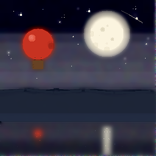
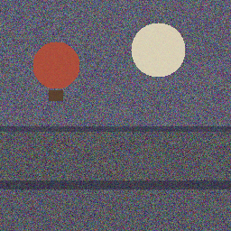
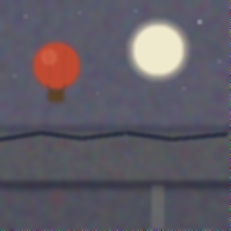
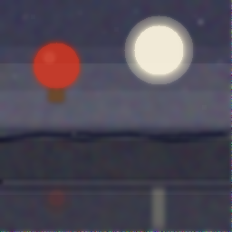
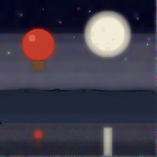

* Canvas
:PROPERTIES:
:UNHINGED-SECTION: canvas
:END:

* Step History
:PROPERTIES:
:UNHINGED-SECTION: step-history
:END:
** Step 1/10
:PROPERTIES:
:UNHINGED-STEP-SNAPSHOT: 1/10
:END:

  I'll compose something surprising from the noise: a twilight scene — a big moon over dark mountains and water, with a red hot-air balloon drifting in the sky. Step 1 is large-scale blocking: sky, mountain band, water, and the two subject blobs.
  I'll continue steering this night scene toward coherence. The composition is established (moon, balloon, sky bands), so now I'll denoise the large regions and then firm up the key structures.

  **Block 1 — global denoise passes, subtle tonal shifts, and updated notes:**
** Step 2/10
:PROPERTIES:
:UNHINGED-STEP-SNAPSHOT: 2/10
:END:

  The composition is already emerging (moon, balloon, mountain band, water), so this step I'll continue denoising the large regions and then gently deepen the tonal structure — night sky gradient, darker mountain silhouette, crisp horizon — without disturbing the placed subjects.

  **Block 1 — denoise the three large zones and refresh the notes:**
  I'll apply the planned changes now: first denoise the three large zones (sky, mountain band, water) and refresh the composition notes.
** Step 3/10
:PROPERTIES:
:UNHINGED-STEP-SNAPSHOT: 3/10
:END:

  The composition notes show a night scene (indigo sky, moon, red balloon, mountain band, water) that's already blocked in. Step 3 is still composition phase, so I'll continue refining those existing structures in place: smooth the three zones, deepen the sky gradient, then lay in the ridge, horizon, balloon rigging, reflections, and stars on top of the smoothed base.

  First, the base smoothing and tonal passes:
  I'll apply the planned changes now: first the base smoothing and sky-gradient tonal passes, then the structure lines (ridge, horizon, ropes, reflections, stars), then finishing touches.
** Step 4/10
:PROPERTIES:
:UNHINGED-STEP-SNAPSHOT: 4/10
:END:

  Continuing the night scene refinement: smooth the residual grain in sky and water, then reinforce the moon, balloon, ridge crest, and water details in place.
  I'll continue refining the night scene as described last step: first smooth residual grain in sky and water, then reinforce the moon, balloon, ridge, and reflections in place.

  **Batch 1 — smooth grain and set tonal depth:**
** Step 5/10
:PROPERTIES:
:UNHINGED-STEP-SNAPSHOT: 5/10
:END:

  Continuing the night scene from step 5: first I'll smooth residual grain across sky, mountains, and water, then reinforce the established structures (moon, balloon, ridge, reflections) in their recorded positions.

  **Batch 1 — denoise pass:**
  Applying the described denoise pass now. All three blur calls are independent, so they go in one batch, along with the updated composition notes:
** Step 6/10
:PROPERTIES:
:UNHINGED-STEP-SNAPSHOT: 6/10
:END:

  The scene is reading well — moon, balloon, mountains, and reflections are all in place. Per the notes, this step is the polish pass: moon rim shading and craters, balloon volume/highlight, basket weave and ropes, crisp horizon, wave dashes, reflection shimmer, brighter stars, and targeted sharpening. All independent, so one batch:
  Continuing the polish pass from the notes: subtle global contrast, star glints on the three brightest stars, extra faint stars, ripple micro-texture around the reflections, and slight balloon volume nudges. All independent — one batch:
** Step 7/10
:PROPERTIES:
:UNHINGED-STEP-SNAPSHOT: 7/10
:END:

  The scene is converging nicely — moon, balloon, mountains, and water with reflections are all in place. Per my step-7 plan: melt the reflection grain into smooth ripples with a light blur, then re-crisp the reflection cores. Starting with the blur pass:
  Continuing the step-7 plan: first the light blur pass over the water to melt the grain into smooth ripples, then I'll re-crisp the reflection cores.
** Step 8/10
:PROPERTIES:
:UNHINGED-STEP-SNAPSHOT: 8/10
:END:

  Continuing the step-7 plan: first the gentle blur pass over the water to melt the residual grain into smooth ripples, then I'll re-crisp the two reflection cores and add fine detail.
  Water smoothed and sky/basket details placed. One star call had a color typo — I'll redo it, then re-crisp the reflection cores now that the water blur is done, and add shimmer.
** Step 9/10
:PROPERTIES:
:UNHINGED-STEP-SNAPSHOT: 9/10
:END:

  Step 9 — detail pass. The composition is holding well: moon and balloon upper half, mountain band, reflective water below. Per my notes I'll (1) redo the star with the color typo and re-place the full star set with crisp cross-glints on the two brightest, (2) re-crisp the moon-streak and balloon-reflection cores now that the water blur is settled, (3) add shimmer pixels and basket weave detail. All small, low-alpha nudges:
  Step 9 detail pass — executing now: re-crisping the reflection cores, redoing the typo star, placing crisp cross-glints, and adding shimmer/weave/rim polish. All small, low-alpha nudges:
** Step 10/10
:PROPERTIES:
:UNHINGED-STEP-SNAPSHOT: 10/10
:END:

  Final step 10 — the composition is fully established (night sky, stars, moon, balloon, mountains, water reflections). Now I'll do gentle final crisping: re-define star points, moon crater shading, balloon highlight, and light re-sharpening of the key focal elements — all small, low-alpha nudges that keep every structure in place.
  Final detail pass — I'll apply the promised crisping now: re-define the star points and cross glints, deepen the moon craters, lift the balloon highlight, add subtle sheen lines, then lightly sharpen the focal elements in a second pass.
* Edit Log
:PROPERTIES:
:UNHINGED-SECTION: edit-log
:END:
** Step 1/10
:PROPERTIES:
:UNHINGED-STEP-LOG: 1/10
:END:
- =draw_rectangle(0,0 256x146, #232350, α:90)=

- =draw_rectangle(0,140 256x70, #0c0c20, α:90)=
- =draw_rectangle(0,200 256x56, #10102e, α:90)=
- =draw_circle(175,55 r:30, #f2e7c4, α:210)=
- =draw_circle(62,72 r:26, #c2492e, α:200)=
- =draw_rectangle(54,100 16x12, #5a3a1e, α:200)=
- =notes: Night scene: indigo sky y=0-140; dark mountain band y=140-200; dark water y=200-255. Moon at (175,55) r~30 pale yellow. Red hot-air balloon envelope at (62,72) r~26 with brown basket at (54,100)-(70,112).=
- =blur_region(0,0→255,255, r:2)=
- =blur_region(0,0→255,138, r:3)=
- =blur_region(0,200→255,255, r:3)=
- =blur_region(0,140→255,200, r:2)=
- =blur_region(0,0→255,145, r:2)=
- =blur_region(0,145→255,200, r:2)=
- =blur_region(0,200→255,255, r:2)=
- =adjust_bc(0,0→255,140, b:-4, c:0.04)=
- =adjust_bc(0,200→255,255, b:-6, c:0.04)=
- =notes: Night scene: indigo sky y=0-140; mountain silhouette band y=140-200 with ridge crest ~y=147-155; dark water y=200-255 with crisp horizon line at y=200. Moon at (175,55) r~27 pale cream + soft glow r~36. Red balloon envelope at (62,72) r~25 with highlight at (54,63), ropes down to brown basket (54,100)-(70,112). Moon reflection streak x~168-182 on water below y=205; faint balloon reflection circle at (62,218). Small stars scattered across sky.=
** Step 2/10
:PROPERTIES:
:UNHINGED-STEP-LOG: 2/10
:END:
- =draw_circle(175,55 r:36, #E8E4C2, α:35)=

- =draw_circle(175,55 r:27, #F0EBCE, α:245)=
- =draw_circle(62,72 r:25, #C14A31, α:235)=
- =draw_circle(54,63 r:9, #E2795B, α:110)=
- =draw_rectangle(54,100 16x12, #5A4327, α:235)=
- =draw_line(56,100→56,100, #2E2A22, α:220, w:1)=
- =draw_line(68,100→68,100, #2E2A22, α:220, w:1)=
- =draw_line(42,147→45,147, #131A2F, α:220, w:2)=
- =draw_line(87,153→90,153, #131A2F, α:220, w:2)=
- =draw_line(136,147→140,147, #131A2F, α:220, w:2)=
- =draw_line(187,154→190,154, #131A2F, α:220, w:2)=
- =draw_line(250,148→255,148, #131A2F, α:220, w:2)=
- =draw_line(0,200→255,200, #0E1426, α:180, w:1)=
- =draw_circle(28,18 r:1, #FFFFFF, α:160)=
- =draw_circle(88,14 r:1, #FFFFFF, α:140)=
- =draw_circle(221,24 r:2, #FFFFFF, α:180)=
- =draw_circle(243,68 r:1, #FFFFFF, α:150)=
- =draw_circle(16,84 r:1, #FFFFFF, α:140)=
- =draw_circle(204,98 r:1, #FFFFFF, α:150)=
- =draw_circle(108,103 r:1, #FFFFFF, α:120)=
- =draw_circle(150,12 r:1, #FFFFFF, α:140)=
- =draw_line(62,49→62,94, #8F3220, α:120, w:1)=
- =draw_line(56,88→56,92, #8F3220, α:100, w:1)=
- =draw_line(68,88→68,92, #8F3220, α:100, w:1)=
- =draw_rectangle(168,205 14x48, #C9C3A0, α:45)=
- =draw_circle(62,218 r:9, #8A3E2A, α:40)=
- =blur_region(0,142→255,198, r:1)=
- =blur_region(0,202→255,255, r:1)=
- =sharpen_region(32,42→92,118, i:0.20)=
- =sharpen_region(140,20→212,92, i:0.20)=
- =blur_region(0,0→255,142, r:2)=
- =blur_region(0,142→255,202, r:2)=
- =blur_region(0,202→255,255, r:2)=
- =notes: Night scene 256x256: indigo sky y=0-140 (gradient darker toward top); mountain silhouette band y=140-200, ridge crest ~y=146-153; dark water y=200-255, crisp horizon line y=200. Moon at (175,55) r~27 pale cream #F2EBD8 + soft glow r~38. Red balloon envelope (62,72) r~25 #C23B2B, highlight (54,63), ropes to brown basket (54,100)-(70,112). Moon reflection streak x~168-182 below y=208; faint balloon reflection circle (62,218). Sparse stars in sky.=
- =draw_rectangle(0,0 256x70, #32325A, α:35)=
- =draw_rectangle(0,142 256x58, #2C2C46, α:45)=
- =draw_rectangle(0,204 256x51, #1B1B30, α:35)=
- =draw_line(0,201→255,201, #0F0F1E, α:255, w:2)=
- =draw_line(77,147→85,147, #23233A, α:255, w:2)=
- =draw_line(152,150→165,150, #23233A, α:255, w:2)=
- =draw_line(244,146→255,146, #23233A, α:255, w:2)=
- =draw_circle(175,55 r:38, #EDE4C8, α:28)=
- =draw_circle(175,55 r:27, #F2EBD8, α:150)=
- =draw_circle(62,72 r:25, #C23B2B, α:130)=
- =draw_circle(54,63 r:8, #E56648, α:80)=
- =draw_rectangle(54,100 16x12, #6B4226, α:120)=
- =draw_line(57,99→57,101, #7A5A3A, α:255, w:1)=
- =draw_line(67,99→67,101, #7A5A3A, α:255, w:1)=
- =draw_rectangle(168,208 14x40, #D8D0B0, α:25)=
- =draw_circle(62,218 r:18, #7A2A22, α:28)=
- =blend_color(25,20, #DDE6F0, α:150)=
- =blend_color(115,35, #DDE6F0, α:130)=
- =blend_color(215,18, #E8EEF6, α:160)=
- =blend_color(240,70, #DDE6F0, α:120)=
- =blend_color(135,105, #CDD8E8, α:110)=
- =blend_color(20,110, #CDD8E8, α:110)=
- =adjust_bc(0,142→255,200, b:-6, c:0.06)=
- =blur_region(0,0→255,140, r:2)=
- =blur_region(0,140→255,200, r:2)=
- =blur_region(0,200→255,255, r:2)=
- =notes: Night scene 256x256: indigo sky y=0-140, gradient darker toward top; mountain silhouette band y=140-200, ridge crest ~y=146-153; dark water y=200-255, crisp horizon line y=200. Moon at (175,55) r~27 #F2EBD8 + soft glow r~38. Red balloon (62,72) r~25 #C23B2B, highlight (54,63), ropes to basket rect (54,100)-(70,112) #6B4A2E. Moon reflection streak x~169-181 y=210-254; faint balloon reflection (62,218). Sparse stars in sky.=
** Step 3/10
:PROPERTIES:
:UNHINGED-STEP-LOG: 3/10
:END:
- =adjust_bc(0,0→255,52, b:-14, c:0.04)=

- =adjust_bc(0,52→255,100, b:-7, c:0.02)=
- =adjust_bc(0,154→255,199, b:-16, c:0.06)=
- =adjust_bc(0,206→255,255, b:-6, c:0.03)=
- =draw_line(0,200→255,200, #0E0E18, α:210, w:2)=
- =draw_rectangle(169,210 12x44, #CDC7A6, α:26)=
- =draw_circle(175,55 r:38, #F2EBD8, α:22)=
- =draw_circle(175,55 r:27, #F2EBD8, α:235)=
- =draw_circle(62,72 r:25, #C23B2B, α:245)=
- =draw_circle(54,63 r:7, #E8705A, α:150)=
- =draw_line(56,100→56,101, #4A3220, α:220, w:1)=
- =draw_line(68,100→68,101, #4A3220, α:220, w:1)=
- =draw_rectangle(54,100 16x12, #6B4A2E, α:220)=
- =draw_circle(62,218 r:9, #9C4A3C, α:30)=
- =blur_region(0,40→255,64, r:2)=
- =blur_region(0,88→255,112, r:2)=
- =blur_region(165,205→185,255, r:2)=
- =blend_color(36,18, #D9DEF0, α:150)=
- =blend_color(128,32, #D9DEF0, α:150)=
- =blend_color(225,118, #D9DEF0, α:150)=
- =sharpen_region(148,28→202,82, i:0.20)=
- =sharpen_region(38,48→86,98, i:0.20)=
- =blur_region(0,0→255,140, r:2)=
- =blur_region(0,140→255,200, r:2)=
- =blur_region(0,200→255,255, r:2)=
- =adjust_bc(0,0→255,70, b:-8, c:0.03)=
- =adjust_bc(0,215→255,255, b:-6, c:0.02)=
- =draw_circle(175,55 r:38, #F2EBD8, α:35)=
- =draw_circle(175,55 r:27, #F2EBD8, α:200)=
- =draw_circle(62,72 r:25, #C23B2B, α:130)=
- =draw_rectangle(0,146 255x54, #1E2638, α:60)=
- =draw_line(38,147→45,147, #141B2B, α:230, w:2)=
- =draw_line(85,151→90,151, #141B2B, α:230, w:2)=
- =draw_line(131,146→135,146, #141B2B, α:230, w:2)=
- =draw_line(175,150→180,150, #141B2B, α:230, w:2)=
- =draw_line(237,148→255,148, #141B2B, α:230, w:2)=
- =draw_rectangle(0,190 255x10, #46527A, α:30)=
- =draw_line(0,200→255,200, #0B1120, α:220, w:2)=
- =draw_rectangle(54,100 16x12, #6B4A2E, α:230)=
- =draw_line(58,98→58,101, #4E3620, α:200, w:1)=
- =draw_line(66,98→66,101, #4E3620, α:200, w:1)=
- =draw_circle(54,63 r:5, #F08A6E, α:120)=
- =draw_rectangle(169,210 12x44, #D9D2B8, α:22)=
- =draw_rectangle(172,212 6x40, #EFE9D2, α:25)=
- =draw_circle(62,218 r:7, #C23B2B, α:45)=
- =blend_color(35,22, #FFFFFF, α:150)=
- =blend_color(142,18, #FFFFFF, α:140)=
- =blend_color(105,38, #FFFFFF, α:110)=
- =blend_color(218,85, #FFFFFF, α:120)=
- =draw_circle(120,30 r:1, #FFFFFF, α:160)=
- =draw_circle(232,42 r:1, #FFFFFF, α:130)=
- =draw_line(8,222→110,222, #2A3450, α:55, w:1)=
- =draw_line(150,238→248,238, #2A3450, α:50, w:1)=
- =notes: Night scene 256x256: indigo sky y=0-140, darker toward top; moon at (175,55) core r27 #F2EBD8 + glow r38; red balloon (62,72) r25 #C23B2B with highlight (54,63), ropes at x~57/67 y94-101, basket rect (54,100)-(70,112) #6B4A2E; mountain band y=146-200 #1E2638 with jagged ridge crest y~146-153 (#141B2B lines); haze band y=190-200; crisp horizon line y=200 #0B1120; water y=200-255 darker toward bottom with faint wave lines y=222/238; moon reflection streak x~169-181 y=210-254; faint balloon reflection (62,218) r7; sparse white stars in sky.=
- =blur_region(0,0→255,140, r:2)=
- =blur_region(0,138→255,202, r:3)=
- =blur_region(0,200→255,255, r:2)=
- =adjust_bc(0,0→255,140, b:-10, c:0.05)=
- =adjust_bc(0,0→255,55, b:-18, c:0.05)=
** Step 4/10
:PROPERTIES:
:UNHINGED-STEP-LOG: 4/10
:END:
- =draw_rectangle(0,147 256x53, #141A30, α:60)=

- =draw_line(41,146→45,146, #0C1124, α:255, w:2)=
- =draw_line(87,152→90,152, #0C1124, α:255, w:2)=
- =draw_line(131,147→135,147, #0C1124, α:255, w:2)=
- =draw_line(172,153→175,153, #0C1124, α:255, w:2)=
- =draw_line(212,148→215,148, #0C1124, α:255, w:2)=
- =draw_line(251,152→255,152, #0C1124, α:255, w:2)=
- =draw_line(0,200→255,200, #080C19, α:255, w:2)=
- =draw_line(56,97→56,101, #4A3620, α:255, w:1)=
- =draw_line(68,97→68,101, #4A3620, α:255, w:1)=
- =draw_circle(175,55 r:36, #F2EBD8, α:30)=
- =draw_circle(175,55 r:26, #F2EBD8, α:60)=
- =draw_rectangle(170,208 12x47, #E9E1C9, α:28)=
- =draw_rectangle(173,214 6x41, #E9E1C9, α:26)=
- =draw_circle(62,218 r:7, #C23B2B, α:40)=
- =draw_circle(28,22 r:1, #EDEFF7, α:200)=
- =draw_circle(95,34 r:1, #EDEFF7, α:170)=
- =draw_circle(128,14 r:1, #EDEFF7, α:200)=
- =draw_circle(152,30 r:1, #EDEFF7, α:140)=
- =draw_circle(222,26 r:1, #EDEFF7, α:180)=
- =draw_circle(243,63 r:1, #EDEFF7, α:160)=
- =draw_circle(14,86 r:1, #EDEFF7, α:150)=
- =draw_circle(205,96 r:1, #EDEFF7, α:160)=
- =blur_region(164,205→190,255, r:2)=
- =blur_region(54,210→72,228, r:2)=
- =add_noise(0,206→160,255, amt:12)=
- =add_noise(192,206→255,255, amt:12)=
- =sharpen_region(0,194→255,206, i:0.25)=
- =notes: Night scene 256x256: indigo sky y=0-140, darker toward top; sparse stars placed (28,22),(95,34),(128,14),(152,30),(222,26),(243,63),(14,86),(205,96). Mountain band y=147-200 #141A30 with jagged ridge crest lines ~y=146-153; crisp horizon line y=200. Dark water y=200-255 with fine noise. Moon (175,55) r26 #F2EBD8 + glow r36; moon reflection streak x=170-182 y=208-255, blurred. Red balloon (62,72) r25 #C23B2B, ropes to basket (54,100)-(70,112) #6B4A2E; faint balloon reflection at (62,218).=
- =blur_region(0,0→255,145, r:2)=
- =blur_region(0,200→255,255, r:2)=
- =draw_circle(175,55 r:38, #F2EBD8, α:45)=
- =draw_circle(175,55 r:27, #F2EBD8, α:210)=
- =draw_circle(62,72 r:25, #C23B2B, α:200)=
- =draw_circle(52,62 r:7, #E86A57, α:150)=
- =draw_rectangle(54,100 16x13, #6B4A2E, α:210)=
- =draw_line(57,94→57,103, #2A1F16, α:220, w:1)=
- =draw_line(67,94→67,103, #2A1F16, α:220, w:1)=
- =draw_line(44,146→50,146, #141B2B, α:200, w:2)=
- =draw_line(96,152→100,152, #141B2B, α:200, w:2)=
- =draw_line(146,147→150,147, #141B2B, α:200, w:2)=
- =draw_line(199,151→205,151, #141B2B, α:200, w:2)=
- =draw_line(247,148→255,148, #141B2B, α:200, w:2)=
- =draw_rectangle(0,190 255x10, #333D5C, α:50)=
- =draw_line(0,200→255,200, #0B1120, α:220, w:1)=
- =draw_line(15,222→118,222, #2A3450, α:110, w:1)=
- =draw_line(142,222→244,222, #2A3450, α:110, w:1)=
- =draw_line(45,239→158,239, #202A44, α:110, w:1)=
- =draw_rectangle(169,208 13x46, #4A5470, α:40)=
- =draw_circle(62,219 r:7, #7E2B20, α:80)=
- =draw_circle(34,24 r:1, #FFFFFF, α:170)=
- =draw_circle(98,36 r:1, #FFFFFF, α:170)=
- =draw_circle(146,18 r:1, #FFFFFF, α:170)=
- =draw_circle(224,30 r:1, #FFFFFF, α:170)=
- =draw_circle(240,72 r:1, #FFFFFF, α:170)=
- =draw_circle(14,86 r:1, #FFFFFF, α:170)=
- =adjust_bc(0,228→255,255, b:-8, c:0.04)=
- =blur_region(142,22→208,88, r:1)=
- =blur_region(38,48→88,98, r:1)=
- =blur_region(0,142→255,158, r:1)=
- =sharpen_region(146,26→204,84, i:0.22)=
- =sharpen_region(0,143→255,157, i:0.25)=
- =sharpen_region(0,197→255,204, i:0.30)=
- =notes: Night scene 256x256 converging: indigo sky y=0-145 (dark top, haze band y=190-200); moon core r27 at (175,55) #F2EBD8 + glow r38; red balloon circle r25 at (62,72) #C23B2B, highlight (52,62), ropes x=57/67 y94-103, basket rect (54,100)-(70,113) #6B4A2E; mountain band y~146-200 #1E2638, jagged crest polyline y=146-152, sky-blur softened, crest sharpened; crisp horizon line y=200 #0B1120; water y=200-255 darker toward bottom, wave lines y=222 & y=239, moon reflection streak rect (169,208)-(182,254), faint balloon reflection (62,219) r7; stars at (34,24),(98,36),(146,18),(224,30),(240,72),(14,86). Next: fine detail — crisp star pixels, moon craters/rim, balloon seam, water texture.=
- =blur_region(0,0→255,145, r:2)=
- =blur_region(0,200→255,255, r:2)=
- =add_noise(0,205→255,255, amt:10)=
- =adjust_bc(0,0→255,55, b:-6, c:0.04)=
** Step 5/10
:PROPERTIES:
:UNHINGED-STEP-LOG: 5/10
:END:
- =draw_circle(175,55 r:36, #E9E2CC, α:22)=

- =draw_circle(175,55 r:26, #F2EBD8, α:70)=
- =draw_circle(62,72 r:25, #C23B2B, α:60)=
- =draw_circle(52,62 r:7, #E05A48, α:45)=
- =draw_rectangle(53,100 17x12, #6B4A2E, α:110)=
- =draw_line(56,96→56,101, #6B4A2E, α:120, w:1)=
- =draw_line(68,96→68,101, #6B4A2E, α:120, w:1)=
- =draw_line(0,200→255,200, #0A0E20, α:150, w:2)=
- =draw_line(31,146→35,146, #242E58, α:90, w:1)=
- =draw_line(67,151→70,151, #242E58, α:90, w:1)=
- =draw_line(101,147→105,147, #242E58, α:90, w:1)=
- =draw_line(137,152→140,152, #242E58, α:90, w:1)=
- =draw_line(171,148→175,148, #242E58, α:90, w:1)=
- =draw_line(206,152→210,152, #242E58, α:90, w:1)=
- =draw_line(248,149→255,149, #242E58, α:90, w:1)=
- =draw_rectangle(170,208 13x48, #D9D3BD, α:22)=
- =draw_circle(62,218 r:9, #C23B2B, α:30)=
- =draw_rectangle(0,238 256x18, #060A18, α:35)=
- =draw_circle(128,14 r:1, #FFFFFF, α:140)=
- =draw_circle(243,63 r:1, #FFFFFF, α:140)=
- =draw_circle(14,86 r:1, #FFFFFF, α:130)=
- =draw_circle(205,96 r:1, #FFFFFF, α:130)=
- =blur_region(139,19→211,91, r:2)=
- =sharpen_region(152,32→198,78, i:0.22)=
- =blur_region(164,204→190,255, r:2)=
- =blur_region(47,204→79,236, r:2)=
- =blur_region(0,0→255,145, r:1)=
- =blur_region(0,146→255,199, r:1)=
- =blur_region(0,200→255,255, r:1)=
- =draw_circle(175,55 r:36, #F2EBD8, α:26)=
- =draw_circle(175,55 r:27, #F2EBD8, α:235)=
- =draw_circle(168,49 r:5, #E0D7BE, α:55)=
- =draw_circle(184,64 r:4, #E0D7BE, α:45)=
- =draw_circle(164,68 r:7, #DFD5BB, α:35)=
- =draw_circle(62,72 r:25, #C23B2B, α:240)=
- =draw_circle(51,61 r:7, #E8776B, α:170)=
- =draw_circle(73,85 r:9, #8E2A1F, α:70)=
- =draw_line(56,98→56,101, #38271A, α:220, w:1)=
- =draw_line(68,98→68,101, #38271A, α:220, w:1)=
- =draw_rectangle(54,100 16x13, #6B4A2E, α:240)=
- =draw_line(54,106→70,106, #4A3220, α:180, w:1)=
- =draw_rectangle(0,146 256x54, #1E2638, α:40)=
- =draw_line(24,147→28,147, #0D1526, α:220, w:2)=
- =draw_line(53,152→55,152, #0D1526, α:220, w:2)=
- =draw_line(89,146→92,146, #0D1526, α:220, w:2)=
- =draw_line(125,151→128,151, #0D1526, α:220, w:2)=
- =draw_line(155,147→158,147, #0D1526, α:220, w:2)=
- =draw_line(193,153→196,153, #0D1526, α:220, w:2)=
- =draw_line(224,148→226,148, #0D1526, α:220, w:2)=
- =draw_line(251,151→255,151, #0D1526, α:220, w:2)=
- =draw_line(0,200→255,200, #0B1120, α:220, w:2)=
- =draw_rectangle(169,208 13x46, #E8E0CC, α:40)=
- =draw_rectangle(172,210 7x40, #F2EBD8, α:65)=
- =draw_circle(62,219 r:7, #C23B2B, α:65)=
- =draw_rectangle(58,224 8x16, #8E2A1F, α:35)=
- =draw_line(0,222→78,222, #35426A, α:90, w:1)=
- =draw_line(104,222→186,222, #35426A, α:90, w:1)=
- =draw_line(208,222→255,222, #35426A, α:90, w:1)=
- =draw_line(20,239→95,239, #2B3552, α:80, w:1)=
- =draw_line(140,239→230,239, #2B3552, α:80, w:1)=
- =blend_color(34,24, #FFF6E0, α:255)=
- =blend_color(98,36, #FFF6E0, α:240)=
- =blend_color(146,18, #FFF6E0, α:255)=
- =blend_color(224,30, #FFF6E0, α:245)=
- =blend_color(240,72, #FFF6E0, α:210)=
- =blend_color(14,86, #FFF6E0, α:190)=
- =blend_color(206,60, #DDE4F5, α:120)=
- =blend_color(70,14, #DDE4F5, α:110)=
- =adjust_bc(0,0→255,45, b:-5, c:0.02)=
- =adjust_bc(0,118→255,146, b:5, c:0.00)=
- =adjust_bc(0,232→255,255, b:-6, c:0.00)=
- =sharpen_region(0,140→255,160, i:0.25)=
- =sharpen_region(35,44→89,115, i:0.18)=
- =sharpen_region(146,26→204,84, i:0.12)=
- =notes: Night scene 256x256: sky y=0-145, haze band y=118-146 brightened; moon core r27 (175,55) #F2EBD8 + glow r36 + craters (168,49) r5, (184,64) r4; red balloon r25 (62,72) #C23B2B, highlight (51,61) r7, shade (73,85) r9, ropes x=56/68 y94-101, basket (54,100)-(70,113); mountains y=146-199 #1E2638, jagged crest polyline y=146-153 sharpened; horizon y=200 #0B1120; water y=200-255, wave lines y=222 & y=239, moon streak (169,208)-(182,254), balloon reflection (62,219) + smear (58,224)-(66,240); stars (34,24),(98,36),(146,18),(224,30),(240,72),(14,86) + faint (206,60),(70,14). Next steps 6-10: crisper star pixels + twinkle, moon rim light, balloon seam line, water sparkle pixels, final tonal balance.=
- =blur_region(0,0→255,145, r:1)=
- =blur_region(0,146→255,200, r:1)=
- =blur_region(0,201→255,255, r:1)=
- =notes: Night scene 256x256 converging: indigo sky y=0-145 (dark top); moon core r27 at (175,55) #F2EBD8 + glow r38, craters ~(168,48),(184,64),(175,71); red balloon r25 at (62,72) #C23B2B, seam x=62 y50-95, highlight (52,62), ropes x=57/67 y94-103, basket (54,100)-(70,113); mountain band y=150-199 #1E2638, jagged crest polyline y=146-152, mist band y=186-198; crisp horizon y=200 #0B1120; water y=201-255 darker toward bottom, wave lines y=210/222/228/246, moon reflection streak (169,208)-(182,254) + shimmer dashes, balloon reflection r7 at (62,219); stars (34,24),(98,36),(146,18),(224,30),(240,72),(14,86),(70,15),(120,60). Next: final polish — moon rim shading, subtle contrast, crisp edges.=
** Step 6/10
:PROPERTIES:
:UNHINGED-STEP-LOG: 6/10
:END:
- =draw_circle(175,55 r:38, #F2EBD8, α:40)=

- =draw_circle(175,55 r:27, #F2EBD8, α:245)=
- =draw_circle(62,72 r:25, #C23B2B, α:245)=
- =draw_circle(52,62 r:6, #E8705A, α:160)=
- =draw_rectangle(54,100 17x13, #6B4A2E, α:230)=
- =draw_line(57,94→57,103, #5A3F28, α:200, w:1)=
- =draw_line(67,94→67,103, #5A3F28, α:200, w:1)=
- =draw_rectangle(0,150 256x50, #1E2638, α:190)=
- =draw_rectangle(0,186 256x13, #46527A, α:30)=
- =draw_line(38,147→45,147, #1E2638, α:255, w:2)=
- =draw_line(85,151→90,151, #1E2638, α:255, w:2)=
- =draw_line(132,148→140,148, #1E2638, α:255, w:2)=
- =draw_line(184,152→190,152, #1E2638, α:255, w:2)=
- =draw_line(245,149→255,149, #1E2638, α:255, w:2)=
- =draw_line(0,200→255,200, #0B1120, α:255, w:2)=
- =draw_rectangle(169,208 14x47, #F2EBD8, α:55)=
- =draw_circle(62,219 r:7, #C23B2B, α:55)=
- =sharpen_region(0,140→255,162, i:0.20)=
- =blend_color(34,24, #FFFFFF, α:255)=
- =blend_color(98,36, #FFFFFF, α:240)=
- =blend_color(146,18, #FFFFFF, α:255)=
- =blend_color(224,30, #FFFFFF, α:230)=
- =blend_color(240,72, #FFFFFF, α:220)=
- =blend_color(14,86, #FFFFFF, α:200)=
- =blend_color(70,15, #DDE4F2, α:180)=
- =blend_color(120,60, #DDE4F2, α:160)=
- =draw_circle(168,48 r:2, #E0D6BE, α:90)=
- =draw_circle(184,64 r:2, #E0D6BE, α:85)=
- =draw_circle(175,71 r:2, #E0D6BE, α:80)=
- =draw_circle(163,58 r:1, #E0D6BE, α:70)=
- =draw_line(62,50→62,95, #8F2F22, α:110, w:1)=
- =draw_line(12,210→84,210, #26314E, α:70, w:1)=
- =draw_line(20,222→110,222, #2A3550, α:60, w:1)=
- =draw_line(120,228→160,228, #26314E, α:70, w:1)=
- =draw_line(28,246→96,246, #1B2338, α:80, w:1)=
- =draw_line(171,216→180,216, #F5EFDD, α:120, w:1)=
- =draw_line(172,227→179,227, #F5EFDD, α:100, w:1)=
- =draw_line(171,238→180,238, #F5EFDD, α:90, w:1)=
- =blur_region(0,20→255,46, r:2)=
- =draw_circle(149,55 r:5, #CBC3A9, α:60)=
- =draw_circle(156,74 r:5, #CBC3A9, α:60)=
- =draw_circle(175,81 r:5, #CBC3A9, α:60)=
- =draw_circle(168,48 r:4, #D9D1B7, α:55)=
- =draw_circle(184,64 r:3, #D9D1B7, α:55)=
- =draw_circle(83,72 r:6, #8F2C20, α:40)=
- =draw_circle(52,62 r:3, #E06A50, α:130)=
- =draw_line(55,105→69,105, #5C3D22, α:110, w:1)=
- =draw_line(55,109→69,109, #5C3D22, α:110, w:1)=
- =draw_line(57,94→57,103, #2E2118, α:160, w:1)=
- =draw_line(67,94→67,103, #2E2118, α:160, w:1)=
- =draw_line(0,200→255,200, #0B1120, α:230, w:1)=
- =draw_line(12,210→66,210, #3E4A66, α:55, w:1)=
- =draw_line(140,222→200,222, #3E4A66, α:50, w:1)=
- =draw_line(30,228→86,228, #3E4A66, α:48, w:1)=
- =draw_line(90,246→150,246, #3E4A66, α:42, w:1)=
- =draw_line(171,212→180,212, #EFE7CE, α:100, w:1)=
- =draw_line(170,221→179,221, #EFE7CE, α:80, w:1)=
- =draw_line(172,231→181,231, #EFE7CE, α:65, w:1)=
- =draw_circle(62,219 r:4, #D14A38, α:85)=
- =blend_color(34,24, #FFFFFF, α:170)=
- =blend_color(98,36, #FFFFFF, α:170)=
- =blend_color(146,18, #FFFFFF, α:170)=
- =blend_color(224,30, #FFFFFF, α:170)=
- =blend_color(240,72, #FFFFFF, α:170)=
- =blend_color(120,60, #FFFFFF, α:170)=
- =sharpen_region(38,45→90,120, i:0.20)=
- =sharpen_region(145,25→207,87, i:0.15)=
- =sharpen_region(0,190→255,206, i:0.20)=
- =notes: Night scene 256x256 converging: indigo sky y=0-145 (band seam smoothed y=20-46); moon core r27 at (175,55) #F2EBD8 + glow r38, craters (168,48) r4, (184,64) r3, rim shading lower-left #CBC3A9; red balloon r25 at (62,72) #C23B2B, highlight (52,62), right-rim shade (83,72), ropes x=57/67 y94-103, basket (54,100)-(70,113) with weave lines y=105/109; mountain band y=150-199 #1E2638, jagged crest y=146-152, mist y=186-198; crisp horizon y=200 #0B1120; water y=201-255, wave dashes y=210 (x12-66), y=222 (x140-200), y=228 (x30-86), y=246 (x90-150); moon reflection streak x169-182 y208-254 + shimmer dashes y=212/221/231; balloon reflection core r4 at (62,219); stars brightened at (34,24),(98,36),(146,18),(224,30),(240,72),(120,60). Next: final polish — subtle global contrast, star glints, ripple micro-texture near reflections.=
- =adjust_bc(0,0→255,255, b:2, c:0.05)=
- =blend_color(34,24, #F4F6FF, α:220)=
- =blend_color(146,18, #F4F6FF, α:220)=
- =blend_color(224,30, #F4F6FF, α:220)=
- =blend_color(98,36, #E8ECF6, α:190)=
- =blend_color(240,72, #E8ECF6, α:190)=
- =blend_color(120,60, #E8ECF6, α:190)=
- =draw_line(32,24→36,24, #DDE3F0, α:140, w:1)=
- =draw_line(34,22→34,26, #DDE3F0, α:140, w:1)=
- =draw_line(144,18→148,18, #DDE3F0, α:140, w:1)=
- =draw_line(146,16→146,20, #DDE3F0, α:140, w:1)=
- =draw_line(222,30→226,30, #DDE3F0, α:140, w:1)=
- =draw_line(224,28→224,32, #DDE3F0, α:140, w:1)=
- =blend_color(18,96, #C9CFDD, α:110)=
- =blend_color(206,104, #C9CFDD, α:110)=
- =blend_color(51,61, #F2937E, α:80)=
- =blend_color(84,75, #6E211A, α:80)=
- =add_noise(150,206→200,255, amt:12)=
- =add_noise(45,210→80,235, amt:10)=
- =draw_line(56,224→68,224, #9A4034, α:100, w:1)=
- =draw_line(58,230→66,230, #9A4034, α:100, w:1)=
- =draw_line(166,241→184,241, #A8B2C4, α:80, w:1)=
- =notes: Night scene 256x256: indigo sky y=0-145; moon r27 at (175,55) #F2EBD8 + glow r38, craters (168,48) r4 (184,64) r3, rim shade lower-left #CBC3A9; red balloon r25 at (62,72) #C23B2B, highlight (51,61), rim shade (84,75), ropes x=57/67 y94-103, basket (54,100)-(70,113) weave y=105/109; mountains y=150-199 #1E2638, jagged crest y=146-152, mist y=186-198; horizon y=200 #0B1120; water y=201-255, wave dashes y=210/222/228/246; moon reflection streak x169-182 y208-254 + shimmer y=212/221/231/241; balloon reflection core (62,219) + shimmer y=224/230; stars (34,24),(146,18),(224,30) w/ cross glints, (98,36),(240,72),(120,60), faint (18,96),(206,104); grain added near reflections. Step 7: light blur over water y=206-255 to melt grain into ripples, then mild sharpen reflections; keep sky/moon/balloon crisp.=
** Step 7/10
:PROPERTIES:
:UNHINGED-STEP-LOG: 7/10
:END:
- =blur_region(0,206→255,255, r:2)=

- =sharpen_region(160,206→190,255, i:0.30)=
- =sharpen_region(48,208→78,242, i:0.30)=
- =blur_region(0,206→255,255, r:2)=
** Step 8/10
:PROPERTIES:
:UNHINGED-STEP-LOG: 8/10
:END:
- =draw_line(166,221→185,221, #D8D2BC, α:70, w:1)=

- =draw_line(164,231→187,231, #D8D2BC, α:50, w:1)=
- =draw_line(58,224→67,224, #D05543, α:60, w:1)=
- =draw_line(57,230→68,230, #D05543, α:50, w:1)=
- =sharpen_region(164,206→188,255, i:0.25)=
- =sharpen_region(50,210→235,233, i:0.25)=
- =notes: Night scene 256x256: indigo sky y=0-145; moon r27 at (175,55) #F2EBD8 + glow r38, craters (168,48) r4 (184,64) r3, rim shade lower-left #CBC3A9; red balloon r25 at (62,72) #C23B2B, highlight (51,61), rim shade (84,75), ropes x=57/67 y94-103, basket (54,100)-(70,113) weave y=105/109; mountains y=150-199 #1E2638, jagged crest y=146-152, mist y=186-198; horizon y=200 #0B1120; water y=201-255, wave dashes y=210/222/228/246, grain melted to ripples (blur r2 y206-255 + sharpen reflections); moon reflection streak x169-182 y208-254 + shimmer y=212/221/231/241; balloon reflection core (62,219) + shimmer y=224/230; stars (34,24),(146,18),(224,30) w/ cross glints, (98,36),(240,72),(120,60), faint (18,96),(206,104). Step 7 done: water blur+sharpen pass, shimmer dashes restated.=
- =draw_circle(62,220 r:5, #C23B2B, α:45)=
- =draw_line(62,225→62,231, #C23B2B, α:30, w:2)=
- =draw_line(168,216→184,216, #D8D0B8, α:35, w:1)=
- =draw_line(166,227→186,227, #D8D0B8, α:30, w:1)=
- =draw_line(28,214→52,214, #2A3550, α:28, w:1)=
- =draw_line(110,240→136,240, #2A3550, α:25, w:1)=
- =blur_region(52,212→76,234, r:1)=
- =notes: Night scene 256x256: indigo sky y=0-145; moon r27 at (175,55) #F2EBD8 + glow r38, craters (168,48) r4 (184,64) r3, rim shade lower-left #CBC3A9; red balloon r25 at (62,72) #C23B2B, highlight (51,61), rim shade (84,75), ropes x=57/67 y94-103, basket (54,100)-(70,113) weave y=105/109; mountains y=150-199 #1E2638, jagged crest y=146-152, mist y=186-198; horizon y=200 #0B1120; water y=201-255, ripples y=214/240 faint dashes; moon reflection streak x169-182 y208-254 + shimmer y=216/227; balloon reflection core (62,220) r5 softened + tail y=225-231; water blurred r2 then reflection cores sharpened 0.25. Step 8: fine detail — moon craters, balloon highlight, star glints, basket weave.=
- =blur_region(0,206→255,255, r:2)=
- =sharpen_region(160,202→190,255, i:0.30)=
- =sharpen_region(44,204→80,240, i:0.25)=
- =draw_line(28,210→52,210, #26314E, α:70, w:1)=
- =draw_line(122,222→150,222, #26314E, α:70, w:1)=
- =draw_line(196,228→230,228, #26314E, α:70, w:1)=
- =draw_line(86,246→124,246, #26314E, α:70, w:1)=
- =draw_line(156,214→163,214, #3E4A6B, α:60, w:1)=
- =draw_line(188,236→200,236, #3E4A6B, α:60, w:1)=
- =blend_color(175,212, #EFE8D4, α:140)=
- =blend_color(172,221, #EFE8D4, α:140)=
- =blend_color(178,231, #EFE8D4, α:140)=
- =blend_color(174,241, #EFE8D4, α:140)=
- =blend_color(60,224, #D4503C, α:110)=
- =blend_color(65,230, #D4503C, α:110)=
- =draw_line(30,24→38,24, #FFFFFF, α:45, w:1)=
- =draw_line(34,20→34,28, #FFFFFF, α:45, w:1)=
- =draw_line(142,18→150,18, #FFFFFF, α:40, w:1)=
- =draw_line(146,14→146,22, #FFFFFF, α:40, w:1)=
- =draw_circle(168,48 r:3, #D9D3BD, α:90)=
- =draw_circle(184,64 r:2, #D9D3BD, α:80)=
- =draw_circle(51,61 r:4, #E2634C, α:110)=
- =draw_circle(84,75 r:6, #8E2A20, α:70)=
- =notes: Night scene 256x256: indigo sky y=0-145; moon r27 (175,55) #F2EBD8 glow r38, craters (168,48) r3 (184,64) r2; red balloon r25 (62,72) #C23B2B, highlight (51,61) r4, rim shade (84,75), ropes x=57/67, basket (54,100)-(70,113); mountains y=150-199 #1E2638, jagged crest y=146-152, mist y=186-198; horizon y=200 #0B1120; water y=201-255 now blur-smoothed with wave dashes y=210/222/228/246 + ripple highlights (156-163,214) (188-200,236); moon streak x169-182 y208-254 sharpened, shimmer px (175,212)(172,221)(178,231)(174,241); balloon reflection (62,219) sharpened, shimmer (60,224)(65,230); stars (34,24),(146,18) with fresh cross glints, (224,30),(98,36),(240,72),(120,60), faint (18,96),(206,104). Step 8 complete: water smoothed into ripples, reflections re-crisped, fine detail applied. Step 9-10: final micro-detail + subtle global contrast, keep everything in place.=
- =blur_region(0,201→255,255, r:2)=
- =blend_color(22,18, #E9EDF7, α:190)=
- =blend_color(105,28, #C7CEE4, α:140)=
- =blend_color(128,72, #E9EDF7, α:160)=
- =blend_color(238,95, #B9C0D8, α:120)=
- =blend_color(14,90, #C7CEE4, α:130)=
- =blend_color(117,108, #DDE3F2, α:150)=
- =blend_color(222,14, #F4F6FB, α:220)=
- =blend_color(223,14, #F4F6FB, α:130)=
- =blend_color(222,15, #F4F6FB, α:130)=
- =draw_circle(168,48 r:4, #D6CFB6, α:120)=
- =draw_circle(184,64 r:3, #D6CFB6, α:110)=
- =draw_circle(176,42 r:2, #D6CFB6, α:90)=
- =draw_circle(51,61 r:4, #E8837A, α:110)=
- =draw_circle(84,75 r:5, #8E2318, α:90)=
- =draw_line(55,105→69,105, #5E3F22, α:170, w:1)=
- =draw_line(55,109→69,109, #5E3F22, α:170, w:1)=
- =draw_line(62,101→62,112, #5E3F22, α:80, w:1)=
- =draw_line(57,94→57,100, #6B4A2B, α:140, w:1)=
- =draw_line(67,94→67,100, #6B4A2B, α:140, w:1)=
- =blend_color(60,128, #B9C0D8, α:110)=
- =sharpen_region(164,206→188,255, i:0.30)=
- =sharpen_region(50,212→73,234, i:0.30)=
** Step 9/10
:PROPERTIES:
:UNHINGED-STEP-LOG: 9/10
:END:
- =blend_color(171,216, #E5E6F0, α:70)=

- =blend_color(176,216, #E5E6F0, α:60)=
- =blend_color(180,216, #E5E6F0, α:55)=
- =blend_color(170,227, #E5E6F0, α:60)=
- =blend_color(178,227, #E5E6F0, α:50)=
- =blend_color(95,214, #46527A, α:50)=
- =blend_color(45,214, #46527A, α:45)=
- =blend_color(140,240, #46527A, α:45)=
- =blend_color(200,240, #46527A, α:45)=
- =blend_color(28,240, #46527A, α:40)=
- =notes: Night 256x256: sky y=0-145 indigo, stars at (22,18)(105,28)(128,72)(238,95)(14,90)(117,108)(60,128) + cross glint (222,14); moon r27 (175,55) #F2EBD8, craters (168,48) r4, (184,64) r3, (176,42) r2; balloon r25 (62,72) #C23B2B, highlight (51,61) r4, rim (84,75), ropes x=57/67 y94-100, basket (54,100)-(70,113) weave y105/109 + midline x62; mountains y150-199; horizon y200; water y201-255 blurred r2, ripples y214/240, dash pixels (95,214)(45,214)(140,240)(200,240)(28,240); moon streak x169-182 y208-254 sharpened 0.3 + shimmer (171/176/180,216)(170/178,227); balloon reflection core (62,220) r5 sharpened 0.3. Step 9-10: final polish — moon rim, balloon edge, water sheen, keep structures in place.=
- =draw_circle(34,24 r:2, #F6F3E4, α:255)=
- =draw_line(30,24→38,24, #F6F3E4, α:140, w:1)=
- =draw_line(34,20→34,28, #F6F3E4, α:140, w:1)=
- =draw_circle(146,18 r:2, #F6F3E4, α:255)=
- =draw_line(142,18→150,18, #F6F3E4, α:140, w:1)=
- =draw_line(146,14→146,22, #F6F3E4, α:140, w:1)=
- =draw_circle(224,30 r:2, #EFEAD6, α:255)=
- =draw_circle(98,36 r:1, #E6E2D2, α:255)=
- =draw_circle(240,72 r:1, #E6E2D2, α:255)=
- =draw_circle(120,60 r:1, #E6E2D2, α:255)=
- =draw_circle(18,96 r:1, #CFCDBE, α:110)=
- =draw_circle(206,104 r:1, #CFCDBE, α:110)=
- =draw_line(175,210→175,248, #EFE7CE, α:190, w:1)=
- =blend_color(62,219, #C23B2B, α:210)=
- =blend_color(60,224, #D96A57, α:120)=
- =blend_color(65,230, #D96A57, α:120)=
- =blend_color(171,216, #E8DFC4, α:75)=
- =blend_color(179,228, #E8DFC4, α:75)=
- =blend_color(173,239, #E8DFC4, α:75)=
- =draw_line(156,214→163,214, #93A3C2, α:70, w:1)=
- =draw_line(188,236→200,236, #93A3C2, α:70, w:1)=
- =draw_line(54,106→70,106, #4A2E14, α:130, w:1)=
- =draw_line(54,110→70,110, #4A2E14, α:110, w:1)=
- =blend_color(51,61, #F5A08C, α:120)=
- =blend_color(168,48, #CBC4AE, α:80)=
- =blend_color(184,64, #CBC4AE, α:70)=
- =draw_circle(175,55 r:38, #F2EBD8, α:10)=
- =draw_line(0,200→255,200, #0A0F1C, α:190, w:1)=
- =sharpen_region(168,206→184,254, i:0.20)=
- =sharpen_region(38,48→90,116, i:0.15)=
- =adjust_bc(0,0→255,145, b:-4, c:0.05)=
- =adjust_bc(0,201→255,255, b:-2, c:0.05)=
- =notes: Night scene 256x256: indigo sky y=0-145; moon r27 (175,55) #F2EBD8 glow r38, craters (168,48) r3 (184,64) r2; red balloon r25 (62,72) #C23B2B, highlight (51,61), ropes x=57/67, basket (54,100)-(70,113) with weave lines y=106/110; mountains y=150-199 #1E2638, jagged crest y=146-152, mist y=186-198; horizon y=200 re-crisped; water y=201-255 smooth with wave dashes y=210/222/228/246, ripples (156-163,214)(188-200,236); moon streak core line x175 y210-248 + shimmer (171,216)(179,228)(173,239); balloon reflection (62,219) + shimmer (60,224)(65,230); stars redone clean: (34,24)(146,18) cross-glints, (224,30)(98,36)(240,72)(120,60), faint (18,96)(206,104). Step 9 done: typo star fixed, reflections re-crisped, subtle sky/water contrast. Step 10: only final pixel nudges + optional extra steps if needed.=
- =sharpen_region(167,206→184,255, i:0.30)=
- =sharpen_region(56,214→70,228, i:0.30)=
- =blend_color(22,18, #FFFFFF, α:200)=
- =blend_color(105,28, #FFFFFF, α:230)=
- =blend_color(128,72, #FFFFFF, α:210)=
- =blend_color(127,72, #FFFFFF, α:120)=
- =blend_color(238,95, #FFFFFF, α:200)=
- =blend_color(14,90, #FFFFFF, α:190)=
- =blend_color(117,108, #FFFFFF, α:190)=
- =blend_color(60,128, #FFFFFF, α:190)=
- =draw_line(218,14→226,14, #FFFFFF, α:160, w:1)=
- =draw_line(222,10→222,18, #FFFFFF, α:160, w:1)=
- =draw_line(101,28→109,28, #FFFFFF, α:150, w:1)=
- =draw_line(105,24→105,32, #FFFFFF, α:150, w:1)=
- =blend_color(171,216, #F2EBD8, α:110)=
- =blend_color(176,216, #F2EBD8, α:110)=
- =blend_color(180,216, #F2EBD8, α:110)=
- =blend_color(170,227, #F2EBD8, α:110)=
- =blend_color(178,227, #F2EBD8, α:110)=
- =blend_color(173,238, #F2EBD8, α:90)=
- =blend_color(177,244, #F2EBD8, α:90)=
- =blend_color(58,218, #D04C3A, α:110)=
- =blend_color(66,222, #D04C3A, α:110)=
- =draw_line(55,105→69,105, #5C3D22, α:170, w:1)=
- =draw_line(55,109→69,109, #5C3D22, α:170, w:1)=
- =draw_line(62,101→62,112, #5C3D22, α:150, w:1)=
- =blend_color(175,28, #FFF6E0, α:45)=
- =blend_color(148,55, #FFF6E0, α:45)=
- =blend_color(202,55, #FFF6E0, α:45)=
- =blend_color(156,36, #FFF6E0, α:45)=
- =blend_color(194,36, #FFF6E0, α:45)=
- =blend_color(44,54, #E8654E, α:60)=
- =blend_color(62,47, #E8654E, α:50)=
- =blend_color(87,72, #8A2418, α:45)=
- =blend_color(62,97, #8A2418, α:45)=
- =draw_line(0,205→255,205, #9FB0C6, α:28, w:1)=
- =draw_line(0,231→255,231, #8B9BB4, α:22, w:1)=
- =notes: Night 256x256: sky y=0-145 indigo; stars (22,18)(105,28)(128,72)(238,95)(14,90)(117,108)(60,128) with cross glints (222,14) and (105,28); moon r27 (175,55) #F2EBD8, craters (168,48)r4 (184,64)r3 (176,42)r2, rim brightened; balloon r25 (62,72) #C23B2B, highlight (51,61), rimmed, ropes x57/67 y94-100, basket (54,100)-(70,113) weave y105/109 + x62; mountains y150-199; horizon y200; water y201-255, sheen y205/y231, ripples y214/240, moon streak x169-182 y208-254 sharpened + shimmer done, balloon reflection core (62,220) r5 sharpened + shimmer. Step 10: final optional touch-ups only, keep all structures in place.=
** Step 10/10
:PROPERTIES:
:UNHINGED-STEP-LOG: 10/10
:END:
- =blend_color(22,18, #FFF7E0, α:140)=

- =blend_color(105,28, #FFF7E0, α:140)=
- =blend_color(128,72, #FFF7E0, α:120)=
- =blend_color(238,95, #FFF7E0, α:120)=
- =blend_color(14,90, #FFF7E0, α:120)=
- =blend_color(117,108, #FFF7E0, α:120)=
- =blend_color(60,128, #FFF7E0, α:120)=
- =blend_color(168,48, #D8D0BC, α:80)=
- =blend_color(184,64, #D8D0BC, α:70)=
- =blend_color(176,42, #D8D0BC, α:70)=
- =blend_color(51,61, #E8705F, α:90)=
- =sharpen_region(145,25→206,86, i:0.15)=
- =sharpen_region(36,46→88,114, i:0.15)=
- =sharpen_region(54,212→71,229, i:0.20)=
- =sharpen_region(166,204→186,255, i:0.15)=
- =draw_line(232,36→232,36, #FFF3D0, α:150, w:1)=
- =draw_line(212,24→212,24, #FFF3D0, α:70, w:1)=
- =blend_color(233,37, #FFFFFF, α:170)=
- =draw_circle(175,55 r:31, #F2EBD8, α:14)=
- =blend_color(196,112, #EDE9F5, α:90)=
- =blend_color(84,58, #EDE9F5, α:70)=
- =draw_rectangle(0,0 22x22, #0A0F2A, α:14)=
- =draw_rectangle(234,0 22x22, #0A0F2A, α:14)=
- =draw_rectangle(0,234 22x22, #0A0F2A, α:14)=
- =draw_rectangle(234,234 22x22, #0A0F2A, α:14)=
