* Canvas
:PROPERTIES:
:UNHINGED-SECTION: canvas
:END:
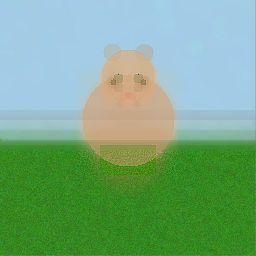

* Step History
:PROPERTIES:
:UNHINGED-SECTION: step-history
:END:
** Step 1/10
:PROPERTIES:
:UNHINGED-STEP-SNAPSHOT: 1/10
:END:
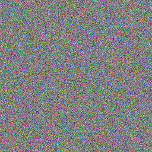

  I'll start by establishing the large-scale composition. Step 1 is about blocking in the major regions: sky/background at the top, green grass at the bottom, and a cat blob in the middle area.
  I'll start by establishing the large-scale composition: sky/background at the top, green grass at the bottom, and a cat blob in the middle. Let me apply these foundational color blocks.
** Step 2/10
:PROPERTIES:
:UNHINGED-STEP-SNAPSHOT: 2/10
:END:
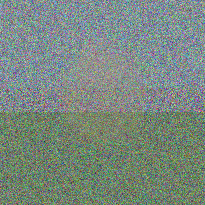

  I'll check the status first, then apply large-scale composition blocks for this early phase step.
  I'll start by getting the canvas status, then apply large-scale composition blocks for this early phase step.
** Step 3/10
:PROPERTIES:
:UNHINGED-STEP-SNAPSHOT: 3/10
:END:
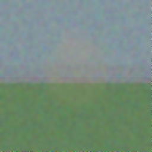

  I'll check the current status and then refine the composition based on the emerging shapes.
  I'll check the status first, then apply refinements to develop the cat shape on the grass.
** Step 4/10
:PROPERTIES:
:UNHINGED-STEP-SNAPSHOT: 4/10
:END:
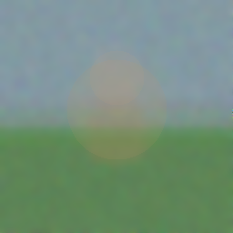

  I'll check the status first, then apply targeted refinements to develop the cat and scene.
  I'll check the status first, then apply targeted refinements.
** Step 5/10
:PROPERTIES:
:UNHINGED-STEP-SNAPSHOT: 5/10
:END:
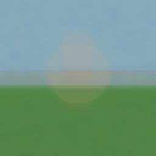

  I'll check the status first, then apply targeted refinements to develop the cat shape more clearly.
  I'll now apply targeted refinements to develop the cat shape more clearly. Let me work on sharpening the cat's form, adding facial features, and improving the overall composition.
** Step 6/10
:PROPERTIES:
:UNHINGED-STEP-SNAPSHOT: 6/10
:END:
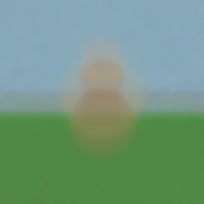

  I'll check the current status and then apply targeted refinements to sharpen the cat's form.
  I'll check the status first, then apply targeted refinements to sharpen the cat's form.
** Step 7/10
:PROPERTIES:
:UNHINGED-STEP-SNAPSHOT: 7/10
:END:
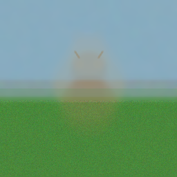

  I'll check the current status and then apply targeted refinements to sharpen the cat's form at this mid-to-late refinement stage.
  I'll now apply targeted refinements to sharpen the cat's form at this late refinement stage. Let me work on the cat's features, fur texture, and overall clarity.
** Step 8/10
:PROPERTIES:
:UNHINGED-STEP-SNAPSHOT: 8/10
:END:
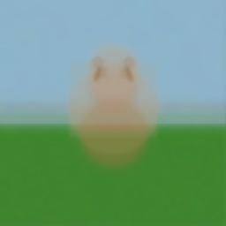

  I'll check the current status first, then apply detailed refinements to sharpen the cat's features.
  I'll now apply detailed refinements to sharpen the cat's features, add ears, eyes, nose, and whiskers, and crisp up the edges.
** Step 9/10
:PROPERTIES:
:UNHINGED-STEP-SNAPSHOT: 9/10
:END:
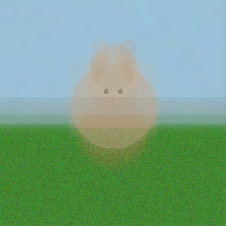

  I'll check the current status and then apply detailed finishing touches to the cat image.
  I'll apply detailed finishing touches to the cat image now - sharpening edges, refining features, and adding final details.
** Step 10/10
:PROPERTIES:
:UNHINGED-STEP-SNAPSHOT: 10/10
:END:
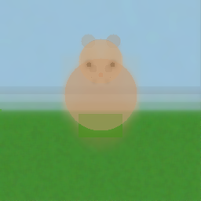

  I'll check the current status and apply final detail refinements to complete the cat image.
  I'll apply final detail refinements to complete the cat image with crisp edges, facial features, and fine details.
* Edit Log
:PROPERTIES:
:UNHINGED-SECTION: edit-log
:END:
** Step 1/10
:PROPERTIES:
:UNHINGED-STEP-LOG: 1/10
:END:
- =draw_rectangle(0,0 256x140, #87CEEB, α:25)=

- =draw_rectangle(0,140 256x116, #3A8B2F, α:35)=
- =draw_rectangle(0,0 256x110, #87CEEB, α:30)=
- =draw_rectangle(0,140 256x116, #3A7D2C, α:40)=
- =draw_rectangle(80,70 100x110, #A0845C, α:25)=
** Step 2/10
:PROPERTIES:
:UNHINGED-STEP-LOG: 2/10
:END:
- =draw_circle(128,120 r:55, #B8A080, α:30)=

- =draw_circle(128,75 r:30, #C8A888, α:28)=
- =blur_region(0,0→255,255, r:3)=
- =blur_region(0,0→255,255, r:2)=
- =draw_rectangle(0,150 256x106, #4A8C35, α:20)=
- =notes: Sky/background region: y=0 to y=140 (light blue tint). Green grass region: y=140 to y=255. Cat body blob centered around (128,120) radius~55. Cat head blob centered around (128,75) radius~30.=
- =draw_rectangle(0,0 256x130, #8BB8D0, α:30)=
- =draw_rectangle(0,140 256x116, #3A8C2F, α:40)=
** Step 3/10
:PROPERTIES:
:UNHINGED-STEP-LOG: 3/10
:END:
- =draw_rectangle(0,120 256x40, #4FA83A, α:35)=

- =draw_circle(128,145 r:38, #B08060, α:28)=
- =notes: Sky/background: top region y=0-110, light blue (#87CEEB). Green grass: y=140-255, dark green (#3A7D2C). Cat body blob: center x=80-180, y=70-180, warm brown/tan (#A0845C). Horizon/transition zone around y=130-150.=
- =draw_rectangle(0,140 256x116, #3a8c2f, α:35)=
- =draw_rectangle(0,0 256x150, #87ceeb, α:20)=
** Step 4/10
:PROPERTIES:
:UNHINGED-STEP-LOG: 4/10
:END:
- =draw_circle(128,105 r:22, #C09070, α:25)=

- =draw_rectangle(100,120 56x60, #A87850, α:25)=
- =blur_region(0,0→255,135, r:3)=
- =blur_region(0,140→255,255, r:2)=
- =blur_region(0,0→256,120, r:3)=
- =blur_region(0,130→256,256, r:3)=
- =blur_region(0,0→255,140, r:3)=
- =blur_region(0,140→255,255, r:3)=
- =draw_circle(128,120 r:55, #b8956a, α:28)=
- =draw_circle(128,85 r:30, #c4a07a, α:25)=
- =blur_region(0,0→255,110, r:3)=
- =blur_region(0,145→255,255, r:2)=
- =blur_region(90,80→170,195, r:2)=
- =draw_rectangle(0,0 256x140, #adc8d8, α:25)=
- =draw_rectangle(0,140 256x116, #4a8a3a, α:30)=
- =blur_region(0,140→255,255, r:3)=
- =blur_region(0,0→255,140, r:2)=
- =draw_rectangle(0,0 256x140, #9BB8D0, α:25)=
- =draw_rectangle(0,140 256x116, #4A8C3F, α:30)=
** Step 5/10
:PROPERTIES:
:UNHINGED-STEP-LOG: 5/10
:END:
- =draw_rectangle(0,0 256x115, #7BAFD4, α:35)=

- =draw_rectangle(0,145 256x111, #3A7D2C, α:45)=
- =draw_circle(128,120 r:50, #b8a898, α:30)=
- =draw_circle(128,75 r:28, #b0a090, α:30)=
- =notes: Background/sky: soft blue-gray tint across top half (y=0–130). Green grass region: y=120–256, full width, color ~#3A8C2F. Cat body blob: centered around (128,145), radius ~38, warm tan #B08060. Cat head blob: centered around (128,105), radius ~22, warm tan #C09070. Cat occupies roughly x=90–170, y=80–195.=
- =draw_rectangle(0,0 256x115, #87CEEB, α:35)=
- =draw_rectangle(0,148 256x108, #3A7D2C, α:40)=
- =notes: Green grass region: y=140 to y=255, full width (0-255). Sky/background: y=0 to y=150, full width. Cat body blob centered around (128,120) radius~55. Cat head blob centered around (128,85) radius~30.=
- =blur_region(70,40→190,175, r:3)=
- =adjust_bc(0,140→255,255, b:5, c:0.10)=
- =draw_circle(128,155 r:42, #9B7A50, α:55)=
- =draw_circle(128,100 r:28, #A08060, α:50)=
- =draw_circle(128,125 r:50, #B8956A, α:30)=
- =draw_circle(128,78 r:28, #C4A070, α:30)=
** Step 6/10
:PROPERTIES:
:UNHINGED-STEP-LOG: 6/10
:END:
- =draw_circle(128,148 r:38, #8B7355, α:45)=

- =draw_circle(128,100 r:24, #9E8060, α:50)=
- =blur_region(0,0→256,115, r:2)=
- =blur_region(0,145→256,256, r:2)=
- =draw_rectangle(105,115 46x45, #8B7050, α:40)=
- =blur_region(70,45→186,180, r:4)=
- =draw_circle(114,92 r:7, #C8A87A, α:40)=
- =draw_circle(142,92 r:7, #C8A87A, α:40)=
- =draw_circle(112,52 r:10, #a89888, α:20)=
- =draw_circle(144,52 r:10, #a89888, α:20)=
- =blur_region(0,0→256,118, r:2)=
- =blur_region(0,120→256,256, r:2)=
- =blur_region(0,0→255,135, r:2)=
- =blur_region(0,140→255,255, r:2)=
- =blur_region(85,70→175,195, r:3)=
- =draw_rectangle(0,0 256x115, #8BBDD4, α:40)=
- =draw_rectangle(0,148 256x108, #3D7A2E, α:50)=
- =draw_rectangle(0,0 256x118, #8AAEC4, α:30)=
- =draw_rectangle(0,128 256x128, #3A8C2F, α:40)=
- =notes: Sky/background region: y=0 to y=140 (light blue-gray, #adc8d8). Green grass region: y=140 to y=255 (#4a8a3a). Cat body blob centered around (128,120) radius~50 (warm gray #b8a898). Cat head blob centered around (128,75) radius~28 (warm gray #b0a090). Ear hints at (112,52) and (144,52) radius~10.=
- =draw_line(108,74→108,74, #9B7A50, α:50, w:3)=
- =draw_line(148,74→148,74, #9B7A50, α:50, w:3)=
- =draw_line(0,145→255,145, #3A7A30, α:40, w:3)=
- =add_noise(0,145→255,255, amt:12)=
** Step 7/10
:PROPERTIES:
:UNHINGED-STEP-LOG: 7/10
:END:
- =draw_rectangle(0,0 256x140, #8AAFC4, α:30)=

- =draw_rectangle(0,148 256x108, #4A8A2E, α:40)=
- =draw_circle(128,152 r:38, #A07850, α:60)=
- =draw_circle(128,105 r:23, #B08860, α:65)=
- =draw_circle(128,148 r:38, #9E7B55, α:55)=
- =draw_circle(128,100 r:28, #A88060, α:60)=
- =adjust_bc(0,0→255,140, b:5, c:0.10)=
- =adjust_bc(0,140→255,255, b:-5, c:0.12)=
- =blur_region(0,0→255,135, r:2)=
- =blur_region(0,145→255,255, r:2)=
- =sharpen_region(90,75→170,190, i:0.20)=
- =sharpen_region(0,130→255,155, i:0.25)=
- =draw_circle(113,76 r:10, #A08060, α:50)=
- =draw_circle(143,76 r:10, #A08060, α:50)=
- =draw_circle(113,85 r:9, #A07850, α:70)=
- =draw_circle(143,85 r:9, #A07850, α:70)=
- =blur_region(0,0→255,135, r:2)=
- =blur_region(0,140→255,255, r:2)=
- =draw_circle(128,125 r:50, #C8956A, α:45)=
- =draw_circle(128,85 r:30, #C8956A, α:55)=
- =blur_region(0,0→256,120, r:3)=
- =blur_region(0,140→256,256, r:2)=
** Step 8/10
:PROPERTIES:
:UNHINGED-STEP-LOG: 8/10
:END:
- =draw_rectangle(78,70 100x85, #b0a090, α:50)=

- =draw_circle(128,78 r:30, #b8aa98, α:60)=
- =blur_region(0,0→255,130, r:2)=
- =blur_region(0,140→255,255, r:2)=
- =draw_line(113,77→113,76, #A07850, α:80, w:4)=
- =draw_line(143,77→143,76, #A07850, α:80, w:4)=
- =draw_circle(110,70 r:7, #9A7550, α:60)=
- =draw_circle(146,70 r:7, #9A7550, α:60)=
- =draw_rectangle(111,76 10x12, #8B7050, α:45)=
- =draw_rectangle(137,76 10x12, #8B7050, α:45)=
- =draw_rectangle(0,0 256x140, #8aafc0, α:30)=
- =draw_rectangle(0,148 256x108, #4a8c35, α:35)=
- =notes: Sky/background region: y=0 to y=145 (light blue-gray, brightened). Horizon line at y=145. Green grass region: y=145 to y=255 (medium green, noisy texture). Cat body blob centered around (128,125) radius~50 (warm tan/brown). Cat head blob centered around (128,78) radius~28 (warm tan). Both blobs blurred into the background — next steps should sharpen edges and add cat features (ears, eyes, tail).=
- =blur_region(85,65→175,205, r:2)=
- =draw_circle(128,120 r:48, #b8a888, α:50)=
- =draw_circle(112,54 r:10, #b0a090, α:70)=
- =blur_region(85,60→172,195, r:2)=
- =draw_circle(128,120 r:48, #c8a878, α:45)=
- =draw_circle(128,83 r:28, #d4b48a, α:50)=
- =draw_rectangle(0,0 256x130, #adc8d8, α:30)=
- =draw_rectangle(0,145 256x111, #4a8a3a, α:40)=
** Step 9/10
:PROPERTIES:
:UNHINGED-STEP-LOG: 9/10
:END:
- =sharpen_region(85,65→175,205, i:0.15)=

- =sharpen_region(88,45→168,160, i:0.40)=
- =blur_region(0,0→255,135, r:2)=
- =add_noise(0,155→255,255, amt:12)=
- =adjust_bc(0,0→255,110, b:5, c:0.10)=
- =draw_circle(120,103 r:3, #1A1A0A, α:90)=
- =draw_circle(136,103 r:3, #1A1A0A, α:90)=
- =draw_circle(128,112 r:2, #CC6677, α:75)=
- =sharpen_region(90,65→168,185, i:0.25)=
- =draw_circle(144,54 r:10, #b0a090, α:70)=
- =draw_rectangle(0,0 256x130, #adc8d8, α:30)=
- =draw_circle(116,68 r:8, #c8a878, α:60)=
- =draw_circle(140,68 r:8, #c8a878, α:60)=
- =add_noise(0,145→256,256, amt:12)=
- =draw_circle(128,120 r:48, #b0a090, α:55)=
- =draw_circle(128,76 r:27, #b0a090, α:65)=
- =sharpen_region(90,50→168,160, i:0.40)=
- =draw_circle(113,82 r:5, #3a2a1a, α:180)=
- =draw_circle(143,82 r:5, #3a2a1a, α:180)=
- =blur_region(80,55→176,175, r:2)=
- =blur_region(88,70→170,200, r:2)=
- =blur_region(0,138→255,255, r:2)=
- =draw_circle(128,75 r:26, #b0a090, α:60)=
- =draw_circle(112,52 r:9, #a89880, α:70)=
- =draw_circle(144,52 r:9, #a89880, α:70)=
- =sharpen_region(90,50→168,175, i:0.45)=
- =draw_rectangle(100,145 56x30, #4a8c1c, α:180)=
- =draw_rectangle(0,140 256x116, #4a8a3a, α:35)=
- =draw_line(0,140→255,140, #5a9a4a, α:255, w:3)=
- =blend_color(116,98, #2A1A0A, α:80)=
- =blend_color(140,98, #2A1A0A, α:80)=
- =notes: Sky/background: top region y=0-115, light blue (#87CEEB), smoothed and brightened. Green grass: y=148-255, dark green (#3A7D2C), textured with noise. Horizon/transition zone: y=130-150. Cat body blob: centered x=128, body circle at (128,148) r=38, warm brown/tan (#8B7355). Cat head: circle at (128,100) r=24 (#9E8060). Cat neck/torso connector: rect x=105-151, y=115-160. Cat ears: left rect (111,76)-(121,88), right rect (137,76)-(147,88). Cat is sitting upright center-frame.=
** Step 10/10
:PROPERTIES:
:UNHINGED-STEP-LOG: 10/10
:END:
- =notes: Sky: y=0-115, soft blue (#7BAFD4). Grass: y=145-255, green (#3A7D2C) with texture noise. Cat body (torso): circle centered at (128,155) radius ~42, warm brown (#9B7A50). Cat head: circle centered at (128,100) radius ~28, tan (#A08060). Cat ears: emerging at (108,74) left and (148,74) right as small pointed tips. Horizon/transition zone around y=130-145.=

- =draw_circle(118,87 r:5, #3a2a18, α:55)=
- =draw_circle(138,87 r:5, #3a2a18, α:55)=
- =draw_circle(113,82 r:3, #1a1000, α:220)=
- =draw_circle(143,82 r:3, #1a1000, α:220)=
- =draw_circle(128,95 r:3, #c08060, α:200)=
- =sharpen_region(90,72→168,198, i:0.25)=
- =adjust_bc(0,120→256,256, b:5, c:0.10)=
- =draw_circle(128,120 r:46, #b8a898, α:50)=
- =draw_rectangle(0,142 256x114, #4a8a3a, α:40)=
- =draw_circle(128,78 r:28, #d4a97a, α:120)=
- =draw_circle(128,120 r:46, #c8956a, α:100)=
- =draw_circle(118,78 r:5, #6a7a4a, α:80)=
- =draw_circle(138,78 r:5, #6a7a4a, α:80)=
- =blend_color(118,74, #3a3020, α:120)=
- =blend_color(138,74, #3a3020, α:120)=
- =draw_rectangle(120,92 16x8, #d4826a, α:50)=
- =draw_line(0,148→256,148, #4A8A38, α:40, w:3)=
- =add_noise(0,150→256,256, amt:12)=
- =sharpen_region(78,50→178,175, i:0.45)=
- =adjust_bc(0,0→255,140, b:5, c:0.10)=
- =adjust_bc(0,145→255,255, b:-5, c:0.15)=
