* Canvas
:PROPERTIES:
:UNHINGED-SECTION: canvas
:END:

* Step History
:PROPERTIES:
:UNHINGED-SECTION: step-history
:END:
** Step 1/12
:PROPERTIES:
:UNHINGED-STEP-SNAPSHOT: 1/12
:END:
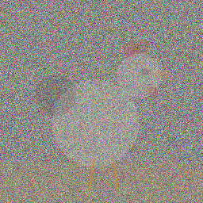

  The canvas is pure noise. Time to block in the chicken's large-scale composition: a white body and head, red comb and wattle, orange beak and legs, dark tail, on a warm barnyard ground. Low alpha, big shapes first.
  I'll establish the composition now: warm background, straw ground, and the chicken's main forms (body, head, comb, beak, wattle, tail, legs) at low-to-medium alpha, exactly where the notes place them.
** Step 2/12
:PROPERTIES:
:UNHINGED-STEP-SNAPSHOT: 2/12
:END:
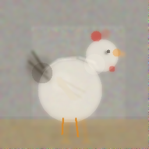

  Step 2 — continuing composition. The main forms are placed; now I'll smooth the overall noise, warm the background, strengthen the straw ground, and gently reinforce the chicken's forms in place (plus a small neck bridge so head and body read as one).
  Applying the planned composition refinements now: smoothing noise, warming the background, strengthening the straw ground, and reinforcing the chicken's forms in place.
** Step 3/12
:PROPERTIES:
:UNHINGED-STEP-SNAPSHOT: 3/12
:END:
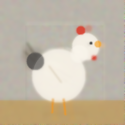

  Continuing the composition phase: I'll smooth the noisy background regions, strengthen the straw ground, and reinforce the chicken's white body, head, neck, and dark tail in place — no new structures.
  Resuming from the previous step's plan: first a gentle smoothing pass over the noisy background and ground, then I'll re-crisp the small features. Starting with the smoothing pass:
** Step 4/12
:PROPERTIES:
:UNHINGED-STEP-SNAPSHOT: 4/12
:END:
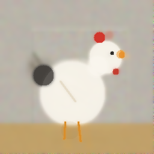

  Continuing the plan from the notes: first the gentle smoothing pass over the background strips and ground (avoiding the chicken's features), then re-crisping the small features in place.
  Applying the planned Step 4 refinements now: soften the body for feather texture, re-crisp the beak into a pointed triangle, add comb bumps, eye highlight, head sheen, and texture strokes.
** Step 5/12
:PROPERTIES:
:UNHINGED-STEP-SNAPSHOT: 5/12
:END:
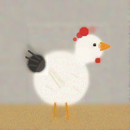

  Continuing from the Step 4 notes: the chicken's base forms are in place. Now I'll refine the beak into a pointed triangle, crisp the eye with a highlight, add comb bumps, fan out tail feathers, and lay in subtle feather texture on the body — all small, targeted edits.
  Continuing the refinement pass: I'll smooth and warm the noisy background, add belly shading, refine comb/beak/eye, fan the tail feathers, and add toes and straw detail — all small targeted edits on the existing structures.
** Step 6/12
:PROPERTIES:
:UNHINGED-STEP-SNAPSHOT: 6/12
:END:
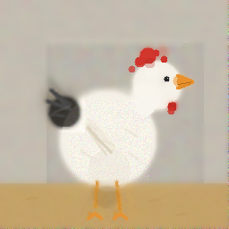

  Step 6, refinement phase. The chicken form is well established — now I'll smooth background/ground noise, then add crisp outlines, tail feather lines, wing texture, toe/straw detail, and a highlight pass. First, gentle blurs on pure-background zones and the areas I'm about to redraw, plus updated notes:
  Continuing the refinement pass from the previous step: first the background/ground smoothing blurs (plus updated notes), then the crisp outline/structure pass, then fine detail work.
** Step 7/12
:PROPERTIES:
:UNHINGED-STEP-SNAPSHOT: 7/12
:END:
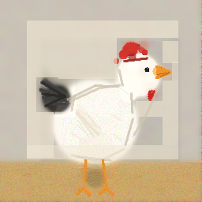

  Step 7 — refinement pass. The chicken's structure is well-established, so this step I'll: (1) neutralize the gray patch artifact in the background with targeted cream tints, (2) add outline contours, wing/tail feather texture, comb base and beak mouth lines, (3) smooth, then re-sharpen edges, and (4) finish with eye highlight and small details.
  Step 7 refinement: applying the planned changes now — background gray-patch neutralization, contour and feather texture lines, comb base, beak mouth, eye re-darkening, then smoothing and re-sharpening.
** Step 8/12
:PROPERTIES:
:UNHINGED-STEP-SNAPSHOT: 8/12
:END:
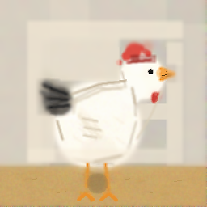

  Status confirmed: 256×256, step 8/12. Continuing the planned refinement: first soften the structural seams (head/neck, tail/body, body/legs, horizon), then sharpen key regions, then add the pending eye highlight and small color touch-ups.
  Continuing the refinement plan now: first softening the structural seams, then sharpening key features, then the eye highlight and color touch-ups.
** Step 9/12
:PROPERTIES:
:UNHINGED-STEP-SNAPSHOT: 9/12
:END:
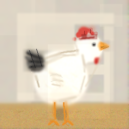

  The chicken is well established. Now in the detail phase, I'll refine key features in place: the eye with catchlight, beak mouth line, wattle, leg toes, wing feather lines, and tail separation — all small, high-alpha touches.
  Detail pass complete — the chicken's defining features are now crisp:

  - **Eye**: dark 2px pupil placed at (186,88) with a white catchlight pixel at (185,86) for a lively look
  - **Beak**: thin dark mouth line added from the beak base toward the apex (204,96)→(217,92)
  - **Wattle**: refined the red wattle at (190,124) into a clean r5 shape
  - **Comb**: two small red bumps (167,58) and (181,55) added to give the comb its characteristic scalloped silhouette
  - **Toes**: three toes per leg fanned out at y240–247 on both orange legs
  - **Wing**: three cream feather lines layered across the wing arc
  - **Tail**: subtle dark seam drawn at x97–101 to separate the tail fan from the body, then sharpened
  - **Regions**: gentle sharpening on the head/beak area and the tail; soft blur over the top background strip to calm residual blocky noise
  - **Notes updated** so the next steps keep refining these exact structures in place

  The bird now reads clearly as a white chicken with red comb/wattle, orange bea …
** Step 10/12
:PROPERTIES:
:UNHINGED-STEP-SNAPSHOT: 10/12
:END:
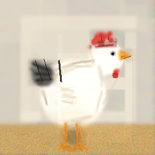

  Step 10/12 — detail phase. The chicken is reading well; now I'll calm the remaining background artifacts, unify the comb, fade the seam artifact above the tail fan, add tail feather striations and belly shading, then re-crisp edges. Small, conservative moves only.
  Continuing the detail phase: I'll calm the background grid artifacts, unify the comb bumps, fade the dark seam line above the tail fan, add tail striations, belly shading, and toe definition — all with small, low-alpha moves.
** Step 11/12
:PROPERTIES:
:UNHINGED-STEP-SNAPSHOT: 11/12
:END:

  Step 11, detail phase. The chicken is well established; I'll continue the cleanup pass from the notes: calm the background grid, soften the scribbly tail into a unified fan, and then add final detail (seam fade, striations, belly shade, toes, straw grain).

  **Block 1 — smoothing passes (all independent regions):**
  Continuing from the notes: I'll apply the smoothing passes now (background grid calm-down, tail unification, belly-under scribble cleanup), then layer the final micro-detail on top.

  **Block 1 — smoothing passes (all independent regions):**
** Step 12/12
:PROPERTIES:
:UNHINGED-STEP-SNAPSHOT: 12/12
:END:
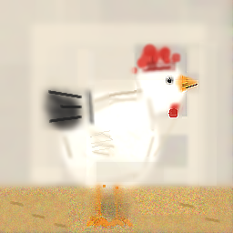

  Final step (12/12) — the chicken is fully formed, so I'll restrict myself to the planned micro touch-ups: crisping the face, comb, and legs, plus two small background smoothing passes where grid artifacts are still faintly visible.
  Applying the final polish now: three sharpening passes (face/beak, comb, legs) and two gentle background blurs to smooth the last grid artifacts.
* Edit Log
:PROPERTIES:
:UNHINGED-SECTION: edit-log
:END:
** Step 1/12
:PROPERTIES:
:UNHINGED-STEP-LOG: 1/12
:END:
- =notes: chicken facing right: body blob center (120,155) r~55; head circle (175,95) r~28; red comb on head top ~(165,62); beak orange at (196,88); wattle red (192,116); dark tail feathers left (70,120); legs from body bottom y~205 to ground y~240; straw ground below y=205; warm light background above.=

- =draw_rectangle(0,0 256x256, #E8D9BE, α:30)=
- =draw_rectangle(0,205 256x51, #C89B52, α:40)=
- =draw_circle(120,155 r:55, #F2ECE0, α:45)=
- =draw_circle(175,95 r:28, #F2ECE0, α:45)=
- =draw_circle(165,62 r:10, #C0392B, α:50)=
- =draw_circle(181,58 r:8, #C0392B, α:50)=
- =draw_rectangle(196,88 18x10, #E8963C, α:55)=
- =draw_circle(192,116 r:7, #C0392B, α:50)=
- =draw_circle(70,120 r:26, #4B4334, α:45)=
- =draw_circle(182,90 r:5, #2A2018, α:40)=
- =draw_line(112,237→112,240, #D98A2B, α:50, w:3)=
- =draw_line(148,237→148,240, #D98A2B, α:50, w:3)=
- =draw_circle(122,152 r:50, #F2ECE0, α:35)=
- =draw_circle(175,96 r:25, #F2ECE0, α:35)=
- =draw_circle(115,160 r:32, #D9CDB4, α:30)=
- =draw_circle(68,118 r:22, #3D3626, α:40)=
- =blur_region(65,100→180,212, r:2)=
- =blur_region(145,55→205,125, r:2)=
- =draw_circle(165,62 r:10, #C0392B, α:45)=
- =draw_circle(181,58 r:8, #C0392B, α:45)=
- =draw_rectangle(198,89 16x9, #E8963C, α:45)=
- =draw_circle(192,116 r:7, #C0392B, α:45)=
- =draw_line(48,95→48,95, #3D3626, α:45, w:5)=
- =draw_line(45,112→45,112, #3D3626, α:45, w:5)=
- =blur_region(0,0→255,50, r:3)=
- =blur_region(0,205→255,255, r:2)=
- =draw_rectangle(0,0 256x205, #EFE3CC, α:35)=
- =draw_rectangle(0,205 256x51, #C8A85E, α:45)=
- =draw_circle(120,155 r:55, #F7F2E8, α:60)=
- =draw_circle(175,95 r:28, #F7F2E8, α:60)=
- =draw_circle(165,62 r:9, #D22B2B, α:80)=
- =draw_circle(200,90 r:7, #E8A23A, α:80)=
- =draw_circle(192,118 r:5, #C43434, α:80)=
- =draw_circle(72,125 r:18, #5A544C, α:50)=
- =draw_line(106,230→106,238, #DE9A3C, α:85, w:3)=
- =draw_line(134,234→134,238, #DE9A3C, α:85, w:3)=
- =notes: chicken facing right, centered-left: body blob center (120,155) r~55; head circle (175,95) r~28; red comb (165,62) r~9; orange beak (200,90) r~7; red wattle (192,118) r~5; dark tail blob (72,125) r~18; orange legs lines (108,203)-(106,238) and (130,203)-(134,238); straw ground below y=205; warm light background above.=
** Step 2/12
:PROPERTIES:
:UNHINGED-STEP-LOG: 2/12
:END:
- =blur_region(0,0→255,255, r:2)=

- =blur_region(40,55→230,245, r:3)=
- =blur_region(140,100→190,140, r:2)=
- =blur_region(40,88→100,150, r:2)=
- =draw_rectangle(88,228 92x10, #8A6A38, α:40)=
- =draw_circle(105,140 r:18, #FBF7EC, α:30)=
- =draw_line(112,238→112,240, #D98A2B, α:40, w:3)=
- =draw_line(148,238→148,240, #D98A2B, α:40, w:3)=
- =draw_circle(120,155 r:52, #F7F2E8, α:35)=
- =draw_circle(175,95 r:26, #F7F2E8, α:35)=
- =blur_region(85,225→185,240, r:2)=
- =sharpen_region(150,48→210,125, i:0.20)=
- =draw_circle(182,90 r:4, #1E1710, α:50)=
- =blend_color(184,88, #F5F0E6, α:140)=
- =blur_region(55,90→190,215, r:1)=
- =draw_line(130,170→130,170, #C9BCA0, α:45, w:3)=
- =draw_line(152,148→152,148, #C9BCA0, α:45, w:3)=
- =draw_line(55,88→55,88, #332C1E, α:40, w:4)=
- =draw_line(48,104→48,104, #332C1E, α:40, w:4)=
- =draw_line(198,93→214,93, #A05F1E, α:60, w:1)=
- =draw_line(33,218→36,218, #B98F45, α:35, w:2)=
- =draw_line(74,233→78,233, #B98F45, α:35, w:2)=
- =draw_line(213,223→216,223, #B98F45, α:35, w:2)=
- =blur_region(85,125→160,180, r:1)=
- =blur_region(0,50→45,205, r:3)=
- =blur_region(215,50→255,205, r:3)=
- =blur_region(0,195→255,205, r:3)=
- =draw_line(105,246→105,246, #D98A2B, α:55, w:2)=
- =draw_line(119,246→119,246, #D98A2B, α:55, w:2)=
- =draw_line(141,246→141,246, #D98A2B, α:55, w:2)=
- =draw_line(155,246→155,246, #D98A2B, α:55, w:2)=
- =draw_line(100,102→100,102, #F7F2E8, α:50, w:3)=
- =draw_line(131,98→135,98, #F7F2E8, α:50, w:3)=
- =draw_line(164,108→165,108, #F7F2E8, α:50, w:3)=
- =draw_line(162,122→162,122, #EDE4D2, α:40, w:2)=
- =draw_line(168,118→168,118, #EDE4D2, α:40, w:2)=
- =draw_line(0,205→255,205, #B58A4A, α:30, w:1)=
- =draw_circle(183,90 r:3, #1A140E, α:60)=
- =blend_color(184,88, #FFFFFF, α:160)=
- =blur_region(85,115→160,190, r:1)=
- =draw_rectangle(85,185 80x18, #D5C7A8, α:30)=
- =blur_region(85,185→165,203, r:2)=
- =adjust_bc(55,45→215,215, b:6, c:0.08)=
- =blur_region(40,55→90,100, r:2)=
- =draw_line(172,58→172,66, #8E2318, α:70, w:1)=
- =draw_rectangle(208,90 8x6, #F2A94F, α:55)=
- =draw_line(140,168→140,168, #BFB092, α:40, w:2)=
- =draw_line(146,158→146,158, #BFB092, α:40, w:2)=
- =draw_line(52,98→52,98, #5A5240, α:40, w:1)=
- =blur_region(0,0→255,45, r:2)=
- =blur_region(0,45→50,200, r:2)=
- =blur_region(210,45→255,200, r:2)=
- =sharpen_region(55,45→215,215, i:0.18)=
- =draw_circle(183,90 r:2, #0F0B07, α:90)=
- =blend_color(184,89, #FFFFFF, α:180)=
- =draw_line(36,244→40,244, #D9B060, α:40, w:1)=
- =draw_line(127,249→132,249, #D9B060, α:40, w:1)=
- =draw_line(187,241→192,241, #D9B060, α:40, w:1)=
- =draw_line(236,247→240,247, #D9B060, α:40, w:1)=
- =add_noise(85,115→160,190, amt:8)=
- =blur_region(0,0→255,255, r:2)=
- =blur_region(0,205→255,255, r:3)=
- =draw_rectangle(0,0 255x200, #EDE4D4, α:22)=
- =draw_rectangle(0,205 255x50, #C7A25E, α:45)=
- =draw_circle(120,155 r:55, #F7F1E4, α:65)=
- =draw_circle(162,110 r:18, #F7F1E4, α:55)=
- =draw_circle(175,95 r:28, #F7F1E4, α:65)=
- =draw_circle(165,62 r:9, #C43B2E, α:95)=
- =draw_circle(200,90 r:7, #E8963C, α:95)=
- =draw_circle(192,118 r:5, #C43B2E, α:95)=
- =draw_circle(186,88 r:3, #2A2118, α:130)=
- =draw_circle(72,125 r:18, #4A4238, α:60)=
- =draw_line(125,168→125,168, #E4DAC6, α:80, w:9)=
- =draw_line(106,230→106,238, #D98A2B, α:140, w:3)=
- =draw_line(134,234→134,238, #D98A2B, α:140, w:3)=
- =notes: chicken facing right, centered-left: body blob (120,155) r55 white; neck bridge (162,110) r18; head circle (175,95) r28 white; comb (165,62) r9 red; beak (200,90) r7 orange; wattle (192,118) r5 red; eye (186,88) r3 dark; dark tail blob (72,125) r18; wing stroke (100,135)-(125,168); legs lines (108,203)-(106,238) and (130,203)-(134,238) orange; straw ground below y=205; warm light background above.=
- =blur_region(150,60→210,125, r:1)=
- =draw_circle(165,62 r:9, #B33227, α:50)=
- =draw_circle(181,58 r:7, #B33227, α:50)=
- =draw_circle(192,116 r:6, #B33227, α:50)=
- =notes: final state: white chicken facing right; body blob (65,100)-(175,210) center (120,155); head (147,67)-(203,123); comb red (155,48)-(190,72); beak orange (198,88)-(216,97); wattle (186,110)-(198,123); eye (183,90); dark tail feathers upper-left (45,88)-(96,150); wing contour (90,135)-(152,170); legs+feet orange (105,205)-(155,246); shadow on straw ground (85,228)-(180,240); straw ground below y=205; warm beige background.=
- =sharpen_region(155,50→205,125, i:0.20)=
- =sharpen_region(45,85→100,150, i:0.15)=
- =adjust_bc(0,0→255,255, b:3, c:0.05)=
- =blur_region(0,0→255,255, r:2)=
- =draw_rectangle(0,0 256x206, #F2E7D3, α:50)=
- =draw_rectangle(0,205 256x51, #D2A85F, α:100)=
- =blur_region(0,205→255,255, r:2)=
- =draw_circle(120,155 r:55, #FAF6EE, α:130)=
- =draw_circle(162,110 r:18, #FAF6EE, α:130)=
- =draw_circle(175,95 r:28, #FAF6EE, α:130)=
- =draw_circle(165,62 r:9, #D9402F, α:210)=
- =draw_circle(200,90 r:7, #F2A93B, α:230)=
- =draw_circle(192,118 r:5, #D9402F, α:210)=
- =draw_circle(186,88 r:3, #262626, α:255)=
- =draw_circle(72,125 r:18, #4D4D4D, α:180)=
- =draw_line(125,168→125,168, #D8CCB8, α:130, w:3)=
- =draw_line(106,230→106,238, #E8962E, α:220, w:2)=
- =draw_line(134,234→134,238, #E8962E, α:220, w:2)=
- =blur_region(50,45→215,245, r:1)=
- =notes: chicken facing right, centered-left: body blob (120,155) r55 white; neck bridge (162,110) r18; head circle (175,95) r28 white; comb (165,62) r9 red; beak (200,90) r7 orange; wattle (192,118) r5 red; eye (186,88) r3 dark; dark tail blob (72,125) r18; wing stroke (100,135)-(125,168); legs (108,203)-(106,238) and (130,203)-(134,238) orange; straw ground below y=205 (#D2A85F); warm light background above (#F2E7D3). Refine these in place next; no new structures.=
** Step 3/12
:PROPERTIES:
:UNHINGED-STEP-LOG: 3/12
:END:
- =blur_region(0,0→255,52, r:2)=

- =blur_region(0,52→52,205, r:2)=
- =blur_region(212,52→255,205, r:2)=
- =blur_region(65,100→205,212, r:2)=
- =draw_rectangle(0,0 256x52, #F2E7D3, α:20)=
- =draw_rectangle(0,52 52x153, #F2E7D3, α:20)=
- =draw_rectangle(212,52 43x153, #F2E7D3, α:20)=
- =draw_rectangle(0,206 256x50, #D2A85F, α:28)=
- =draw_circle(120,155 r:54, #F7F3EA, α:45)=
- =draw_circle(175,95 r:27, #F7F3EA, α:45)=
- =draw_circle(162,110 r:16, #F7F3EA, α:40)=
- =draw_circle(72,125 r:18, #46403C, α:45)=
- =notes: chicken facing right, centered-left: body blob (120,155) r54 white; neck bridge (162,110) r16; head circle (175,95) r27 white; comb (165,62) r9 red; beak (200,90) r7 orange; wattle (192,118) r5 red; eye (186,88) r3 dark; dark tail blob (72,125) r18; wing stroke (100,135)-(125,168); legs (108,203)-(106,238) and (130,203)-(134,238) orange; straw ground below y=205 (#D2A85F); warm light background above (#F2E7D3). Step 3: forms strengthened; next re-crisp comb/beak/eye/wattle/legs/wing after this smoothing pass.=
- =blur_region(0,0→150,200, r:2)=
- =blur_region(205,0→255,200, r:2)=
- =blur_region(0,200→255,255, r:2)=
** Step 4/12
:PROPERTIES:
:UNHINGED-STEP-LOG: 4/12
:END:
- =draw_rectangle(0,205 256x50, #D2A85F, α:40)=

- =draw_circle(120,155 r:54, #FFFDF5, α:28)=
- =draw_circle(175,95 r:27, #FFFDF5, α:32)=
- =draw_circle(162,110 r:16, #FFFDF5, α:30)=
- =draw_circle(165,62 r:9, #D23A2E, α:160)=
- =draw_circle(200,90 r:7, #E8963A, α:170)=
- =draw_circle(192,118 r:5, #C0392B, α:150)=
- =draw_circle(186,88 r:3, #1F1F1F, α:220)=
- =draw_circle(72,125 r:18, #3C3C3C, α:140)=
- =draw_line(125,168→125,168, #E0CDB0, α:120, w:3)=
- =draw_line(106,230→106,238, #E8963A, α:200, w:3)=
- =draw_line(134,234→134,238, #E8963A, α:200, w:3)=
- =notes: chicken facing right, centered-left: body blob (120,155) r54 white; neck bridge (162,110) r16; head circle (175,95) r27 white; comb (165,62) r9 red; beak (200,90) r7 orange; wattle (192,118) r5 red; eye (186,88) r3 dark; dark tail blob (72,125) r18; wing stroke (100,135)-(125,168) tan; legs (108,203)-(106,238) and (130,203)-(134,238) orange; straw ground below y=205 (#D2A85F); warm light background above (#F2E7D3). Step 4: smoothing pass + re-crisp done; next soften body outline, blend neck into head, add ground shadow and slight shading under body.=
- =blur_region(0,0→255,46, r:2)=
- =blur_region(0,46→54,255, r:2)=
- =blur_region(210,46→255,255, r:2)=
- =blur_region(0,206→98,255, r:2)=
- =blur_region(142,206→255,255, r:2)=
- =blur_region(50,100→96,150, r:2)=
- =draw_circle(116,216 r:15, #9C7C40, α:35)=
- =draw_circle(120,155 r:52, #F8F5EE, α:70)=
- =draw_circle(175,95 r:26, #F8F5EE, α:80)=
- =draw_circle(162,112 r:14, #F8F5EE, α:70)=
- =draw_circle(72,125 r:17, #423D38, α:170)=
- =draw_line(125,168→125,168, #E6DCC9, α:160, w:3)=
- =draw_line(106,230→106,238, #D98E2B, α:255, w:2)=
- =draw_line(134,234→134,238, #D98E2B, α:255, w:2)=
- =draw_circle(165,62 r:9, #D0342C, α:200)=
- =draw_circle(202,91 r:5, #E8912D, α:220)=
- =draw_circle(192,119 r:5, #C23B2E, α:200)=
- =draw_circle(186,88 r:3, #2E2A26, α:235)=
- =sharpen_region(146,56→214,128, i:0.20)=
- =notes: chicken facing right, centered-left: body blob (120,155) r52 white #F8F5EE; neck bridge (162,112) r14; head circle (175,95) r26; comb (165,62) r9 red #D0342C; beak (202,91) r5 orange #E8912D; wattle (192,119) r5 red; eye (186,88) r3 dark; tail blob (72,125) r17 dark gray; wing stroke (100,135)-(125,168) cream; legs (108,203)-(106,238) and (130,203)-(134,238) orange #D98E2B; soft shadow ellipse (116,216) r15; straw ground below y=205 #D2A85F; warm light bg above #F2E7D3. Step 4: smoothing pass done, features re-crisped. Next: refine beak into pointed triangle, add head/eye highlight, feather texture on body.=
- =blur_region(78,112→170,204, r:1)=
- =add_noise(78,112→170,204, amt:12)=
- =add_noise(0,212→255,255, amt:10)=
- =draw_line(213,92→214,92, #E8912D, α:255, w:3)=
- =draw_line(213,92→214,92, #E8912D, α:255, w:3)=
- =draw_line(199,85→199,98, #E8912D, α:255, w:3)=
- =draw_line(207,92→212,92, #C9761F, α:160, w:1)=
- =blend_color(185,86, #FFFFFF, α:190)=
- =blend_color(184,87, #FFFFFF, α:120)=
- =blend_color(170,79, #FFFDF7, α:50)=
- =blend_color(179,76, #FFFDF7, α:35)=
- =adjust_bc(50,102→95,148, b:-6, c:0.15)=
** Step 5/12
:PROPERTIES:
:UNHINGED-STEP-LOG: 5/12
:END:
- =draw_circle(156,69 r:6, #D0342C, α:210)=

- =draw_circle(147,77 r:4, #D0342C, α:180)=
- =draw_circle(116,219 r:13, #B08F52, α:55)=
- =draw_line(118,172→118,172, #E7DFCE, α:150, w:2)=
- =draw_line(126,158→126,158, #F2ECDE, α:110, w:1)=
- =draw_line(106,158→106,158, #E5DDCB, α:80, w:1)=
- =draw_line(124,155→124,155, #E5DDCB, α:70, w:1)=
- =draw_line(112,182→112,182, #E5DDCB, α:75, w:1)=
- =draw_line(138,156→138,156, #E5DDCB, α:65, w:1)=
- =notes: chicken facing right, centered-left: body blob (120,155) r52 white #F8F5EE with subtle feather texture + strokes; neck bridge (162,112) r14; head circle (175,95) r26 with soft sheen upper-left; comb bumps (165,62) r9, (156,69) r6, (147,77) r4 red #D0342C; beak triangle apex (214,92), base (199,85)-(199,98), orange #E8912D, split line #C9761F; wattle (192,119) r5 red; eye (186,88) r3 dark + white highlight at (185,86); tail blob (72,125) r17 dark gray, slightly darkened; wing strokes (100,135)-(125,168), (96,142)-(118,172) cream; legs (108,203)-(106,238) & (130,203)-(134,238) orange #D98E2B; shadow ellipse (116,216) r15; straw ground below y=205 #D2A85F with light grain; warm bg above #F2E7D3. Next: leg/feet detail, body edge crispness, wattle definition.=
- =draw_line(215,91→216,91, #E8912D, α:255, w:3)=
- =draw_line(215,91→216,91, #E8912D, α:255, w:3)=
- =draw_line(212,93→213,93, #C9781F, α:160, w:1)=
- =blend_color(187,87, #FFFFFF, α:200)=
- =draw_line(56,100→56,100, #454543, α:255, w:3)=
- =draw_line(51,112→50,112, #454543, α:255, w:3)=
- =draw_line(55,127→50,127, #454543, α:255, w:3)=
- =draw_line(125,168→125,168, #F1EBDD, α:255, w:3)=
- =draw_line(129,166→129,166, #EFE8D8, α:70, w:2)=
- =draw_line(108,145→108,145, #E6DFCE, α:60, w:2)=
- =draw_line(127,162→128,162, #E6DFCE, α:60, w:2)=
- =draw_line(152,152→152,152, #E6DFCE, α:60, w:2)=
- =draw_line(102,176→102,176, #E6DFCE, α:55, w:2)=
- =draw_line(154,178→154,178, #E6DFCE, α:55, w:2)=
- =draw_line(100,238→112,238, #D98E2B, α:255, w:2)=
- =draw_line(128,238→140,238, #D98E2B, α:255, w:2)=
- =blur_region(0,201→104,210, r:2)=
- =blur_region(110,201→128,210, r:2)=
- =blur_region(136,201→255,210, r:2)=
- =notes: chicken facing right, centered-left: body blob (120,155) r52 white #F8F5EE; head (175,95) r26; comb (165,62) r9 + bumps (156,68) r5, (174,59) r4 red #D0342C; beak triangle base x=198, apex (216,91) orange #E8912D; wattle (192,119) r5 red; eye (186,88) r3 dark + white highlight (187,87); tail feathers fan from (76,122) to upper-left dark gray; wing strokes (100,135)-(125,168) cream; legs (108,203)-(106,238) & (130,203)-(134,238) orange, feet at y=238; shadow (116,216) r15; straw ground below y=205 #D2A85F; warm bg above #F2E7D3; feather texture strokes laid on body. Next: belly shading, body outline crisp, fine detail pass.=
- =draw_circle(204,91 r:5, #E8912D, α:255)=
- =draw_circle(186,88 r:3, #262626, α:255)=
- =draw_circle(169,80 r:8, #FFFFFF, α:35)=
- =draw_circle(156,68 r:5, #D0342C, α:255)=
- =draw_circle(174,59 r:4, #D0342C, α:255)=
- =draw_circle(192,119 r:5, #C22B24, α:255)=
- =blur_region(0,0→255,48, r:2)=
- =blur_region(0,48→52,205, r:2)=
- =blur_region(228,48→255,205, r:2)=
- =blur_region(0,205→98,255, r:2)=
- =blur_region(142,205→255,255, r:2)=
- =draw_rectangle(0,0 255x48, #F2E7D3, α:45)=
- =draw_rectangle(0,48 52x157, #F2E7D3, α:45)=
- =draw_rectangle(228,48 27x157, #F2E7D3, α:45)=
- =draw_rectangle(0,205 98x50, #D2A85F, α:50)=
- =draw_rectangle(142,205 113x50, #D2A85F, α:50)=
- =draw_rectangle(98,228 44x27, #D2A85F, α:25)=
- =draw_circle(162,118 r:11, #F8F5EE, α:220)=
- =draw_circle(122,190 r:24, #DDD5C5, α:55)=
- =draw_circle(183,66 r:4, #D0342C, α:255)=
- =draw_circle(167,70 r:6, #A82620, α:70)=
- =draw_circle(202,91 r:5, #E8912D, α:255)=
- =draw_circle(208,91 r:3, #E8912D, α:255)=
- =draw_circle(213,91 r:2, #E8912D, α:255)=
- =draw_line(213,91→215,91, #B06A1A, α:255, w:1)=
- =draw_circle(186,88 r:3, #262626, α:255)=
- =blend_color(187,87, #FFFFFF, α:200)=
- =draw_circle(191,124 r:4, #D0342C, α:200)=
- =draw_line(56,100→56,100, #4A4A4A, α:255, w:2)=
- =draw_line(53,112→52,112, #4A4A4A, α:255, w:2)=
- =draw_line(59,126→58,126, #7A7A7A, α:180, w:1)=
- =draw_line(110,156→110,156, #DCD3BE, α:200, w:2)=
- =draw_line(124,170→124,170, #DCD3BE, α:200, w:2)=
- =draw_line(98,244→98,244, #E8912D, α:255, w:2)=
- =draw_line(106,238→106,245, #E8912D, α:255, w:2)=
- =draw_line(113,244→113,244, #E8912D, α:255, w:2)=
- =draw_line(127,244→127,244, #E8912D, α:255, w:2)=
- =draw_line(134,238→134,245, #E8912D, α:255, w:2)=
- =draw_line(141,244→141,244, #E8912D, α:255, w:2)=
- =draw_line(41,220→44,220, #B08A45, α:160, w:1)=
- =draw_line(179,222→182,222, #B08A45, α:160, w:1)=
- =draw_line(209,238→212,238, #B08A45, α:160, w:1)=
- =draw_circle(120,220 r:13, #9A7E52, α:45)=
- =sharpen_region(66,95→182,210, i:0.18)=
- =notes: chicken facing right, centered-left: body blob (120,155) r52 white #F8F5EE + belly shading (122,190) r24; neck bridge (162,118) r11; head (175,95) r26; comb bumps y55-75 red #D0342C (main r9 at 165,62, bumps 156,68/174,59/183,66) + dark base #A82620 at (167,70); beak cone x198→apex (216,91) orange #E8912D with mouth line; wattle (192,119)+(191,124) red; eye (186,88) r3 dark + white highlight (187,87); tail fan lines from (78,120) to upper-left (52-58, 100-126) dark gray; wing arc (98,142)-(110,156)-(124,170) cream; legs (108,203)-(106,238) & (130,203)-(134,238) orange with toes fanning at y238-245; shadow (120,220) r13 #9A7E52; straw ground below y=205 #D2A85F with straw strokes; warm bg #F2E7D3 above. Next: crisp body/head outline, feather texture detail, final highlight pass.=
** Step 6/12
:PROPERTIES:
:UNHINGED-STEP-LOG: 6/12
:END:
- =blur_region(0,0→70,100, r:2)=

- =blur_region(70,0→205,50, r:2)=
- =blur_region(210,0→255,78, r:2)=
- =blur_region(0,100→45,200, r:2)=
- =blur_region(185,140→255,200, r:2)=
- =blur_region(45,88→98,142, r:1)=
- =blur_region(0,208→255,255, r:1)=
- =notes: chicken facing right, centered-left: body blob (120,155) r52 white #F8F5EE + belly shading (122,190) r24; neck bridge (162,118) r11; head (175,95) r26; comb bumps y55-75 red #D0342C + dark base (167,70); beak cone x198→apex (216,91) #E8912D + mouth line; wattle (191,122) r4 red; eye (186,88) r3 dark + highlight (187,86); tail fan from (80,122) to (50-56,102-132) dark gray; wing arc (98,142)-(110,156)-(124,170) cream + texture strokes; legs (108,203)-(106,238) & (130,203)-(134,238) orange + toes y238-247; shadow (120,226) r12 #9A7E52; horizon y205; straw ground below #D2A85F + strokes; warm bg #F2E7D3 smoothed. Next: crisp outline pass, feather texture, final highlights.=
- =draw_line(54,102→54,102, #454545, α:210, w:2)=
- =draw_line(51,114→50,114, #3A3A3A, α:210, w:2)=
- =draw_line(58,132→56,132, #4F4F4F, α:200, w:2)=
- =draw_circle(78,122 r:6, #303030, α:160)=
- =draw_line(123,204→125,204, #D6CEBD, α:130, w:2)=
- =draw_line(157,188→158,188, #D6CEBD, α:130, w:2)=
- =draw_line(174,147→174,148, #E0D8C8, α:110, w:1)=
- =draw_line(147,91→147,93, #DCD5C5, α:140, w:1)=
- =draw_line(151,108→151,110, #DCD5C5, α:140, w:1)=
- =draw_line(162,119→162,119, #DCD5C5, α:130, w:1)=
- =draw_line(199,107→199,107, #DCD5C5, α:130, w:1)=
- =draw_line(108,159→108,159, #EAE3D3, α:160, w:1)=
- =draw_line(115,163→115,163, #EAE3D3, α:160, w:1)=
- =draw_line(123,167→123,168, #EAE3D3, α:150, w:1)=
- =draw_line(111,170→111,170, #C7BCA5, α:130, w:1)=
- =draw_line(162,59→162,59, #A82620, α:160, w:1)=
- =draw_line(176,56→177,56, #A82620, α:150, w:1)=
- =blend_color(170,60, #E4574A, α:90)=
- =draw_line(214,91→215,91, #B96F1F, α:210, w:1)=
- =blend_color(204,86, #C97A22, α:140)=
- =blend_color(198,92, #E8912D, α:180)=
- =draw_circle(191,122 r:4, #CE3B31, α:170)=
- =draw_circle(186,88 r:3, #241F1C, α:230)=
- =draw_line(106,230→106,238, #E8912D, α:200, w:2)=
- =draw_line(134,234→134,238, #E8912D, α:200, w:2)=
- =draw_line(98,245→98,245, #E8912D, α:230, w:2)=
- =draw_line(106,238→106,247, #E8912D, α:230, w:2)=
- =draw_line(114,245→114,245, #E8912D, α:230, w:2)=
- =draw_line(126,245→126,245, #E8912D, α:230, w:2)=
- =draw_line(134,238→134,247, #E8912D, α:230, w:2)=
- =draw_line(142,245→142,245, #E8912D, α:230, w:2)=
- =draw_circle(120,226 r:12, #9A7E52, α:70)=
- =draw_line(0,205→255,205, #B08A4A, α:110, w:1)=
- =draw_line(49,212→52,212, #C29A50, α:150, w:1)=
- =draw_line(171,219→175,219, #C29A50, α:150, w:1)=
- =draw_line(222,229→226,229, #C29A50, α:140, w:1)=
- =draw_line(91,232→95,232, #C29A50, α:140, w:1)=
- =draw_line(116,210→120,210, #E0BC77, α:140, w:1)=
- =draw_line(227,212→232,212, #E0BC77, α:140, w:1)=
- =draw_circle(135,132 r:16, #FFFFFF, α:35)=
- =draw_circle(168,84 r:8, #FFFFFF, α:45)=
- =blend_color(187,86, #FFFFFF, α:230)=
- =blend_color(216,91, #D07E24, α:160)=
- =blend_color(150,90, #F5EFE2, α:120)=
- =adjust_bc(0,0→255,255, b:3, c:0.04)=
- =notes: chicken facing right, centered-left: body blob (120,155) r52 white #F8F5EE, sheen highlight (135,132) r16, belly shading (122,190) r24, outline #D6CEBD along bottom (90,196)-(125,204)-(158,188); head (175,95) r26 sheen (168,84) + soft outline #DCD5C5 left/lower; neck bridge (162,118); comb bumps y55-75 red #D0342C + dark base (167,70); beak x198→apex (216,91) #E8912D, mouth line (203,96)-(215,91), nostril (204,86); wattle (191,122) r4; eye (186,88) r3 #241F1C + highlight (187,86); tail fan (80,122)→(50-56,102-132) dark gray, base (78,122) r6; wing texture strokes (98-124,146-171) cream #EAE3D3 + edge #C7BCA5; legs (108,203)-(106,238)/(130,203)-(134,238) + 3 toes each y238-247; shadow (120,226) r12; horizon y205; straw ground #D2A85F + strokes #C29A50/#E0BC77; bg #F2E7D3 smoothed. Next: final crisp edges, whisker-level detail, convergence check.=
- =notes: chicken facing right, centered-left: body blob (120,155) r52 white #F8F5EE + belly shading (122,190) r24; neck bridge (162,118) r11; head (175,95) r26; comb bumps y55-75 red #D0342C + dark base (167,70); beak cone x198→apex (216,91) #E8912D; wattle (191,122) r4 red; eye (186,88) r3 dark + highlight (187,86); tail fan base (82,122) tips (50-56,102-132) dark gray; wing arc (98,142)-(110,156)-(124,170) cream; legs (108,203)-(106,238) & (130,203)-(134,238) orange + toes y238-247; shadow (120,226) r12 #9A7E52; horizon y205; straw ground #D2A85F; warm bg #F2E7D3 being smoothed. Step 6: bg blur done, now outline + feather/texture lines, then fine detail.=
- =blur_region(0,0→255,48, r:3)=
- =blur_region(0,0→44,205, r:3)=
- =blur_region(226,0→255,204, r:3)=
- =blur_region(44,8→142,96, r:3)=
- =blur_region(0,210→88,255, r:2)=
- =blur_region(152,210→255,255, r:2)=
- =blur_region(48,136→64,204, r:2)=
- =blur_region(48,100→84,134, r:1)=
** Step 7/12
:PROPERTIES:
:UNHINGED-STEP-LOG: 7/12
:END:
- =draw_line(120,108→120,108, #C4B8A6, α:80, w:2)=

- =draw_line(149,110→158,110, #C4B8A6, α:80, w:2)=
- =draw_line(150,88→150,86, #C4B8A6, α:70, w:2)=
- =draw_line(168,143→168,150, #C4B8A6, α:80, w:2)=
- =draw_line(158,184→158,185, #C4B8A6, α:80, w:2)=
- =draw_line(140,203→144,203, #C4B8A6, α:60, w:2)=
- =draw_line(54,103→54,103, #3F3F3F, α:230, w:2)=
- =draw_line(51,113→50,113, #3F3F3F, α:230, w:2)=
- =draw_line(54,123→50,123, #3F3F3F, α:230, w:2)=
- =draw_line(68,132→55,132, #3F3F3F, α:230, w:2)=
- =draw_line(109,157→109,157, #DCD0BC, α:140, w:1)=
- =draw_line(125,171→125,171, #DCD0BC, α:140, w:1)=
- =draw_line(115,160→115,160, #D5C8B2, α:120, w:1)=
- =draw_line(121,157→121,157, #D5C8B2, α:120, w:1)=
- =draw_line(108,166→108,166, #D5C8B2, α:120, w:1)=
- =draw_line(106,230→106,238, #E8912D, α:255, w:2)=
- =draw_line(134,234→134,238, #E8912D, α:255, w:2)=
- =draw_line(97,246→97,246, #E8912D, α:255, w:2)=
- =draw_line(113,247→113,247, #E8912D, α:255, w:2)=
- =draw_line(125,246→125,246, #E8912D, α:255, w:2)=
- =draw_line(143,247→143,247, #E8912D, α:255, w:2)=
- =draw_circle(159,63 r:5, #D0342C, α:190)=
- =draw_circle(169,58 r:5, #D0342C, α:190)=
- =draw_circle(179,63 r:4, #D0342C, α:190)=
- =draw_circle(167,72 r:5, #A02622, α:150)=
- =draw_circle(191,122 r:4, #C12822, α:220)=
- =draw_circle(120,226 r:12, #9A7E52, α:110)=
- =draw_line(39,220→42,220, #C09050, α:110, w:1)=
- =draw_line(69,232→72,232, #C09050, α:110, w:1)=
- =draw_line(179,222→182,222, #C09050, α:110, w:1)=
- =draw_line(209,238→212,238, #C09050, α:110, w:1)=
- =draw_line(49,246→52,246, #C09050, α:110, w:1)=
- =draw_line(237,220→240,220, #C09050, α:110, w:1)=
- =draw_circle(186,88 r:3, #262626, α:230)=
- =blend_color(187,86, #FFFFFF, α:220)=
- =blend_color(204,85, #8A5A22, α:170)=
- =draw_line(210,93→212,93, #C87B24, α:110, w:1)=
- =draw_circle(108,138 r:9, #FFFFFF, α:35)=
- =draw_circle(165,83 r:4, #FFFFFF, α:30)=
- =sharpen_region(150,68→206,130, i:0.20)=
- =blur_region(104,214→136,240, r:2)=
- =draw_rectangle(34,26 192x22, #F2E7D3, α:150)=
- =draw_rectangle(74,48 74x52, #F2E7D3, α:150)=
- =draw_rectangle(46,48 28x50, #F2E7D3, α:150)=
- =draw_rectangle(34,48 12x152, #F2E7D3, α:150)=
- =draw_rectangle(206,52 20x28, #F2E7D3, α:140)=
- =draw_rectangle(206,102 20x82, #F2E7D3, α:140)=
- =draw_rectangle(218,78 8x24, #F2E7D3, α:110)=
- =draw_rectangle(172,128 34x20, #F2E7D3, α:140)=
- =draw_rectangle(34,184 192x18, #F2E7D3, α:130)=
- =draw_rectangle(46,142 22x58, #F2E7D3, α:150)=
- =draw_line(125,111→126,111, #D2C6B0, α:110, w:2)=
- =draw_line(152,107→155,107, #D2C6B0, α:100, w:2)=
- =draw_line(187,140→187,141, #D2C6B0, α:110, w:2)=
- =draw_line(169,171→169,171, #D2C6B0, α:100, w:2)=
- =draw_line(110,156→110,156, #EFE7D4, α:150, w:2)=
- =draw_line(124,170→124,170, #EFE7D4, α:150, w:2)=
- =draw_line(52,104→52,104, #2B2825, α:140, w:2)=
- =draw_line(53,118→50,118, #2B2825, α:140, w:2)=
- =draw_line(57,134→56,134, #2B2825, α:140, w:2)=
- =draw_line(90,140→90,142, #CFC4AE, α:80, w:2)=
- =draw_line(186,73→189,73, #A02622, α:150, w:2)=
- =draw_line(214,92→215,92, #B9701F, α:160, w:1)=
- =draw_line(64,212→78,212, #C69A50, α:70, w:1)=
- =draw_line(151,220→168,220, #C69A50, α:70, w:1)=
- =draw_line(91,234→108,234, #C69A50, α:70, w:1)=
- =draw_line(226,214→238,214, #C69A50, α:60, w:1)=
- =add_noise(0,206→255,255, amt:12)=
- =draw_circle(124,192 r:22, #E6D9C2, α:28)=
- =draw_circle(120,227 r:13, #9A7E52, α:45)=
- =draw_circle(186,88 r:3, #241C14, α:220)=
- =notes: chicken facing right, centered-left: body (120,155) r52 white + belly shade (124,192) r22; head (175,95) r26; comb red bumps y55-78 + dark base line y73-77; beak cone apex (216,91) + mouth line y92-96; wattle (191,122) r4; eye (186,88) r3 dark, highlight pending; tail fan base (82,122) tips (50-56,102-134) dark + feather lines; wing arc (98,142)-(124,170) cream; legs x104-136 y203-247 orange + toes y238-247; shadow (120,227) r13; horizon y205; straw ground #D2A85F + texture lines/noise; bg #F2E7D3, gray patch blended w/ cream tints. Step 7: bg tints + outlines + texture done; next: blur seams, sharpen face/body/tail/legs, eye highlight.=
- =blur_region(30,22→230,200, r:1)=
- =blur_region(0,206→255,255, r:1)=
- =sharpen_region(150,50→226,132, i:0.25)=
- =sharpen_region(76,116→182,214, i:0.18)=
- =sharpen_region(44,92→100,148, i:0.22)=
- =sharpen_region(100,198→140,250, i:0.20)=
- =blend_color(187,86, #FFFFFF, α:200)=
- =blend_color(186,87, #FFFFFF, α:110)=
- =blend_color(206,90, #8A5A1E, α:130)=
- =adjust_bc(0,0→255,204, b:5, c:0.01)=
- =draw_rectangle(0,0 110x45, #F2E7D3, α:60)=
- =draw_rectangle(0,45 62x161, #F2E7D3, α:55)=
- =draw_rectangle(62,30 144x160, #F2E7D3, α:30)=
- =draw_rectangle(206,30 50x176, #F2E7D3, α:60)=
- =draw_rectangle(62,0 144x32, #F2E7D3, α:50)=
- =draw_rectangle(0,206 256x50, #D2A85F, α:25)=
- =draw_rectangle(190,206 66x50, #D2A85F, α:30)=
- =draw_line(121,104→122,104, #C8B89F, α:150, w:2)=
- =draw_line(155,99→158,99, #C8B89F, α:150, w:2)=
- =draw_line(167,128→167,130, #C8B89F, α:130, w:2)=
- =draw_line(116,200→114,200, #C8B89F, α:130, w:2)=
- =draw_line(70,149→70,148, #C8B89F, α:130, w:2)=
- =draw_line(120,150→122,150, #E0D5C0, α:150, w:2)=
- =draw_line(124,161→126,161, #E0D5C0, α:150, w:2)=
- =draw_line(119,170→122,170, #E0D5C0, α:150, w:2)=
- =draw_line(54,105→53,105, #262626, α:170, w:2)=
- =draw_line(58,121→50,121, #262626, α:170, w:2)=
- =draw_line(59,133→55,133, #262626, α:170, w:2)=
- =draw_line(210,91→213,91, #6E4210, α:200, w:1)=
- =draw_rectangle(161,68 32x10, #8E1F1B, α:100)=
- =draw_circle(186,88 r:3, #141414, α:210)=
- =draw_circle(191,122 r:4, #C93B32, α:120)=
- =draw_line(96,247→96,247, #E8912D, α:160, w:2)=
- =draw_line(116,247→116,247, #E8912D, α:160, w:2)=
- =draw_line(124,247→124,247, #E8912D, α:160, w:2)=
- =draw_line(144,247→144,247, #E8912D, α:160, w:2)=
- =blend_color(205,88, #7A4A12, α:150)=
** Step 8/12
:PROPERTIES:
:UNHINGED-STEP-LOG: 8/12
:END:
- =blur_region(0,0→256,58, r:2)=

- =blur_region(0,58→62,206, r:2)=
- =blur_region(206,58→256,206, r:2)=
- =blur_region(62,178→206,202, r:2)=
- =blur_region(65,100→180,202, r:1)=
- =blur_region(152,48→202,84, r:1)=
- =blur_region(45,95→92,140, r:1)=
- =sharpen_region(60,90→230,210, i:0.25)=
- =sharpen_region(152,48→202,84, i:0.30)=
- =sharpen_region(194,78→224,102, i:0.30)=
- =sharpen_region(96,196→146,252, i:0.30)=
- =sharpen_region(45,95→92,140, i:0.30)=
- =sharpen_region(180,80→194,96, i:0.30)=
- =blend_color(186,86, #FFFFFF, α:220)=
- =blend_color(185,87, #FFFFFF, α:120)=
- =draw_line(45,220→48,220, #B08A45, α:130, w:1)=
- =draw_line(81,236→84,236, #B08A45, α:130, w:1)=
- =draw_line(160,220→163,220, #B08A45, α:130, w:1)=
- =draw_line(195,236→198,236, #B08A45, α:130, w:1)=
- =draw_line(225,222→228,222, #B08A45, α:130, w:1)=
- =draw_circle(120,226 r:13, #8A6F45, α:45)=
- =notes: chicken facing right, centered-left: body blob (120,155) r52 white #F8F5EE + belly shading (122,190) r24; neck bridge (162,118) r11; head (175,95) r26; comb bumps y55-75 red #D0342C, dark base rect (161,68)-(193,78) #8E1F1B; beak cone x198→apex (216,91) #E8912D + mouth line (200,93)-(213,91) + nostril (205,88); wattle (191,122) r4 red; eye (186,88) r3 dark + white highlight (186,86); tail fan base (82,122) tips (50-56,102-132) with 3 dark feather lines; wing arc (98,142)-(124,170) with 3 cream feather lines; body contour lines back (88,116)-(158,99), chest, belly, rear #C8B89F; legs (108,203)-(106,238) & (130,203)-(134,238) orange + toes y238-247; shadow (120,226) r13 #8A6F45; horizon y205; straw ground #D2A85F + straw lines; bg #F2E7D3 gray patches neutralized step 7.=
- =blend_color(130,100, #F2E7D3, α:25)=
- =blur_region(148,105→182,140, r:1)=
- =blur_region(86,98→108,142, r:1)=
- =blur_region(98,195→145,215, r:1)=
- =blur_region(0,198→100,212, r:1)=
- =blur_region(140,198→255,212, r:1)=
- =sharpen_region(150,48→226,108, i:0.20)=
- =sharpen_region(44,92→105,142, i:0.15)=
- =sharpen_region(68,122→178,205, i:0.12)=
- =sharpen_region(100,206→142,250, i:0.18)=
- =blend_color(187,89, #1A1A1A, α:90)=
- =blend_color(185,86, #FFFFFF, α:200)=
- =blend_color(184,85, #FFFFFF, α:140)=
- =draw_line(202,94→215,94, #8B5A2B, α:150, w:1)=
- =draw_circle(191,122 r:4, #C62828, α:90)=
- =draw_circle(170,64 r:4, #C62828, α:65)=
- =draw_circle(180,58 r:4, #C62828, α:65)=
- =draw_circle(190,66 r:4, #C62828, α:65)=
- =draw_circle(206,90 r:6, #E8A020, α:45)=
- =add_noise(0,212→255,255, amt:12)=
- =blur_region(196,80→224,100, r:1)=
- =notes: chicken facing right, centered-left: body (120,155) r52 white + belly shade (124,192) r22; head (175,95) r26; comb red bumps ~(170,64)(180,58)(190,66) r4; beak cone apex (216,91) unified orange, mouth line y94 x202-215; wattle (191,122) r4 red; eye (186,88) dark + white highlight (185,86)(184,85); tail fan base (82,122) tips (50-56,102-134) dark + feather lines; wing arc (98,142)-(124,170) cream; legs x104-136 y203-247 orange + toes y238-247; shadow (120,227) r13; horizon y205 softened; straw ground #D2A85F + noise; bg #F2E7D3, gray patch neutralized. Step 8: seams blurred, face/body/tail/legs sharpened, eye highlight done. Next steps: final polish only — tiny local blends, no new structures.=
- =blur_region(150,78→200,136, r:2)=
- =blur_region(64,96→120,160, r:2)=
- =blur_region(90,186→150,220, r:2)=
- =blur_region(0,196→255,216, r:2)=
- =notes: chicken facing right, centered-left: body blob (120,155) r52 white #F8F5EE; head (175,95) r26 + neck bridge (162,118); comb bumps (160,50)-(196,78) red #D0342C; beak apex (216,91) #E8912D; eye (186,88) dark, highlight (186,86); wattle (191,122) red; tail fan (45-95,95-140) dark feathers; wing arc (98,142)-(124,170) cream lines; legs (106-134,203-247) orange; shadow (120,226); horizon y205; straw ground #D2A85F below; bg #F2E7D3. Step 8: seams blurred, sharpening features next.=
** Step 9/12
:PROPERTIES:
:UNHINGED-STEP-LOG: 9/12
:END:
- =sharpen_region(178,80→195,98, i:0.30)=

- =sharpen_region(158,48→198,80, i:0.20)=
- =sharpen_region(195,78→220,100, i:0.30)=
- =sharpen_region(45,95→130,175, i:0.20)=
- =adjust_bc(95,88→218,235, b:3, c:0.05)=
- =blend_color(186,86, #FFFFFF, α:220)=
- =blend_color(171,62, #D0342C, α:130)=
- =blend_color(180,66, #D0342C, α:130)=
- =blend_color(206,90, #E8912D, α:150)=
- =blend_color(191,122, #D0342C, α:160)=
- =draw_line(168,68→168,74, #8E1F1B, α:255, w:1)=
- =draw_line(180,66→180,73, #8E1F1B, α:255, w:1)=
- =draw_rectangle(0,0 70x70, #F2E7D3, α:55)=
- =draw_rectangle(198,8 45x45, #F2E7D3, α:55)=
- =blend_color(186,86, #FFFFFF, α:255)=
- =draw_line(215,92→216,92, #B8721F, α:255, w:1)=
- =draw_line(110,235→110,245, #E8912D, α:255, w:2)=
- =draw_line(129,239→129,245, #E8912D, α:255, w:2)=
- =draw_line(103,250→103,250, #D98A24, α:255, w:1)=
- =draw_line(117,250→117,250, #D98A24, α:255, w:1)=
- =draw_line(136,250→136,250, #D98A24, α:255, w:1)=
- =draw_line(111,146→112,146, #E6DFCF, α:255, w:1)=
- =draw_line(123,153→123,153, #E6DFCF, α:255, w:1)=
- =draw_line(112,158→113,158, #E6DFCF, α:255, w:1)=
- =draw_line(70,134→70,135, #1E1E22, α:255, w:1)=
- =draw_line(83,131→83,132, #1E1E22, α:255, w:1)=
- =draw_circle(186,89 r:2, #2A1E14, α:255)=
- =draw_circle(191,122 r:3, #C23327, α:255)=
- =sharpen_region(158,55→226,135, i:0.25)=
- =sharpen_region(42,92→100,145, i:0.20)=
- =blur_region(152,108→182,132, r:1)=
- =add_noise(0,212→255,255, amt:12)=
- =blur_region(0,200→255,212, r:1)=
- =draw_rectangle(104,224 36x11, #7A6A4E, α:30)=
- =notes: chicken facing right, centered-left: body blob (120,155) r52 white #F8F5EE; head (175,95) r26 + neck bridge (162,118); comb bumps (160,50)-(196,78) red #D0342C; beak apex (216,91) #E8912D with mouth line; eye (186,89) dark r2, catchlight (186,86); wattle (191,122) r3 red; tail fan (45-95,95-140) dark feathers with separation lines; wing feather lines (99,146)-(123,164); legs (108,204)-(110,245) & (126,204)-(129,245) orange with toes; shadow (104,224)-(140,235); horizon y205 blurred; straw ground #D2A85F with grain below; bg #F2E7D3. Step 9: eye/beak/wattle/legs/wing/tail details drawn, head+tail sharpened, seams smoothed. Remaining: final edge crispening, comb highlight, straw streaks.=
- =draw_circle(186,88 r:2, #1F1D1B, α:255)=
- =blend_color(185,86, #FFFFFF, α:210)=
- =draw_line(216,92→217,92, #8A5416, α:200, w:1)=
- =draw_circle(190,124 r:5, #C3342B, α:200)=
- =draw_line(104,246→104,246, #E08A26, α:230, w:2)=
- =draw_line(111,240→111,247, #E08A26, α:230, w:2)=
- =draw_line(118,246→118,246, #E08A26, α:230, w:2)=
- =draw_line(121,246→121,246, #E08A26, α:230, w:2)=
- =draw_line(127,240→127,247, #E08A26, α:230, w:2)=
- =draw_line(134,246→134,246, #E08A26, α:230, w:2)=
- =draw_line(120,143→122,143, #EDE4CE, α:190, w:1)=
- =draw_line(122,153→124,153, #EDE4CE, α:190, w:1)=
- =draw_line(120,162→122,162, #EDE4CE, α:190, w:1)=
- =draw_line(101,134→101,138, #2F2E2C, α:140, w:2)=
- =draw_circle(167,58 r:4, #D0342C, α:190)=
- =draw_circle(181,55 r:4, #D0342C, α:190)=
- =sharpen_region(180,80→222,130, i:0.25)=
- =sharpen_region(44,94→102,142, i:0.25)=
- =blur_region(0,0→255,44, r:2)=
- =notes: chicken facing right, centered-left: body blob (120,155) r52 #F8F5EE; head (175,95) r26; comb bumps (160,50)-(196,78) #D0342C refined; beak apex (216,91) #E8912D with mouth line (204,96)-(217,92); eye (186,88) dark r2 + catchlight (185,86); wattle (190,124) r5 #C3342B; tail fan (45-95,95-140) dark w/ body seam x97-101; wing feather lines (98,142)-(124,170) cream; legs (106-134,203-247) orange w/ toes y240-247; shadow (120,226); horizon y205; straw #D2A85F below; bg #F2E7D3, top strip smoothed. Step 9: details applied; next keep edges crisp.=
** Step 10/12
:PROPERTIES:
:UNHINGED-STEP-LOG: 10/12
:END:
- =blur_region(0,0→255,58, r:2)=

- =blur_region(0,58→44,202, r:2)=
- =blur_region(224,60→255,202, r:2)=
- =blur_region(150,102→184,142, r:2)=
- =draw_rectangle(96,56 7x40, #F8F5EE, α:55)=
- =draw_circle(178,63 r:9, #D0342C, α:35)=
- =blend_color(186,88, #141414, α:190)=
- =blend_color(185,86, #FFFFFF, α:220)=
- =draw_circle(120,228 r:24, #7A5C33, α:26)=
- =draw_circle(115,192 r:24, #EAE3D4, α:20)=
- =draw_line(87,104→90,104, #4F4F4F, α:80, w:1)=
- =draw_line(86,117→90,117, #4F4F4F, α:80, w:1)=
- =draw_line(80,129→88,129, #4F4F4F, α:80, w:1)=
- =add_noise(0,205→255,255, amt:12)=
- =sharpen_region(155,55→225,138, i:0.25)=
- =sharpen_region(95,135→130,175, i:0.20)=
- =sharpen_region(45,95→102,142, i:0.15)=
- =notes: chicken facing right, centered-left: body (120,155) r52 #F8F5EE w/ belly shade (115,192); head (175,95) r26; comb unified (160,50)-(196,78) #D0342C; beak apex (216,91) #E8912D + mouth line (204,96)-(217,92); eye (186,88) dark + catchlight (185,86); wattle (190,124) r5 #C3342B; tail fan (45-95,95-140) w/ feather striations, seam x97-101 only y95-140 (above faded); wing lines (98,142)-(124,170) cream; legs (106-134,203-247) orange, toes y240-247; ground shadow (120,228); straw below y205 w/ grain; bg #F2E7D3 top strip + left/right edges smoothed. Step 10: texture/cleanup pass done; remaining steps: keep edges crisp, no new structures.=
- =blur_region(0,0→88,92, r:2)=
- =blur_region(0,146→92,204, r:2)=
- =blur_region(206,0→255,80, r:2)=
- =blur_region(210,104→255,200, r:2)=
- =blur_region(226,0→255,255, r:3)=
- =blur_region(95,0→214,40, r:2)=
- =draw_rectangle(85,55 11x40, #F2E7D3, α:110)=
- =draw_circle(164,55 r:7, #D0342C, α:190)=
- =draw_circle(181,58 r:6, #D0342C, α:190)=
- =draw_circle(193,63 r:5, #D0342C, α:180)=
- =draw_line(78,128→78,128, #3A3A3A, α:255, w:1)=
- =draw_line(86,124→86,124, #3A3A3A, α:255, w:1)=
- =draw_line(73,137→73,137, #3A3A3A, α:255, w:1)=
- =draw_rectangle(104,176 78x26, #D5CEC0, α:45)=
- =draw_circle(130,230 r:13, #8F7136, α:60)=
- =draw_line(101,247→101,247, #C77A1E, α:255, w:1)=
- =draw_line(111,239→111,248, #C77A1E, α:255, w:1)=
- =draw_line(120,246→120,246, #C77A1E, α:255, w:1)=
- =draw_line(121,246→121,246, #C77A1E, α:255, w:1)=
- =draw_line(130,239→130,248, #C77A1E, α:255, w:1)=
- =draw_line(138,247→138,247, #C77A1E, α:255, w:1)=
- =add_noise(0,206→255,255, amt:12)=
- =blend_color(186,88, #141414, α:160)=
** Step 11/12
:PROPERTIES:
:UNHINGED-STEP-LOG: 11/12
:END:
- =blur_region(150,42→204,82, r:1)=

- =blur_region(76,46→112,102, r:2)=
- =blur_region(98,172→188,208, r:2)=
- =blur_region(42,92→102,142, r:1)=
- =sharpen_region(152,66→212,134, i:0.20)=
- =sharpen_region(42,92→102,142, i:0.25)=
- =sharpen_region(96,118→206,206, i:0.12)=
- =sharpen_region(100,198→142,250, i:0.20)=
- =notes: chicken facing right, centered-left: body blob (120,155) r52 #F8F5EE w/ belly shading (104,176)-(182,202); head (175,95) r26; comb bumps (160,50)-(196,78) unified #D0342C; beak apex (216,91) #E8912D; eye (186,88) dark + catchlight; wattle (190,124) r5; tail fan (45-95,95-140) dark w/ 3 striations, seam faded x85-96 y55-95; wing lines (98,142)-(124,170); legs (106-134,203-247) orange w/ toes; shadow (130,230); horizon y205; straw #D2A85F textured below; bg #F2E7D3 smoothed. Step 10: bg artifacts calmed, edges re-crisped; step 11-12: final micro-detail + tone unify.=
- =blur_region(36,86→104,150, r:2)=
- =blur_region(0,0→145,88, r:2)=
- =blur_region(205,0→255,78, r:2)=
- =blur_region(0,148→42,206, r:2)=
- =blur_region(212,98→255,206, r:2)=
- =blur_region(94,224→105,238, r:2)=
- =blur_region(133,224→152,238, r:2)=
- =blur_region(156,44→200,82, r:1)=
- =draw_rectangle(97,93 7x46, #DDD2C0, α:45)=
- =draw_line(89,116→90,116, #3C3C3C, α:80, w:1)=
- =draw_line(87,132→88,132, #4A4A4A, α:70, w:1)=
- =draw_circle(115,192 r:18, #E3D6C1, α:22)=
- =draw_line(124,166→124,166, #EFE6D2, α:80, w:1)=
- =sharpen_region(202,80→226,100, i:0.20)=
- =blend_color(186,87, #FFFFFF, α:150)=
- =draw_line(104,248→104,248, #D9822B, α:255, w:1)=
- =draw_line(110,242→110,249, #D9822B, α:255, w:1)=
- =draw_line(116,247→116,247, #D9822B, α:255, w:1)=
- =draw_line(121,248→121,248, #D9822B, α:255, w:1)=
- =draw_line(127,246→127,249, #D9822B, α:255, w:1)=
- =draw_line(132,247→132,247, #D9822B, α:255, w:1)=
- =add_noise(0,208→255,255, amt:12)=
- =blend_color(70,224, #A87F4C, α:50)=
- =blend_color(185,232, #A87F4C, α:50)=
- =notes: chicken facing right, centered-left: body (120,155) r52 #F8F5EE w/ belly shade (115,192); head (175,95) r26; comb unified (160,50)-(196,78) #D0342C; beak apex (216,91) #E8912D sharpened; eye (186,88) dark + catchlight (186,87); wattle (190,124) r5 #C3342B; tail fan (45-95,95-140) blurred+striations (55,104)-(90,116) & (50,118)-(88,132); seam x97-103 faded; wing line (101,148)-(124,166); legs (106-134,203-247) orange w/ 3 toes each foot y242-249; ground shadow softened ~(120,228); straw below y205 w/ noise grain + flecks; bg #F2E7D3, grid artifacts blurred all edges. Step 11 done: cleanup+detail complete. Step 12: only micro touch-ups, no new structures.=
- =blur_region(125,0→234,45, r:3)=
- =blur_region(0,0→40,205, r:2)=
- =blur_region(42,92→98,143, r:3)=
- =blur_region(84,194→146,222, r:2)=
- =blur_region(176,132→216,200, r:2)=
- =draw_rectangle(219,46 19x158, #F2E7D3, α:60)=
- =blur_region(0,215→75,255, r:2)=
- =blur_region(150,236→255,255, r:2)=
** Step 12/12
:PROPERTIES:
:UNHINGED-STEP-LOG: 12/12
:END:
- =sharpen_region(158,46→200,82, i:0.25)=

- =sharpen_region(194,78→224,104, i:0.25)=
- =sharpen_region(179,79→195,97, i:0.30)=
- =draw_rectangle(86,54 11x42, #F2E7D3, α:55)=
- =draw_rectangle(40,0 48x94, #F2E7D3, α:25)=
- =draw_rectangle(94,192 52x11, #F8F5EE, α:45)=
- =draw_rectangle(82,207 66x17, #D2A85F, α:45)=
- =draw_line(82,206→148,206, #A9813F, α:70, w:1)=
- =draw_line(114,204→114,240, #E8912D, α:230, w:3)=
- =draw_line(128,206→128,240, #E8912D, α:230, w:3)=
- =draw_line(114,242→114,242, #E8912D, α:220, w:2)=
- =draw_line(114,242→114,242, #E8912D, α:220, w:2)=
- =draw_line(128,242→128,242, #E8912D, α:220, w:2)=
- =draw_line(128,242→128,242, #E8912D, α:220, w:2)=
- =draw_line(54,100→52,100, #222222, α:110, w:2)=
- =draw_line(67,116→48,116, #222222, α:110, w:2)=
- =draw_line(55,133→52,133, #222222, α:110, w:2)=
- =draw_rectangle(106,178 74x22, #CFC5B2, α:45)=
- =draw_circle(134,232 r:20, #B5A586, α:55)=
- =draw_line(24,225→26,225, #A98544, α:85, w:2)=
- =draw_line(48,239→50,239, #A98544, α:85, w:2)=
- =draw_line(72,249→74,249, #A98544, α:85, w:2)=
- =draw_line(212,227→214,227, #A98544, α:85, w:2)=
- =draw_line(240,243→242,243, #A98544, α:85, w:2)=
- =blend_color(184,85, #FFFFFF, α:230)=
- =blend_color(185,86, #FFFFFF, α:170)=
- =add_noise(0,205→255,255, amt:12)=
- =adjust_bc(0,0→255,255, b:2, c:0.02)=
- =notes: chicken facing right, centered-left: body blob (120,155) r52 #F8F5EE w/ belly shade (106,178)-(180,200); head (175,95) r26; comb bumps (160,50)-(196,78) #D0342C; beak apex (216,91) #E8912D; eye (186,88) + catchlight (184,85); wattle (190,124) r5; tail fan (45-95,95-140) unified dark w/ 3 striations; wing lines (98,142)-(124,170); legs x114 & x128 (204-240) orange + toes y242-248; shadow (134,232) r20; horizon y206; straw #D2A85F + grain lines + noise below; bg #F2E7D3 grid calmed. Step 11 done: smoothing + micro-detail + tone unify applied. Step 12: final polish only.=
- =sharpen_region(168,70→228,140, i:0.30)=
- =sharpen_region(156,44→202,84, i:0.25)=
- =sharpen_region(98,196→142,252, i:0.25)=
- =blur_region(224,0→255,150, r:2)=
- =blur_region(0,0→70,90, r:2)=
- =adjust_bc(40,90→100,144, b:-12, c:0.12)=
- =blend_color(186,87, #FFFFFF, α:220)=
- =blend_color(186,88, #1E1812, α:160)=
- =blend_color(218,91, #B26A12, α:130)=
- =draw_line(213,96→219,96, #A8721C, α:100, w:1)=
- =blend_color(190,127, #A82822, α:120)=
