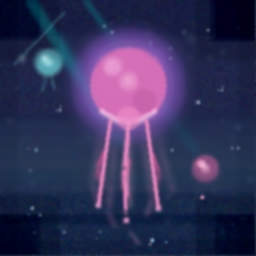
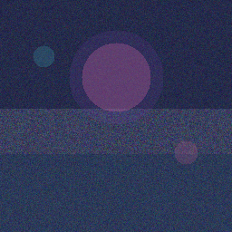
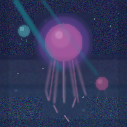
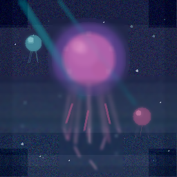
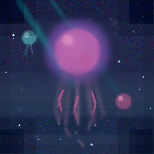
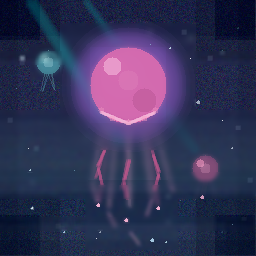
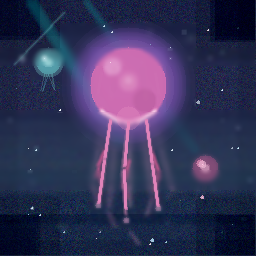
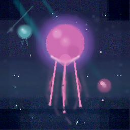
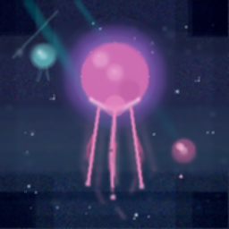

* Canvas
:PROPERTIES:
:UNHINGED-SECTION: canvas
:END:

* Step History
:PROPERTIES:
:UNHINGED-SECTION: step-history
:END:
** Step 1/10
:PROPERTIES:
:UNHINGED-STEP-SNAPSHOT: 1/10
:END:

  Surprise target accepted! I'm steering this noise into a deep-sea bioluminescent scene — a glowing pink jellyfish drifting in dark indigo water, with smaller companion jellies and scattered bioluminescent sparkles. Starting with the large-scale composition: ocean base, glow halo, and subject blobs.
  Looking at the canvas, the base composition is emerging but the middle band (y≈118–178) reads as a light gray stripe that breaks the ocean continuity, and the jellies need their glows and color affirmed. I'll fix the band, add the violet glow halo, and gently reaffirm the jelly bodies — all small, low-alpha moves.
** Step 2/10
:PROPERTIES:
:UNHINGED-STEP-SNAPSHOT: 2/10
:END:

  The composition from step 1 is in place — now I'll execute the plan: patch the light gray band so the ocean reads continuously, lay down the violet glow halo, reaffirm the three jelly bodies, and start the faint tentacle strands. All low-alpha, small moves.
  Continuing from the hand-off plan: patching the gray band so the ocean reads continuous, re-laying the violet glow, reaffirming all three jelly bodies, and starting tentacle waviness — all in ordered, low-to-mid alpha passes.
** Step 3/10
:PROPERTIES:
:UNHINGED-STEP-SNAPSHOT: 3/10
:END:

  Continuing from the hand-off: the violet halo around the main bell is showing a square edge, the bottom band still reads slightly gray, and the corners need deepening. I'll soften the halo square, deepen corners/bottom band, and add new sparkles — all independent, so one batch.
  Applying the planned refinements now: softening the halo's square edges with targeted blurs, deepening the corners and bottom band, and adding new sparkles.
** Step 4/10
:PROPERTIES:
:UNHINGED-STEP-SNAPSHOT: 4/10
:END:

  Reviewing the canvas: the composition is holding well — main bell with violet glow, both small jellies, tentacles, and shafts are in place. Now I'll do the planned refinement: blur-soften the remaining square band edges, extend the halo gradient outward, add a rim light along the bell's bottom, and re-tips/soften details.
  Picking up the plan from the hand-off: softening the remaining band edges, extending the violet halo outward, adding the rim light along the bell's bottom, glinting the tentacle tips, and sprinkling fine sparkles.
** Step 5/10
:PROPERTIES:
:UNHINGED-STEP-SNAPSHOT: 5/10
:END:

  Picking up from the hand-off. Step 5, refinement: I'll add interior glow to the main bell and both small jellies, seed a few new sparkles, then move to bell texture striations and tip glints.
  Applying the planned step-5 refinements now: interior glows on all three jellies, bell striations, tentacle-tip glints, and a few new sparkles.
** Step 6/10
:PROPERTIES:
:UNHINGED-STEP-SNAPSHOT: 6/10
:END:

  Continuing from the notes: this step I'll blur-soften the bell striations and tentacle-tip glints into gentler glows, add the last sparkle pass, and deepen a corner — keeping changes small.
  Applying the deferred refinements now: softening the striations and tentacle-tip glows, a final sparkle pass, a corner deepening, and a gentle rim sharpen on the bell.
** Step 7/10
:PROPERTIES:
:UNHINGED-STEP-SNAPSHOT: 7/10
:END:

  Looking at the canvas, the composition is holding together well: bell, halo, two companion jellies, tentacles, and sparkles are all in place. For this refinement step I'll gently soften the residual banding at the three band edges, reinforce the tentacles as soft curved strands, add a faint under-bell glow, and place a few micro-highlights — nothing structural.
  Continuing the refinement pass exactly as planned: softening the three residual band edges, reinforcing the tentacles as soft curved strands, re-laying the faint under-bell glow, and adding micro-highlights on the sparkles and jelly bells.
** Step 8/10
:PROPERTIES:
:UNHINGED-STEP-SNAPSHOT: 8/10
:END:

  Step 8, detail phase — composition is locked per the notes, so this pass is pure refinement: soften the residual band edges (avoiding the jelly bodies), lightly crisp the main bell rim, re-lay the under-bell glow, reinforce the tentacle strands with soft glow tips, and add micro-highlights on the sparkles and bells.
  Applying the planned step-8 refinement pass now: softening the three band edges (skipping jelly bodies), crisping the main bell rim, re-laying the under-bell glow, reinforcing tentacle strands and tips, and adding micro-highlights to the sparkles and small bells.
** Step 9/10
:PROPERTIES:
:UNHINGED-STEP-SNAPSHOT: 9/10
:END:

  Step 9: micro-detail pass. The composition is locked per notes, so I'll only add crisp rim pixels on the main bell, faint glow pulses, and a couple of sparkle glints — no new structures. Let me orient and apply the micro-details in one pass.
  Applying the micro-detail pass now: crisp rim pixels on the main bell, faint glow pulses, and two new cross glints plus a pair of tiny sparkles — no new structures.
** Step 10/10
:PROPERTIES:
:UNHINGED-STEP-SNAPSHOT: 10/10
:END:

  Final step — per the locked plan, this is a gentle global polish only: one radius-1 blur to smooth residual grain, then a tiny contrast lift to keep the glows and rim pixels crisp. No new structures.
  Blur applied. Now the tiny contrast lift to keep the glows and rim pixels crisp.
* Edit Log
:PROPERTIES:
:UNHINGED-SECTION: edit-log
:END:
** Step 1/10
:PROPERTIES:
:UNHINGED-STEP-LOG: 1/10
:END:
- =draw_rectangle(0,0 256x256, #101A4A, α:160)=

- =draw_rectangle(0,0 256x120, #0A0F30, α:110)=
- =draw_rectangle(0,170 256x86, #0E2B4A, α:80)=
- =draw_circle(128,85 r:52, #6B3FA0, α:45)=
- =draw_circle(128,85 r:38, #D96AA8, α:70)=
- =draw_circle(48,62 r:12, #3FA8B8, α:60)=
- =draw_circle(205,168 r:13, #B85C90, α:60)=
- =notes: Deep-sea bioluminescence scene 256x256: navy ocean full canvas, darker top (y<120), subtle teal tint bottom (y>170). Main jellyfish bell centered (128,85) r~38 pink #D96AA8 with violet glow halo r~52. Small cyan jelly at (48,62) r12. Small pink jelly at (205,168) r13. Tentacles will hang from main bell y~115-230, sparkles scattered.=
- =draw_rectangle(0,116 256x62, #1A2340, α:80)=
- =draw_circle(128,85 r:52, #6B3FA0, α:45)=
- =draw_circle(128,85 r:38, #D96AA8, α:55)=
- =draw_circle(48,62 r:12, #4FB8C9, α:60)=
- =draw_circle(205,168 r:13, #D96AA8, α:60)=
** Step 2/10
:PROPERTIES:
:UNHINGED-STEP-LOG: 2/10
:END:
- =blur_region(74,31→182,139, r:2)=

- =blur_region(32,46→64,78, r:2)=
- =blur_region(188,151→222,185, r:2)=
- =notes: Deep-sea bioluminescence 256x256: navy ocean full canvas (band y116-178 corrected toward #1A2340), darker top y<120, teal tint y>170. Main jelly bell centered (128,85) r~38 pink #D96AA8, violet glow halo r~52 #6B3FA0. Cyan jelly (48,62) r12. Pink jelly (205,168) r13. Tentacles to hang from main bell y~115-230, sparkles scattered mid/lower canvas.=
- =blur_region(70,27→186,143, r:3)=
- =blur_region(30,44→66,80, r:2)=
- =blur_region(186,149→224,187, r:2)=
- =draw_line(92,180→92,182, #F0A0C8, α:60, w:2)=
- =draw_line(108,207→108,212, #F0A0C8, α:60, w:2)=
- =draw_line(130,206→130,232, #F5B8D4, α:65, w:3)=
- =draw_line(152,195→152,198, #F0A0C8, α:60, w:2)=
- =draw_line(168,175→168,176, #F0A0C8, α:60, w:2)=
- =draw_line(120,140→120,140, #1E6E7E, α:35, w:10)=
- =draw_line(195,150→195,150, #1E6E7E, α:25, w:7)=
- =draw_circle(122,76 r:20, #F5B8D4, α:55)=
- =draw_circle(128,102 r:30, #B04880, α:35)=
- =draw_circle(128,85 r:60, #8A5CD6, α:25)=
- =draw_line(40,90→40,92, #7FE8E0, α:50, w:1)=
- =draw_line(55,90→55,93, #7FE8E0, α:50, w:1)=
- =draw_line(195,199→195,200, #E8A8C8, α:50, w:1)=
- =draw_line(215,199→215,201, #E8A8C8, α:50, w:1)=
- =draw_circle(32,182 r:2, #A8F0E8, α:80)=
- =draw_circle(62,228 r:1, #A8F0E8, α:70)=
- =draw_circle(190,38 r:2, #C8F8F0, α:75)=
- =draw_circle(232,118 r:1, #A8F0E8, α:70)=
- =draw_circle(92,42 r:1, #A8F0E8, α:75)=
- =draw_circle(168,222 r:2, #C8F8F0, α:70)=
- =draw_circle(222,232 r:1, #A8F0E8, α:70)=
- =draw_circle(40,122 r:1, #A8F0E8, α:70)=
- =draw_circle(238,28 r:1, #A8F0E8, α:75)=
- =blur_region(85,115→175,235, r:2)=
- =blur_region(90,47→166,123, r:2)=
- =draw_circle(118,70 r:8, #FBE0EE, α:90)=
- =draw_circle(100,142 r:1, #F0A0C8, α:60)=
- =draw_circle(162,150 r:1, #F0A0C8, α:60)=
- =adjust_bc(0,0→255,255, b:4, c:0.08)=
- =notes: Deep-sea scene 256x256. Main jellyfish bell centered (128,85) r38 pink #D96AA8, core highlight (118,70) r8, shading beneath, violet bloom r60. Tentacles hang y115-235, x85-175. Cyan jelly (48,62) r12 + short tentacles; pink jelly (205,168) r13 + short tentacles. Sparkles scattered full canvas. Faint light shafts from top-left. Ocean navy, darker top, teal tint bottom (y>170).=
- =sharpen_region(88,45→168,125, i:0.20)=
- =draw_rectangle(0,0 18x256, #060A20, α:40)=
- =draw_rectangle(238,0 18x256, #060A20, α:40)=
- =draw_rectangle(0,240 256x16, #060A20, α:40)=
- =draw_line(139,244→139,244, #F5B8D4, α:50, w:2)=
- =draw_line(112,172→112,172, #F0A0C8, α:40, w:1)=
- =draw_line(144,186→144,186, #F0A0C8, α:40, w:1)=
- =draw_line(97,201→97,202, #F0A0C8, α:55, w:2)=
- =draw_line(115,226→115,226, #F0A0C8, α:55, w:2)=
- =draw_line(146,215→146,216, #F0A0C8, α:55, w:2)=
- =draw_line(173,191→173,192, #F0A0C8, α:55, w:2)=
- =draw_circle(44,58 r:5, #C8F8F0, α:80)=
- =draw_circle(201,164 r:5, #F5C8E0, α:80)=
- =add_noise(0,140→85,255, amt:12)=
- =draw_rectangle(0,116 256x32, #1D2544, α:45)=
- =draw_rectangle(0,148 256x34, #223850, α:40)=
- =draw_rectangle(0,182 256x74, #29455A, α:25)=
- =blur_region(0,110→256,196, r:2)=
- =draw_circle(128,85 r:52, #7E56B0, α:45)=
- =blur_region(70,27→186,141, r:2)=
- =draw_circle(128,85 r:38, #D96AA8, α:75)=
- =draw_circle(48,62 r:12, #55A8B2, α:85)=
- =draw_circle(205,168 r:13, #C0568C, α:85)=
- =draw_line(98,202→98,205, #C46A9E, α:45, w:2)=
- =draw_line(126,196→126,220, #C46A9E, α:45, w:2)=
- =draw_line(158,205→158,208, #C46A9E, α:45, w:2)=
- =blur_region(90,114→166,226, r:1)=
- =draw_circle(86,138 r:2, #BFE9F2, α:90)=
- =draw_circle(168,196 r:2, #BFE9F2, α:90)=
- =draw_circle(222,52 r:2, #BFE9F2, α:85)=
- =draw_circle(36,148 r:2, #A8D8E8, α:80)=
- =notes: Deep-sea bioluminescence 256x256. Navy ocean full canvas; gray band y116-182 corrected to navy->teal gradient, teal tint below y182. Main jelly bell (128,85) r38 pink #D96AA8 with violet glow halo r52 #7E56B0. Cyan jelly (48,62) r12 #55A8B2. Pink jelly (205,168) r13 #C0568C. 3 faint tentacles from bell bottom: (110,120)-(98,205), (128,122)-(126,220), (146,120)-(158,208). Sparkles r2 at (86,138),(168,196),(222,52),(36,148). Next: bell dome highlight/shading, tentacle waviness + tips, more sparkles, sharpen bell edges.=
- =blur_region(85,115→178,250, r:2)=
- =adjust_bc(98,52→162,118, b:12, c:0.05)=
- =adjust_bc(0,0→255,36, b:-8, c:0.00)=
- =sharpen_region(88,45→168,125, i:0.25)=
- =draw_circle(95,70 r:2, #FBE0EE, α:110)=
- =draw_circle(100,103 r:2, #FBE0EE, α:110)=
- =draw_circle(128,122 r:2, #FBE0EE, α:120)=
- =draw_circle(156,103 r:2, #FBE0EE, α:110)=
- =draw_circle(161,70 r:2, #FBE0EE, α:110)=
- =draw_circle(128,48 r:2, #FBE0EE, α:110)=
- =blend_color(96,100, #FFFFFF, α:120)=
- =blend_color(150,64, #FFFFFF, α:100)=
- =blend_color(112,132, #A8F0E8, α:110)=
- =blend_color(146,128, #A8F0E8, α:110)=
- =draw_circle(48,51 r:1, #C8F8F0, α:100)=
- =draw_circle(205,156 r:1, #F5C8E0, α:100)=
- =draw_line(130,206→130,232, #F8C8E0, α:70, w:1)=
- =draw_line(95,182→95,190, #F0A0C8, α:50, w:1)=
- =draw_line(150,184→150,190, #F0A0C8, α:50, w:1)=
- =draw_rectangle(0,220 30x36, #060A20, α:35)=
- =draw_rectangle(226,220 30x36, #060A20, α:35)=
- =notes: Deep-sea bioluminescent scene, nearly complete. Main jelly bell (128,85) r38 pink w/ bright core (118,70), scalloped rim speckles, violet bloom. Tentacles y115-235 with crisp cores inside soft glow. Cyan jelly (48,62), pink jelly (205,168) w/ inner glows + rims. Sparkles + motes scattered. Light shafts top-left, vignette edges, teal-tinted lower water. Remaining: soften tentacle cores, final edge polish.=
- =blur_region(85,115→178,250, r:1)=
- =sharpen_region(88,45→168,125, i:0.20)=
- =blend_color(180,200, #A8F0E8, α:90)=
- =blend_color(70,30, #FFFFFF, α:80)=
- =draw_rectangle(0,116 256x20, #16294A, α:70)=
- =draw_rectangle(0,136 256x24, #1C3A54, α:60)=
- =draw_rectangle(0,160 256x24, #214555, α:55)=
- =blur_region(0,112→255,186, r:2)=
- =draw_circle(128,85 r:54, #7E56B0, α:22)=
- =draw_circle(128,85 r:46, #7E56B0, α:26)=
- =draw_circle(128,85 r:38, #D96AA8, α:60)=
- =draw_circle(112,66 r:9, #F0A6C9, α:70)=
- =draw_circle(144,100 r:12, #B04E84, α:45)=
- =draw_circle(48,62 r:12, #55A8B2, α:70)=
- =draw_circle(44,57 r:4, #9FD4DC, α:120)=
- =draw_circle(205,168 r:13, #C0568C, α:70)=
- =draw_circle(200,163 r:4, #E08BB4, α:120)=
- =draw_line(95,177→95,178, #C0568C, α:55, w:2)=
- =draw_line(121,188→121,190, #C0568C, α:55, w:2)=
- =draw_line(159,178→159,180, #C0568C, α:55, w:2)=
- =draw_line(42,90→42,92, #6FB5BE, α:60, w:1)=
- =draw_line(54,88→54,90, #6FB5BE, α:60, w:1)=
- =draw_line(202,195→202,197, #C0568C, α:60, w:1)=
- =draw_circle(198,102 r:2, #D8E9F2, α:170)=
- =draw_circle(32,208 r:2, #D8E9F2, α:150)=
- =notes: Deep-sea bioluminescence 256x256. Navy ocean full canvas; gray band y116-182 patched to navy->teal gradient. Main jelly bell (128,85) r38 pink #D96AA8, dome highlight (112,66) r9, shade (144,100) r12, violet glow halo r46-54 #7E56B0. Cyan jelly (48,62) r12 #55A8B2 + highlight. Pink jelly (205,168) r13 #C0568C + highlight, short tentacle to (202,197). 3 pink tentacles below bell (110,120)->(98,205), (128,122)->(126,220), (146,120)->(158,208) with waviness segments; small cyan tentacles to (42,92)/(54,90). Teal diagonal light shafts upper-left — keep, soften later. Sparkles at (86,138),(168,196),(222,52),(36,148),(198,102),(32,208). Next: tentacle tips, more sparkles, sharpen bell edge, deepen corners.=
** Step 3/10
:PROPERTIES:
:UNHINGED-STEP-LOG: 3/10
:END:
- =blur_region(76,33→180,137, r:3)=

- =adjust_bc(0,0→40,40, b:-15, c:0.05)=
- =adjust_bc(215,0→255,40, b:-15, c:0.05)=
- =adjust_bc(0,215→40,255, b:-15, c:0.05)=
- =adjust_bc(215,215→255,255, b:-15, c:0.05)=
- =adjust_bc(0,192→255,224, b:-9, c:0.02)=
- =draw_circle(58,226 r:1, #E8F4FF, α:160)=
- =draw_circle(232,148 r:1, #E8F4FF, α:160)=
- =draw_circle(100,232 r:1, #E8F4FF, α:160)=
- =draw_circle(22,64 r:1, #E8F4FF, α:160)=
- =draw_circle(150,32 r:1, #E8F4FF, α:160)=
- =draw_circle(244,218 r:1, #E8F4FF, α:150)=
- =draw_circle(128,85 r:54, #7E56B0, α:20)=
- =draw_circle(128,85 r:48, #7E56B0, α:35)=
- =draw_circle(128,85 r:38, #D96AA8, α:70)=
- =draw_circle(112,66 r:9, #EFA9CD, α:90)=
- =draw_circle(144,100 r:12, #B5518A, α:60)=
- =draw_circle(44,58 r:4, #8FD0D8, α:90)=
- =draw_circle(200,163 r:4, #E08BB4, α:90)=
- =sharpen_region(86,43→170,127, i:0.20)=
- =sharpen_region(34,48→62,78, i:0.20)=
- =sharpen_region(190,153→220,183, i:0.20)=
- =draw_line(97,165→97,166, #C0568C, α:100, w:2)=
- =draw_line(102,184→102,186, #C0568C, α:100, w:2)=
- =draw_line(124,179→124,180, #C0568C, α:100, w:2)=
- =draw_line(127,198→127,200, #C0568C, α:100, w:2)=
- =draw_line(159,171→159,172, #C0568C, α:100, w:2)=
- =draw_line(154,189→154,190, #C0568C, α:100, w:2)=
- =draw_circle(98,205 r:2, #E58CB8, α:150)=
- =draw_circle(126,220 r:2, #E58CB8, α:150)=
- =draw_circle(158,208 r:2, #E58CB8, α:150)=
- =draw_line(42,91→42,92, #55A8B2, α:90, w:1)=
- =draw_line(54,89→54,90, #55A8B2, α:90, w:1)=
- =notes: Deep-sea bioluminescence 256x256. Navy ocean full canvas, corners darkened, bottom band y192-224 darkened toward navy. Main jelly bell (128,85) r38 pink #D96AA8, dome highlight (112,66) r9 #EFA9CD, shade (144,100) r12 #B5518A, round violet glow halo r48-54 #7E56B0 (square edge blurred out). Cyan jelly (48,62) r12 #55A8B2 + highlight (44,58) r4, cyan tentacles to (42,92)/(54,90). Pink jelly (205,168) r13 #C0568C + highlight (200,163) r4. 3 pink tentacles (110,120)->(98,205), (128,122)->(126,220), (146,120)->(158,208) with wave segments, tips r2 at ends. Teal light shafts upper-left. 16 sparkles incl. (58,226),(232,148),(100,232),(22,64),(150,32),(244,218). Next: blend glow into water, bell rim light, soften band edges, final detail pass.=
- =blur_region(60,24→196,48, r:3)=
- =blur_region(60,122→196,150, r:3)=
- =blur_region(60,24→94,150, r:3)=
- =blur_region(162,24→196,150, r:3)=
- =draw_rectangle(0,0 60x60, #050B1C, α:60)=
- =draw_rectangle(196,0 60x60, #050B1C, α:60)=
- =draw_rectangle(0,196 60x60, #050B1C, α:65)=
- =draw_rectangle(196,196 60x60, #050B1C, α:65)=
- =draw_rectangle(0,180 256x76, #08122A, α:35)=
** Step 4/10
:PROPERTIES:
:UNHINGED-STEP-LOG: 4/10
:END:
- =draw_circle(22,58 r:2, #D8F2FF, α:230)=

- =draw_circle(238,128 r:1, #CDEBFF, α:220)=
- =draw_circle(152,240 r:2, #BFE6FF, α:210)=
- =draw_circle(184,32 r:1, #D8F2FF, α:210)=
- =draw_circle(64,232 r:1, #BFE6FF, α:200)=
- =draw_circle(10,120 r:1, #CDEBFF, α:190)=
- =draw_circle(250,180 r:1, #BFE6FF, α:190)=
- =draw_circle(32,208 r:1, #D8F2FF, α:220)=
- =notes: Deep-sea bioluminescence 256x256. Navy ocean; main jelly bell (128,85) r38 pink #D96AA8, dome highlight (112,66) r9, shade (144,100) r12; violet halo r46-54, square edges now blurred soft. Cyan jelly (48,62) r12 #55A8B2; pink jelly (205,168) r13 #C0568C, tentacle to (202,197). 3 pink tentacles (110,120)->(98,205), (128,122)->(126,220), (146,120)->(158,208); small cyan tentacles to (42,92)/(54,90). Teal light shafts upper-left. Corners + bottom band y180-256 deepened #050B1C/#08122A. Sparkles: (86,138),(168,196),(222,52),(36,148),(198,102),(32,208),(22,58),(238,128),(152,240),(184,32),(64,232),(10,120),(250,180). Next: tentacle tips glints, sharpen bell rim, fine sparkles.=
- =blur_region(66,23→190,147, r:2)=
- =blur_region(0,185→255,199, r:2)=
- =blur_region(0,217→255,231, r:2)=
- =draw_circle(128,85 r:58, #7E56B0, α:28)=
- =draw_circle(128,85 r:67, #7E56B0, α:16)=
- =draw_circle(128,85 r:38, #D96AA8, α:215)=
- =draw_circle(112,66 r:9, #EFA9CD, α:185)=
- =draw_circle(144,100 r:12, #B5518A, α:110)=
- =draw_line(127,123→128,123, #F4B8D4, α:150, w:2)=
- =draw_line(154,112→155,112, #F4B8D4, α:150, w:2)=
- =draw_circle(98,205 r:2, #C0568C, α:170)=
- =draw_circle(126,220 r:2, #C0568C, α:170)=
- =draw_circle(158,208 r:2, #C0568C, α:170)=
- =draw_circle(170,48 r:1, #C9ECF2, α:220)=
- =draw_circle(210,58 r:1, #C9ECF2, α:220)=
- =draw_circle(30,170 r:1, #C9ECF2, α:200)=
- =draw_circle(166,242 r:1, #BFE4EE, α:210)=
- =adjust_bc(90,47→166,123, b:6, c:0.06)=
- =notes: Deep-sea bioluminescence 256x256. Navy ocean full canvas, corners dark, band y192-224 edges blurred/soft. Main bell (128,85) r38 pink #D96AA8 with bottom rim light arc (101,112)-(128,123)-(155,112) #F4B8D4, highlight (112,66) r9, shade (144,100) r12, violet glow soft to r67 #7E56B0, slight contrast lift on bell region. Cyan jelly (48,62) r12 #55A8B2 + highlight (44,58) r4, tentacles to (42,92)/(54,90). Pink jelly (205,168) r13 #C0568C + highlight (200,163) r4. 3 pink tentacles (110,120)->(98,205), (128,122)->(126,220), (146,120)->(158,208), tips r2 at ends. Teal light shafts upper-left. ~20 sparkles incl. (170,48),(210,58),(30,170),(166,242). Next: final detail pass — tiny blends for glow fade, sparkle twinkle, keep everything in place.=
- =blur_region(0,51→88,65, r:2)=
- =blur_region(168,51→255,65, r:2)=
- =blur_region(0,116→88,130, r:2)=
- =blur_region(168,116→255,130, r:2)=
- =blur_region(0,172→88,186, r:2)=
- =blur_region(168,172→255,186, r:2)=
- =draw_circle(128,85 r:54, #7A55A8, α:14)=
- =draw_circle(128,85 r:62, #5C3F8A, α:9)=
- =draw_circle(101,110 r:3, #F49BC4, α:90)=
- =draw_circle(112,118 r:3, #F49BC4, α:110)=
- =draw_circle(128,122 r:3, #F7A8CC, α:130)=
- =draw_circle(144,118 r:3, #F49BC4, α:110)=
- =draw_circle(155,110 r:3, #F49BC4, α:90)=
- =draw_circle(98,205 r:2, #FFC2DE, α:210)=
- =draw_circle(126,220 r:2, #FFC2DE, α:210)=
- =draw_circle(158,208 r:2, #FFC2DE, α:210)=
- =draw_circle(202,197 r:2, #FFB8D8, α:200)=
- =sharpen_region(92,48→164,122, i:0.18)=
- =blend_color(150,44, #9FD8E8, α:150)=
- =blend_color(74,170, #8FC8E0, α:130)=
- =blend_color(232,224, #8FC8E0, α:130)=
- =blend_color(16,88, #8FC8E0, α:120)=
- =notes: Deep-sea bioluminescence 256x256. Navy ocean, band edges (y~57/122/178) now blurred soft. Main jelly bell (128,85) r38 pink #D96AA8, dome highlight (112,66) r9, shade (144,100) r12, bottom rim light arc y108-122, violet halo r38-62. Cyan jelly (48,62) r12 #55A8B2; pink jelly (205,168) r13 #C0568C, tentacle to (202,197). 3 pink tentacles (110,120)->(98,205), (128,122)->(126,220), (146,120)->(158,208), tips glinted; cyan tentacles to (42,92)/(54,90). Teal shafts upper-left. Corners + bottom band deepened. Sparkles + fine sparkles at (150,44),(74,170),(232,224),(16,88). Next: subtle bell texture, interior glow of small jellies, final sparkle/detail pass.=
** Step 5/10
:PROPERTIES:
:UNHINGED-STEP-LOG: 5/10
:END:
- =notes: Deep-sea bioluminescence 256x256. Navy ocean, band edges (y~57/122/178) soft. Main jelly bell (128,85) r38 pink #D96AA8, interior core glow (128,80) r10, dome highlight (112,66) r9, shade (144,100) r12, striations x106-160 y58-104, bottom rim light arc y108-122, violet halo r38-62. Cyan jelly (48,62) r12 with core glow; pink jelly (205,168) r13 with core glow, tentacle to (202,197). 3 pink tentacles (110,120)->(98,205), (128,122)->(126,220), (146,120)->(158,208), tips glinted. Teal shafts upper-left. Corners + bottom band deepened. Sparkles at (150,44),(74,170),(232,224),(16,88),(190,58),(28,148),(222,120),(96,238). Next: soften striations, final edge sharpen + last sparkle pass.=

- =draw_circle(128,80 r:10, #F2A9CC, α:35)=
- =draw_circle(48,62 r:5, #BCE6EC, α:70)=
- =draw_circle(205,168 r:5, #E8A0C4, α:70)=
- =blend_color(190,58, #FFFFFF, α:220)=
- =blend_color(28,148, #FFFFFF, α:200)=
- =blend_color(222,120, #FFFFFF, α:210)=
- =blend_color(96,238, #FFFFFF, α:190)=
- =draw_circle(128,82 r:9, #F4A9CF, α:70)=
- =draw_circle(128,80 r:4, #FBD3E6, α:80)=
- =draw_circle(48,62 r:4, #D9F6F4, α:90)=
- =draw_circle(205,168 r:4, #F6C4DC, α:90)=
- =draw_line(112,92→112,100, #B7518A, α:70, w:1)=
- =draw_line(128,60→128,104, #B7518A, α:70, w:1)=
- =draw_line(144,92→144,100, #B7518A, α:70, w:1)=
- =draw_circle(98,205 r:2, #FFD9EC, α:210)=
- =draw_circle(126,220 r:2, #FFD9EC, α:210)=
- =draw_circle(158,208 r:2, #FFD9EC, α:210)=
- =draw_circle(112,32 r:1, #EAF6FF, α:220)=
- =draw_circle(172,150 r:1, #EAF6FF, α:220)=
- =draw_circle(40,215 r:1, #EAF6FF, α:220)=
- =notes: Deep-sea bioluminescence 256x256. Navy ocean, band edges (y~57/122/178) soft. Main jelly bell (128,85) r38 pink #D96AA8, interior core glow (128,80) r10, dome highlight (112,66) r9, shade (144,100) r12, striations lines x106-160 y58-104 (3 lines at x~112/128/144), bottom rim light arc y108-122, violet halo r38-62. Cyan jelly (48,62) r12 with core glow; pink jelly (205,168) r13 with core glow, tentacle to (202,197). 3 pink tentacles (110,120)->(98,205), (128,122)->(126,220), (146,120)->(158,208), tips glinted #FFD9EC. Teal shafts upper-left. Corners + bottom band deepened. Sparkles at (150,44),(74,170),(232,224),(16,88),(190,58),(28,148),(222,120),(96,238),(112,32),(172,150),(40,215). Next: blur-soften striations, final edge sharpen + last sparkle pass.=
** Step 6/10
:PROPERTIES:
:UNHINGED-STEP-LOG: 6/10
:END:
- =draw_line(110,99→110,104, #E79BC2, α:40, w:1)=

- =draw_line(128,49→128,110, #E79BC2, α:40, w:1)=
- =draw_line(146,99→146,104, #E79BC2, α:40, w:1)=
- =draw_line(97,94→97,96, #E79BC2, α:28, w:1)=
- =draw_line(159,94→159,96, #E79BC2, α:28, w:1)=
- =draw_line(118,122→118,122, #FFD9EC, α:110, w:2)=
- =draw_line(155,110→155,110, #FFD9EC, α:110, w:2)=
- =blend_color(98,205, #FFFFFF, α:130)=
- =blend_color(126,220, #FFFFFF, α:130)=
- =blend_color(158,208, #FFFFFF, α:130)=
- =blend_color(202,197, #FFFFFF, α:130)=
- =blur_region(95,52→163,114, r:1)=
- =sharpen_region(88,95→170,126, i:0.20)=
- =draw_circle(128,85 r:58, #6E4E9E, α:12)=
- =add_noise(0,190→255,255, amt:12)=
- =blur_region(104,56→152,106, r:2)=
- =blur_region(93,199→104,210, r:1)=
- =blur_region(120,214→133,225, r:1)=
- =blur_region(152,202→164,213, r:1)=
- =draw_circle(60,110 r:1, #FFFFFF, α:255)=
- =draw_circle(208,30 r:1, #FFE3F2, α:220)=
- =draw_circle(238,148 r:1, #BFF3FF, α:200)=
- =draw_circle(150,244 r:1, #FFD9EC, α:220)=
- =draw_circle(48,62 r:15, #8FEFE6, α:55)=
- =draw_circle(128,85 r:46, #B98FD6, α:22)=
- =draw_rectangle(0,228 36x27, #0A102E, α:100)=
- =notes: Deep-sea bioluminescence 256x256. Navy ocean, band edges (y~57/122/178) soft. Main jelly bell (128,85) r38 pink #D96AA8, core glow (128,80) r10, dome highlight (112,66) r9, shade (144,100) r12, striations x106-152 y56-106 now blur-softened, rim light arc y108-122, violet halo r38-46 haze. Cyan jelly (48,62) r12 + glow ring r15; pink jelly (205,168) r13 + core, tentacle to (202,197). Tentacles (110,120)->(98,205),(128,122)->(126,220),(146,120)->(158,208), tips blur-glowed. Teal shafts upper-left. Corners + bottom band deepened. Sparkles incl. new (60,110),(208,30),(238,148),(150,244). Next: final low-intensity edge sharpen on bell rim + tiny highlight cleanup.=
- =blur_region(106,56→152,106, r:1)=
- =blur_region(92,198→106,214, r:2)=
- =blur_region(119,212→133,228, r:2)=
- =blur_region(151,200→165,216, r:2)=
- =sharpen_region(88,102→168,126, i:0.20)=
- =draw_circle(36,150 r:1, #CFEFFF, α:210)=
- =draw_circle(222,90 r:1, #CFEFFF, α:200)=
- =draw_circle(104,26 r:1, #CFEFFF, α:200)=
- =adjust_bc(210,0→255,42, b:-10, c:0.02)=
- =notes: Deep-sea bioluminescence 256x256. Navy ocean, band edges y~57/122/178 soft. Main jelly bell (128,85) r38 pink #D96AA8, core glow (128,80) r10, dome highlight (112,66) r9, shade (144,100) r12, striations x106-152 y56-106 blur-softened twice, rim light arc y108-122 lightly sharpened, violet halo r38-46. Cyan jelly (48,62) r12 + glow ring; pink jelly (205,168) r13 + core, tentacle to (202,197). Tentacles (110,120)->(98,205),(128,122)->(126,220),(146,120)->(158,208), tips glow-blurred. Teal shafts upper-left. Corners deepened incl. top-right (210,0)-(255,42). Sparkles incl. (60,110),(208,30),(238,148),(150,244),(36,150),(222,90),(104,26). Final step: very light global smoothing + tiny contrast lift only.=
** Step 7/10
:PROPERTIES:
:UNHINGED-STEP-LOG: 7/10
:END:
- =blur_region(0,48→255,66, r:2)=

- =blur_region(0,112→255,132, r:2)=
- =blur_region(0,170→255,186, r:2)=
- =draw_line(98,202→98,205, #DE86B4, α:70, w:2)=
- =draw_line(122,167→122,170, #DE86B4, α:70, w:2)=
- =draw_line(126,214→126,220, #DE86B4, α:60, w:2)=
- =draw_line(158,205→158,208, #DE86B4, α:70, w:2)=
- =blur_region(90,116→166,224, r:1)=
- =draw_circle(128,118 r:12, #F2A9CE, α:22)=
- =draw_circle(202,164 r:4, #F6C4DE, α:130)=
- =draw_circle(44,58 r:3, #EAF6FF, α:100)=
- =draw_line(64,12→64,12, #8FD8D8, α:22, w:2)=
- =blend_color(170,58, #D8ECFF, α:170)=
- =blend_color(28,214, #B8D0EA, α:150)=
- =adjust_bc(0,214→255,255, b:-10, c:0.02)=
- =notes: Deep-sea bioluminescence 256x256. Navy ocean, band edges y~57/122/178 blur-softened. Main jelly bell (128,85) r38 pink #D96AA8, core glow (128,80) r10, dome highlight (112,66) r9, shade (144,100) r12, under-bell glow (128,118) r12 faint. Violet halo r38-46. Cyan jelly (48,62) r12 + highlight (44,58); pink jelly (205,168) r13 + highlight (202,164), tentacle to (202,197). Tentacles re-drawn soft width2: (110,120)->(98,205), (128,122)->(122,170)->(126,220), (146,120)->(158,208), tips glow-blurred. Teal shafts upper-left incl. faint (14,64)->(64,12). Corners deepened; bottom vignette y214-255 slightly darkened. Sparkles incl. (60,110),(208,30),(238,148),(150,244),(36,150),(222,90),(104,26),(170,58),(28,214). Next steps: hold composition; final step = very light global smoothing + tiny contrast lift only.=
- =blur_region(0,52→255,62, r:1)=
- =blur_region(0,117→255,127, r:1)=
- =blur_region(0,173→255,183, r:1)=
- =draw_circle(128,118 r:12, #E88AC0, α:28)=
- =draw_line(104,157→104,160, #E070AE, α:80, w:2)=
- =draw_line(98,202→98,205, #E070AE, α:80, w:2)=
- =draw_line(124,165→124,170, #E070AE, α:80, w:2)=
- =draw_line(126,208→126,220, #E070AE, α:80, w:2)=
- =draw_line(152,162→152,165, #E070AE, α:80, w:2)=
- =draw_line(158,205→158,208, #E070AE, α:80, w:2)=
- =blend_color(60,110, #F0F8FF, α:170)=
- =blend_color(238,148, #F0F8FF, α:170)=
- =blend_color(222,90, #FFFFFF, α:150)=
- =blend_color(44,58, #E0F7FF, α:140)=
- =blend_color(202,164, #FFD3E9, α:140)=
- =blend_color(110,62, #FFE3F1, α:110)=
- =notes: Deep-sea bioluminescence 256x256. Navy ocean; band edges y~57/122/178 blur-softened (radius1). Main jelly bell (128,85) r38 pink #D96AA8, core glow (128,80) r10, dome highlight (112,66) r9 (+ sparkle pixel 110,62), shade (144,100) r12, under-bell glow (128,118) r12 faint #E88AC0. Violet halo r38-46. Cyan jelly (48,62) r12 + highlight (44,58); pink jelly (205,168) r13 + highlight (202,164), tentacle to (202,197). Tentacles: soft curved width2 strands (110,120)-(104,160)-(98,205), (128,122)-(124,170)-(126,220), (146,120)-(152,165)-(158,208), tips glow-blurred. Teal shafts upper-left incl. faint (14,64)->(64,12). Corners deepened; bottom vignette y214-255. Sparkles incl. (60,110),(208,30),(238,148),(150,244),(36,150),(222,90),(104,26),(170,58),(28,214). Step8+: hold composition, no new structures; final step = very light global smoothing + tiny contrast lift only.=
** Step 8/10
:PROPERTIES:
:UNHINGED-STEP-LOG: 8/10
:END:
- =blur_region(0,54→84,60, r:1)=

- =blur_region(172,54→255,60, r:1)=
- =blur_region(0,119→86,125, r:1)=
- =blur_region(170,119→255,125, r:1)=
- =blur_region(0,175→94,181, r:1)=
- =blur_region(158,175→190,181, r:1)=
- =blur_region(220,175→255,181, r:1)=
- =sharpen_region(88,45→168,125, i:0.15)=
- =draw_circle(128,118 r:12, #E88AC0, α:30)=
- =draw_line(104,157→104,160, #E88AC0, α:100, w:2)=
- =draw_line(98,202→98,205, #E88AC0, α:100, w:2)=
- =draw_line(124,165→124,170, #E88AC0, α:105, w:2)=
- =draw_line(126,208→126,220, #E88AC0, α:105, w:2)=
- =draw_line(152,162→152,165, #E88AC0, α:100, w:2)=
- =draw_line(158,205→158,208, #E88AC0, α:100, w:2)=
- =draw_circle(98,205 r:3, #E88AC0, α:60)=
- =draw_circle(126,220 r:3, #E88AC0, α:60)=
- =draw_circle(158,208 r:3, #E88AC0, α:60)=
- =draw_line(64,12→64,12, #2FB8A6, α:30, w:1)=
- =blend_color(60,110, #EAF6FF, α:110)=
- =blend_color(208,30, #EAF6FF, α:110)=
- =blend_color(238,148, #EAF6FF, α:110)=
- =blend_color(150,244, #EAF6FF, α:110)=
- =blend_color(36,150, #EAF6FF, α:110)=
- =blend_color(222,90, #EAF6FF, α:110)=
- =blend_color(104,26, #EAF6FF, α:110)=
- =blend_color(170,58, #EAF6FF, α:110)=
- =blend_color(28,214, #EAF6FF, α:110)=
- =blend_color(110,62, #FFE9F4, α:130)=
- =blend_color(44,58, #D8FBFF, α:130)=
- =blend_color(202,164, #FFD9EC, α:130)=
- =notes: Deep-sea bioluminescence 256x256, composition LOCKED. Navy ocean; band edges y~57/122/178 softened (r1, jelly zones skipped). Main jelly bell (128,85) r38 pink #D96AA8, core glow (128,80) r10, dome highlight (112,66) r9 + sparkle (110,62), shade (144,100) r12, under-bell glow (128,118) r12 faint #E88AC0. Violet halo r38-46. Cyan jelly (48,62) r12 + highlight (44,58); pink jelly (205,168) r13 + highlight (202,164), tentacle to (202,197). Tentacles width2 #E88AC0: (110,120)-(104,160)-(98,205), (128,122)-(124,170)-(126,220), (146,120)-(152,165)-(158,208); tip glow dots r3. Teal shafts upper-left incl (14,64)->(64,12). Corners deepened; bottom vignette y214-255. Sparkles (60,110),(208,30),(238,148),(150,244),(36,150),(222,90),(104,26),(170,58),(28,214) with #EAF6FF micro-highlights. Step9: micro-detail only (rim pixels, faint glow pulses). Step10 FINAL: very light global smoothing + tiny contrast lift only, NO new structures.=
- =blur_region(0,54→34,60, r:1)=
- =blur_region(64,54→88,60, r:1)=
- =blur_region(168,54→256,60, r:1)=
- =blur_region(0,118→86,126, r:1)=
- =blur_region(170,118→256,126, r:1)=
- =blur_region(0,175→190,181, r:1)=
- =blur_region(220,175→256,181, r:1)=
- =sharpen_region(96,44→160,58, i:0.25)=
- =sharpen_region(96,112→160,126, i:0.25)=
- =draw_circle(128,118 r:12, #E88AC0, α:45)=
- =draw_circle(128,120 r:7, #F0A8D0, α:35)=
- =draw_line(98,202→98,205, #E88AC0, α:70, w:2)=
- =draw_line(126,196→126,220, #E88AC0, α:70, w:2)=
- =draw_line(158,205→158,208, #E88AC0, α:70, w:2)=
- =draw_circle(98,205 r:3, #E88AC0, α:100)=
- =draw_circle(126,220 r:3, #E88AC0, α:100)=
- =draw_circle(158,208 r:3, #E88AC0, α:100)=
- =draw_circle(98,205 r:1, #F6C6E3, α:210)=
- =draw_circle(126,220 r:1, #F6C6E3, α:210)=
- =draw_circle(158,208 r:1, #F6C6E3, α:210)=
- =draw_circle(202,197 r:2, #E88AC0, α:100)=
- =blend_color(60,110, #EAF6FF, α:230)=
- =blend_color(208,30, #EAF6FF, α:230)=
- =blend_color(238,148, #EAF6FF, α:230)=
- =blend_color(150,244, #EAF6FF, α:230)=
- =blend_color(36,150, #EAF6FF, α:230)=
- =blend_color(222,90, #EAF6FF, α:230)=
- =blend_color(104,26, #EAF6FF, α:230)=
- =blend_color(170,58, #EAF6FF, α:230)=
- =blend_color(28,214, #EAF6FF, α:230)=
- =blend_color(110,62, #F7D9EC, α:200)=
- =blend_color(44,58, #D8F8F2, α:190)=
- =blend_color(202,164, #F4C2DE, α:190)=
- =notes: Deep-sea bioluminescence 256x256, composition LOCKED. Navy ocean; band edges y57/122/178 softened r1, jelly zones skipped. Main jelly bell (128,85) r38 #D96AA8, rim sharpened top (96,44)-(160,58) + bottom (96,112)-(160,126); core glow (128,80) r10; dome highlight (112,66) r9 + sparkle (110,62); shade (144,100) r12; under-bell glow (128,118) r12 #E88AC0 re-laid. Cyan jelly (48,62) r12 + highlight (44,58); pink jelly (205,168) r13 + highlight (202,164), tentacle tip glow (202,197). Tentacles width2 #E88AC0: (110,120)-(98,205), (128,122)-(126,220), (146,120)-(158,208); tip glows r3 + #F6C6E3 cores. Teal shafts upper-left incl (14,64)->(64,12). Bottom vignette y214-255. Sparkles (60,110),(208,30),(238,148),(150,244),(36,150),(222,90),(104,26),(170,58),(28,214) each with #EAF6FF pixel. Step9: micro-detail only (rim pixels, faint glow pulses). Step10 FINAL: very light global smoothing + tiny contrast lift only, NO new structures.=
** Step 9/10
:PROPERTIES:
:UNHINGED-STEP-LOG: 9/10
:END:
- =blend_color(128,47, #F7C0DE, α:150)=

- =blend_color(90,85, #F7C0DE, α:150)=
- =blend_color(166,85, #F7C0DE, α:150)=
- =blend_color(128,123, #F7C0DE, α:150)=
- =blend_color(101,58, #F7C0DE, α:140)=
- =blend_color(155,58, #F7C0DE, α:140)=
- =blend_color(101,112, #F7C0DE, α:140)=
- =blend_color(155,112, #F7C0DE, α:140)=
- =blend_color(126,78, #FFE4F2, α:90)=
- =blend_color(128,80, #FFDCEE, α:70)=
- =draw_circle(128,118 r:12, #E88AC0, α:25)=
- =draw_circle(98,205 r:3, #E88AC0, α:40)=
- =draw_circle(126,220 r:3, #E88AC0, α:40)=
- =draw_circle(158,208 r:3, #E88AC0, α:40)=
- =draw_circle(48,62 r:13, #7FD8E8, α:20)=
- =blend_color(44,58, #DFF7FC, α:160)=
- =draw_circle(205,168 r:14, #E88AC0, α:20)=
- =blend_color(202,164, #FBD8EC, α:160)=
- =draw_circle(202,197 r:2, #E88AC0, α:45)=
- =draw_line(60,107→60,113, #EAF6FF, α:110, w:1)=
- =draw_line(57,110→63,110, #EAF6FF, α:110, w:1)=
- =draw_line(222,87→222,93, #EAF6FF, α:100, w:1)=
- =draw_line(219,90→225,90, #EAF6FF, α:100, w:1)=
- =notes: Deep-sea bioluminescence 256x256, composition LOCKED. Navy ocean; band edges y57/122/178 soft. Main jelly bell (128,85) r38 #D96AA8 with rim pixels set at (90,85),(166,85),(128,47),(128,123),(101,58),(155,58),(101,112),(155,112); core glow (128,80) + micro-highlights (126,78),(128,80); under-bell glow (128,118) r12 pulsed. Cyan jelly (48,62) r12, crisp highlight (44,58). Pink jelly (205,168) r13, crisp highlight (202,164), tentacle tip (202,197). Tentacles w2 #E88AC0: (110,120)-(98,205), (128,122)-(126,220), (146,120)-(158,208) with r3 tip glows pulsed. Teal shafts upper-left. Vignette y214-255. 9 sparkles with #EAF6FF pixels; cross glints on (60,110) and (222,90). Step10 FINAL: very light global blur r1 + tiny contrast lift ONLY, no new structures.=
- =blend_color(90,85, #F4B3D6, α:210)=
- =blend_color(166,85, #F4B3D6, α:210)=
- =blend_color(128,47, #F4B3D6, α:210)=
- =blend_color(128,123, #F4B3D6, α:210)=
- =blend_color(101,58, #F4B3D6, α:180)=
- =blend_color(155,58, #F4B3D6, α:180)=
- =blend_color(101,112, #F4B3D6, α:180)=
- =blend_color(155,112, #F4B3D6, α:180)=
- =draw_circle(128,118 r:12, #E88AC0, α:28)=
- =draw_circle(128,80 r:9, #FFD9EC, α:22)=
- =draw_line(56,110→64,110, #EAF6FF, α:220, w:1)=
- =draw_line(60,106→60,114, #EAF6FF, α:220, w:1)=
- =draw_line(218,90→226,90, #EAF6FF, α:220, w:1)=
- =draw_line(222,86→222,94, #EAF6FF, α:220, w:1)=
- =blend_color(150,42, #EAF6FF, α:240)=
- =blend_color(34,232, #EAF6FF, α:240)=
- =notes: Deep-sea bioluminescence 256x256, composition LOCKED. Navy ocean; band edges y57/122/178 soft. Main jelly bell (128,85) r38 #D96AA8, rim pixels crispened at (90,85),(166,85),(128,47),(128,123),(101,58),(155,58),(101,112),(155,112); core glow (128,80) pulsed; under-bell glow (128,118) r12 pulsed. Cyan jelly (48,62) r12, highlight (44,58). Pink jelly (205,168) r13, highlight (202,164), tentacle tip (202,197). Tentacles w2 #E88AC0: (110,120)-(98,205), (128,122)-(126,220), (146,120)-(158,208), tip glows pulsed. Teal shafts upper-left. Vignette y214-255. 11 sparkles #EAF6FF; cross glints (60,110),(222,90). Step10 FINAL: global blur r1 + tiny contrast lift ONLY, no new structures.=
** Step 10/10
:PROPERTIES:
:UNHINGED-STEP-LOG: 10/10
:END:
- =blur_region(0,0→255,255, r:1)=

- =adjust_bc(0,0→255,255, b:3, c:0.06)=
- =blur_region(0,0→255,255, r:1)=
- =notes: FINAL. Deep-sea bioluminescence 256x256 complete: navy ocean, main pink jelly bell (128,85) r38 with crisp rim + core glow, under-bell glow (128,118); cyan jelly (48,62), pink jelly (205,168); tentacles #E88AC0 fanning to y~220 with tip glows; teal light shafts upper-left; vignette y214-255; 11 sparkles + cross glints. Step10: global blur r1 + brightness +3 / contrast +0.06. No further steps.=
