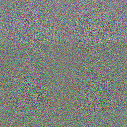
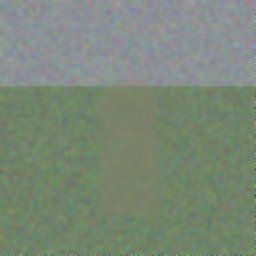
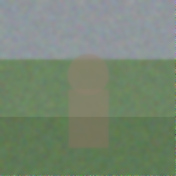
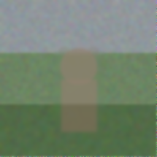
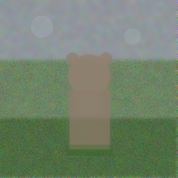
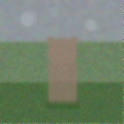
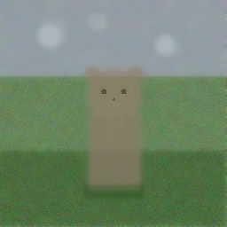
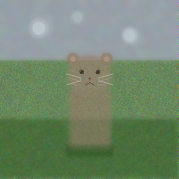
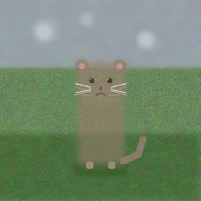
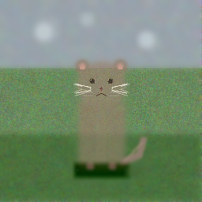

* Canvas
:PROPERTIES:
:UNHINGED-SECTION: canvas
:END:

* Step History
:PROPERTIES:
:UNHINGED-SECTION: step-history
:END:
** Step 1/10
:PROPERTIES:
:UNHINGED-STEP-SNAPSHOT: 1/10
:END:

  Step 1 of 10 — composition phase. The canvas is pure noise, so I'll start by establishing the large-scale layout: a hint of background at the top, the green grass field below, and the cat's basic silhouette (head + body blob) centered slightly above the grass line. I'll keep alpha low so the noise is gently steered rather than overwritten.
  Base composition is blocked in. Now I'll gently blur to pull coherent shapes out of the noise — a light full-canvas pass plus a slightly stronger pass over the cat region so the body/head emerge.
** Step 2/10
:PROPERTIES:
:UNHINGED-STEP-SNAPSHOT: 2/10
:END:

  Step 2: The base blocks are in place — sky band on top, grass below, and a faint cat silhouette in the center. Now I'll consolidate the color regions with low-alpha fills and gently blur to pull the shapes out of the noise, keeping everything in the same locations as the notes.
  Continuing from the previous step's plan: I'll consolidate the sky, grass, and cat silhouette with low-alpha fills, then blur each region to smooth the noise into coherent shapes — all in the same locations already recorded in the notes.
** Step 3/10
:PROPERTIES:
:UNHINGED-STEP-SNAPSHOT: 3/10
:END:

  Step 3: The composition blocks are in place (sky, grass, faint cat silhouette). The cat is still very weak against the grass, so I'll strengthen the head and body in place with slightly higher alpha, and add a touch of depth to the grass. These are independent, so I'll do them together.
  The blocks are in place; now I'll strengthen the cat silhouette in place and add grass depth, all as independent calls.
** Step 4/10
:PROPERTIES:
:UNHINGED-STEP-SNAPSHOT: 4/10
:END:

  Step 4, refinement phase. The composition blocks are in place — now I'll smooth the whole canvas gently to consolidate shapes, then strengthen the cat silhouette in place and add grass texture. Starting with a light global denoise pass:
  Continuing the refinement pass described last step: first a gentle global denoise to consolidate the emerging shapes, plus extra smoothing over the cat blob.
** Step 5/10
:PROPERTIES:
:UNHINGED-STEP-SNAPSHOT: 5/10
:END:

  Step 5, refinement phase. The overall composition (sky, grass, cat blob) is in place. This step I'll: (1) re-assert the cat's ears and silhouette which the previous blur softened, (2) add a soft ground shadow to seat the cat on the grass, (3) add faint cloud hints in the sky — then smooth and lightly texture.

  First, the structural draws and updated notes:
  Applying the planned refinement now: re-asserting ears and silhouette, seating the cat with a soft shadow, and adding faint cloud hints.
** Step 6/10
:PROPERTIES:
:UNHINGED-STEP-SNAPSHOT: 6/10
:END:

  Step 6, refinement phase. The composition is established (sky, grass, cat silhouette with ears, shadow). I'll now denoise the large regions, re-assert the emerging colors, then start faint face hints.

  First, smooth residual noise across the major regions (independent blurs):
  Continuing from where the last step left off — applying the planned refinements now. First, the independent denoising blurs across the major regions:
** Step 7/10
:PROPERTIES:
:UNHINGED-STEP-SNAPSHOT: 7/10
:END:

  Continuing the refinement in place. First, the independent edge-defining and texture steps: sharpen the cat's head and body outlines (they're still very soft), and add subtle grain to the grass regions away from the cat.
  Applying the planned refinement now: sharpening the cat's head and body edges, adding gentle grain to the grass away from the cat, and beginning to deepen the facial hints in place.
** Step 8/10
:PROPERTIES:
:UNHINGED-STEP-SNAPSHOT: 8/10
:END:

  The core composition is in place — now I'll refine it in place: smooth residual noise on the body and lower grass band, keep the grass grain lively, then layer in the fine facial details (whiskers, mouth, eye highlights, inner ears) and soften the cloud blobs. Smoothing calls come first so the drawn details stay crisp.
  Applying the planned refinements now — smoothing first, then re-graining, then crisp facial details.
** Step 9/10
:PROPERTIES:
:UNHINGED-STEP-SNAPSHOT: 9/10
:END:

  Step 9, detail phase. Per my notes, I'll now add the paws, draw the tail, then define the shadow and do a final light sharpen. Starting with the paws and tail structure:
  Applying the step 9 detail work now: defining the shadow under the cat, adding paw toe lines and a tail highlight, softening the tail edge, planting a few grass blades to anchor the cat, and finishing with a light sharpen of the cat region.
** Step 10/10
:PROPERTIES:
:UNHINGED-STEP-SNAPSHOT: 10/10
:END:

  Final step — applying the remaining micro-detail pass: eye glints, nose sheen, whisker touch-up, ear-tip definition, a soft chest highlight, plus gentle noise cleanup on the sky and lower band and a subtle global tone nudge.
  Applying the final micro-detail pass now — eye glints, nose sheen, whisker touch-ups, ear tips, chest highlight, and noise cleanup:
* Edit Log
:PROPERTIES:
:UNHINGED-SECTION: edit-log
:END:
** Step 1/10
:PROPERTIES:
:UNHINGED-STEP-LOG: 1/10
:END:
- =draw_rectangle(0,0 256x90, #A8BCC8, α:18)=

- =draw_rectangle(0,86 256x170, #4F8A38, α:30)=
- =draw_circle(128,108 r:30, #8A7A6A, α:40)=
- =draw_rectangle(100,130 58x85, #87786A, α:40)=
- =notes: Composition (256x256): background band top y=0-85 (#A8BCC8); green grass field y=86-255 (#4F8A38); cat head circle centered (128,108) r=30; cat body block (100,130)-(158,215); cat sits on grass, lower body meets grass ~y=215.=
- =blur_region(0,0→255,255, r:2)=
- =draw_rectangle(0,0 256x86, #A8BCC8, α:30)=
- =draw_rectangle(0,86 256x170, #4F8A38, α:30)=
- =draw_circle(128,108 r:30, #8D8577, α:35)=
- =draw_rectangle(100,130 58x85, #8D8577, α:35)=
- =blur_region(0,0→255,255, r:1)=
- =blur_region(95,75→165,220, r:2)=
- =notes: Composition (256x256): background band top y=0-85 (#A8BCC8); green grass field y=86-255 (#4F8A38); cat head circle centered (128,108) r=30; cat body block (100,130)-(158,215); base color blocks + initial blur applied in step 1; continue refining these in place.=
** Step 2/10
:PROPERTIES:
:UNHINGED-STEP-LOG: 2/10
:END:
- =notes: Composition (256x256): sky band y=0-85 (#A8BCC8); green grass y=86-255 (#4F8A38); cat head circle centered (128,108) r=30 (#918070); cat body block (100,130)-(158,215) same color; refine these in place, no duplicates.=

- =draw_rectangle(0,0 256x86, #A8BCC8, α:35)=
- =draw_rectangle(0,86 256x170, #4F8A38, α:35)=
- =draw_circle(128,108 r:30, #918070, α:45)=
- =draw_rectangle(100,130 58x85, #918070, α:45)=
- =blur_region(0,0→255,255, r:2)=
- =blur_region(95,75→160,220, r:2)=
- =draw_rectangle(0,0 256x86, #A8BCC8, α:30)=
- =draw_rectangle(0,86 256x170, #4F8A38, α:30)=
- =draw_circle(128,108 r:30, #918070, α:70)=
- =draw_rectangle(100,130 58x85, #918070, α:70)=
- =blur_region(0,0→255,85, r:2)=
- =blur_region(0,86→255,255, r:2)=
- =blur_region(95,75→162,218, r:2)=
- =notes: Composition (256x256): sky band y=0-85 (#A8BCC8); green grass y=86-255 (#4F8A38); cat head circle centered (128,108) r=30 (#918070); cat body block (100,130)-(158,215) same color; all regions filled and blurred at step 2; refine in place, no duplicates.=
** Step 3/10
:PROPERTIES:
:UNHINGED-STEP-LOG: 3/10
:END:
- =draw_circle(128,108 r:30, #918070, α:55)=

- =draw_rectangle(100,130 58x85, #918070, α:55)=
- =adjust_bc(0,170→255,255, b:-12, c:0.05)=
- =blur_region(90,70→168,228, r:2)=
- =blur_region(0,170→255,255, r:2)=
- =notes: Composition (256x256): sky band y=0-85 (#A8BCC8); green grass y=86-255 (#4F8A38, darker below y=170); cat head circle centered (128,108) r=30 (#918070); cat body block (100,130)-(158,215) same color; cat silhouette strengthened + blurred at step 3; continue refining cat in place (ears, tail) and grass texture next; no duplicates.=
- =draw_circle(128,108 r:30, #918070, α:70)=
- =draw_rectangle(100,130 58x85, #918070, α:70)=
- =draw_circle(104,84 r:9, #8A7A6A, α:50)=
- =draw_circle(152,84 r:9, #8A7A6A, α:50)=
- =adjust_bc(0,170→255,255, b:-12, c:0.05)=
- =notes: Composition (256x256): sky band y=0-85 (#A8BCC8); green grass y=86-255 (#4F8A38), darker below y=170 for depth; cat head circle centered (128,108) r=30 (#918070) strengthened at step 3; ear hints circles (104,84) and (152,84) r=9; cat body block (100,130)-(158,215) strengthened; refine in place, no duplicates.=
** Step 4/10
:PROPERTIES:
:UNHINGED-STEP-LOG: 4/10
:END:
- =blur_region(88,70→170,222, r:2)=

- =blur_region(0,160→255,255, r:2)=
- =blur_region(0,0→255,255, r:1)=
- =draw_circle(128,108 r:30, #918070, α:60)=
- =draw_circle(104,84 r:9, #918070, α:80)=
- =draw_circle(152,84 r:9, #918070, α:80)=
- =draw_rectangle(100,130 58x85, #8A7A6A, α:50)=
- =draw_rectangle(0,170 256x86, #3F7030, α:20)=
- =draw_line(0,86→255,86, #4F8A38, α:120, w:1)=
- =draw_line(36,196→36,212, #5E9C42, α:60, w:2)=
- =draw_line(58,148→58,160, #5E9C42, α:60, w:2)=
- =draw_line(200,126→200,140, #5E9C42, α:60, w:2)=
- =draw_line(226,186→226,200, #5E9C42, α:60, w:2)=
- =draw_line(80,236→80,248, #3F7030, α:60, w:2)=
- =draw_line(240,150→240,162, #3F7030, α:60, w:2)=
- =sharpen_region(92,68→166,222, i:0.25)=
- =sharpen_region(0,80→255,92, i:0.15)=
- =notes: Composition (256x256): sky band y=0-85 (#A8BCC8) with crisp horizon line at y=86; green grass y=86-255 (#4F8A38), darker band below y=170 (#3F7030), scattered grass tuft lines; cat head circle centered (128,108) r=30 (#918070); ear circles (104,84) and (152,84) r=9; body rect (100,130)-(158,215) (#8A7A6A); all strengthened at step 4. Next: face details (eyes, nose, whiskers) in late steps, refine in place, no duplicates.=
- =blur_region(0,0→255,255, r:2)=
- =blur_region(95,72→162,218, r:2)=
** Step 5/10
:PROPERTIES:
:UNHINGED-STEP-LOG: 5/10
:END:
- =draw_rectangle(0,170 256x86, #3E6E2C, α:30)=

- =add_noise(0,86→97,255, amt:15)=
- =add_noise(161,86→255,255, amt:15)=
- =add_noise(98,216→158,255, amt:15)=
- =draw_circle(128,108 r:30, #918070, α:55)=
- =draw_circle(104,84 r:9, #918070, α:70)=
- =draw_circle(152,84 r:9, #918070, α:70)=
- =draw_rectangle(100,130 58x85, #918070, α:45)=
- =draw_circle(128,150 r:16, #A69684, α:35)=
- =draw_rectangle(95,214 68x10, #2F5A20, α:60)=
- =sharpen_region(95,72→162,225, i:0.20)=
- =sharpen_region(0,78→255,96, i:0.20)=
- =draw_line(55,140→55,156, #3A6B2A, α:130, w:1)=
- =draw_line(200,115→200,130, #3A6B2A, α:130, w:1)=
- =draw_line(35,195→35,212, #3A6B2A, α:130, w:1)=
- =draw_line(215,205→215,222, #3A6B2A, α:130, w:1)=
- =draw_line(175,175→175,188, #6FA84F, α:110, w:1)=
- =draw_line(30,105→30,116, #6FA84F, α:110, w:1)=
- =draw_line(115,232→115,246, #6FA84F, α:110, w:1)=
- =notes: 256x256: sky y=0-85 (#A8BCC8); grass y=86-255 (#4F8A38) with texture noise, darker band below y=170 (#3E6E2C), horizon sharpened ~y=86; cat head circle (128,108) r=30 (#918070), ears circles (104,84) & (152,84) r=9, body rect (100,130)-(158,215), chest highlight (128,150) r=16, base shadow (95,214)-(163,224); next steps: face details (eyes/nose/muzzle), whiskers, more grass blades.=
- =draw_circle(104,84 r:9, #918070, α:150)=
- =draw_circle(152,84 r:9, #918070, α:150)=
- =draw_circle(128,108 r:30, #918070, α:130)=
- =draw_rectangle(100,130 58x85, #8A7A6A, α:120)=
- =draw_rectangle(95,208 67x16, #3A6B2C, α:90)=
- =draw_circle(60,38 r:16, #C6D4DC, α:40)=
- =draw_circle(190,52 r:12, #C6D4DC, α:35)=
- =notes: Composition (256x256): sky band y=0-85 (#A8BCC8) with faint clouds, horizon y=86; grass y=86-255 (#4F8A38), darker band below y=170 (#3F7030), scattered tuft lines; cat head circle (128,108) r=30 (#918070); ears (104,84) & (152,84) r=9; body rect (100,130)-(158,215) (#8A7A6A); soft shadow under cat around (95,208)-(162,224). Next: face details (eyes, nose, whiskers) in late steps; refine in place, no duplicates.=
- =blur_region(90,70→170,228, r:2)=
- =blur_region(0,0→255,85, r:2)=
- =sharpen_region(96,74→164,144, i:0.20)=
- =draw_line(45,193→45,192, #3A6B2C, α:160, w:1)=
- =draw_line(210,174→210,173, #3A6B2C, α:160, w:1)=
- =draw_line(74,141→74,140, #3A6B2C, α:150, w:1)=
- =draw_line(190,215→190,214, #3A6B2C, α:150, w:1)=
- =draw_circle(104,84 r:9, #918070, α:90)=
- =draw_circle(152,84 r:9, #918070, α:90)=
- =draw_circle(128,108 r:30, #918070, α:60)=
- =draw_rectangle(100,130 58x85, #8A7A6A, α:55)=
- =draw_rectangle(95,208 67x16, #2E4522, α:50)=
- =draw_circle(55,40 r:14, #E8EEF2, α:30)=
- =draw_circle(185,50 r:12, #E8EEF2, α:28)=
- =draw_circle(110,24 r:10, #E8EEF2, α:20)=
- =notes: Composition (256x256): sky band y=0-85 (#A8BCC8) with faint clouds near (55,40), (185,50), (110,24); horizon y=86; grass y=86-255 (#4F8A38), darker band below y=170 (#3F7030); cat head circle (128,108) r=30 (#918070); ears (104,84) & (152,84) r=9; body rect (100,130)-(158,215) (#8A7A6A); soft shadow (95,208)-(162,224). Next: face details (eyes, nose, whiskers) in late steps; refine in place, no duplicates.=
** Step 6/10
:PROPERTIES:
:UNHINGED-STEP-LOG: 6/10
:END:
- =blur_region(90,70→170,100, r:2)=

- =blur_region(85,198→172,230, r:3)=
- =blur_region(30,15→210,65, r:2)=
- =sharpen_region(95,70→165,222, i:0.20)=
- =add_noise(0,86→255,255, amt:12)=
- =blur_region(0,0→255,85, r:2)=
- =blur_region(0,86→255,255, r:2)=
- =blur_region(96,74→162,226, r:1)=
- =draw_rectangle(0,0 256x86, #A8BCC8, α:22)=
- =draw_rectangle(0,86 256x84, #4F8A38, α:22)=
- =draw_rectangle(0,170 256x86, #3F7030, α:22)=
- =draw_circle(55,40 r:14, #D8E0E4, α:30)=
- =draw_circle(185,50 r:12, #D8E0E4, α:28)=
- =draw_circle(110,24 r:10, #D8E0E4, α:25)=
- =draw_circle(128,108 r:30, #918070, α:55)=
- =draw_circle(104,84 r:9, #8A7A6A, α:60)=
- =draw_circle(152,84 r:9, #8A7A6A, α:60)=
- =draw_rectangle(100,130 58x85, #8A7A6A, α:55)=
- =draw_rectangle(95,208 67x16, #2E4A26, α:45)=
- =draw_circle(116,102 r:4, #3E342C, α:75)=
- =draw_circle(140,102 r:4, #3E342C, α:75)=
- =draw_circle(128,115 r:3, #B07A72, α:85)=
- =draw_line(0,86→255,86, #3E6E31, α:70, w:1)=
- =sharpen_region(96,74→162,226, i:0.20)=
- =add_noise(0,86→255,255, amt:12)=
- =notes: Composition (256x256): sky band y=0-85 (#A8BCC8), clouds at (55,40),(185,50),(110,24); horizon line y=86; grass y=86-255 (#4F8A38), darker band below y=170 (#3F7030); cat head circle (128,108) r=30 (#918070); ears (104,84)&(152,84) r=9; body rect (100,130)-(158,215) (#8A7A6A); shadow (95,208)-(162,224); eye hints (116,102)&(140,102) r=4 (#3E342C), nose (128,115) r=3 (#B07A72). Late steps: deepen eyes/nose, whiskers from muzzle, fur texture on body, keep grass grain subtle. Refine in place, no duplicates.=
- =blur_region(0,0→255,85, r:2)=
- =blur_region(0,86→255,169, r:2)=
- =blur_region(0,170→255,255, r:2)=
- =blur_region(96,70→164,224, r:2)=
** Step 7/10
:PROPERTIES:
:UNHINGED-STEP-LOG: 7/10
:END:
- =draw_rectangle(0,0 256x86, #A8BCC8, α:25)=

- =draw_circle(55,40 r:10, #C9D6DD, α:30)=
- =draw_circle(185,50 r:8, #C9D6DD, α:25)=
- =draw_rectangle(0,86 256x84, #4F8A38, α:25)=
- =draw_rectangle(0,170 256x86, #3F7030, α:25)=
- =draw_circle(128,108 r:30, #918070, α:45)=
- =draw_circle(104,84 r:9, #918070, α:45)=
- =draw_circle(152,84 r:9, #918070, α:45)=
- =draw_rectangle(100,130 58x85, #8A7A6A, α:40)=
- =draw_rectangle(95,208 67x16, #2F5A26, α:30)=
- =draw_circle(117,103 r:3, #33291F, α:110)=
- =draw_circle(139,103 r:3, #33291F, α:110)=
- =draw_circle(128,112 r:2, #5C3A33, α:120)=
- =draw_line(124,117→132,117, #4A3A30, α:60, w:1)=
- =sharpen_region(96,70→164,224, i:0.20)=
- =notes: Composition (256x256): sky y=0-85 (#A8BCC8), faint clouds (55,40),(185,50),(110,24); horizon y=86; grass y=86-169 (#4F8A38), darker band y=170-255 (#3F7030); cat head circle (128,108) r=30 (#918070); ears (104,84) & (152,84) r=9; body rect (100,130)-(158,215) (#8A7A6A); shadow (95,208)-(162,224); faint face hints placed: eyes (117,103)&(139,103) r=3, nose (128,112) r=2, mouth line y=117. Late steps: deepen eyes/nose, whiskers, grass texture. Refine in place, no duplicates.=
- =sharpen_region(98,74→158,142, i:0.30)=
- =sharpen_region(94,126→164,220, i:0.20)=
- =add_noise(0,88→94,255, amt:10)=
- =add_noise(164,88→255,255, amt:10)=
- =add_noise(0,226→255,255, amt:8)=
- =draw_circle(104,84 r:9, #8A7A68, α:110)=
- =draw_circle(152,84 r:9, #8A7A68, α:110)=
- =add_noise(102,132→156,212, amt:10)=
- =draw_circle(116,102 r:3, #2E241C, α:110)=
- =draw_circle(140,102 r:3, #2E241C, α:110)=
- =draw_circle(128,114 r:2, #A5685F, α:110)=
- =draw_line(128,116→128,121, #6B584E, α:70, w:1)=
- =draw_line(97,110→96,110, #E8E0D4, α:45, w:1)=
- =draw_line(106,120→96,120, #E8E0D4, α:45, w:1)=
- =draw_line(159,110→160,110, #E8E0D4, α:45, w:1)=
- =draw_line(150,120→160,120, #E8E0D4, α:45, w:1)=
- =draw_rectangle(95,208 67x16, #2F5124, α:50)=
- =draw_rectangle(0,170 256x86, #3F7030, α:25)=
- =draw_circle(55,40 r:9, #DCE6EA, α:40)=
- =draw_circle(185,50 r:8, #DCE6EA, α:40)=
- =adjust_bc(0,0→255,255, b:2, c:0.05)=
- =notes: Composition (256x256): sky y=0-85 (#A8BCC8), clouds (55,40) r9,(185,50) r8; horizon y=86; grass y=86-255 (#4F8A38), darker band below y=170 (#3F7030); cat head circle (128,108) r=30 (#918070), edges sharpened; ears (104,84)&(152,84) r=9 (#8A7A68); body rect (100,130)-(158,215) (#8A7A6A) with fur noise; shadow (95,208)-(162,224); eyes (116,102)&(140,102) r=3 (#2E241C); nose (128,114) r=2 (#A5685F), mouth line (128,116)-(128,121); whisker hints to (96,110/120)&(160,110/120). Steps 8-10: deepen eyes + tiny highlights, strengthen whiskers, muzzle shading, chest fur, keep grass grain subtle. Refine in place, no duplicates.=
- =sharpen_region(95,72→162,140, i:0.30)=
- =sharpen_region(95,125→165,220, i:0.25)=
- =add_noise(0,90→88,250, amt:15)=
- =add_noise(168,90→255,250, amt:15)=
- =blend_color(117,103, #33281E, α:120)=
- =blend_color(139,103, #33281E, α:120)=
- =blend_color(128,112, #5C4136, α:120)=
- =notes: Composition (256x256): sky y=0-85 (#A8BCC8) with faint clouds (55,40),(185,50),(110,24); horizon y=86; grass y=86-169 (#4F8A38) with grain added, darker band y=170-255 (#3F7030); cat head circle (128,108) r=30 (#918070) edges sharpened; ears (104,84)&(152,84) r=9; body rect (100,130)-(158,215) (#8A7A6A) edges sharpened; shadow (95,208)-(162,224); face: eyes (117,103)&(139,103) darkened to #33281E, nose (128,112) #5C4136, mouth line y=117. Late steps: whiskers, mouth line, grass texture near cat, shadow definition. Refine in place, no duplicates.=
** Step 8/10
:PROPERTIES:
:UNHINGED-STEP-LOG: 8/10
:END:
- =blur_region(102,132→156,213, r:1)=

- =blur_region(0,170→255,255, r:2)=
- =blur_region(0,164→255,172, r:1)=
- =add_noise(0,86→255,169, amt:10)=
- =add_noise(0,170→255,255, amt:8)=
- =draw_line(95,105→94,105, #D8D0C8, α:160, w:1)=
- =draw_line(115,113→92,113, #D8D0C8, α:160, w:1)=
- =draw_line(95,121→94,121, #D8D0C8, α:160, w:1)=
- =draw_line(161,105→162,105, #D8D0C8, α:160, w:1)=
- =draw_line(141,113→164,113, #D8D0C8, α:160, w:1)=
- =draw_line(161,121→162,121, #D8D0C8, α:160, w:1)=
- =draw_line(128,114→128,118, #4A362B, α:220, w:1)=
- =draw_line(122,121→122,121, #4A362B, α:220, w:1)=
- =draw_line(134,121→134,121, #4A362B, α:220, w:1)=
- =blend_color(115,101, #E0DACE, α:160)=
- =blend_color(137,101, #E0DACE, α:160)=
- =draw_circle(104,84 r:4, #C69C8E, α:130)=
- =draw_circle(152,84 r:4, #C69C8E, α:130)=
- =draw_circle(55,40 r:9, #C4D0D8, α:60)=
- =draw_circle(185,50 r:11, #C4D0D8, α:55)=
- =draw_circle(110,24 r:7, #C4D0D8, α:55)=
- =notes: Composition (256x256): sky y=0-85 (#A8BCC8) soft clouds (55,40),(185,50),(110,24); horizon y=86; grass y=86-169 (#4F8A38) with grain; darker band y=170-255 (#3F7030), smoothed + re-grained. Cat: head circle (128,108) r=30 #918070; ears (104,84)&(152,84) r=9 with inner pink r=4; eyes (117,103)&(139,103) #33281E with highlights (115,101)&(137,101); nose (128,112) #5C4136; mouth (128,114-118) with curves to (122,121)&(134,121); whiskers from (115,111-115)&(141,111-115) outward to x~92-164. Body rect (100,130)-(158,215) #8A7A6A blurred smooth. Shadow (95,208)-(162,224). Remaining (step 9-10): paws circles r=5 at (114,210)&(142,210), tail from (156,205)->(176,196)->(182,176) width 6 #8A7A6A, darken/define shadow, final light sharpen of cat edges.=
- =blur_region(100,130→158,215, r:2)=
- =blur_region(0,170→255,255, r:2)=
- =blur_region(42,28→70,54, r:3)=
- =blur_region(172,38→200,64, r:3)=
- =blur_region(98,12→124,38, r:2)=
** Step 9/10
:PROPERTIES:
:UNHINGED-STEP-LOG: 9/10
:END:
- =add_noise(0,170→96,255, amt:14)=

- =add_noise(160,170→255,255, amt:14)=
- =add_noise(97,226→161,255, amt:10)=
- =add_noise(100,132→158,213, amt:8)=
- =blend_color(115,101, #F2EEE6, α:230)=
- =blend_color(137,101, #F2EEE6, α:230)=
- =draw_circle(104,84 r:4, #C79A8C, α:210)=
- =draw_circle(152,84 r:4, #C79A8C, α:210)=
- =draw_line(122,121→122,121, #4A352B, α:255, w:1)=
- =draw_line(134,121→134,121, #4A352B, α:255, w:1)=
- =draw_line(96,106→94,106, #EAE2D2, α:240, w:1)=
- =draw_line(114,112→92,112, #EAE2D2, α:240, w:1)=
- =draw_line(96,118→94,118, #EAE2D2, α:240, w:1)=
- =draw_line(160,106→162,106, #EAE2D2, α:240, w:1)=
- =draw_line(142,112→164,112, #EAE2D2, α:240, w:1)=
- =draw_line(160,118→162,118, #EAE2D2, α:240, w:1)=
- =draw_circle(114,210 r:5, #9C8B76, α:255)=
- =draw_circle(142,210 r:5, #9C8B76, α:255)=
- =draw_line(175,196→176,196, #8A7A6A, α:255, w:6)=
- =draw_line(182,177→182,176, #8A7A6A, α:255, w:6)=
- =notes: Composition (256x256): sky y=0-85 #A8BCC8, clouds softened at (56,41),(186,51),(111,25); horizon y=86; grass y=86-169 #4F8A38 grainy; darker band y=170-255 #3F7030 smoothed + re-grained (noise 14 sides). Cat: head circle (128,108) r=30 #918070; ears (104,84)&(152,84) r=9, inner pink r=4 #C79A8C; eyes (117,103)&(139,103) #33281E with white highlights (115,101)&(137,101); nose (128,112) #5C4136; mouth vertical (128,114-118) + curves to (122,121)&(134,121) #4A352B; whiskers 3/side from (114,110-114)&(142,110-114) to x~92/164 #EAE2D2. Body (100,130)-(158,215) #8A7A6A blurred + subtle fur noise; paws r=5 (114,210)&(142,210) #9C8B76; tail (156,205)->(176,196)->(182,176) w6 #8A7A6A. Shadow (95,208)-(162,224). Remaining (step 9-10): darken/define shadow, final light sharpen of cat edges, sky cleanup if needed.=
- =draw_line(175,196→176,196, #8A7A6A, α:255, w:6)=
- =draw_line(182,177→182,176, #8A7A6A, α:255, w:6)=
- =draw_circle(114,210 r:5, #918070, α:255)=
- =draw_circle(142,210 r:5, #918070, α:255)=
- =draw_line(114,212→114,216, #6E6154, α:255, w:1)=
- =draw_line(142,212→142,216, #6E6154, α:255, w:1)=
- =blur_region(148,168→190,212, r:1)=
- =adjust_bc(93,205→165,227, b:-18, c:0.12)=
- =sharpen_region(95,74→190,228, i:0.18)=
- =notes: Composition (256x256): sky y=0-85 (#A8BCC8) soft clouds (55,40),(185,50),(110,24); horizon y=86; grass y=86-169 (#4F8A38) with grain; darker band y=170-255 (#3F7030), smoothed + re-grained. Cat complete: head circle (128,108) r=30 #918070; ears (104,84)&(152,84) r=9 inner pink r=4; eyes (117,103)&(139,103) #33281E with highlights (115,101)&(137,101); nose (128,112) #5C4136; mouth curves to (122,121)&(134,121); whiskers to x~92-164; body rect (100,130)-(158,215) #8A7A6A; paws r=5 at (114,210)&(142,210) with toe lines; tail (156,205)->(176,196)->(182,176) width 6; shadow (95,205)-(165,227) darkened. Step 10: only final touch-ups — light sharpen of face if needed, subtle whisker re-check, tiny grain on grass bands; no new structures.=
- =adjust_bc(95,208→162,224, b:-26, c:0.06)=
- =draw_rectangle(158,212 24x12, #3A5C2E, α:90)=
- =blur_region(86,200→190,234, r:2)=
- =draw_line(111,206→111,213, #6B5B48, α:255, w:1)=
- =draw_line(117,206→117,213, #6B5B48, α:255, w:1)=
- =draw_line(139,206→139,213, #6B5B48, α:255, w:1)=
- =draw_line(145,206→145,213, #6B5B48, α:255, w:1)=
- =draw_line(180,180→180,180, #9C8B76, α:90, w:2)=
- =blur_region(150,166→190,212, r:1)=
- =draw_line(88,212→88,221, #2F5A26, α:170, w:1)=
- =draw_line(98,215→98,227, #7DB35E, α:150, w:1)=
- =draw_line(170,211→170,223, #2F5A26, α:170, w:1)=
- =draw_line(177,221→177,231, #7DB35E, α:140, w:1)=
- =sharpen_region(92,70→190,230, i:0.18)=
- =notes: Composition (256x256): sky y=0-85 #A8BCC8, clouds (56,41),(186,51),(111,25); horizon y=86; grass y=86-169 #4F8A38 grainy; darker band y=170-255 #3F7030. Cat: head circle (128,108) r=30 #918070; ears (104,84)&(152,84) r=9, inner pink r=4 #C79A8C; eyes (117,103)&(139,103) #33281E, highlights (115,101)&(137,101); nose (128,112) #5C4136; mouth (128,114-118)+curves #4A352B; whiskers to x~92/164 #EAE2D2. Body (100,130)-(158,215) #8A7A6A. Paws (114,210)&(142,210) r=5 #9C8B76 with toe lines x=111,117,139,145. Tail (156,205)->(182,176) w6, highlight added, edge softened. Shadow (95,208)-(162,224) darkened -26, extended to x=182, feathered blur r2. Grass blades (88,212),(98,215),(170,211),(177,221). Cat edges lightly sharpened 0.18. Step 10 remaining: micro-detail only (eye glint brighten, nose highlight, whisker touch-up), gentle global tone check.=
** Step 10/10
:PROPERTIES:
:UNHINGED-STEP-LOG: 10/10
:END:
- =blur_region(0,0→255,85, r:2)=

- =blur_region(0,172→255,255, r:1)=
- =blend_color(115,101, #FFF6E0, α:220)=
- =blend_color(137,101, #FFF6E0, α:220)=
- =blend_color(126,111, #8F6B58, α:120)=
- =blend_color(104,76, #6E5A4C, α:90)=
- =blend_color(152,76, #6E5A4C, α:90)=
- =draw_line(93,106→92,106, #EAE2D2, α:170, w:1)=
- =draw_line(94,117→93,117, #EAE2D2, α:170, w:1)=
- =draw_line(163,106→164,106, #EAE2D2, α:170, w:1)=
- =draw_line(162,117→163,117, #EAE2D2, α:170, w:1)=
- =draw_rectangle(122,140 12x65, #A3947F, α:22)=
- =adjust_bc(0,0→255,255, b:2, c:0.02)=
- =draw_line(73,210→73,208, #6BA34A, α:255, w:1)=
- =draw_line(202,207→202,205, #6BA34A, α:255, w:1)=
- =draw_line(41,185→41,183, #6BA34A, α:255, w:1)=
- =sharpen_region(98,78→162,126, i:0.15)=
- =notes: Final composition (256x256): sky y=0-85 #A8BCC8 w/ clouds (56,41),(186,51),(111,25); horizon y=86; grass y=86-169 #4F8A38; dark band y=170-255 #3F7030. Cat: head (128,108) r30 #918070; ears (104,84)&(152,84) r9, pink inner r4, tips darkened; eyes (117,103)&(139,103) w/ bright glints (115,101)/(137,101); nose (128,112) sheened; whiskers to x~92/164 touched up; chest highlight (122,140)-(134,205); body (100,130)-(158,215) #8A7A6A; paws (114,210)&(142,210) w/ toe lines; tail (156,205)->(182,176); shadow (95,208)-(162,224) extended to x=182. Grass blades at (88,212),(98,215),(170,211),(177,221),(70-73,208-222),(202-205,205-218),(38-41,183-196). Image complete.=
