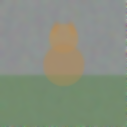
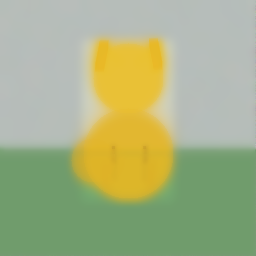
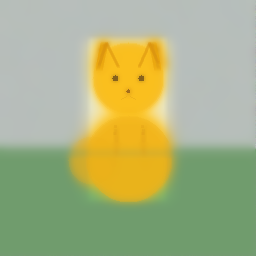
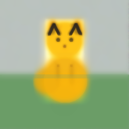
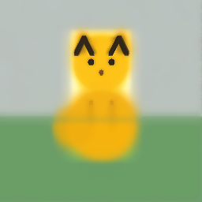
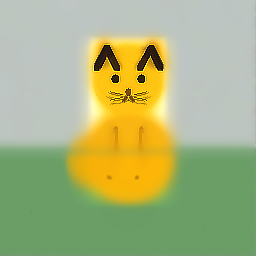
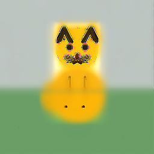

* Canvas
:PROPERTIES:
:UNHINGED-SECTION: canvas
:END:

* Step History
:PROPERTIES:
:UNHINGED-SECTION: step-history
:END:
** Step 1/10
:PROPERTIES:
:UNHINGED-STEP-SNAPSHOT: 1/10
:END:

  Established and gently smoothed the sky, grass, central seated-cat silhouette, and emerging ears.
  Applied gentle composition-level smoothing and color guidance for the sky, grass, and centered seated cat silhouette.
** Step 2/10
:PROPERTIES:
:UNHINGED-STEP-SNAPSHOT: 2/10
:END:

  եցի
  Applied subtle composition refinements: smoothed sky and grass, reinforced the centered tawny cat head/body, and gently clarified the grass horizon.
** Step 3/10
:PROPERTIES:
:UNHINGED-STEP-SNAPSHOT: 3/10
:END:

  Composition gently reinforced: smooth sky and grass planes, a centered warm tawny cat body and head, soft ears, and a subtle grassy horizon.
  Established and softly blended the sky, grass, and centered tawny seated-cat silhouette while preserving the existing composition.
** Step 4/10
:PROPERTIES:
:UNHINGED-STEP-SNAPSHOT: 4/10
:END:

  Refined the soft landscape and reinforced the centered tawny sitting-cat silhouette, including rounded head, ears, body, and haunch.
  Refined the soft sky-and-grass landscape, strengthened the centered golden cat silhouette and ears, and added subtle foreleg separation.
** Step 5/10
:PROPERTIES:
:UNHINGED-STEP-SNAPSHOT: 5/10
:END:

  Refined the cat’s rounded golden form, ear definition, face, foreleg separation, and softened the grass horizon.
  Refined the cat’s facial features, ear contours, and subtle foreleg definition while keeping the rounded body soft.
** Step 6/10
:PROPERTIES:
:UNHINGED-STEP-SNAPSHOT: 6/10
:END:

  Refined the cat’s soft silhouette, ear edges, facial features, foreleg separation, and grass contrast while preserving the centered seated pose.
  Refined the centered seated cat with smoother golden body forms, clearer dark ear tips and eyes, subtle nose detail, and gentle foreleg separation.
** Step 7/10
:PROPERTIES:
:UNHINGED-STEP-SNAPSHOT: 7/10
:END:

  Refined the cat’s facial features, ear outlines, and subtle foreleg separation while smoothing the seated body silhouette.
  Refined the cat’s eyes, nose, ear outlines, and foreleg separation while smoothing the rounded seated body.
** Step 8/10
:PROPERTIES:
:UNHINGED-STEP-SNAPSHOT: 8/10
:END:

  Refined the cat’s facial features, foreleg separation, and smooth rounded body while preserving the soft sky-and-grass setting.
  Refined the cat’s eyes, nose, mouth, whiskers, and seated foreleg definition.
** Step 9/10
:PROPERTIES:
:UNHINGED-STEP-SNAPSHOT: 9/10
:END:

  Refined facial features, whiskers, foreleg separation, and subtle paw definition while preserving the centered seated cat composition.
  Applied late-stage detail refinements to the cat’s eyes, ear outlines, nose, foreleg separation, and facial sharpness.
** Step 10/10
:PROPERTIES:
:UNHINGED-STEP-SNAPSHOT: 10/10
:END:

  Refined the cat’s facial features, whiskers, foreleg separation, paws, and subtle edge definition.
  Refined the seated cat’s ears, eyes, nose and mouth, foreleg separation, and paw details.
* Edit Log
:PROPERTIES:
:UNHINGED-SECTION: edit-log
:END:
** Step 1/10
:PROPERTIES:
:UNHINGED-STEP-LOG: 1/10
:END:
- =blur_region(0,0→255,159, r:3)=

- =blur_region(0,155→255,255, r:3)=
- =draw_rectangle(0,150 256x106, #4E8D3A, α:28)=
- =draw_rectangle(0,0 256x154, #A9C8DE, α:18)=
- =draw_circle(128,116 r:39, #B5885D, α:24)=
- =draw_circle(128,76 r:28, #B98C61, α:24)=
- =notes: pale sky/background across y=0-153; green grass across y=150-255; seated cat body emerging centered around (89,77)-(167,160), head around (100,48)-(156,104)=
- =draw_rectangle(0,0 256x154, #A6B5AD, α:22)=
- =draw_rectangle(0,151 256x105, #5F8C52, α:32)=
- =draw_circle(128,122 r:40, #A87E5C, α:25)=
- =draw_circle(128,76 r:29, #B18463, α:27)=
- =blur_region(0,0→255,255, r:2)=
- =notes: pale sky/background across y=0-153; green grass across y=150-255; seated warm brown cat body centered around (89,77)-(167,160), head around (100,48)-(156,104)=
- =blur_region(0,0→255,153, r:2)=
- =blur_region(0,150→255,255, r:2)=
- =draw_rectangle(0,0 256x154, #B8C0B2, α:18)=
- =draw_rectangle(0,150 256x106, #668D57, α:28)=
- =draw_circle(128,126 r:41, #A9784B, α:30)=
- =draw_circle(128,77 r:29, #B78354, α:32)=
- =notes: pale softly blurred sky/background across y=0-153; green grass across y=150-255; seated warm brown cat body centered around (89,85)-(167,167), round head around (99,48)-(157,106)=
- =blur_region(0,0→255,151, r:2)=
- =blur_region(0,151→255,255, r:2)=
- =draw_rectangle(0,151 256x105, #71965f, α:20)=
- =draw_circle(128,76 r:29, #aa865e, α:18)=
- =draw_circle(128,128 r:39, #a77f58, α:18)=
- =notes: pale softly blurred sky/background across y=0-153; green grass across y=150-255; seated warm brown cat body centered around (89,85)-(167,167), round head around (99,48)-(157,106)=
- =blur_region(0,0→255,152, r:2)=
- =blur_region(0,153→255,255, r:2)=
- =draw_circle(128,77 r:29, #A8825C, α:18)=
- =draw_circle(128,128 r:40, #95734F, α:18)=
- =notes: pale softly blurred sky/background across y=0-153; green grass across y=150-255; seated warm brown cat body centered around (89,85)-(167,167), round head around (99,48)-(157,106)=
- =notes: pale softly blurred sky/background across y=0-153; green grass across y=150-255; seated warm brown cat body centered around (89,85)-(167,174), round head around (99,48)-(157,106); faint ears beginning above head near (106,51) and (150,51).=
- =blur_region(0,0→255,153, r:2)=
- =blur_region(0,150→255,255, r:2)=
- =draw_circle(128,131 r:41, #A7835B, α:24)=
- =draw_circle(128,77 r:29, #B28B60, α:22)=
- =draw_rectangle(0,153 256x103, #688B60, α:18)=
- =blur_region(0,0→255,153, r:2)=
- =blur_region(0,150→255,255, r:2)=
- =draw_circle(128,126 r:41, #9B8056, α:22)=
- =draw_circle(128,77 r:29, #A4875C, α:18)=
- =draw_line(115,46→115,45, #9B7A4E, α:20, w:8)=
- =draw_line(141,46→141,45, #9B7A4E, α:20, w:8)=
- =notes: soft pale sky/background spans y=0-153; green grass spans y=150-255; warm brown seated cat body centered around (89,85)-(167,174), head around (99,48)-(157,106); subtle triangular ears emerging near (108,45)-(117,66) and (139,45)-(148,66).=
- =blur_region(0,0→255,255, r:2)=
- =draw_rectangle(0,0 256x151, #A9B7B2, α:18)=
- =draw_rectangle(0,151 256x105, #6F9870, α:25)=
- =draw_circle(128,130 r:42, #B78E55, α:24)=
- =draw_circle(128,79 r:29, #C09A64, α:24)=
- =draw_line(114,48→114,47, #B98F58, α:20, w:10)=
- =draw_line(142,48→142,47, #B98F58, α:20, w:10)=
- =notes: soft pale sky/background spans y=0-153; green grass spans y=150-255; warm brown seated cat body centered around (89,85)-(167,174), head around (99,48)-(157,106); subtle triangular ears emerging near (108,45)-(117,66) and (139,45)-(148,66).=
- =blur_region(0,0→255,149, r:2)=
- =blur_region(0,151→255,255, r:2)=
- =draw_rectangle(0,151 256x105, #70946f, α:20)=
- =draw_circle(128,131 r:42, #a48759, α:24)=
- =draw_circle(128,78 r:29, #a98b5d, α:24)=
- =notes: soft pale sky/background spans y=0-153; green grass spans y=150-255; warm brown seated cat body centered around (89,85)-(167,174), head around (99,48)-(157,106); subtle triangular ears emerging near (108,45)-(117,66) and (139,45)-(148,66).=
- =blur_region(0,0→255,255, r:2)=
- =draw_rectangle(0,151 256x105, #6F986B, α:24)=
- =draw_circle(128,132 r:41, #B38A53, α:29)=
- =draw_circle(128,78 r:29, #B88C52, α:28)=
- =notes: soft pale sky/background spans y=0-153; green grass spans y=150-255; warm brown seated cat body centered around (89,85)-(167,174), head around (99,48)-(157,106); subtle triangular ears emerging near (108,45)-(117,66) and (139,45)-(148,66).=
- =blur_region(0,0→255,255, r:2)=
- =draw_rectangle(0,0 256x151, #A6AAA5, α:18)=
- =draw_rectangle(0,150 256x106, #70966D, α:24)=
- =draw_circle(128,132 r:41, #B28F5A, α:24)=
- =draw_circle(128,77 r:30, #B68F55, α:25)=
- =notes: soft pale sky/background spans y=0-153; green grass spans y=150-255; warm brown seated cat body centered around (89,85)-(167,174), head around (99,48)-(157,106); subtle triangular ears emerging near (108,45)-(117,66) and (139,45)-(148,66).=
- =blur_region(0,0→255,149, r:2)=
- =blur_region(0,151→255,255, r:2)=
- =draw_circle(128,132 r:42, #B89259, α:24)=
- =draw_circle(128,76 r:29, #BD9254, α:25)=
- =notes: soft pale sky/background spans y=0-150; green grass spans y=150-255; warm brown seated cat body centered around (86,88)-(170,174), head around (99,47)-(157,106); subtle triangular ears emerging near (108,45)-(121,66) and (135,45)-(149,66).=
- =blur_region(0,0→255,149, r:2)=
- =blur_region(0,150→255,255, r:2)=
- =draw_rectangle(0,0 256x150, #B5BEC0, α:18)=
- =draw_rectangle(0,150 256x106, #71996C, α:22)=
- =draw_circle(128,132 r:42, #B8894F, α:21)=
- =draw_circle(128,76 r:29, #BD8B50, α:22)=
- =notes: soft pale sky/background spans y=0-150; green grass spans y=150-255; warm brown seated cat body centered around (86,88)-(170,174), head around (99,47)-(157,106); subtle triangular ears emerging near (108,45)-(121,66) and (135,45)-(149,66).=
** Step 2/10
:PROPERTIES:
:UNHINGED-STEP-LOG: 2/10
:END:
- =draw_circle(128,132 r:43, #B18B58, α:18)=

- =draw_circle(128,77 r:30, #B8884D, α:22)=
- =draw_line(113,46→113,45, #A97843, α:25, w:9)=
- =draw_line(152,64→152,65, #A97843, α:25, w:9)=
- =blur_region(82,39→175,179, r:2)=
- =notes: soft pale sky/background spans y=0-150; green grass spans y=150-255; warm brown seated cat body centered around (86,88)-(170,174), head around (99,47)-(157,106); subtle triangular ears emerging near (105,45)-(116,67) and (141,45)-(152,67).=
- =blur_region(0,0→255,149, r:2)=
- =blur_region(0,151→255,255, r:2)=
- =draw_rectangle(0,0 256x150, #B9C3BE, α:14)=
- =draw_rectangle(0,150 256x106, #79A574, α:18)=
- =draw_circle(128,133 r:42, #B99158, α:23)=
- =draw_circle(128,76 r:30, #B98D52, α:25)=
- =notes: soft pale sky/background spans y=0-150; green grass spans y=150-255; warm brown seated cat body centered around (86,88)-(170,174), head around (99,47)-(157,106); subtle triangular ears emerging near (105,45)-(116,67) and (141,45)-(152,67).=
- =blur_region(0,0→255,149, r:2)=
- =blur_region(0,150→255,255, r:2)=
- =draw_circle(128,132 r:43, #B78D52, α:22)=
- =draw_circle(128,76 r:30, #C19152, α:24)=
- =draw_line(112,47→112,46, #B87F42, α:20, w:1)=
- =draw_line(152,65→152,66, #B87F42, α:20, w:1)=
- =draw_rectangle(0,150 256x106, #719970, α:13)=
- =notes: soft pale sky/background spans y=0-150; green grass spans y=150-255; warm brown seated cat body centered around (86,88)-(170,174), head around (99,47)-(157,106); subtle triangular ears emerging near (105,45)-(116,67) and (141,45)-(152,67).=
- =blur_region(0,0→255,149, r:2)=
- =blur_region(0,151→255,255, r:2)=
- =draw_circle(128,132 r:43, #B38A50, α:24)=
- =draw_circle(128,76 r:31, #B87F3D, α:25)=
- =draw_line(110,46→110,45, #B87F3D, α:30, w:8)=
- =draw_line(146,46→146,45, #B87F3D, α:30, w:8)=
- =draw_rectangle(0,150 256x106, #6C9468, α:12)=
- =notes: soft pale sky/background spans y=0-150; green grass spans y=150-255; warm brown seated cat body centered around (86,88)-(170,174), head around (99,47)-(157,106); subtle triangular ears emerging near (103,45)-(115,67) and (141,45)-(153,67).=
- =blur_region(0,0→255,149, r:2)=
- =blur_region(0,151→255,255, r:2)=
- =draw_circle(128,132 r:43, #B7894A, α:20)=
- =draw_circle(128,77 r:30, #C18F50, α:22)=
- =notes: soft pale sky/background spans y=0-150; green grass spans y=150-255; warm brown seated cat body centered around (86,88)-(170,174), head around (99,47)-(157,106); subtle triangular ears emerging near (103,45)-(115,67) and (141,45)-(153,67).=
- =draw_circle(128,132 r:43, #B78D50, α:24)=
- =draw_circle(128,77 r:31, #BD914C, α:25)=
- =draw_line(110,49→110,48, #B77E3A, α:28, w:1)=
- =draw_line(152,64→152,65, #B77E3A, α:28, w:1)=
- =blur_region(82,40→174,180, r:2)=
- =blur_region(0,0→255,255, r:1)=
- =notes: soft pale sky/background spans y=0-150; green grass spans y=150-255; warm brown seated cat body centered around (86,88)-(170,176), head around (98,46)-(158,108); subtle triangular ears emerging near (103,45)-(115,67) and (141,45)-(153,67).=
- =blur_region(0,0→255,149, r:2)=
- =blur_region(0,151→255,255, r:2)=
- =draw_rectangle(0,150 256x106, #75976e, α:24)=
- =draw_circle(128,133 r:43, #ba9352, α:25)=
- =draw_circle(128,77 r:30, #bd914b, α:23)=
- =notes: soft pale sky/background spans y=0-150; muted green grass spans y=150-255; centered warm brown seated cat body emerging around (86,88)-(170,176), round head around (98,46)-(158,108); subtle triangular ears emerging near (103,45)-(115,67) and (141,45)-(153,67).=
- =draw_rectangle(0,0 256x150, #A5AAA5, α:18)=
- =draw_rectangle(0,150 256x106, #769B72, α:22)=
- =draw_circle(128,133 r:43, #B99052, α:24)=
- =draw_circle(128,76 r:31, #BE914D, α:22)=
- =notes: soft pale sky/background spans y=0-150; muted green grass spans y=150-255; centered warm brown seated cat body emerging around (86,88)-(170,176), round head around (98,46)-(158,108); subtle triangular ears emerging near (103,45)-(115,67) and (141,45)-(153,67).=
- =draw_line(108,47→108,46, #B9894A, α:28, w:8)=
- =draw_line(118,65→118,65, #B9894A, α:28, w:8)=
- =draw_line(148,46→148,46, #B9894A, α:28, w:8)=
- =draw_line(154,67→154,68, #B9894A, α:28, w:8)=
- =blur_region(82,40→174,180, r:2)=
- =blur_region(0,0→255,149, r:2)=
- =blur_region(0,151→255,255, r:2)=
- =draw_circle(128,133 r:43, #B88D4E, α:22)=
- =draw_circle(128,77 r:31, #B98943, α:20)=
- =draw_line(106,47→106,45, #B67E38, α:20, w:10)=
- =draw_line(155,66→155,68, #B67E38, α:20, w:10)=
- =notes: soft pale sky/background spans y=0-150; muted green grass spans y=150-255; centered warm brown seated cat body emerging around (86,88)-(170,176), round head around (98,46)-(158,108); subtle triangular ears emerging near (103,45)-(115,67) and (141,45)-(153,67).=
- =blur_region(0,0→255,255, r:2)=
- =draw_rectangle(0,0 256x150, #B8C1B9, α:20)=
- =draw_rectangle(0,150 256x106, #719A70, α:28)=
- =draw_circle(128,133 r:43, #B88D4B, α:25)=
- =draw_circle(128,77 r:31, #BD914C, α:25)=
- =notes: soft pale sky/background spans y=0-150; muted green grass spans y=150-255; centered warm brown seated cat body emerging around (86,88)-(170,176), round head around (98,46)-(158,108); subtle triangular ears emerging near (103,45)-(115,67) and (141,45)-(153,67).=
- =blur_region(0,0→255,149, r:2)=
- =blur_region(0,150→255,255, r:2)=
- =draw_circle(128,132 r:44, #B99558, α:22)=
- =draw_circle(128,76 r:33, #BA914E, α:24)=
- =draw_line(107,46→107,45, #B88947, α:25, w:10)=
- =draw_line(149,47→149,45, #B88947, α:25, w:10)=
- =draw_rectangle(0,150 256x106, #71986F, α:12)=
- =notes: soft pale sky/background spans y=0-150; muted green grass spans y=150-255; centered warm brown seated cat body emerging around (86,88)-(170,176), round head around (98,46)-(158,108); subtle triangular ears emerging near (103,45)-(115,67) and (141,45)-(153,67).=
- =draw_rectangle(0,0 256x150, #B7BCB3, α:18)=
- =draw_rectangle(0,150 256x106, #759B70, α:24)=
- =draw_circle(128,133 r:43, #B99050, α:27)=
- =draw_circle(128,76 r:32, #BF9655, α:29)=
- =draw_line(106,49→106,46, #B98948, α:25, w:1)=
- =draw_line(117,57→117,57, #B98948, α:25, w:1)=
- =draw_line(151,46→151,46, #B98948, α:25, w:1)=
- =draw_line(154,64→154,67, #B98948, α:25, w:1)=
- =blur_region(82,40→174,180, r:2)=
- =notes: soft pale sky/background spans y=0-150; muted green grass spans y=150-255; centered warm tawny seated cat body emerging around (86,88)-(170,176), round head around (98,46)-(158,108); subtle triangular ears near (103,45)-(117,67) and (140,45)-(154,67).=
- =draw_rectangle(0,0 256x150, #A9ADAA, α:18)=
- =draw_rectangle(0,150 256x106, #7E9D78, α:22)=
- =draw_circle(128,137 r:42, #BE9655, α:25)=
- =draw_circle(128,77 r:31, #C59C59, α:25)=
- =blur_region(82,40→174,180, r:2)=
- =notes: soft pale sky/background spans y=0-150; muted green grass spans y=150-255; centered warm tawny seated cat body emerging around (86,88)-(170,176), round head around (98,46)-(158,108); subtle triangular ears near (103,45)-(117,67) and (140,45)-(154,67).=
- =blur_region(0,0→255,149, r:2)=
- =blur_region(0,150→255,255, r:2)=
- =draw_rectangle(0,150 256x106, #72966d, α:22)=
- =draw_circle(128,137 r:43, #bf9651, α:25)=
- =draw_circle(128,76 r:32, #c49a56, α:24)=
- =notes: soft pale sky/background spans y=0-150; muted green grass spans y=150-255; centered warm tawny seated cat body emerging around (86,88)-(170,176), round head around (98,46)-(158,108); subtle triangular ears near (103,45)-(117,67) and (140,45)-(154,67).=
- =blur_region(0,0→255,149, r:2)=
- =blur_region(0,150→255,255, r:2)=
- =draw_circle(128,137 r:42, #B9904C, α:22)=
- =draw_circle(128,76 r:32, #BF9650, α:24)=
- =draw_rectangle(0,151 256x105, #719B70, α:18)=
- =notes: soft pale sky/background spans y=0-150; muted green grass spans y=150-255; centered warm tawny seated cat body emerging around (86,88)-(170,176), round head around (98,46)-(158,108); subtle triangular ears near (103,45)-(117,67) and (140,45)-(154,67).=
- =blur_region(0,0→255,149, r:2)=
- =blur_region(0,150→255,255, r:2)=
- =draw_rectangle(0,150 256x106, #759a70, α:22)=
- =draw_circle(128,135 r:44, #bd9650, α:25)=
- =draw_circle(128,77 r:33, #bd9650, α:27)=
- =draw_line(108,49→108,47, #bd9650, α:24, w:1)=
- =draw_line(148,49→148,47, #bd9650, α:24, w:1)=
- =notes: soft pale sky/background spans y=0-150; muted green grass spans y=150-255; centered warm tawny seated cat body emerging around (86,88)-(170,176), round head around (98,46)-(158,108); subtle triangular ears near (103,45)-(117,67) and (140,45)-(154,67).=
- =blur_region(0,0→255,255, r:2)=
- =draw_rectangle(0,150 256x106, #739B70, α:24)=
- =draw_circle(128,134 r:44, #BE9149, α:22)=
- =draw_circle(128,76 r:32, #BF9148, α:21)=
- =notes: soft pale sky/background spans y=0-150; muted green grass spans y=150-255; centered warm tawny seated cat body emerging around (86,88)-(170,176), round head around (98,46)-(158,108); subtle triangular ears near (103,45)-(117,67) and (140,45)-(154,67).=
- =notes: soft pale sky/background spans y=0-150; muted green grass spans y=150-255; centered warm tawny seated cat body emerging around (86,88)-(170,176), round head around (98,46)-(158,108); subtle triangular ears near (103,45)-(117,67) and (140,45)-(154,67).=
- =blur_region(0,0→255,149, r:2)=
- =blur_region(0,151→255,255, r:2)=
- =draw_circle(128,135 r:43, #BD9651, α:24)=
- =draw_circle(128,77 r:32, #C69A50, α:25)=
- =draw_line(0,150→255,150, #819E7A, α:20, w:1)=
** Step 3/10
:PROPERTIES:
:UNHINGED-STEP-LOG: 3/10
:END:
- =draw_circle(128,133 r:43, #BC9144, α:28)=

- =draw_circle(128,75 r:33, #B98738, α:31)=
- =draw_line(108,44→108,43, #B98738, α:35, w:10)=
- =draw_line(121,61→121,61, #B98738, α:35, w:10)=
- =draw_line(148,43→148,43, #B98738, α:35, w:10)=
- =draw_line(155,67→155,68, #B98738, α:35, w:10)=
- =blur_region(83,39→173,180, r:2)=
- =draw_rectangle(0,148 256x8, #789C74, α:18)=
- =notes: soft pale sky/background spans y=0-150; muted green grass spans y=150-255 with gentle horizon; centered warm tawny seated cat body emerging around (86,88)-(170,176), round head around (98,46)-(158,108); subtle triangular ears near (103,44)-(121,65) and (135,65)-(153,44).=
- =blur_region(0,0→255,148, r:2)=
- =blur_region(0,152→255,255, r:2)=
- =draw_circle(128,137 r:43, #C79445, α:28)=
- =draw_circle(128,77 r:32, #C98F38, α:30)=
- =draw_line(106,45→106,43, #C78932, α:32, w:9)=
- =draw_line(157,67→157,69, #C78932, α:32, w:9)=
- =draw_line(0,150→255,150, #7D9E78, α:22, w:3)=
- =notes: soft pale sky/background spans y=0-150; muted green grass spans y=150-255 with gentle horizon; centered warm tawny seated cat body emerging around (86,88)-(170,176), round head around (98,46)-(158,108); subtle triangular ears near (103,44)-(121,65) and (135,65)-(153,44).=
- =blur_region(0,0→255,148, r:2)=
- =blur_region(0,151→255,255, r:2)=
- =draw_circle(128,136 r:44, #C6943E, α:25)=
- =draw_circle(128,77 r:32, #C98E2B, α:28)=
- =draw_line(0,150→255,150, #779B73, α:20, w:1)=
- =notes: soft pale sky/background spans y=0-150; muted green grass spans y=150-255 with gentle horizon; centered warm tawny seated cat body emerging around (86,88)-(170,176), round head around (98,46)-(158,108); subtle triangular ears near (103,44)-(121,65) and (135,65)-(153,44).=
- =draw_circle(128,137 r:43, #C89742, α:24)=
- =draw_circle(128,77 r:33, #C88F31, α:24)=
- =draw_line(108,46→108,45, #C88F31, α:28, w:12)=
- =draw_line(154,67→154,68, #C88F31, α:28, w:12)=
- =draw_line(84,171→84,172, #BD8B3D, α:18, w:12)=
- =blur_region(78,35→178,183, r:2)=
- =blur_region(0,143→255,158, r:2)=
- =notes: pale sky/background spans y=0-150; muted green grass spans y=150-255 with soft horizon; centered tawny seated cat body established around (84,95)-(172,180), rounded head around (96,45)-(160,110); soft pointed ears at (99,42)-(113,70) and (143,42)-(157,70); left haunch/tail suggestion around (83,142)-(102,174).=
- =blur_region(0,0→255,148, r:2)=
- =blur_region(0,151→255,255, r:2)=
- =draw_circle(128,138 r:43, #BE9040, α:25)=
- =draw_circle(128,77 r:33, #C18E36, α:24)=
- =draw_line(0,150→255,150, #83A07E, α:22, w:1)=
- =notes: pale gray-blue sky spans y=0-150; muted green grass spans y=150-255 with soft horizon; centered tawny seated cat body around (84,95)-(172,180), rounded head around (96,45)-(160,110); soft pointed ears at (99,42)-(113,70) and (143,42)-(157,70); left haunch/tail suggestion around (83,142)-(102,174).=
- =blur_region(0,0→255,149, r:2)=
- =blur_region(0,151→255,255, r:2)=
- =draw_rectangle(0,147 256x10, #7f9f79, α:24)=
- =draw_circle(128,139 r:43, #bf9145, α:32)=
- =draw_circle(128,78 r:33, #c18f3c, α:35)=
- =draw_circle(99,155 r:21, #bd9148, α:25)=
- =notes: pale gray-blue sky spans y=0-150; muted green grass spans y=150-255 with soft horizon; centered tawny seated cat body around (84,95)-(172,180), rounded head around (96,45)-(160,110); soft pointed ears at (99,42)-(113,70) and (143,42)-(157,70); left haunch/tail suggestion around (83,142)-(102,174).=
- =blur_region(0,0→255,149, r:2)=
- =blur_region(0,151→255,255, r:2)=
- =draw_circle(128,137 r:43, #C49139, α:28)=
- =draw_circle(128,76 r:34, #C98E2D, α:30)=
- =draw_line(0,150→255,150, #779B75, α:24, w:1)=
- =notes: pale gray-blue sky spans y=0-150; muted green grass spans y=150-255 with soft horizon; centered tawny seated cat body around (84,95)-(172,180), rounded head around (96,45)-(160,110); soft pointed ears at (99,42)-(113,70) and (143,42)-(157,70); left haunch/tail suggestion around (83,142)-(102,174).=
- =draw_rectangle(0,0 256x150, #AEB8B5, α:14)=
- =draw_rectangle(0,150 256x106, #779C74, α:18)=
- =draw_circle(128,142 r:43, #C69134, α:28)=
- =draw_circle(128,76 r:34, #C58D2E, α:27)=
- =draw_circle(105,151 r:26, #BD8831, α:20)=
- =draw_circle(151,151 r:25, #C79235, α:18)=
- =draw_line(104,45→104,43, #BE842B, α:28, w:11)=
- =draw_line(152,54→152,43, #BE842B, α:28, w:11)=
- =blur_region(77,35→177,184, r:2)=
- =notes: pale gray-blue sky spans y=0-150; muted green grass spans y=150-255 with soft horizon; centered tawny seated cat body around (84,95)-(172,180), rounded head around (96,45)-(160,110); soft pointed ears at (99,42)-(113,70) and (143,42)-(157,70); left haunch/tail suggestion around (83,142)-(102,174).=
- =notes: pale gray-blue sky spans y=0-149; muted green grass spans y=151-255 with soft horizon; centered tawny seated cat body around (84,96)-(172,180), rounded head around (96,45)-(160,110); soft pointed ears at (99,42)-(113,70) and (143,42)-(157,70); left haunch/tail suggestion around (83,142)-(102,174).=
- =draw_rectangle(0,0 256x149, #AEB7B2, α:18)=
- =draw_rectangle(0,151 256x105, #789B75, α:20)=
- =draw_circle(128,143 r:43, #C99A47, α:28)=
- =draw_circle(128,77 r:33, #CB983E, α:30)=
- =draw_line(0,150→255,150, #88A47D, α:22, w:3)=
- =draw_line(108,48→108,46, #C78E34, α:25, w:10)=
- =draw_line(148,48→148,46, #C78E34, α:25, w:10)=
- =draw_circle(94,157 r:19, #C69A4B, α:24)=
- =blur_region(76,36→180,185, r:2)=
- =draw_rectangle(0,0 256x149, #ABB2AD, α:14)=
- =draw_rectangle(0,151 256x105, #769B71, α:18)=
- =draw_circle(128,142 r:43, #C8953B, α:25)=
- =draw_circle(128,77 r:34, #C99539, α:24)=
- =draw_circle(96,157 r:19, #C68F34, α:18)=
- =draw_line(0,150→255,150, #86A07C, α:18, w:3)=
- =blur_region(78,35→177,186, r:2)=
- =notes: pale gray-blue sky spans y=0-149; muted green grass spans y=151-255 with soft horizon y=150; centered tawny seated cat body around (84,96)-(172,180), rounded head around (96,45)-(160,110); soft pointed ears at (99,42)-(113,70) and (143,42)-(157,70); left haunch/tail suggestion around (83,142)-(102,174).=
- =blur_region(0,0→255,147, r:2)=
- =blur_region(0,153→255,255, r:2)=
- =draw_rectangle(0,148 256x6, #7B9C76, α:22)=
- =draw_circle(128,141 r:42, #C7963C, α:27)=
- =draw_circle(128,76 r:32, #C99134, α:25)=
- =draw_line(104,47→104,45, #BD852D, α:25, w:14)=
- =draw_line(152,47→152,45, #BD852D, α:25, w:14)=
- =draw_circle(96,157 r:20, #B98834, α:18)=
- =notes: pale gray-blue sky spans y=0-149; muted green grass spans y=151-255 with soft horizon y=150; centered tawny seated cat body around (84,96)-(172,180), rounded head around (96,45)-(160,110); soft pointed ears at (99,42)-(113,70) and (143,42)-(157,70); left haunch/tail suggestion around (83,142)-(102,174).=
- =blur_region(0,0→255,148, r:2)=
- =blur_region(0,151→255,255, r:2)=
- =draw_circle(128,143 r:42, #B98D32, α:24)=
- =draw_circle(128,78 r:33, #C39335, α:20)=
- =draw_line(84,169→84,169, #A9792D, α:20, w:13)=
- =draw_line(108,66→108,67, #B77D24, α:26, w:11)=
- =draw_line(150,66→150,67, #B77D24, α:26, w:11)=
- =notes: pale gray-blue sky spans y=0-149; muted green grass spans y=151-255 with soft horizon y=150; centered tawny seated cat body around (84,96)-(172,180), rounded head around (96,45)-(160,110); soft pointed ears at (99,42)-(113,70) and (143,42)-(157,70); left haunch/tail suggestion around (83,142)-(102,174).=
- =draw_rectangle(0,0 256x149, #B8C3BD, α:16)=
- =draw_rectangle(0,151 256x105, #789C73, α:18)=
- =draw_circle(130,143 r:42, #C5963C, α:24)=
- =draw_circle(128,78 r:34, #C7963D, α:24)=
- =draw_line(103,49→103,46, #C18D31, α:28, w:13)=
- =draw_line(153,51→153,46, #C18D31, α:28, w:13)=
- =blur_region(78,38→177,185, r:2)=
- =notes: pale gray-blue sky spans y=0-149; muted green grass spans y=151-255 with soft horizon y=150; centered tawny seated cat body around (84,96)-(172,180), rounded head around (96,45)-(160,110); soft pointed ears at (99,42)-(113,70) and (143,42)-(157,70); left haunch/tail suggestion around (83,142)-(102,174).=
- =draw_rectangle(0,0 256x149, #B9C0BD, α:16)=
- =draw_rectangle(0,151 256x105, #779A73, α:18)=
- =draw_circle(129,145 r:43, #C79C45, α:28)=
- =draw_circle(128,77 r:33, #C99E4B, α:26)=
- =draw_line(0,150→255,150, #89A484, α:26, w:1)=
- =notes: pale gray-blue sky spans y=0-149; muted green grass spans y=151-255 with soft horizon y=150; centered tawny seated cat body around (84,96)-(172,180), rounded head around (96,45)-(160,110); soft pointed ears at (99,42)-(113,70) and (143,42)-(157,70); left haunch/tail suggestion around (83,142)-(102,174).=
- =blur_region(0,0→255,148, r:2)=
- =blur_region(0,151→255,255, r:2)=
- =draw_circle(128,143 r:43, #C89D47, α:28)=
- =draw_circle(128,78 r:34, #C99D48, α:25)=
- =draw_line(0,150→255,150, #789D74, α:25, w:3)=
- =notes: pale gray-blue sky spans y=0-149; muted green grass spans y=151-255 with soft horizon y=150; centered tawny seated cat body around (84,96)-(172,180), rounded head around (96,45)-(160,110); soft pointed ears at (99,42)-(113,70) and (143,42)-(157,70); left haunch/tail suggestion around (83,142)-(102,174).=
- =draw_rectangle(0,0 256x149, #B6BDB8, α:18)=
- =draw_rectangle(0,151 256x105, #789B75, α:18)=
- =draw_circle(128,145 r:42, #C89E49, α:26)=
- =draw_circle(128,79 r:34, #C99E4C, α:25)=
- =draw_line(104,47→104,45, #C99E4C, α:24, w:13)=
- =draw_line(152,47→152,45, #C99E4C, α:24, w:13)=
- =blur_region(75,35→181,189, r:2)=
- =notes: pale gray-blue sky spans y=0-149; muted green grass spans y=151-255 with soft horizon y=150; centered tawny seated cat body around (84,96)-(172,180), rounded head around (96,45)-(160,110); soft pointed ears at (99,42)-(113,70) and (143,42)-(157,70); left haunch/tail suggestion around (83,142)-(102,174).=
- =blur_region(0,0→255,148, r:2)=
- =blur_region(0,151→255,255, r:2)=
- =draw_circle(128,146 r:40, #BE9640, α:24)=
- =draw_circle(128,78 r:32, #C59C47, α:21)=
- =draw_line(0,150→255,150, #829E7C, α:28, w:3)=
- =draw_line(105,49→105,47, #B98C39, α:18, w:1)=
- =notes: pale gray-blue sky spans y=0-149; muted green grass spans y=151-255 with soft horizon y=150; centered tawny seated cat body around (84,96)-(172,180), rounded head around (96,45)-(160,110); soft pointed ears at (99,42)-(113,70) and (143,42)-(157,70); left haunch/tail suggestion around (83,142)-(102,174).=
- =blur_region(0,0→255,149, r:2)=
- =blur_region(0,151→255,255, r:2)=
- =draw_circle(128,143 r:42, #C99C42, α:26)=
- =draw_circle(128,78 r:32, #CAA047, α:24)=
- =draw_line(0,150→255,150, #7C9F79, α:20, w:1)=
- =notes: pale gray-blue sky spans y=0-149; muted green grass spans y=151-255 with soft horizon y=150; centered tawny seated cat body around (84,96)-(172,180), rounded head around (96,45)-(160,110); soft pointed ears at (99,42)-(113,70) and (143,42)-(157,70); left haunch/tail suggestion around (83,142)-(102,174).=
- =notes: pale gray-blue sky spans y=0-149; muted green grass spans y=151-255 with soft horizon y=150; centered tawny seated cat body around (84,96)-(172,180), rounded head around (96,45)-(160,110); soft pointed ears at (99,42)-(113,70) and (143,42)-(157,70); left haunch/tail suggestion around (83,142)-(102,174).=
- =blur_region(0,0→255,148, r:2)=
- =blur_region(0,152→255,255, r:2)=
- =draw_circle(128,143 r:42, #C99D43, α:28)=
- =draw_circle(128,78 r:33, #C99C42, α:25)=
- =draw_line(0,150→255,150, #86A17C, α:20, w:3)=
- =draw_line(104,48→104,45, #C99C42, α:26, w:1)=
- =draw_line(158,69→158,72, #C99C42, α:26, w:1)=
- =blur_region(79,39→176,186, r:1)=
- =draw_circle(128,142 r:42, #C89B43, α:22)=
- =draw_circle(128,76 r:32, #C99B43, α:18)=
- =draw_line(0,150→255,150, #789A75, α:20, w:1)=
- =blur_region(78,36→177,187, r:2)=
- =notes: pale gray-blue sky spans y=0-149; muted green grass spans y=151-255 with soft horizon y=150; centered tawny seated cat body around (84,96)-(172,180), rounded head around (96,45)-(160,110); soft pointed ears at (99,42)-(113,70) and (143,42)-(157,70); left haunch/tail suggestion around (83,142)-(102,174).=
- =blur_region(0,0→255,147, r:2)=
- =blur_region(0,153→255,255, r:2)=
- =draw_rectangle(0,148 256x8, #759975, α:28)=
- =draw_circle(128,143 r:42, #C99A3D, α:30)=
- =draw_circle(128,78 r:33, #C99A3D, α:28)=
- =draw_circle(94,157 r:18, #BE9139, α:22)=
- =notes: pale gray-blue sky spans y=0-149; muted green grass spans y=151-255 with soft horizon y=150; centered tawny seated cat body around (84,96)-(172,184), rounded head around (96,45)-(160,110); soft pointed ears at (99,42)-(113,70) and (143,42)-(157,70); left haunch/tail suggestion around (83,142)-(102,174).=
- =draw_circle(128,148 r:39, #C99838, α:28)=
- =draw_circle(128,78 r:33, #C99838, α:26)=
- =draw_line(104,47→104,45, #C99838, α:28, w:1)=
- =draw_line(157,65→157,67, #C99838, α:28, w:1)=
- =draw_circle(94,157 r:17, #B98732, α:20)=
- =blur_region(80,39→175,187, r:2)=
- =blur_region(0,143→255,157, r:2)=
- =notes: pale gray-blue sky spans y=0-149; muted green grass spans y=151-255 with soft horizon y=150; centered tawny seated cat body around (84,96)-(172,184), rounded head around (96,45)-(160,110); soft pointed ears at (99,42)-(113,70) and (143,42)-(157,70); left haunch/tail suggestion around (83,142)-(102,174).=
- =blur_region(0,0→255,148, r:2)=
- =blur_region(0,152→255,255, r:2)=
- =draw_circle(128,146 r:41, #C99A3B, α:30)=
- =draw_circle(128,77 r:33, #C99A3B, α:25)=
- =draw_circle(92,158 r:17, #BD9138, α:22)=
- =notes: pale gray-blue sky spans y=0-149; muted green grass spans y=151-255 with a soft horizon y=150; centered tawny seated cat body around (84,96)-(172,184), rounded head around (96,45)-(160,110); soft pointed ears at (99,42)-(113,70) and (143,42)-(157,70); left haunch/tail suggestion around (83,142)-(102,174).=
- =blur_region(0,0→255,255, r:2)=
- =draw_rectangle(0,0 256x149, #B3BBB6, α:18)=
- =draw_rectangle(0,151 256x105, #769B72, α:20)=
- =draw_circle(128,148 r:42, #C99B3D, α:25)=
- =draw_circle(128,78 r:33, #C99B3D, α:25)=
- =draw_line(0,150→255,150, #8AA483, α:30, w:3)=
- =draw_circle(91,158 r:18, #C59436, α:16)=
- =notes: pale gray-blue sky spans y=0-149; muted green grass spans y=151-255 with soft horizon y=150; centered tawny seated cat body around (84,106)-(172,187), rounded head around (96,45)-(160,110); soft pointed ears at (99,42)-(113,70) and (143,42)-(157,70); left haunch/tail suggestion around (80,140)-(105,176).=
- =draw_rectangle(0,0 256x149, #B2B9B4, α:16)=
- =draw_rectangle(0,151 256x105, #789A73, α:19)=
- =draw_circle(128,151 r:40, #C79C3F, α:28)=
- =draw_circle(128,78 r:33, #C89F48, α:25)=
- =draw_line(105,50→105,48, #C69C43, α:27, w:1)=
- =draw_line(154,51→154,48, #C69C43, α:27, w:1)=
- =draw_circle(94,157 r:20, #BE943B, α:19)=
- =blur_region(76,38→178,190, r:2)=
- =notes: pale gray-blue sky spans y=0-149; muted green grass spans y=151-255 with soft horizon y=150; centered tawny seated cat body around (84,106)-(172,187), rounded head around (96,45)-(160,110); soft pointed ears at (99,42)-(113,70) and (143,42)-(157,70); left haunch/tail suggestion around (80,140)-(105,176).=
- =blur_region(0,0→255,148, r:2)=
- =blur_region(0,151→255,255, r:2)=
- =draw_circle(128,148 r:42, #C69A3B, α:24)=
- =draw_circle(128,77 r:34, #C89F48, α:22)=
- =draw_line(105,46→105,44, #C89F48, α:26, w:13)=
- =draw_line(151,46→151,44, #C89F48, α:26, w:13)=
- =draw_circle(94,158 r:21, #B98935, α:18)=
- =notes: pale gray-blue sky spans y=0-149; muted green grass spans y=151-255 with soft horizon y=150; centered tawny seated cat body around (84,106)-(172,187), rounded head around (96,45)-(160,110); soft pointed ears at (99,42)-(113,70) and (143,42)-(157,70); left haunch/tail suggestion around (80,140)-(105,176).=
- =blur_region(0,0→255,148, r:2)=
- =blur_region(0,151→255,255, r:2)=
- =draw_rectangle(0,148 256x7, #7D9E79, α:22)=
- =draw_circle(128,151 r:39, #C59D3E, α:29)=
- =draw_circle(128,77 r:33, #C9A043, α:23)=
- =draw_line(108,46→108,45, #C89E40, α:30, w:1)=
- =draw_line(155,66→155,67, #C89E40, α:30, w:1)=
- =notes: pale gray-blue sky spans y=0-148; muted green grass spans y=151-255 with soft horizon y=149-154; centered tawny seated cat body around (84,109)-(172,188), rounded head around (96,45)-(160,111); soft pointed ears at (99,42)-(113,70) and (143,42)-(157,70); left haunch/tail suggestion around (78,140)-(105,177).=
- =blur_region(0,0→255,146, r:2)=
- =blur_region(0,153→255,255, r:2)=
- =draw_rectangle(0,147 256x8, #849f82, α:28)=
- =draw_circle(128,151 r:42, #c9a344, α:27)=
- =draw_circle(128,80 r:34, #cba649, α:24)=
- =draw_line(105,47→105,45, #c5a043, α:25, w:1)=
- =draw_line(155,50→155,45, #c5a043, α:25, w:1)=
- =notes: pale gray-blue sky spans y=0-148; muted green grass spans y=151-255 with soft horizon y=149-154; centered tawny seated cat body around (84,109)-(172,188), rounded head around (96,45)-(160,111); soft pointed ears at (99,42)-(113,70) and (143,42)-(157,70); left haunch/tail suggestion around (78,140)-(105,177).=
- =blur_region(0,0→255,146, r:2)=
- =blur_region(0,154→255,255, r:2)=
- =draw_circle(128,151 r:40, #C79E3D, α:24)=
- =draw_circle(128,77 r:34, #C9A044, α:22)=
- =draw_line(0,150→255,150, #7E9D78, α:22, w:5)=
- =notes: pale gray-blue sky spans y=0-148; muted green grass spans y=151-255 with soft horizon y=149-154; centered tawny seated cat body around (84,109)-(172,188), rounded head around (96,45)-(160,111); soft pointed ears at (99,42)-(113,70) and (143,42)-(157,70); left haunch/tail suggestion around (78,140)-(105,177).=
- =blur_region(0,0→255,147, r:2)=
- =blur_region(0,151→255,255, r:2)=
- =draw_circle(128,151 r:41, #C99E3F, α:24)=
- =draw_circle(128,77 r:34, #CDA443, α:22)=
- =draw_circle(94,158 r:21, #C49A3C, α:18)=
- =draw_line(0,150→255,150, #7F9D79, α:22, w:4)=
- =notes: pale gray-blue sky spans y=0-148; muted green grass spans y=151-255 with soft horizon y=149-154; centered tawny seated cat body around (84,109)-(172,190), rounded head around (96,45)-(160,111); soft pointed ears at (99,42)-(113,70) and (143,42)-(157,70); left haunch/tail suggestion around (78,140)-(105,177).=
- =blur_region(0,0→255,147, r:2)=
- =blur_region(0,153→255,255, r:2)=
- =draw_rectangle(0,149 256x7, #789b73, α:28)=
- =draw_circle(128,151 r:42, #c89e3c, α:30)=
- =draw_circle(128,80 r:34, #cba445, α:28)=
- =draw_line(105,48→105,46, #c8a143, α:30, w:1)=
- =draw_line(151,49→151,46, #c8a143, α:30, w:1)=
- =notes: pale gray-blue sky spans y=0-148; muted green grass spans y=151-255 with soft horizon y=149-154; centered tawny seated cat body around (84,109)-(172,190), rounded head around (96,45)-(160,111); soft pointed ears at (99,42)-(113,70) and (143,42)-(157,70); left haunch/tail suggestion around (78,140)-(105,177).=
- =draw_rectangle(0,0 256x148, #B1B8B2, α:14)=
- =draw_rectangle(0,151 256x105, #769B72, α:16)=
- =draw_circle(128,153 r:40, #C99E3A, α:22)=
- =draw_circle(128,78 r:33, #C99E3A, α:18)=
- =draw_line(103,47→103,45, #C99E3A, α:20, w:14)=
- =draw_line(153,47→153,45, #C99E3A, α:20, w:14)=
- =blur_region(73,36→180,196, r:2)=
- =notes: pale gray-blue sky spans y=0-148; muted green grass spans y=151-255 with soft horizon y=149-154; centered tawny seated cat body around (84,109)-(172,190), rounded head around (96,45)-(160,111); soft pointed ears at (99,42)-(113,70) and (143,42)-(157,70); left haunch/tail suggestion around (78,140)-(105,177).=
- =draw_rectangle(0,0 256x148, #B4BCB8, α:18)=
- =draw_rectangle(0,151 256x105, #789C76, α:22)=
- =draw_circle(128,151 r:40, #C79C35, α:25)=
- =draw_circle(128,78 r:34, #C9A13B, α:20)=
- =blur_region(75,38→177,195, r:2)=
- =notes: pale gray-blue sky spans y=0-148; muted green grass spans y=151-255 with soft horizon y=149-154; centered tawny seated cat body around (84,109)-(172,190), rounded head around (96,45)-(160,111); soft pointed ears at (99,42)-(113,70) and (143,42)-(157,70); left haunch/tail suggestion around (78,140)-(105,177).=
- =draw_rectangle(0,148 256x8, #82A17E, α:22)=
- =draw_circle(128,151 r:42, #C39E3E, α:25)=
- =draw_circle(128,78 r:34, #C8A443, α:23)=
- =draw_line(105,47→105,45, #BE9835, α:24, w:1)=
- =draw_line(157,70→157,72, #BE9835, α:24, w:1)=
- =blur_region(76,38→178,194, r:2)=
- =notes: pale gray-blue sky spans y=0-148; muted green grass spans y=151-255 with soft horizon y=149-154; centered tawny seated cat body around (84,109)-(172,190), rounded head around (96,45)-(160,111); soft pointed ears at (99,42)-(113,70) and (143,42)-(157,70); left haunch/tail suggestion around (78,140)-(105,177).=
- =draw_rectangle(0,0 256x148, #B7BEBA, α:18)=
- =draw_rectangle(0,151 256x105, #7D9F7B, α:22)=
- =draw_circle(128,153 r:41, #C9A548, α:28)=
- =draw_circle(128,77 r:33, #C9A548, α:28)=
- =blur_region(72,35→184,197, r:2)=
- =notes: pale gray-blue sky spans y=0-148; muted green grass spans y=151-255 with soft horizon y=149-154; centered tawny seated cat body around (84,109)-(172,190), rounded head around (96,45)-(160,111); soft pointed ears at (99,42)-(113,70) and (143,42)-(157,70); left haunch/tail suggestion around (78,140)-(105,177).=
- =blur_region(0,0→255,255, r:2)=
- =draw_rectangle(0,0 256x148, #B3BBB5, α:18)=
- =draw_rectangle(0,151 256x105, #769A72, α:20)=
- =draw_circle(128,151 r:43, #C8A644, α:25)=
- =draw_circle(128,78 r:33, #C8A644, α:21)=
- =draw_line(0,150→255,150, #8CA78A, α:25, w:3)=
- =notes: pale gray-blue sky spans y=0-148; muted green grass spans y=151-255 with soft horizon y=149-154; centered tawny seated cat body around (84,109)-(172,190), rounded head around (96,45)-(160,111); soft pointed ears at (99,42)-(113,70) and (143,42)-(157,70); left haunch/tail suggestion around (78,140)-(105,177).=
- =draw_rectangle(0,0 256x149, #B3BBB6, α:18)=
- =draw_rectangle(0,150 256x106, #759B75, α:18)=
- =draw_circle(128,153 r:42, #C5A34B, α:28)=
- =draw_circle(128,78 r:34, #C6A54D, α:25)=
- =draw_line(0,150→255,150, #8EAC89, α:25, w:3)=
- =blur_region(75,35→180,197, r:2)=
- =notes: pale gray-blue sky spans y=0-148; muted green grass spans y=151-255 with soft horizon y=149-154; centered tawny seated cat body around (84,109)-(172,190), rounded head around (96,45)-(160,111); soft pointed ears at (99,42)-(113,70) and (143,42)-(157,70); left haunch/tail suggestion around (78,140)-(105,177).=
- =blur_region(0,0→255,146, r:2)=
- =blur_region(0,153→255,255, r:2)=
- =draw_circle(128,151 r:42, #BDA252, α:26)=
- =draw_circle(128,77 r:34, #C6A955, α:20)=
- =draw_line(0,150→255,150, #789A75, α:28, w:1)=
- =notes: pale gray-blue sky spans y=0-148; muted green grass spans y=151-255 with soft horizon y=149-154; centered tawny seated cat body around (84,109)-(172,190), rounded head around (96,45)-(160,111); soft pointed ears at (99,42)-(113,70) and (143,42)-(157,70); left haunch/tail suggestion around (78,140)-(105,177).=
- =blur_region(0,0→255,147, r:2)=
- =blur_region(0,150→255,255, r:2)=
- =draw_circle(128,151 r:42, #C8A84D, α:24)=
- =draw_circle(128,79 r:34, #C8A84D, α:20)=
- =draw_circle(94,157 r:21, #BD9F4A, α:17)=
- =draw_line(0,150→255,150, #75986F, α:22, w:5)=
- =notes: pale gray-blue sky spans y=0-148; muted green grass spans y=151-255 with soft horizon y=149-154; centered tawny seated cat body around (84,109)-(172,193), rounded head around (96,45)-(160,111); soft pointed ears at (99,42)-(113,70) and (143,42)-(157,70); left haunch/tail suggestion around (78,140)-(105,177).=
- =draw_rectangle(0,0 256x149, #B8C0BB, α:14)=
- =draw_rectangle(0,151 256x105, #7F9F79, α:16)=
- =draw_circle(128,154 r:42, #C8A94B, α:24)=
- =draw_circle(128,79 r:34, #C8A94B, α:22)=
- =draw_line(105,47→105,45, #C8A94B, α:20, w:12)=
- =draw_line(151,48→151,45, #C8A94B, α:20, w:12)=
- =blur_region(74,37→179,198, r:2)=
- =notes: pale gray-blue sky spans y=0-148; muted green grass spans y=151-255 with soft horizon y=149-154; centered tawny seated cat body around (84,109)-(172,193), rounded head around (96,45)-(160,111); soft pointed ears at (99,42)-(113,70) and (143,42)-(157,70); left haunch/tail suggestion around (78,140)-(105,177).=
- =blur_region(0,0→255,147, r:2)=
- =blur_region(0,151→255,255, r:2)=
- =draw_circle(128,153 r:42, #BD9D3E, α:24)=
- =draw_circle(128,77 r:34, #C4A548, α:20)=
- =draw_line(0,150→255,150, #7C9F78, α:25, w:5)=
- =notes: pale gray-blue sky spans y=0-148; muted green grass spans y=151-255 with soft horizon y=149-154; centered tawny seated cat body around (84,109)-(172,193), rounded head around (96,45)-(160,111); soft pointed ears at (99,42)-(113,70) and (143,42)-(157,70); left haunch/tail suggestion around (78,140)-(105,177).=
- =notes: pale gray-blue sky spans y=0-148; muted green grass spans y=151-255 with soft horizon y=149-154; centered tawny seated cat body around (84,109)-(172,193), rounded head around (96,45)-(160,111); soft pointed ears at (99,42)-(113,70) and (143,42)-(157,70); left haunch/tail suggestion around (78,140)-(105,177).=
- =draw_rectangle(0,0 256x149, #B5BDB7, α:18)=
- =draw_rectangle(0,150 256x106, #7C9F78, α:20)=
- =draw_circle(128,154 r:42, #C8AA51, α:28)=
- =draw_circle(128,79 r:34, #C8AA51, α:28)=
- =draw_circle(94,159 r:23, #BF9F4C, α:18)=
- =blur_region(76,37→179,198, r:2)=
** Step 4/10
:PROPERTIES:
:UNHINGED-STEP-LOG: 4/10
:END:
- =blur_region(0,0→255,255, r:2)=

- =draw_circle(128,151 r:43, #C6AA50, α:34)=
- =draw_circle(128,78 r:34, #C9AD53, α:40)=
- =draw_circle(94,157 r:21, #BEA34C, α:30)=
- =draw_line(105,48→105,45, #C9AD53, α:53, w:12)=
- =draw_line(151,48→151,45, #C9AD53, α:53, w:12)=
- =adjust_bc(82,40→174,198, b:2, c:0.10)=
- =notes: pale gray-blue sky spans y=0-148; muted green grass spans y=151-255 with soft horizon y=149-154; centered tawny seated cat has rounded head around (96,45)-(160,111), softly pointed ears at (99,42)-(113,70) and (143,42)-(157,70), broad seated body around (84,109)-(172,193), and left haunch/tail suggestion around (78,140)-(105,177).=
- =draw_rectangle(0,0 256x149, #B9C0BA, α:18)=
- =draw_rectangle(0,151 256x105, #71966F, α:24)=
- =draw_circle(128,151 r:43, #CBA844, α:42)=
- =draw_circle(128,78 r:34, #D0AD48, α:48)=
- =draw_line(102,48→102,44, #D0AD48, α:64, w:13)=
- =draw_line(153,50→153,44, #D0AD48, α:64, w:13)=
- =draw_circle(91,156 r:19, #C6A040, α:40)=
- =blur_region(75,37→176,198, r:2)=
- =notes: pale gray-blue sky spans y=0-148; muted green grass spans y=151-255 with a soft horizon y=149-154; centered tawny seated cat has rounded head around (96,45)-(160,111), ears around (99,42)-(113,70) and (143,42)-(157,70), broad seated body around (84,109)-(172,193), and left haunch/tail suggestion around (78,140)-(105,177).=
- =draw_circle(128,78 r:34, #D3AD3D, α:48)=
- =draw_circle(129,154 r:43, #CDA938, α:52)=
- =draw_circle(94,158 r:20, #C7A43A, α:42)=
- =draw_line(108,71→108,72, #D7B64A, α:62, w:10)=
- =draw_line(148,71→148,72, #D7B64A, α:62, w:10)=
- =adjust_bc(82,40→174,197, b:3, c:0.08)=
- =notes: pale gray-blue sky spans y=0-148; muted green grass spans y=151-255 with a soft horizon y=149-154; centered tawny seated cat has rounded head around (96,45)-(160,111), upright ears around (98,42)-(113,72) and (143,42)-(158,72), broad seated body around (84,109)-(172,193), and left haunch/tail suggestion around (78,140)-(105,177).=
- =blur_region(74,38→181,201, r:2)=
- =draw_circle(128,78 r:35, #D9B743, α:48)=
- =draw_circle(128,155 r:43, #CEAD42, α:54)=
- =draw_circle(94,158 r:21, #C8A941, α:42)=
- =draw_rectangle(96,43 17x31, #D7B442, α:55)=
- =draw_rectangle(143,43 17x31, #D7B442, α:55)=
- =draw_line(0,150→255,150, #7A9E78, α:32, w:5)=
- =notes: Pale gray-blue sky spans y=0-148; muted green grass spans y=151-255 with soft horizon y=149-154. Centered tawny seated cat: rounded head (96,45)-(160,111), upright ears (96,42)-(113,74) and (143,42)-(160,74), broad seated body (84,109)-(172,198), left haunch/tail suggestion (76,139)-(108,179).=
- =draw_circle(128,78 r:34, #D8B53F, α:48)=
- =draw_line(101,50→101,46, #D8B53F, α:58, w:1)=
- =draw_line(115,59→115,59, #D8B53F, α:58, w:1)=
- =draw_line(156,46→156,46, #D8B53F, α:58, w:1)=
- =draw_line(158,66→158,72, #D8B53F, α:58, w:1)=
- =draw_circle(129,156 r:42, #CDAA3C, α:48)=
- =draw_circle(94,158 r:21, #C5A33A, α:38)=
- =blur_region(0,143→255,157, r:2)=
- =notes: Pale gray-blue sky spans y=0-148; muted green grass spans y=151-255 with soft horizon y=149-154. Centered tawny seated cat: rounded head (96,45)-(160,111), pointed upright ears (98,45)-(115,73) and (142,59)-(158,45), broad seated body (84,109)-(172,198), left haunch/tail suggestion (76,139)-(108,179).=
- =blur_region(0,0→255,147, r:2)=
- =blur_region(0,151→255,255, r:2)=
- =draw_circle(128,78 r:34, #D5AE3D, α:42)=
- =draw_circle(129,155 r:43, #D0A93C, α:40)=
- =draw_circle(96,159 r:22, #C9A23B, α:35)=
- =draw_line(105,44→105,43, #D6AF3E, α:55, w:8)=
- =draw_line(118,55→118,55, #D6AF3E, α:55, w:8)=
- =draw_line(152,43→152,43, #D6AF3E, α:55, w:8)=
- =draw_line(159,64→159,65, #D6AF3E, α:55, w:8)=
- =notes: Pale gray-blue sky spans y=0-148; muted green grass spans y=151-255 with soft horizon y=149-154. Centered tawny seated cat: rounded head (96,44)-(160,112), two upright pointed ears near (98,43)-(118,64) and (140,54)-(159,43), broad rounded body (85,110)-(172,198), left haunch/tail suggestion (75,138)-(108,180).=
- =notes: Pale gray-blue sky spans y=0-148; muted green grass spans y=151-255 with soft horizon y=149-154. Centered tawny seated cat: rounded head (96,44)-(160,112), upright pointed ears near (98,43)-(119,67) and (139,43)-(160,67), broad rounded body (85,110)-(172,198), left haunch/tail suggestion (75,138)-(108,180).=
- =blur_region(84,36→173,202, r:2)=
- =adjust_bc(0,0→255,255, b:0, c:0.08)=
- =draw_line(0,150→255,150, #789C77, α:35, w:4)=
- =draw_circle(128,81 r:33, #D7B53E, α:42)=
- =draw_circle(130,157 r:41, #CDAA39, α:48)=
- =draw_circle(94,158 r:21, #C8A735, α:32)=
- =draw_line(103,45→103,43, #D8B63F, α:45, w:1)=
- =draw_line(119,61→119,61, #D8B63F, α:45, w:5)=
- =draw_line(139,61→139,61, #D8B63F, α:45, w:5)=
- =draw_line(159,64→159,65, #D8B63F, α:45, w:5)=
- =blur_region(72,135→176,201, r:1)=
- =blur_region(0,0→255,147, r:2)=
- =blur_region(0,153→255,255, r:2)=
- =adjust_bc(0,0→255,255, b:0, c:0.08)=
- =notes: Pale gray-blue sky spans y=0-148; muted green grass spans y=151-255 with soft horizon y=149-154. Centered tawny seated cat: rounded head (96,44)-(160,112), upright pointed ears near (98,43)-(119,67) and (139,43)-(160,67), broad rounded body (85,110)-(172,198), left haunch/tail suggestion (75,138)-(108,180).=
- =draw_circle(128,78 r:33, #DAB83C, α:42)=
- =draw_circle(128,158 r:42, #D5B33A, α:45)=
- =draw_circle(96,160 r:23, #D2AE37, α:38)=
- =draw_line(100,51→100,44, #DBBA40, α:46, w:10)=
- =draw_line(156,58→156,44, #DBBA40, α:46, w:10)=
- =draw_line(0,150→255,150, #779B72, α:32, w:5)=
- =blur_region(72,38→177,202, r:2)=
- =draw_rectangle(0,147 256x9, #789F72, α:38)=
- =draw_circle(129,156 r:43, #D9AD2F, α:44)=
- =draw_circle(128,79 r:34, #E4BA36, α:46)=
- =draw_line(106,45→106,44, #E6BB38, α:65, w:1)=
- =draw_line(158,65→158,66, #E6BB38, α:65, w:1)=
- =blur_region(73,37→176,203, r:2)=
- =sharpen_region(90,40→165,119, i:0.16)=
- =notes: Pale gray-blue sky spans y=0-148; muted green grass spans y=151-255 with soft horizon y=149-154. Centered tawny seated cat: rounded head (96,44)-(160,112), upright pointed ears near (98,43)-(119,67) and (139,43)-(160,67), broad rounded body (85,110)-(172,198), left haunch/tail suggestion (75,138)-(108,180).=
- =draw_rectangle(0,149 256x107, #769E73, α:38)=
- =draw_rectangle(0,0 256x149, #C4CCC7, α:22)=
- =draw_circle(128,76 r:36, #E8BD31, α:54)=
- =draw_circle(129,158 r:43, #DCAA28, α:57)=
- =draw_circle(98,160 r:25, #D5A727, α:45)=
- =draw_line(112,73→112,73, #E7BA30, α:58, w:1)=
- =draw_line(145,73→145,73, #E7BA30, α:58, w:1)=
- =blur_region(70,36→179,204, r:2)=
- =notes: Pale gray-blue sky spans y=0-148; muted green grass spans y=151-255 with soft horizon y=149-154. Centered tawny seated cat: rounded head (96,44)-(160,112), upright pointed ears near (98,43)-(119,67) and (139,43)-(160,67), broad rounded body (85,110)-(172,198), left haunch/tail suggestion (75,138)-(108,180); silhouette softly smoothed.=
- =draw_line(105,44→105,43, #D9AE29, α:55, w:5)=
- =draw_line(160,65→160,66, #D9AE29, α:55, w:5)=
- =draw_circle(128,82 r:32, #E3B62E, α:35)=
- =draw_circle(130,157 r:43, #D9AE29, α:35)=
- =draw_circle(94,162 r:23, #D5A92B, α:30)=
- =blur_region(74,37→174,204, r:2)=
- =adjust_bc(82,39→174,205, b:3, c:0.08)=
- =notes: Pale gray-blue sky spans y=0-148; muted green grass spans y=151-255 with soft horizon y=149-154. Centered tawny seated cat refined at head (96,44)-(160,112), pointed ears near (98,43)-(119,67) and (139,43)-(160,67), broad rounded body (85,110)-(172,198), left haunch/tail suggestion (75,138)-(108,180); softly blended.=
- =blur_region(82,35→174,205, r:2)=
- =draw_line(0,150→255,150, #84A77C, α:45, w:5)=
- =draw_circle(128,160 r:42, #D8AD2B, α:45)=
- =draw_circle(128,78 r:34, #EAC23A, α:55)=
- =draw_circle(94,162 r:22, #D6AB28, α:45)=
- =draw_line(104,44→104,43, #E8BE36, α:60, w:10)=
- =draw_line(159,64→159,65, #E8BE36, α:60, w:10)=
- =draw_line(104,160→104,150, #C99D23, α:48, w:7)=
- =draw_line(152,160→152,150, #C99D23, α:48, w:7)=
- =sharpen_region(89,39→166,202, i:0.16)=
- =notes: Pale gray-blue sky spans y=0-148; muted green grass spans y=151-255 with soft horizon y=149-154. Centered tawny seated cat: round head (96,44)-(160,112), pointed ears at (98,43)-(119,67) and (139,43)-(160,67), broad body (85,110)-(172,198), left rounded haunch/tail at (75,138)-(108,180); emerging darker foreleg separations.=
- =draw_circle(128,78 r:35, #EABD27, α:52)=
- =draw_circle(130,161 r:42, #DDAF23, α:53)=
- =draw_line(113,65→113,66, #EABD27, α:63, w:1)=
- =draw_line(144,65→144,66, #EABD27, α:63, w:1)=
- =draw_line(113,160→113,190, #A8791C, α:57, w:1)=
- =draw_line(145,160→145,190, #A8791C, α:57, w:1)=
- =blur_region(72,38→177,203, r:2)=
- =sharpen_region(91,38→164,116, i:0.16)=
- =notes: Pale gray-blue sky spans y=0-148; muted green grass spans y=151-255 with soft horizon y=149-154. Centered tawny seated cat: round head (96,44)-(160,112), pointed ears at (98,43)-(119,67) and (139,43)-(160,67), broad body (85,110)-(172,198), left rounded haunch/tail at (75,138)-(108,180); soft darker foreleg separations at x=113 and x=145.=
- =draw_circle(128,78 r:35, #E9B92B, α:52)=
- =draw_line(107,43→107,42, #D99D22, α:67, w:1)=
- =draw_line(158,64→158,65, #D99D22, α:67, w:1)=
- =draw_circle(129,154 r:43, #DDB02A, α:45)=
- =draw_circle(94,163 r:25, #DCAF28, α:45)=
- =draw_line(113,159→113,190, #B98720, α:55, w:1)=
- =draw_line(145,159→145,190, #B98720, α:55, w:1)=
- =blur_region(73,38→177,204, r:2)=
- =notes: Pale gray-blue sky spans y=0-148; muted green grass spans y=151-255 with soft horizon y=149-154. Centered tawny seated cat: rounded head (96,44)-(160,112), pointed ears (98,43)-(119,67) and (139,43)-(160,67), broad body (85,110)-(172,198), rounded left haunch/tail (75,138)-(108,180); darker foreleg separations near x=113 and x=145.=
- =blur_region(0,0→255,255, r:2)=
- =draw_circle(128,77 r:35, #D8A92A, α:42)=
- =draw_circle(129,157 r:43, #D5A72B, α:48)=
- =draw_line(0,150→255,150, #749C70, α:34, w:1)=
- =draw_line(113,157→113,187, #A87D25, α:42, w:1)=
- =draw_line(145,158→145,187, #A87D25, α:42, w:1)=
- =notes: Pale gray-blue sky spans y=0-148; muted green grass spans y=151-255 with soft horizon y=149-154. Centered tawny seated cat: rounded head (96,44)-(160,112), pointed ears (98,43)-(119,67) and (139,43)-(160,67), broad body (85,110)-(172,198), rounded left haunch/tail (75,138)-(108,180); darker foreleg separations near x=113 and x=145.=
- =draw_circle(128,151 r:42, #DDAF27, α:45)=
- =draw_circle(126,77 r:34, #EFC436, α:50)=
- =draw_line(102,48→102,43, #EFC436, α:60, w:10)=
- =draw_line(155,54→155,43, #EFC436, α:60, w:10)=
- =blur_region(71,35→177,205, r:2)=
- =adjust_bc(0,145→255,255, b:-3, c:0.08)=
- =notes: Pale gray-blue sky spans y=0-148; muted green grass spans y=151-255 with soft horizon y=149-154. Centered tawny seated cat: rounded head (96,44)-(160,112), pointed ears (98,43)-(119,67) and (139,43)-(160,67), broad body (85,110)-(172,198), rounded left haunch/tail (75,138)-(108,180); darker foreleg separations near x=113 and x=145.=
- =blur_region(70,35→180,205, r:2)=
- =draw_line(0,150→255,150, #7AA574, α:35, w:5)=
- =draw_circle(128,160 r:43, #E5B723, α:36)=
- =draw_circle(128,78 r:34, #EDC12A, α:40)=
- =draw_line(113,151→113,186, #C9971E, α:60, w:1)=
- =draw_line(145,151→145,187, #C9971E, α:60, w:1)=
- =notes: Pale gray-blue sky spans y=0-148; muted green grass spans y=151-255 with soft horizon y=149-154. Centered tawny seated cat: rounded head (96,44)-(160,112), pointed ears (98,43)-(119,67) and (139,43)-(160,67), broad body (85,110)-(172,198), rounded left haunch/tail (75,138)-(108,180); darker foreleg separations near x=113 and x=145.=
- =blur_region(0,0→255,147, r:2)=
- =blur_region(0,151→255,255, r:2)=
- =notes: Pale gray-blue sky spans y=0-148; muted green grass spans y=151-255 with soft horizon y=149-154. Centered tawny seated cat: rounded head (96,44)-(160,112), pointed ears (98,43)-(119,67) and (139,43)-(160,67), broad body (85,110)-(172,198), rounded left haunch/tail (75,138)-(108,180); darker foreleg separations near x=113 and x=145.=
- =draw_rectangle(0,148 256x7, #779d72, α:38)=
- =draw_circle(128,158 r:43, #e5b91f, α:48)=
- =draw_circle(128,78 r:34, #edc32b, α:46)=
- =draw_circle(93,159 r:23, #e0b21c, α:39)=
- =draw_line(113,151→113,187, #bd911b, α:48, w:3)=
- =draw_line(145,151→145,187, #bd911b, α:48, w:3)=
- =draw_line(101,46→101,43, #e9be29, α:58, w:8)=
- =draw_line(119,62→119,62, #e9be29, α:58, w:8)=
- =draw_line(157,43→157,43, #e9be29, α:58, w:8)=
- =draw_line(160,64→160,67, #e9be29, α:58, w:8)=
- =sharpen_region(72,38→176,204, i:0.16)=
- =blur_region(70,35→180,205, r:2)=
- =draw_line(0,150→255,150, #739f70, α:38, w:5)=
- =draw_circle(128,155 r:43, #EABF26, α:38)=
- =draw_circle(128,78 r:34, #EDC72B, α:35)=
- =draw_line(105,42→105,41, #EDC72B, α:42, w:1)=
- =draw_line(120,56→120,56, #EDC72B, α:42, w:1)=
- =draw_line(153,40→153,40, #EDC72B, α:42, w:1)=
- =draw_line(160,59→160,60, #EDC72B, α:42, w:1)=
- =draw_line(115,179→115,190, #C99E20, α:45, w:3)=
- =draw_line(143,180→143,191, #C99E20, α:45, w:3)=
- =notes: Pale gray-blue sky spans y=0-148; muted green grass spans y=151-255 with soft horizon y=149-154. Centered tawny seated cat: rounded head (96,44)-(160,112), pointed ears (98,43)-(119,67) and (139,43)-(160,67), broad body (85,110)-(172,198), rounded left haunch/tail (75,138)-(108,180); darker foreleg separations near x=113 and x=145.=
- =blur_region(0,0→255,147, r:2)=
- =blur_region(0,153→255,255, r:2)=
- =draw_circle(127,151 r:43, #E8B91D, α:38)=
- =draw_circle(128,79 r:34, #F0C52B, α:42)=
- =draw_line(114,162→114,177, #A87B20, α:52, w:2)=
- =draw_line(144,162→144,177, #A87B20, α:52, w:2)=
- =notes: Pale gray-blue sky spans y=0-148; muted green grass spans y=151-255 with soft horizon y=149-154. Centered tawny seated cat: rounded head (96,44)-(160,112), pointed ears (98,43)-(119,67) and (139,43)-(160,67), broad body (85,110)-(172,198), rounded left haunch/tail (75,138)-(108,180); darker foreleg separations near x=113 and x=145.=
- =draw_rectangle(0,0 256x148, #BEC4C0, α:20)=
- =draw_rectangle(0,151 256x105, #6D9C69, α:24)=
- =draw_circle(128,78 r:35, #EABF26, α:40)=
- =draw_circle(130,157 r:43, #E8B929, α:38)=
- =draw_circle(98,159 r:27, #DFAF27, α:30)=
- =draw_line(104,46→104,44, #E7BC28, α:52, w:11)=
- =draw_line(153,47→153,44, #E7BC28, α:52, w:11)=
- =blur_region(65,35→181,205, r:2)=
- =draw_line(113,147→113,166, #9D782A, α:52, w:2)=
- =draw_line(145,147→145,166, #9D782A, α:52, w:2)=
- =blur_region(0,142→255,158, r:2)=
- =notes: Pale gray-blue sky spans y=0-148; muted green grass spans y=151-255 with soft horizon y=149-154. Centered tawny seated cat: rounded head (96,44)-(160,112), pointed ears (98,43)-(119,67) and (139,43)-(160,67), broad body (85,110)-(172,198), rounded left haunch/tail (75,138)-(108,180); darker foreleg separations near x=113 and x=145.=
- =blur_region(0,0→255,146, r:2)=
- =blur_region(0,154→255,255, r:2)=
- =draw_circle(128,153 r:45, #E9B928, α:45)=
- =draw_circle(128,78 r:35, #EDBF2B, α:45)=
- =notes: Pale gray-blue sky spans y=0-148; muted green grass spans y=151-255 with soft horizon y=149-154. Centered tawny seated cat: rounded head (96,44)-(160,112), pointed ears (98,43)-(119,67) and (139,43)-(160,67), broad body (85,110)-(172,198), rounded left haunch/tail (75,138)-(108,180); darker foreleg separations near x=113 and x=145.=
- =draw_line(104,44→104,42, #E9B725, α:55, w:9)=
- =draw_line(158,65→158,67, #E9B725, α:55, w:9)=
- =draw_circle(93,160 r:22, #E5B326, α:35)=
- =draw_line(113,147→113,177, #B98B24, α:52, w:3)=
- =draw_line(144,147→144,178, #B98B24, α:52, w:3)=
- =sharpen_region(87,38→169,204, i:0.16)=
- =blur_region(0,0→255,147, r:2)=
- =blur_region(0,151→255,255, r:2)=
- =draw_circle(128,78 r:35, #E7AE22, α:46)=
- =draw_circle(129,153 r:43, #DFAA24, α:45)=
- =draw_circle(96,160 r:25, #DCA724, α:42)=
- =draw_line(0,150→255,150, #7AA573, α:34, w:5)=
- =draw_line(108,43→108,42, #E6AF25, α:55, w:1)=
- =draw_line(148,43→148,42, #E6AF25, α:55, w:7)=
- =draw_line(114,147→114,177, #9E791F, α:48, w:3)=
- =draw_line(145,147→145,177, #9E791F, α:48, w:3)=
- =notes: Pale gray-blue sky spans y=0-148; muted green grass spans y=151-255 with soft horizon y=149-154. Centered tawny seated cat: rounded head (96,44)-(160,112), pointed ears (98,43)-(119,67) and (139,43)-(160,67), broad body (85,110)-(172,198), rounded left haunch/tail (75,138)-(108,180); darker foreleg separations near x=113 and x=145.=
** Step 5/10
:PROPERTIES:
:UNHINGED-STEP-LOG: 5/10
:END:
- =draw_circle(127,78 r:35, #EAAF18, α:42)=

- =draw_circle(130,158 r:42, #E6AD19, α:38)=
- =draw_line(103,44→103,42, #D69A16, α:58, w:5)=
- =draw_line(153,44→153,42, #D69A16, α:58, w:5)=
- =draw_line(113,168→113,186, #C98E18, α:52, w:3)=
- =draw_line(145,148→145,187, #C98E18, α:52, w:3)=
- =blur_region(68,130→180,207, r:2)=
- =notes: Pale gray-blue sky spans y=0-148; muted green grass spans y=151-255 with soft horizon y=149-154. Centered tawny seated cat: rounded head (96,44)-(160,112), pointed ears (98,43)-(119,67) and (139,43)-(160,67), broad body (85,110)-(172,198), rounded left haunch/tail (75,138)-(108,180); emerging darker foreleg separations x=113 and x=145.=
- =draw_rectangle(0,149 256x107, #6E9A6C, α:28)=
- =draw_circle(128,80 r:34, #EFB920, α:48)=
- =draw_circle(130,157 r:43, #E8B51B, α:40)=
- =draw_circle(91,161 r:23, #E4B21A, α:34)=
- =draw_line(104,46→104,43, #D49A0A, α:62, w:6)=
- =draw_line(158,62→158,65, #D49A0A, α:62, w:6)=
- =draw_line(113,147→113,174, #CC960D, α:44, w:3)=
- =draw_line(145,147→145,177, #CC960D, α:44, w:3)=
- =notes: Pale gray-blue sky spans y=0-148; muted green grass spans y=151-255 with soft horizon y=149-154. Centered tawny seated cat: rounded head (96,44)-(160,112), pointed ears (98,43)-(119,67) and (139,43)-(160,67), broad body (85,110)-(172,198), rounded left haunch/tail (75,138)-(108,180); darker foreleg separations x=113 and x=145.=
- =blur_region(72,106→176,204, r:2)=
- =sharpen_region(93,38→164,115, i:0.18)=
- =adjust_bc(87,40→169,202, b:3, c:0.10)=
- =blur_region(82,37→174,204, r:2)=
- =draw_line(102,44→102,43, #E9AC16, α:70, w:6)=
- =draw_line(164,66→164,67, #E9AC16, α:70, w:6)=
- =draw_line(114,143→114,184, #DDAA22, α:55, w:3)=
- =draw_line(145,143→145,185, #DDAA22, α:55, w:3)=
- =sharpen_region(89,39→167,115, i:0.14)=
- =notes: Pale gray-blue sky spans y=0-148; muted green grass spans y=151-255 with soft horizon y=149-154. Centered tawny seated cat: rounded head (96,44)-(160,112), pointed ears (98,43)-(119,67) and (139,43)-(160,67), broad body (85,110)-(172,198), rounded left haunch/tail (75,138)-(108,180); subtly dark foreleg separations x=114 and x=145.=
- =blur_region(82,38→174,205, r:2)=
- =draw_circle(128,78 r:36, #F6BC17, α:38)=
- =draw_circle(129,158 r:43, #EFB51C, α:34)=
- =draw_circle(92,161 r:23, #E9B11D, α:26)=
- =draw_line(114,139→114,177, #C9961B, α:45, w:1)=
- =draw_line(145,139→145,177, #C9961B, α:45, w:1)=
- =draw_line(103,45→103,42, #E9AA12, α:50, w:1)=
- =draw_line(161,65→161,68, #E9AA12, α:50, w:1)=
- =notes: Pale gray-blue sky spans y=0-148; muted green grass spans y=151-255 with a soft horizon y=149-154. Centered tawny seated cat: rounded head (96,44)-(160,112), pointed ears (98,43)-(119,67) and (139,43)-(160,67), broad body (85,110)-(172,198), rounded left haunch/tail (75,138)-(108,180); foreleg separation lines near x=114 and x=145.=
- =blur_region(0,0→255,147, r:2)=
- =blur_region(0,153→255,255, r:2)=
- =draw_circle(128,79 r:34, #E9AE22, α:35)=
- =draw_circle(130,159 r:41, #E7AB20, α:35)=
- =draw_line(0,150→255,150, #779E72, α:45, w:5)=
- =draw_line(103,45→103,43, #D99918, α:55, w:1)=
- =draw_line(121,63→121,65, #D99918, α:40, w:1)=
- =draw_line(143,45→143,43, #D99918, α:40, w:1)=
- =draw_line(161,62→161,65, #D99918, α:55, w:1)=
- =draw_line(114,145→114,183, #C88D1B, α:55, w:3)=
- =draw_line(145,145→145,183, #C88D1B, α:55, w:3)=
- =sharpen_region(74,38→174,205, i:0.18)=
- =blur_region(70,36→177,204, r:2)=
- =draw_rectangle(0,149 256x7, #779F73, α:34)=
- =draw_circle(128,82 r:35, #F6B91B, α:47)=
- =draw_circle(129,157 r:43, #F2B619, α:40)=
- =draw_circle(92,160 r:24, #EFB11B, α:34)=
- =draw_line(104,44→104,42, #E5A618, α:67, w:7)=
- =draw_line(153,44→153,42, #E5A618, α:67, w:7)=
- =draw_line(114,166→114,185, #D99D17, α:52, w:2)=
- =draw_line(145,166→145,185, #D99D17, α:52, w:2)=
- =notes: Pale gray-blue sky spans y=0-148; muted green grass spans y=151-255 with a soft horizon y=149-154. Centered tawny seated cat: rounded head (96,44)-(160,112), pointed ears (98,43)-(119,67) and (139,43)-(160,67), broad body (85,110)-(172,198), rounded left haunch/tail (75,138)-(108,180); foreleg separation lines near x=114 and x=145.=
- =blur_region(70,35→180,205, r:2)=
- =draw_circle(128,78 r:35, #F5B91A, α:36)=
- =draw_circle(130,160 r:41, #EEB51B, α:42)=
- =draw_circle(94,160 r:23, #EDB119, α:38)=
- =draw_rectangle(0,148 256x8, #79A477, α:24)=
- =draw_line(115,145→115,166, #C78A16, α:54, w:1)=
- =draw_line(145,145→145,166, #C78A16, α:54, w:1)=
- =draw_line(103,44→103,42, #E6A517, α:64, w:1)=
- =draw_line(153,44→153,42, #E6A517, α:64, w:1)=
- =sharpen_region(88,38→167,203, i:0.18)=
- =notes: Pale gray-blue sky spans y=0-148; muted green grass spans y=151-255 with soft horizon y=149-154. Centered tawny seated cat: rounded head (96,44)-(160,112), pointed ears (98,43)-(119,67) and (139,43)-(160,67), broad body (85,110)-(172,198), rounded left haunch/tail (75,138)-(108,180); subtle foreleg separation near x=115 and x=145.=
- =notes: Pale gray-blue sky spans y=0-148; muted green grass spans y=151-255 with soft horizon y=149-154. Centered tawny seated cat: rounded head (96,44)-(160,112), pointed ears (98,43)-(119,67) and (139,43)-(160,67), broad body (85,110)-(172,198), rounded left haunch/tail (75,138)-(108,180); subtle foreleg separation near x=115 and x=145.=
- =draw_circle(128,78 r:35, #EFAE19, α:52)=
- =draw_circle(129,160 r:40, #E9A919, α:48)=
- =draw_circle(96,164 r:25, #EBAF1C, α:42)=
- =draw_line(103,45→103,43, #D99812, α:57, w:7)=
- =draw_line(154,46→154,43, #D99812, α:57, w:7)=
- =draw_line(116,142→116,188, #C98711, α:52, w:3)=
- =draw_line(145,142→145,188, #C98711, α:52, w:3)=
- =sharpen_region(74,38→174,204, i:0.18)=
- =draw_circle(115,78 r:3, #704A1C, α:70)=
- =draw_circle(141,78 r:3, #704A1C, α:70)=
- =draw_circle(128,91 r:2, #9A5A23, α:65)=
- =blur_region(66,132→180,207, r:2)=
- =blur_region(0,0→255,148, r:2)=
- =blur_region(0,150→255,255, r:2)=
- =notes: Pale gray-blue sky spans y=0-148; muted green grass spans y=151-255 with soft horizon y=149-154. Centered tawny seated cat: rounded head (96,44)-(160,112), pointed ears (98,43)-(119,67) and (139,43)-(160,67), broad body (85,110)-(172,198), rounded left haunch/tail (75,138)-(108,180); subtle foreleg separation near x=115 and x=145. Facial eyes at about (115,78) and (141,78), small muzzle centered around (128,91).=
- =draw_circle(128,78 r:35, #ECAF20, α:42)=
- =draw_circle(128,158 r:43, #E9AD22, α:44)=
- =draw_circle(95,160 r:25, #E3A91F, α:38)=
- =draw_line(104,44→104,43, #D99416, α:62, w:1)=
- =draw_line(118,65→118,65, #D99416, α:62, w:1)=
- =draw_line(153,43→153,43, #D99416, α:62, w:1)=
- =draw_line(159,63→159,64, #D99416, α:62, w:1)=
- =draw_circle(115,78 r:3, #855B20, α:100)=
- =draw_circle(141,78 r:3, #855B20, α:100)=
- =draw_circle(128,91 r:3, #B3701D, α:78)=
- =draw_line(115,125→115,182, #C9871B, α:58, w:1)=
- =draw_line(145,125→145,182, #C9871B, α:58, w:1)=
- =sharpen_region(91,38→165,202, i:0.15)=
- =notes: Pale gray-blue sky spans y=0-148; muted green grass spans y=151-255 with soft horizon y=149-154. Centered tawny seated cat: rounded head (96,44)-(160,112), pointed ears (98,43)-(119,67) and (139,43)-(160,67), broad body (85,110)-(172,198), rounded left haunch/tail (75,138)-(108,180); subtle foreleg separation near x=115 and x=145. Facial eyes at (115,78) and (141,78), small muzzle centered around (128,91).=
- =draw_rectangle(0,151 256x105, #6F9C70, α:32)=
- =draw_rectangle(0,0 256x148, #BEC6C2, α:18)=
- =draw_circle(128,153 r:43, #DFA91A, α:43)=
- =draw_circle(128,79 r:35, #E8B21B, α:45)=
- =draw_line(103,44→103,42, #D79C13, α:60, w:5)=
- =draw_line(153,45→153,42, #D79C13, α:60, w:5)=
- =draw_circle(115,78 r:3, #805E1B, α:120)=
- =draw_circle(141,78 r:3, #805E1B, α:120)=
- =draw_circle(128,91 r:2, #9A6718, α:100)=
- =blur_region(65,35→183,204, r:2)=
- =blur_region(0,143→255,159, r:2)=
- =draw_line(117,140→117,181, #B98117, α:55, w:3)=
- =draw_line(141,140→141,181, #B98117, α:55, w:3)=
- =notes: Pale gray-blue sky spans y=0-148; muted green grass spans y=151-255 with soft horizon y=149-154. Centered tawny seated cat: rounded head (96,44)-(160,112), pointed ears (98,43)-(119,67) and (139,43)-(160,67), broad body (85,110)-(172,198), rounded left haunch/tail (75,138)-(108,180); subtle foreleg separation near x=115 and x=145. Facial eyes at (115,78) and (141,78), small muzzle centered around (128,91).=
- =blur_region(0,142→255,158, r:2)=
- =blur_region(89,36→168,202, r:1)=
- =adjust_bc(89,38→166,201, b:3, c:0.12)=
- =draw_circle(115,78 r:3, #6E5421, α:105)=
- =draw_circle(141,78 r:3, #6E5421, α:105)=
- =draw_circle(128,91 r:2, #9C6619, α:95)=
- =draw_line(115,126→115,177, #C88E16, α:60, w:2)=
- =draw_line(145,126→145,177, #C88E16, α:60, w:2)=
- =draw_line(108,43→108,43, #B87912, α:50, w:3)=
- =draw_line(148,43→148,43, #B87912, α:50, w:3)=
- =draw_rectangle(0,149 256x8, #7BA276, α:28)=
- =draw_circle(128,82 r:36, #F6B91B, α:36)=
- =draw_circle(129,160 r:41, #EFAF17, α:38)=
- =draw_line(105,44→105,43, #D58E0E, α:58, w:3)=
- =draw_line(151,44→151,43, #D58E0E, α:58, w:3)=
- =blur_region(76,111→174,204, r:2)=
- =draw_circle(115,78 r:3, #58451C, α:105)=
- =draw_circle(141,78 r:3, #58451C, α:105)=
- =draw_circle(128,91 r:3, #B66F18, α:70)=
- =draw_line(128,95→128,102, #B87816, α:70, w:2)=
- =draw_line(115,154→115,178, #D89412, α:65, w:3)=
- =draw_line(144,154→144,178, #D89412, α:65, w:3)=
- =notes: Pale gray-blue sky spans y=0-148; muted green grass spans y=151-255 with soft horizon y=149-154. Centered tawny seated cat: rounded head (96,44)-(160,112), pointed ears (98,43)-(119,67) and (139,43)-(160,67), broad body (85,110)-(172,198), rounded left haunch/tail (75,138)-(108,180); forelegs separated near x=115 and x=144. Facial dark eyes at (115,78) and (141,78), small muzzle centered around (128,91).=
- =draw_rectangle(0,149 256x7, #7BA479, α:28)=
- =blur_region(0,0→255,148, r:2)=
- =blur_region(0,155→255,255, r:2)=
- =draw_circle(128,163 r:39, #EFB71D, α:43)=
- =draw_circle(128,79 r:36, #F2BA20, α:38)=
- =draw_circle(92,160 r:24, #E8AF1B, α:34)=
- =draw_line(104,45→104,43, #D99616, α:65, w:3)=
- =draw_line(152,45→152,43, #D99616, α:65, w:3)=
- =draw_line(115,130→115,183, #D59A19, α:54, w:3)=
- =draw_line(143,130→143,183, #D59A19, α:54, w:3)=
- =draw_circle(115,78 r:3, #573D1C, α:118)=
- =draw_circle(141,78 r:3, #573D1C, α:118)=
- =draw_circle(128,91 r:2, #714519, α:115)=
- =notes: Pale gray-blue sky spans y=0-148; muted green grass spans y=151-255 with soft horizon y=149-154. Centered tawny seated cat: rounded head (96,44)-(160,112), pointed ears (98,43)-(119,67) and (139,43)-(160,67), broad rounded body (85,110)-(172,201), left haunch/tail (75,138)-(108,181); forelegs separated at x=115 and x=143. Dark eyes at (115,78),(141,78), small nose at (128,91).=
- =draw_circle(128,158 r:43, #E9AD19, α:42)=
- =draw_circle(128,77 r:35, #F6BB20, α:48)=
- =draw_line(104,45→104,43, #E7A20C, α:52, w:7)=
- =draw_line(152,45→152,43, #E7A20C, α:52, w:7)=
- =draw_line(115,133→115,178, #D99B16, α:46, w:3)=
- =draw_line(142,133→142,178, #D99B16, α:46, w:3)=
- =sharpen_region(90,37→166,205, i:0.16)=
- =notes: Pale gray-blue sky spans y=0-148; muted green grass spans y=151-255 with soft horizon y=149-154. Centered tawny seated cat: rounded head (96,44)-(160,112), pointed ears (98,43)-(119,67) and (139,43)-(160,67), broad rounded body (85,110)-(172,201), left haunch/tail (75,138)-(108,181); forelegs separated at x=115 and x=143. Dark eyes at (115,78),(141,78), small nose at (128,91).=
- =notes: Pale gray-blue sky spans y=0-148; muted green grass spans y=151-255 with soft horizon y=149-154. Centered tawny seated cat: rounded head (96,44)-(160,112), pointed ears (98,43)-(119,67) and (139,43)-(160,67), broad rounded body (85,110)-(172,201), left haunch/tail (75,138)-(108,181); forelegs separated at x=115 and x=143. Dark eyes at (115,78),(141,78), small nose at (128,91).=
- =blur_region(0,142→255,158, r:2)=
- =sharpen_region(91,37→165,118, i:0.18)=
- =draw_line(114,133→114,174, #D99A18, α:55, w:2)=
- =draw_line(143,133→143,174, #D99A18, α:55, w:2)=
- =draw_line(105,44→105,43, #D99513, α:48, w:3)=
- =draw_line(151,44→151,43, #D99513, α:48, w:3)=
- =draw_circle(115,78 r:3, #5A431D, α:70)=
- =draw_circle(141,78 r:3, #5A431D, α:70)=
- =draw_circle(128,91 r:2, #9B6420, α:70)=
- =draw_line(121,99→121,99, #B87718, α:48, w:1)=
- =draw_line(135,99→135,99, #B87718, α:48, w:1)=
- =sharpen_region(76,128→174,204, i:0.12)=
- =draw_circle(128,78 r:35, #F6B817, α:45)=
- =draw_circle(129,159 r:43, #EAAA12, α:40)=
- =draw_line(115,126→115,171, #D89612, α:60, w:3)=
- =draw_line(142,126→142,171, #D89612, α:60, w:3)=
- =blur_region(0,143→255,158, r:2)=
- =draw_line(106,44→106,43, #D9910D, α:60, w:3)=
- =draw_line(118,66→118,66, #D9910D, α:60, w:3)=
- =draw_line(149,44→149,43, #D9910D, α:60, w:3)=
- =draw_line(158,62→158,63, #D9910D, α:60, w:3)=
- =draw_circle(115,78 r:3, #593C1A, α:80)=
- =draw_circle(141,78 r:3, #593C1A, α:80)=
- =draw_circle(128,91 r:2, #7A4A18, α:95)=
- =notes: Pale gray-blue sky spans y=0-148; muted green grass spans y=151-255 with soft horizon y=149-154. Centered tawny seated cat: rounded head (96,44)-(160,112), outlined pointed ears (98,43)-(119,67) and (139,43)-(160,67), broad rounded body (85,110)-(172,201), left haunch/tail (75,138)-(108,181); forelegs separated at x=115 and x=142. Dark eyes at (115,78),(141,78), small nose at (128,91).=
- =draw_line(96,88→96,94, #d99808, α:55, w:2)=
- =draw_line(160,88→160,94, #d99808, α:55, w:2)=
- =draw_line(116,65→116,66, #c98406, α:65, w:2)=
- =draw_line(141,65→141,66, #c98406, α:65, w:2)=
- =draw_circle(115,78 r:3, #4f3a18, α:110)=
- =draw_circle(141,78 r:3, #4f3a18, α:110)=
- =draw_circle(128,91 r:3, #9d5a16, α:100)=
- =draw_line(123,98→123,98, #a96714, α:65, w:1)=
- =draw_line(133,98→133,98, #a96714, α:65, w:1)=
- =draw_line(115,129→115,174, #d99808, α:50, w:2)=
- =draw_line(142,129→142,174, #d99808, α:50, w:2)=
- =blur_region(67,142→181,204, r:2)=
- =notes: Pale gray-blue sky spans y=0-148; muted green grass spans y=151-255 with soft horizon y=149-154. Centered tawny seated cat: rounded head (96,44)-(160,112), pointed ears (98,43)-(119,67) and (139,43)-(160,67), broad rounded body (85,110)-(172,201), left haunch/tail (75,138)-(108,181); forelegs at x=115 and x=142. Dark eyes at (115,78),(141,78), small nose/mouth at (128,91)-(133,98).=
** Step 6/10
:PROPERTIES:
:UNHINGED-STEP-LOG: 6/10
:END:
- =draw_circle(128,82 r:35, #EBA91B, α:38)=

- =draw_circle(128,163 r:39, #EAA91A, α:34)=
- =draw_line(105,45→105,44, #A86B13, α:65, w:1)=
- =draw_line(119,67→119,67, #A86B13, α:65, w:1)=
- =draw_line(151,44→151,44, #A86B13, α:65, w:1)=
- =draw_line(159,67→159,68, #A86B13, α:65, w:1)=
- =draw_line(115,130→115,177, #C98B16, α:58, w:1)=
- =draw_line(142,130→142,177, #C98B16, α:58, w:1)=
- =draw_circle(115,78 r:3, #49351B, α:150)=
- =draw_circle(141,78 r:3, #49351B, α:150)=
- =draw_circle(128,91 r:2, #77501D, α:130)=
- =draw_line(124,98→124,98, #77501D, α:115, w:1)=
- =draw_line(132,98→132,98, #77501D, α:115, w:1)=
- =sharpen_region(94,40→163,113, i:0.18)=
- =blur_region(75,136→173,204, r:1)=
- =notes: Pale gray-blue sky spans y=0-148; muted green grass spans y=151-255 with soft horizon y=149-154. Centered tawny seated cat: rounded head (96,44)-(160,112), pointed ears (98,43)-(119,67) and (139,43)-(160,67), broad rounded body (85,110)-(172,201), left haunch/tail (75,138)-(108,181); subtly defined forelegs at x=115 and x=142. Dark eyes at (115,78),(141,78), small nose/mouth at (128,91)-(132,98).=
- =draw_circle(128,158 r:43, #E9A817, α:34)=
- =draw_circle(127,80 r:35, #F2B51B, α:30)=
- =draw_line(105,55→105,44, #B86E12, α:65, w:3)=
- =draw_line(118,67→118,67, #B86E12, α:65, w:3)=
- =draw_line(152,44→152,44, #B86E12, α:65, w:3)=
- =draw_line(154,62→154,67, #B86E12, α:65, w:3)=
- =draw_line(115,129→115,177, #CC8413, α:55, w:3)=
- =draw_line(142,129→142,177, #CC8413, α:55, w:3)=
- =draw_circle(115,78 r:3, #4B3214, α:115)=
- =draw_circle(141,78 r:3, #4B3214, α:115)=
- =draw_circle(128,92 r:2, #774116, α:110)=
- =draw_line(124,98→124,98, #754018, α:90, w:1)=
- =draw_line(132,98→132,98, #754018, α:90, w:1)=
- =blur_region(70,128→177,205, r:2)=
- =sharpen_region(94,40→163,115, i:0.18)=
- =notes: Pale gray-blue sky spans y=0-148; muted green grass spans y=151-255 with soft horizon y=149-154. Centered tawny seated cat: rounded head (96,44)-(160,112), pointed ears (98,43)-(119,67) and (139,43)-(160,67), broad rounded body (85,110)-(172,201), left haunch/tail (75,138)-(108,181); forelegs lightly defined at x=115 and x=142. Dark eyes at (115,78),(141,78), small nose/mouth at (128,91)-(132,98).=
- =draw_line(103,47→103,45, #B87408, α:65, w:2)=
- =draw_line(159,66→159,68, #B87408, α:65, w:2)=
- =draw_line(116,126→116,177, #D8960A, α:48, w:3)=
- =draw_line(141,126→141,178, #D8960A, α:48, w:3)=
- =draw_line(109,180→123,180, #D68D08, α:55, w:2)=
- =draw_line(134,180→148,180, #D68D08, α:55, w:2)=
- =sharpen_region(93,39→163,115, i:0.18)=
- =blur_region(70,132→177,204, r:2)=
- =notes: Pale gray-blue sky spans y=0-148; muted green grass spans y=151-255 with soft horizon y=149-154. Centered tawny seated cat: rounded head (96,44)-(160,112), pointed ears (98,43)-(119,67) and (139,43)-(160,67), broad rounded body (85,110)-(172,201), left haunch/tail (75,138)-(108,181); subtly separated forelegs at x=116 and x=141 ending around y=180. Dark eyes at (115,78),(141,78), small nose/mouth at (128,91)-(132,98).=
- =notes: Pale gray-blue sky spans y=0-148; muted green grass spans y=151-255 with soft horizon y=149-154. Centered tawny seated cat: rounded head (96,44)-(160,112), pointed ears (98,43)-(119,67) and (139,43)-(160,67), broad rounded body (85,110)-(172,201), left haunch/tail (75,138)-(108,181); subtly separated forelegs at x=116 and x=141 ending around y=180. Dark eyes at (115,78),(141,78), small nose/mouth at (128,91)-(132,98).=
- =blur_region(0,0→255,148, r:2)=
- =blur_region(0,153→255,255, r:2)=
- =draw_line(105,47→105,45, #B66A09, α:75, w:2)=
- =draw_line(118,67→118,67, #B66A09, α:75, w:2)=
- =draw_line(153,45→153,45, #B66A09, α:75, w:2)=
- =draw_line(158,65→158,67, #B66A09, α:75, w:2)=
- =draw_line(116,151→116,177, #D9930B, α:55, w:2)=
- =draw_line(141,151→141,177, #D9930B, α:55, w:2)=
- =draw_circle(115,78 r:3, #523716, α:125)=
- =draw_circle(141,78 r:3, #523716, α:125)=
- =draw_circle(128,91 r:2, #7A4613, α:130)=
- =draw_line(124,98→124,98, #704315, α:110, w:1)=
- =draw_line(132,98→132,98, #704315, α:110, w:1)=
- =sharpen_region(94,40→162,114, i:0.18)=
- =sharpen_region(82,108→174,203, i:0.12)=
- =notes: Pale gray-blue sky spans y=0-148; muted green grass spans y=151-255 with soft horizon y=149-154. Centered tawny seated cat: rounded head (96,44)-(160,112), pointed ears (98,43)-(119,67) and (139,43)-(160,67), broad rounded body (85,110)-(172,201), left haunch/tail (75,138)-(108,181); subtly separated forelegs at x=116 and x=141 ending around y=180. Dark eyes at (115,78),(141,78), small nose/mouth at (128,91)-(132,98).=
- =draw_circle(127,82 r:34, #F6B91C, α:38)=
- =draw_circle(129,158 r:43, #EFAE16, α:32)=
- =draw_line(105,46→105,45, #9E5F0C, α:80, w:3)=
- =draw_line(117,65→117,65, #9E5F0C, α:80, w:3)=
- =draw_line(153,45→153,45, #9E5F0C, α:80, w:3)=
- =draw_line(159,66→159,67, #9E5F0C, α:80, w:3)=
- =draw_line(116,128→116,175, #C8830C, α:65, w:2)=
- =draw_line(141,128→141,175, #C8830C, α:65, w:2)=
- =blur_region(0,144→255,158, r:2)=
- =draw_circle(115,78 r:3, #3D2A12, α:150)=
- =draw_circle(141,78 r:3, #3D2A12, α:150)=
- =draw_circle(128,91 r:2, #71400D, α:150)=
- =draw_line(128,94→128,98, #70400D, α:135, w:1)=
- =draw_line(124,100→124,100, #70400D, α:135, w:1)=
- =draw_line(132,100→132,100, #70400D, α:135, w:1)=
- =sharpen_region(93,39→164,113, i:0.18)=
- =sharpen_region(82,107→175,204, i:0.10)=
- =draw_circle(128,158 r:43, #EBA817, α:35)=
- =draw_circle(128,80 r:35, #F1B41A, α:32)=
- =draw_line(105,47→105,46, #8E5A0B, α:68, w:3)=
- =draw_line(118,65→118,65, #8E5A0B, α:68, w:3)=
- =draw_line(153,46→153,46, #8E5A0B, α:68, w:3)=
- =draw_line(160,66→160,67, #8E5A0B, α:68, w:3)=
- =draw_line(116,128→116,176, #BD8012, α:52, w:2)=
- =draw_line(141,128→141,176, #BD8012, α:52, w:2)=
- =notes: Pale gray-blue sky spans y=0-148; muted green grass spans y=151-255 with soft horizon y=149-154. Centered tawny seated cat: rounded head (96,44)-(160,112), pointed ears (98,43)-(119,67) and (139,43)-(160,67), broad rounded body (85,110)-(172,201), left haunch/tail (75,138)-(108,181); subtly separated forelegs at x=116 and x=141 ending around y=180. Dark eyes at (115,78),(141,78), small nose/mouth at (128,91)-(132,98).=
- =sharpen_region(91,39→165,116, i:0.16)=
- =blur_region(70,132→178,205, r:1)=
- =draw_circle(115,78 r:3, #4A3517, α:70)=
- =draw_circle(141,78 r:3, #4A3517, α:70)=
- =draw_circle(128,92 r:2, #81500E, α:78)=
- =notes: Pale gray-blue sky spans y=0-148; muted green grass spans y=151-255 with soft horizon y=149-154. Centered tawny seated cat: rounded head (96,44)-(160,112), pointed ears (98,43)-(119,67) and (139,43)-(160,67), broad rounded body (85,110)-(172,201), left haunch/tail (75,138)-(108,181); subtly separated forelegs at x=116 and x=141 ending around y=180. Dark eyes at (115,78),(141,78), small nose/mouth at (128,91)-(132,98).=
- =blur_region(0,0→255,145, r:2)=
- =blur_region(0,154→255,255, r:2)=
- =draw_circle(128,158 r:43, #EFAA19, α:32)=
- =draw_circle(128,80 r:34, #F4B722, α:30)=
- =draw_circle(91,160 r:22, #EBA717, α:25)=
- =draw_line(106,47→106,46, #80500D, α:70, w:3)=
- =draw_line(118,66→118,66, #80500D, α:70, w:3)=
- =draw_line(153,46→153,46, #80500D, α:70, w:3)=
- =draw_line(159,66→159,67, #80500D, α:70, w:3)=
- =draw_line(116,127→116,177, #C98812, α:45, w:2)=
- =draw_line(141,127→141,177, #C98812, α:45, w:2)=
- =sharpen_region(94,40→163,113, i:0.18)=
- =blur_region(70,132→177,205, r:2)=
- =blur_region(88,35→168,116, r:1)=
- =draw_line(0,150→255,150, #789E73, α:30, w:4)=
- =draw_circle(127,163 r:39, #F5B817, α:28)=
- =draw_circle(127,82 r:34, #FFC428, α:24)=
- =draw_line(116,67→116,67, #6F4A16, α:68, w:3)=
- =draw_line(120,50→120,48, #6F4A16, α:68, w:3)=
- =draw_line(151,66→151,66, #6F4A16, α:68, w:3)=
- =draw_line(156,48→156,47, #6F4A16, α:68, w:3)=
- =draw_circle(115,78 r:3, #533914, α:90)=
- =draw_circle(141,78 r:3, #533914, α:90)=
- =draw_circle(128,91 r:2, #9D6414, α:80)=
- =draw_line(117,128→117,174, #D99418, α:52, w:2)=
- =draw_line(140,128→140,174, #D99418, α:52, w:2)=
- =sharpen_region(94,41→162,107, i:0.18)=
- =notes: Pale gray-blue sky spans y=0-148; muted green grass spans y=151-255 with soft horizon y=149-154. Centered tawny seated cat: rounded head (96,44)-(160,112), pointed dark-edged ears (98,43)-(120,68) and (139,43)-(160,68), broad rounded body (85,110)-(172,201), left haunch/tail (75,138)-(108,181); subtly separated forelegs at x=117 and x=140 ending around y=180. Dark eyes at (115,78),(141,78), small nose/mouth at (128,91)-(132,98).=
- =blur_region(0,143→255,157, r:2)=
- =draw_line(107,48→107,47, #8B620C, α:65, w:3)=
- =draw_line(118,66→118,66, #8B620C, α:65, w:3)=
- =draw_line(151,47→151,47, #8B620C, α:65, w:3)=
- =draw_line(159,66→159,67, #8B620C, α:65, w:3)=
- =draw_circle(127,202 r:29, #668E63, α:24)=
- =draw_line(118,126→118,178, #D7980E, α:40, w:3)=
- =draw_line(140,126→140,178, #D7980E, α:40, w:3)=
- =notes: Pale gray-blue sky spans y=0-148; muted green grass spans y=151-255 with softly blurred horizon y=149-154. Centered tawny seated cat: rounded head (96,44)-(160,112), pointed dark-edged ears (98,43)-(120,68) and (139,43)-(160,68), broad rounded body (85,110)-(172,201), left haunch/tail (75,138)-(108,181); subtly separated forelegs at x=118 and x=140 ending around y=180. Dark eyes at (115,78),(141,78), small nose/mouth at (128,91)-(132,98).=
- =blur_region(82,108→174,204, r:2)=
- =blur_region(88,38→166,117, r:1)=
- =draw_line(105,47→105,46, #80520D, α:75, w:3)=
- =draw_line(151,47→151,46, #80520D, α:75, w:3)=
- =draw_circle(115,78 r:3, #483818, α:95)=
- =draw_circle(141,78 r:3, #483818, α:95)=
- =draw_line(117,126→117,174, #D99612, α:45, w:2)=
- =draw_line(140,126→140,176, #D99612, α:45, w:2)=
- =notes: Pale gray-blue sky spans y=0-148; muted green grass spans y=151-255 with softly blurred horizon y=149-154. Centered tawny seated cat: rounded head (96,44)-(160,112), pointed dark-edged ears (98,43)-(120,68) and (139,43)-(160,68), broad rounded body (85,110)-(172,201), left haunch/tail (75,138)-(108,181); subtly separated forelegs at x=118 and x=140 ending around y=180. Dark eyes at (115,78),(141,78), small nose/mouth at (128,91)-(132,98).=
- =draw_rectangle(0,145 256x10, #8FAF8D, α:24)=
- =draw_circle(128,155 r:44, #ECAF16, α:38)=
- =draw_circle(95,160 r:27, #E5A916, α:33)=
- =draw_line(108,49→108,48, #654819, α:55, w:3)=
- =draw_line(119,66→119,66, #654819, α:55, w:3)=
- =draw_line(150,48→150,48, #654819, α:55, w:3)=
- =draw_line(157,65→157,66, #654819, α:55, w:3)=
- =draw_line(118,132→118,177, #C88C14, α:42, w:3)=
- =draw_line(140,132→140,177, #C88C14, α:42, w:3)=
- =notes: Pale gray-blue sky spans y=0-148; muted green grass spans y=151-255 with softly blurred horizon y=149-154. Centered tawny seated cat: rounded head (96,44)-(160,112), pointed dark-edged ears (98,43)-(120,68) and (139,43)-(160,68), broad rounded body (85,110)-(172,201), left haunch/tail (75,138)-(108,181); subtly separated forelegs at x=118 and x=140 ending around y=180. Dark eyes at (115,78),(141,78), small nose/mouth at (128,91)-(132,98).=
- =blur_region(0,142→255,157, r:2)=
- =blur_region(82,108→174,204, r:2)=
- =draw_circle(115,78 r:4, #49361b, α:75)=
- =draw_circle(141,78 r:4, #49361b, α:75)=
- =draw_line(108,50→108,49, #5b421c, α:65, w:3)=
- =draw_line(149,50→149,49, #5b421c, α:65, w:3)=
- =draw_line(128,90→128,96, #6a4020, α:65, w:1)=
- =notes: Pale gray-blue sky spans y=0-148; muted green grass spans y=151-255 with softly blurred horizon y=149-154. Centered tawny seated cat: rounded head (96,44)-(160,112), pointed dark-edged ears (98,43)-(120,68) and (139,43)-(160,68), broad rounded body (85,110)-(172,201), left haunch/tail (75,138)-(108,181); subtly separated forelegs at x=118 and x=140 ending around y=180. Dark eyes at (115,78),(141,78), small nose/mouth at (128,91)-(132,98).=
- =draw_circle(128,157 r:44, #EAAF19, α:32)=
- =draw_circle(127,82 r:35, #F3B923, α:28)=
- =blur_region(78,105→177,205, r:2)=
- =adjust_bc(91,39→166,116, b:3, c:0.08)=
- =draw_line(116,173→116,176, #D79B16, α:48, w:3)=
- =draw_line(140,173→140,178, #D79B16, α:48, w:3)=
- =draw_circle(115,78 r:4, #3E3523, α:70)=
- =draw_circle(141,78 r:4, #3E3523, α:70)=
- =draw_circle(128,91 r:3, #744825, α:65)=
- =notes: Pale gray-blue sky spans y=0-148; muted green grass spans y=151-255 with softly blurred horizon y=149-154. Centered tawny seated cat: rounded head (96,44)-(160,112), pointed dark-edged ears (98,43)-(120,68) and (139,43)-(160,68), broad rounded body (85,110)-(172,201), left haunch/tail (75,138)-(108,181); subtly separated forelegs at x=114 and x=141 ending around y=178. Dark eyes at (115,78),(141,78), small nose/mouth at (128,91)-(132,98).=
- =draw_circle(128,157 r:43, #EBAE16, α:35)=
- =draw_circle(91,160 r:25, #E3A913, α:40)=
- =draw_line(115,170→115,174, #B97B10, α:75, w:2)=
- =draw_line(141,168→141,174, #B97B10, α:75, w:2)=
- =draw_line(107,50→107,49, #5B431B, α:85, w:3)=
- =draw_line(118,66→118,66, #5B431B, α:85, w:3)=
- =draw_line(150,48→150,48, #5B431B, α:85, w:3)=
- =draw_line(158,66→158,67, #5B431B, α:85, w:3)=
- =sharpen_region(94,40→163,116, i:0.18)=
- =notes: Pale gray-blue sky spans y=0-148; muted green grass spans y=151-255 with softly blurred horizon y=149-154. Centered tawny seated cat: rounded head (96,44)-(160,112), pointed dark-edged ears (98,43)-(120,68) and (139,43)-(160,68), broad rounded body (85,110)-(172,201), left haunch/tail (75,138)-(108,181); subtly separated forelegs at x=114 and x=141 ending around y=178. Dark eyes at (115,78),(141,78), small nose/mouth at (128,91)-(132,98).=
- =notes: Pale gray-blue sky spans y=0-148; muted green grass spans y=151-255 with softly blurred horizon y=149-154. Centered tawny seated cat: rounded head (96,44)-(160,112), pointed dark-edged ears (98,43)-(120,68) and (139,43)-(160,68), broad rounded body (85,110)-(172,201), left haunch/tail (75,138)-(108,181); subtly separated forelegs at x=114 and x=141 ending around y=178. Dark eyes at (115,78),(141,78), small nose/mouth at (128,91)-(132,98).=
- =blur_region(0,143→255,158, r:2)=
- =blur_region(84,109→174,204, r:1)=
- =adjust_bc(90,38→165,205, b:2, c:0.08)=
- =draw_line(115,160→115,170, #9B6514, α:70, w:3)=
- =draw_line(141,163→141,170, #9B6514, α:70, w:3)=
- =draw_line(107,50→107,49, #51340E, α:75, w:3)=
- =draw_line(159,64→159,66, #51340E, α:75, w:3)=
- =draw_circle(115,78 r:3, #38280F, α:100)=
- =draw_circle(141,78 r:3, #38280F, α:100)=
- =draw_circle(128,92 r:2, #70410F, α:100)=
- =blur_region(0,0→255,147, r:2)=
- =blur_region(0,151→255,255, r:2)=
- =draw_circle(127,158 r:43, #E9A91C, α:35)=
- =draw_circle(128,79 r:34, #F7B92A, α:40)=
- =draw_line(106,49→106,48, #5A3B16, α:75, w:3)=
- =draw_line(118,66→118,66, #5A3B16, α:75, w:3)=
- =draw_line(151,48→151,48, #5A3B16, α:75, w:3)=
- =draw_line(159,65→159,66, #5A3B16, α:75, w:3)=
- =notes: Pale gray-blue sky spans y=0-148; muted green grass spans y=151-255 with soft horizon y=149-154. Centered tawny seated cat: rounded head (96,44)-(160,112) with dark-edged pointed ears, broad rounded body (85,110)-(172,201), left haunch/tail (75,138)-(108,181); separated forelegs at x=114 and x=141 ending y=178. Dark eyes (115,78),(141,78), small nose/mouth (128,91)-(132,98).=
- =draw_rectangle(96,44 64x66, #F8B91D, α:30)=
- =draw_circle(128,156 r:43, #F4B51C, α:26)=
- =draw_circle(92,164 r:27, #EDAF1C, α:22)=
- =draw_line(106,49→106,48, #563B13, α:68, w:4)=
- =draw_line(118,67→118,67, #563B13, α:68, w:4)=
- =draw_line(150,48→150,48, #563B13, α:68, w:4)=
- =draw_line(159,66→159,67, #563B13, α:68, w:4)=
- =draw_circle(115,78 r:4, #382A14, α:100)=
- =draw_circle(141,78 r:4, #382A14, α:100)=
- =draw_circle(128,91 r:3, #76501A, α:90)=
- =draw_line(115,149→115,170, #9A6817, α:65, w:3)=
- =draw_line(141,149→141,170, #9A6817, α:65, w:3)=
- =blur_region(71,132→177,205, r:2)=
- =sharpen_region(93,40→163,113, i:0.18)=
- =notes: Pale gray-blue sky spans y=0-148; muted green grass spans y=151-255 with soft horizon y=149-154. Centered tawny seated cat: rounded head (96,44)-(160,112) with dark-edged pointed ears, broad rounded body (85,110)-(172,201), left haunch/tail (75,138)-(108,181); separated forelegs at x=114 and x=141 ending y=178. Dark eyes (115,78),(141,78), small nose/mouth (128,91)-(132,98).=
- =blur_region(0,142→255,158, r:2)=
- =draw_circle(128,158 r:43, #EAB21A, α:38)=
- =draw_circle(91,160 r:25, #E5AE1B, α:35)=
- =draw_rectangle(103,52 51x57, #F8BF24, α:28)=
- =draw_line(116,152→116,174, #986D17, α:60, w:3)=
- =draw_line(140,152→140,174, #986D17, α:60, w:3)=
- =draw_line(108,47→108,47, #483716, α:65, w:4)=
- =draw_line(158,66→158,67, #483716, α:65, w:4)=
- =notes: Pale gray-blue sky spans y=0-148; muted green grass spans y=151-255 with soft horizon y=149-154. Centered tawny seated cat: rounded head (96,44)-(160,112) with dark-edged pointed ears, broad rounded body (85,110)-(172,201), left haunch/tail (75,138)-(108,181); separated forelegs at x=115 and x=141 ending y=176. Dark eyes (115,78),(141,78), small nose/mouth (128,91)-(132,98).=
- =draw_circle(128,160 r:43, #E9AD17, α:35)=
- =draw_circle(91,160 r:25, #E5A918, α:42)=
- =draw_line(108,45→108,45, #C98913, α:55, w:1)=
- =draw_line(159,62→159,62, #C98913, α:55, w:1)=
- =draw_line(116,153→116,174, #9C721B, α:55, w:1)=
- =draw_line(140,153→140,174, #9C721B, α:55, w:1)=
- =blur_region(68,130→178,205, r:2)=
- =adjust_bc(0,0→255,255, b:0, c:0.06)=
- =notes: Pale gray-blue sky spans y=0-148; muted green grass spans y=151-255 with soft horizon y=149-154. Centered tawny seated cat: rounded head (96,44)-(160,112) with dark-edged pointed ears, broad rounded body (85,110)-(172,201), left haunch/tail (75,138)-(108,181); separated forelegs at x=115 and x=141 ending y=176. Dark eyes (115,78),(141,78), small nose/mouth (128,91)-(132,98).=
- =blur_region(70,133→177,204, r:2)=
- =sharpen_region(91,37→164,116, i:0.22)=
- =draw_line(105,48→105,48, #5B4217, α:70, w:3)=
- =draw_line(161,68→161,69, #5B4217, α:70, w:3)=
- =draw_circle(115,78 r:3, #3E3218, α:85)=
- =draw_circle(141,78 r:3, #3E3218, α:85)=
- =draw_line(116,152→116,174, #B97712, α:55, w:3)=
- =draw_line(140,152→140,174, #B97712, α:55, w:3)=
- =notes: Pale gray-blue sky spans y=0-148; muted green grass spans y=151-255 with soft horizon y=149-154. Centered tawny seated cat: rounded head (96,44)-(160,112) with dark-edged pointed ears, broad rounded body (85,110)-(172,201), left haunch/tail (75,138)-(108,181); separated forelegs at x=115 and x=141 ending y=176. Dark eyes (115,78),(141,78), small nose/mouth (128,91)-(132,98).=
- =draw_circle(128,151 r:45, #EAAA18, α:42)=
- =draw_circle(93,163 r:25, #D99D1D, α:38)=
- =draw_rectangle(101,105 54x34, #F1B72B, α:45)=
- =draw_line(0,151→255,151, #7AA474, α:24, w:4)=
- =draw_line(113,50→113,49, #5A431E, α:68, w:4)=
- =draw_line(152,66→152,66, #5A431E, α:68, w:4)=
- =draw_circle(115,78 r:3, #43351B, α:85)=
- =draw_circle(141,78 r:3, #43351B, α:85)=
- =draw_circle(128,91 r:2, #80551D, α:80)=
- =draw_line(115,130→115,153, #AF761A, α:55, w:3)=
- =draw_line(141,130→141,153, #AF761A, α:55, w:3)=
- =blur_region(67,133→180,205, r:2)=
- =sharpen_region(94,41→162,115, i:0.16)=
- =blur_region(91,39→166,116, r:2)=
- =blur_region(70,126→177,207, r:2)=
- =adjust_bc(0,145→255,255, b:-3, c:0.08)=
- =draw_line(106,47→106,47, #5A4217, α:90, w:4)=
- =draw_line(160,68→160,68, #5A4217, α:90, w:4)=
- =draw_circle(115,78 r:4, #3D3017, α:125)=
- =draw_circle(141,78 r:4, #3D3017, α:125)=
- =draw_circle(128,91 r:3, #70411C, α:105)=
- =draw_line(116,153→116,173, #C98D12, α:75, w:3)=
- =draw_line(141,131→141,174, #C98D12, α:75, w:3)=
- =notes: Pale gray-blue sky spans y=0-148; muted green grass spans y=151-255 with soft horizon y=149-154. Centered tawny seated cat: rounded head (96,44)-(160,112) with dark-edged pointed ears, broad rounded body (85,110)-(172,201), left haunch/tail (75,138)-(108,181); separated forelegs at x=115 and x=141 ending y=176. Dark eyes (115,78),(141,78), small nose/mouth (128,91)-(132,98).=
- =draw_circle(127,79 r:35, #F9B915, α:32)=
- =draw_circle(129,158 r:43, #EFAF13, α:30)=
- =draw_line(106,49→106,48, #382A17, α:70, w:5)=
- =draw_line(119,67→119,67, #382A17, α:70, w:5)=
- =draw_line(150,48→150,48, #382A17, α:70, w:5)=
- =draw_line(158,66→158,67, #382A17, α:70, w:5)=
- =draw_circle(115,78 r:4, #32271A, α:105)=
- =draw_circle(141,78 r:4, #32271A, α:105)=
- =draw_circle(128,91 r:3, #7C4D1B, α:90)=
- =draw_line(115,130→115,174, #B87B13, α:55, w:4)=
- =draw_line(141,130→141,174, #B87B13, α:55, w:4)=
- =blur_region(68,105→179,205, r:2)=
- =notes: Pale gray-blue sky spans y=0-148; muted green grass spans y=151-255 with soft horizon y=149-154. Centered golden tawny seated cat: rounded head (96,44)-(160,112) with dark-edged pointed ears, broad rounded body (85,110)-(172,201), left haunch/tail (75,138)-(108,181); separated forelegs at x=115 and x=141 ending y=176. Dark eyes (115,78),(141,78), small brown nose/mouth (128,91)-(132,98).=
- =notes: Pale gray-blue sky spans y=0-148; muted green grass spans y=151-255 with soft horizon y=149-154. Centered golden tawny seated cat: rounded head (96,44)-(160,112) with dark-edged pointed ears, broad rounded body (85,110)-(172,201), left haunch/tail (75,138)-(108,181); separated forelegs at x=115 and x=141 ending y=176. Dark eyes (115,78),(141,78), small brown nose/mouth (128,91)-(132,98).=
- =blur_region(88,39→166,205, r:2)=
- =draw_rectangle(0,147 256x8, #769F72, α:38)=
- =draw_circle(130,160 r:43, #EFB21A, α:42)=
- =draw_circle(128,80 r:34, #FFC62A, α:40)=
- =draw_line(106,49→106,48, #3D3220, α:105, w:5)=
- =draw_line(117,68→117,68, #3D3220, α:105, w:5)=
- =draw_line(151,48→151,48, #3D3220, α:105, w:5)=
- =draw_line(160,67→160,68, #3D3220, α:105, w:5)=
- =draw_circle(115,79 r:4, #322919, α:115)=
- =draw_circle(141,79 r:4, #322919, α:115)=
- =draw_circle(128,92 r:3, #8C561D, α:90)=
- =draw_line(115,130→115,174, #B87A17, α:74, w:4)=
- =draw_line(141,130→141,174, #B87A17, α:74, w:4)=
- =draw_rectangle(0,148 256x8, #6E9E6B, α:45)=
- =draw_circle(129,161 r:43, #F5B817, α:38)=
- =draw_circle(127,79 r:35, #FFBF1B, α:35)=
- =draw_line(107,49→107,48, #33291A, α:75, w:5)=
- =draw_line(116,66→116,67, #33291A, α:75, w:5)=
- =draw_line(150,48→150,48, #33291A, α:75, w:5)=
- =draw_line(158,66→158,67, #33291A, α:75, w:5)=
- =notes: Pale gray-blue sky spans y=0-148; muted green grass spans y=151-255 with soft horizon y=149-154. Centered golden tawny seated cat: rounded head (96,44)-(160,112) with dark-edged pointed ears, broad rounded body (85,110)-(172,201), left haunch/tail (75,138)-(108,181); separated forelegs at x=115 and x=141 ending y=176. Dark eyes (115,78),(141,78), small brown nose/mouth (128,91)-(132,98).=
- =notes: Pale gray-blue sky spans y=0-148; muted green grass spans y=151-255 with soft horizon y=149-154. Centered golden tawny seated cat: rounded head (96,44)-(160,112) with dark-edged pointed ears, broad rounded body (85,110)-(172,201), left haunch/tail (75,138)-(108,181); separated forelegs at x=115 and x=141 ending y=176. Dark eyes (115,78),(141,78), small brown nose/mouth (128,91)-(132,98); ear interiors emerge at upper head.=
- =draw_circle(128,81 r:35, #F8B817, α:36)=
- =draw_circle(129,158 r:44, #EDA916, α:34)=
- =draw_line(107,47→107,47, #3A2B16, α:65, w:1)=
- =draw_line(159,66→159,67, #3A2B16, α:65, w:1)=
- =draw_circle(115,79 r:4, #332919, α:85)=
- =draw_circle(141,79 r:4, #332919, α:85)=
- =draw_circle(128,92 r:3, #9A6220, α:80)=
- =draw_line(115,130→115,173, #D89113, α:55, w:1)=
- =draw_line(141,130→141,173, #D89113, α:55, w:1)=
- =blur_region(67,136→180,205, r:2)=
** Step 7/10
:PROPERTIES:
:UNHINGED-STEP-LOG: 7/10
:END:
- =draw_line(106,47→106,47, #3C3522, α:105, w:5)=

- =draw_line(116,67→116,68, #3C3522, α:105, w:5)=
- =draw_line(151,47→151,47, #3C3522, α:105, w:5)=
- =draw_line(161,66→161,66, #3C3522, α:105, w:5)=
- =draw_circle(115,78 r:4, #272920, α:100)=
- =draw_circle(141,78 r:4, #272920, α:100)=
- =draw_line(115,127→115,174, #D99A18, α:55, w:3)=
- =draw_line(141,127→141,174, #D99A18, α:55, w:3)=
- =blur_region(71,136→178,205, r:2)=
- =notes: Pale gray-blue sky spans y=0-148; muted green grass spans y=151-255 with soft horizon y=149-154. Centered seated golden tawny cat: rounded head (96,44)-(160,112), dark pointed ear outlines and warm ear interiors; broad rounded body (85,110)-(172,201), left haunch/tail (75,138)-(108,181); subtle separated forelegs x=115 and x=141 ending y=176. Dark eyes (115,78),(141,78), small brown nose/mouth (128,91)-(132,98).=
- =draw_line(106,48→106,48, #312619, α:115, w:5)=
- =draw_line(116,68→116,68, #312619, α:115, w:5)=
- =draw_line(150,48→150,48, #312619, α:115, w:5)=
- =draw_line(160,68→160,68, #312619, α:115, w:5)=
- =draw_circle(115,78 r:4, #241d16, α:130)=
- =draw_circle(141,78 r:4, #241d16, α:130)=
- =draw_circle(128,91 r:3, #754124, α:125)=
- =draw_line(128,94→128,98, #754124, α:105, w:2)=
- =draw_line(116,128→116,171, #ca8a17, α:64, w:3)=
- =draw_line(141,128→141,171, #ca8a17, α:64, w:3)=
- =blur_region(67,138→180,205, r:2)=
- =sharpen_region(91,40→165,116, i:0.20)=
** Step 8/10
:PROPERTIES:
:UNHINGED-STEP-LOG: 8/10
:END:
- =notes: Pale gray-blue sky spans y=0-148; muted green grass spans y=151-255 with soft horizon y=149-154. Centered seated golden tawny cat: rounded head (96,44)-(160,112), dark pointed ear outlines with warm ear interiors; broad rounded body (85,110)-(172,201), left haunch/tail (75,138)-(108,181); separated forelegs near x=115 and x=141 ending y=176. Dark eyes (115,78),(141,78), small brown nose/mouth (128,91)-(132,98).=

- =draw_circle(115,78 r:4, #282319, α:120)=
- =draw_circle(141,78 r:4, #282319, α:120)=
- =draw_circle(128,91 r:3, #70431e, α:130)=
- =draw_line(128,94→128,99, #70431e, α:105, w:2)=
- =draw_line(115,129→115,174, #d99916, α:55, w:3)=
- =draw_line(141,129→141,174, #d99916, α:55, w:3)=
- =blur_region(69,145→177,204, r:2)=
- =sharpen_region(92,40→164,114, i:0.18)=
- =draw_circle(115,78 r:4, #222018, α:150)=
- =draw_circle(141,78 r:4, #222018, α:150)=
- =draw_circle(128,91 r:3, #6A451C, α:170)=
- =draw_line(123,100→123,100, #6A451C, α:125, w:2)=
- =draw_line(133,100→133,100, #6A451C, α:125, w:2)=
- =draw_line(108,92→105,92, #9B7027, α:105, w:1)=
- =draw_line(148,92→151,92, #9B7027, α:105, w:1)=
- =sharpen_region(92,42→164,115, i:0.18)=
- =sharpen_region(104,119→153,181, i:0.12)=
** Step 9/10
:PROPERTIES:
:UNHINGED-STEP-LOG: 9/10
:END:
- =draw_line(110,91→108,91, #70451B, α:145, w:1)=

- =draw_line(110,100→108,100, #70451B, α:145, w:1)=
- =draw_line(146,91→148,91, #70451B, α:145, w:1)=
- =draw_line(146,100→148,100, #70451B, α:145, w:1)=
- =draw_line(115,128→115,169, #D99512, α:92, w:2)=
- =draw_line(141,128→141,169, #D99512, α:92, w:2)=
- =draw_line(108,176→119,176, #C88310, α:110, w:2)=
- =draw_line(137,176→148,176, #C88310, α:110, w:2)=
- =sharpen_region(93,40→163,113, i:0.15)=
- =notes: Pale gray-blue sky spans y=0-148; muted green grass spans y=151-255 with soft horizon y=149-154. Centered seated golden tawny cat: rounded head (96,44)-(160,112), dark pointed ear outlines with warm ear interiors; broad rounded body (85,110)-(172,201), left haunch/tail (75,138)-(108,181); separated forelegs near x=115 and x=141 ending y=176. Dark eyes (115,78),(141,78), small brown nose/mouth (128,91)-(132,98), fine whiskers extend to x=108 and x=148.=
- =draw_line(107,48→107,47, #352519, α:190, w:4)=
- =draw_line(117,67→117,67, #352519, α:190, w:4)=
- =draw_line(151,47→151,47, #352519, α:190, w:4)=
- =draw_line(159,65→159,66, #352519, α:190, w:4)=
- =draw_line(115,150→115,171, #D7920C, α:120, w:3)=
- =draw_line(141,150→141,171, #D7920C, α:120, w:3)=
- =draw_line(108,177→120,177, #B97808, α:150, w:2)=
- =draw_line(136,177→148,177, #B97808, α:150, w:2)=
- =draw_line(72,151→182,151, #7AAA72, α:55, w:2)=
- =draw_line(32,208→32,207, #578B57, α:100, w:1)=
- =draw_line(205,225→205,224, #578B57, α:100, w:1)=
- =blend_color(115,78, #20170F, α:200)=
- =blend_color(141,78, #20170F, α:200)=
- =blend_color(128,92, #6B3A16, α:180)=
- =sharpen_region(93,42→163,113, i:0.18)=
- =sharpen_region(83,109→173,202, i:0.12)=
- =draw_circle(115,78 r:4, #2E2415, α:125)=
- =draw_circle(141,78 r:4, #2E2415, α:125)=
- =draw_circle(128,92 r:3, #855018, α:105)=
- =draw_line(128,95→128,101, #744212, α:95, w:1)=
- =draw_line(115,128→115,174, #C88C16, α:65, w:3)=
- =draw_line(141,128→141,174, #C88C16, α:65, w:3)=
- =sharpen_region(93,40→164,113, i:0.16)=
- =sharpen_region(82,108→175,204, i:0.12)=
- =draw_line(119,103→118,103, #70400F, α:75, w:1)=
- =draw_line(137,103→138,103, #70400F, α:75, w:1)=
- =draw_line(110,93→108,93, #6C4214, α:65, w:1)=
- =draw_line(146,93→148,93, #6C4214, α:65, w:1)=
- =draw_line(110,177→118,177, #A87112, α:90, w:2)=
- =draw_line(137,177→145,177, #A87112, α:90, w:2)=
- =adjust_bc(0,0→255,255, b:0, c:0.05)=
- =draw_line(106,47→106,47, #2A1A10, α:170, w:3)=
- =draw_line(118,69→118,69, #2A1A10, α:170, w:3)=
- =draw_line(151,47→151,47, #2A1A10, α:170, w:3)=
- =draw_line(161,67→161,68, #2A1A10, α:170, w:3)=
- =draw_circle(115,79 r:4, #21170E, α:190)=
- =draw_circle(141,79 r:4, #21170E, α:190)=
- =draw_circle(128,91 r:3, #7B4218, α:185)=
- =sharpen_region(92,40→165,116, i:0.20)=
- =sharpen_region(80,112→176,204, i:0.14)=
- =draw_line(128,94→128,100, #553016, α:170, w:1)=
- =draw_line(124,102→123,102, #553016, α:165, w:1)=
- =draw_line(132,102→133,102, #553016, α:165, w:1)=
- =draw_line(111,93→109,93, #553016, α:130, w:1)=
- =draw_line(113,101→110,101, #553016, α:130, w:1)=
- =draw_line(145,93→147,93, #553016, α:130, w:1)=
- =draw_line(144,101→147,101, #553016, α:130, w:1)=
- =draw_line(116,128→116,174, #C98216, α:105, w:2)=
- =draw_line(141,128→141,174, #C98216, α:105, w:2)=
- =draw_line(110,177→120,177, #9D6518, α:140, w:1)=
- =draw_line(136,177→146,177, #9D6518, α:140, w:1)=
- =draw_circle(115,78 r:4, #24170B, α:170)=
- =draw_circle(141,78 r:4, #24170B, α:170)=
- =draw_circle(128,92 r:3, #704018, α:170)=
- =draw_line(128,99→128,99, #3A2510, α:145, w:1)=
- =draw_line(128,99→128,99, #3A2510, α:145, w:1)=
- =draw_line(122,101→121,101, #3A2510, α:120, w:1)=
- =draw_line(134,101→135,101, #3A2510, α:120, w:1)=
- =draw_line(115,127→115,171, #B87813, α:85, w:2)=
- =draw_line(141,127→141,171, #B87813, α:85, w:2)=
- =sharpen_region(93,39→164,205, i:0.22)=
- =draw_line(109,96→108,96, #5A3714, α:105, w:1)=
- =draw_line(112,104→109,104, #5A3714, α:100, w:1)=
- =draw_line(147,96→148,96, #5A3714, α:105, w:1)=
- =draw_line(144,104→147,104, #5A3714, α:100, w:1)=
- =draw_line(108,177→119,177, #9E6515, α:105, w:1)=
- =draw_line(137,177→148,177, #9E6515, α:105, w:1)=
- =blur_region(65,140→185,205, r:1)=
- =notes: Pale gray-blue sky spans y=0-148; muted green grass spans y=151-255 with soft horizon y=149-154. Centered seated golden tawny cat: rounded head (96,44)-(160,112), dark pointed ear outlines with warm ear interiors; broad rounded body (85,110)-(172,201), left haunch/tail (75,138)-(108,181); separated forelegs near x=115 and x=141 ending y=177. Dark eyes (115,78),(141,78), small brown nose/mouth (128,92)-(132,101), fine whiskers extend to x=108 and x=148.=
- =draw_circle(127,83 r:31, #F5B70C, α:20)=
- =sharpen_region(96,43→160,112, i:0.18)=
- =draw_line(106,96→105,96, #5B3A08, α:115, w:1)=
- =draw_line(110,104→106,104, #5B3A08, α:110, w:1)=
- =draw_line(150,96→151,96, #5B3A08, α:115, w:1)=
- =draw_line(146,104→150,104, #5B3A08, α:110, w:1)=
- =blend_color(115,78, #241B09, α:190)=
- =blend_color(141,78, #241B09, α:190)=
- =blend_color(128,93, #75400B, α:180)=
- =draw_line(115,128→115,169, #D68E08, α:95, w:2)=
- =draw_line(141,128→141,169, #D68E08, α:95, w:2)=
- =draw_line(110,178→120,178, #C98508, α:95, w:2)=
- =draw_line(136,178→146,178, #C98508, α:95, w:2)=
- =sharpen_region(83,108→174,204, i:0.14)=
- =blur_region(0,145→255,156, r:2)=
- =draw_circle(115,78 r:4, #302313, α:105)=
- =draw_circle(141,78 r:4, #302313, α:105)=
- =draw_line(107,47→107,47, #38230f, α:115, w:2)=
- =draw_line(159,67→159,68, #38230f, α:115, w:2)=
- =draw_circle(128,93 r:3, #6e3c14, α:100)=
- =draw_line(116,127→116,169, #b97916, α:55, w:2)=
- =draw_line(141,127→141,169, #b97916, α:55, w:2)=
- =sharpen_region(103,63→153,105, i:0.18)=
** Step 10/10
:PROPERTIES:
:UNHINGED-STEP-LOG: 10/10
:END:
- =draw_line(108,48→108,47, #3D2612, α:180, w:2)=

- =draw_line(119,68→119,68, #3D2612, α:180, w:2)=
- =draw_line(149,47→149,47, #3D2612, α:180, w:2)=
- =draw_line(156,64→156,65, #3D2612, α:180, w:2)=
- =draw_circle(115,78 r:4, #24180D, α:180)=
- =draw_circle(141,78 r:4, #24180D, α:180)=
- =draw_circle(128,92 r:3, #704017, α:170)=
- =draw_line(128,96→128,102, #4A2D13, α:160, w:1)=
- =draw_line(122,104→121,104, #4A2D13, α:160, w:1)=
- =draw_line(134,104→135,104, #4A2D13, α:160, w:1)=
- =draw_line(115,128→115,171, #B77918, α:95, w:2)=
- =draw_line(141,128→141,171, #B77918, α:95, w:2)=
- =draw_line(109,92→107,92, #4A2D13, α:125, w:1)=
- =draw_line(115,98→107,98, #4A2D13, α:125, w:1)=
- =draw_line(147,92→149,92, #4A2D13, α:125, w:1)=
- =draw_line(141,98→149,98, #4A2D13, α:125, w:1)=
- =draw_line(108,177→118,177, #A96C13, α:110, w:2)=
- =draw_line(137,177→147,177, #A96C13, α:110, w:2)=
- =sharpen_region(99,43→158,108, i:0.18)=
- =draw_circle(115,78 r:3, #38220B, α:150)=
- =draw_circle(141,78 r:3, #38220B, α:150)=
- =draw_circle(128,92 r:2, #5A2A08, α:145)=
- =draw_line(128,95→128,101, #542A09, α:120, w:1)=
- =draw_line(121,103→119,103, #542A09, α:95, w:1)=
- =draw_line(135,103→137,103, #542A09, α:95, w:1)=
- =sharpen_region(103,43→153,108, i:0.18)=
- =draw_line(115,127→115,173, #B87609, α:75, w:2)=
- =draw_line(141,127→141,173, #B87609, α:75, w:2)=
- =draw_line(116,98→118,98, #57320A, α:85, w:1)=
- =draw_line(113,100→118,100, #57320A, α:75, w:1)=
- =draw_line(140,98→138,98, #57320A, α:85, w:1)=
- =draw_line(143,100→138,100, #57320A, α:75, w:1)=
- =sharpen_region(83,113→173,202, i:0.12)=
- =draw_circle(115,78 r:4, #2B2114, α:150)=
- =draw_circle(141,78 r:4, #2B2114, α:150)=
- =draw_circle(128,92 r:3, #5A3013, α:185)=
- =draw_line(106,65→106,47, #2D2115, α:180, w:3)=
- =draw_line(118,68→118,68, #2D2115, α:180, w:3)=
- =draw_line(150,47→150,47, #2D2115, α:180, w:3)=
- =draw_line(150,47→150,65, #2D2115, α:180, w:3)=
- =draw_line(128,96→128,102, #472614, α:170, w:2)=
- =draw_line(122,105→122,105, #472614, α:170, w:2)=
- =draw_line(134,105→134,105, #472614, α:170, w:2)=
- =draw_line(115,128→115,171, #B97508, α:100, w:2)=
- =draw_line(141,128→141,171, #B97508, α:100, w:2)=
- =draw_line(110,95→108,95, #513117, α:140, w:1)=
- =draw_line(116,100→108,100, #513117, α:140, w:1)=
- =draw_line(146,95→148,95, #513117, α:140, w:1)=
- =draw_line(140,100→148,100, #513117, α:140, w:1)=
- =draw_line(110,177→113,177, #85510D, α:170, w:2)=
- =draw_line(138,177→141,177, #85510D, α:170, w:2)=
- =sharpen_region(94,42→162,113, i:0.20)=
- =draw_line(106,47→106,46, #3B2A12, α:180, w:3)=
- =draw_line(118,69→118,69, #3B2A12, α:180, w:3)=
- =draw_line(150,46→150,46, #3B2A12, α:180, w:3)=
- =draw_line(161,69→161,70, #3B2A12, α:180, w:3)=
- =draw_circle(115,78 r:4, #241B0F, α:155)=
- =draw_circle(141,78 r:4, #241B0F, α:155)=
- =draw_circle(128,93 r:3, #5A3015, α:180)=
- =draw_line(128,97→128,102, #3B2411, α:150, w:2)=
- =draw_line(117,104→116,104, #44260F, α:140, w:1)=
- =draw_line(110,100→108,100, #44260F, α:135, w:1)=
- =draw_line(139,104→140,104, #44260F, α:140, w:1)=
- =draw_line(146,100→148,100, #44260F, α:135, w:1)=
- =draw_line(115,128→115,171, #B97817, α:115, w:2)=
- =draw_line(141,128→141,171, #B97817, α:115, w:2)=
- =draw_circle(109,177 r:2, #8D5617, α:130)=
- =draw_circle(139,177 r:2, #8D5617, α:130)=
- =sharpen_region(93,41→163,112, i:0.18)=
- =notes: Pale gray-blue sky spans y=0-148; muted green grass spans y=151-255 with a soft horizon y=149-154. Centered seated golden tawny cat: rounded head (96,44)-(160,112), dark pointed ear outlines with warm ear interiors; broad rounded body (85,110)-(172,201), left haunch/tail (75,138)-(108,181); separated forelegs near x=115 and x=141 ending y=177. Dark eyes (115,78),(141,78), small brown nose/mouth (128,92)-(132,101), fine whiskers extend to x=108 and x=148.=
- =draw_circle(115,78 r:4, #241908, α:125)=
- =draw_circle(141,78 r:4, #241908, α:125)=
- =draw_circle(128,94 r:3, #5A2A0B, α:120)=
- =draw_line(128,97→128,104, #4A260C, α:105, w:1)=
- =draw_line(122,106→121,106, #4A260C, α:100, w:1)=
- =draw_line(134,106→135,106, #4A260C, α:100, w:1)=
- =draw_line(110,94→108,94, #4B2B0D, α:85, w:1)=
- =draw_line(125,101→107,101, #4B2B0D, α:85, w:1)=
- =draw_line(146,94→148,94, #4B2B0D, α:85, w:1)=
- =draw_line(131,101→149,101, #4B2B0D, α:85, w:1)=
- =draw_line(115,128→115,172, #B87508, α:75, w:2)=
- =draw_line(141,128→141,172, #B87508, α:75, w:2)=
- =draw_circle(109,177 r:2, #8F590A, α:110)=
- =draw_circle(138,177 r:2, #8F590A, α:110)=
- =sharpen_region(94,42→161,111, i:0.16)=
- =sharpen_region(85,111→173,202, i:0.10)=
- =draw_line(107,49→107,48, #261A0A, α:200, w:2)=
- =draw_line(120,69→120,69, #261A0A, α:220, w:2)=
- =draw_line(149,48→149,48, #261A0A, α:220, w:2)=
- =draw_line(156,66→156,67, #261A0A, α:200, w:2)=
- =draw_circle(115,78 r:4, #201706, α:195)=
- =draw_circle(141,78 r:4, #201706, α:195)=
- =draw_circle(128,93 r:3, #5A3010, α:210)=
- =draw_line(128,96→128,102, #2C1A08, α:190, w:1)=
- =draw_line(122,104→121,104, #2C1A08, α:175, w:1)=
- =draw_line(134,104→135,104, #2C1A08, α:175, w:1)=
- =draw_line(110,93→108,93, #38230B, α:150, w:1)=
- =draw_line(116,98→107,98, #38230B, α:150, w:1)=
- =draw_line(117,103→109,103, #38230B, α:150, w:1)=
- =draw_line(146,93→148,93, #38230B, α:150, w:1)=
- =draw_line(140,98→149,98, #38230B, α:150, w:1)=
- =draw_line(139,103→147,103, #38230B, α:150, w:1)=
- =draw_line(115,128→115,170, #B87711, α:115, w:2)=
- =draw_line(141,128→141,170, #B87711, α:115, w:2)=
- =draw_circle(110,177 r:2, #70440B, α:175)=
- =draw_circle(138,177 r:2, #70440B, α:175)=
- =sharpen_region(95,42→160,109, i:0.16)=
- =draw_line(106,47→106,46, #3A280E, α:190, w:3)=
- =draw_line(117,68→117,68, #3A280E, α:190, w:3)=
- =draw_line(150,46→150,46, #3A280E, α:190, w:3)=
- =draw_line(160,67→160,68, #3A280E, α:190, w:3)=
- =draw_circle(115,78 r:4, #241A0A, α:200)=
- =draw_circle(141,78 r:4, #241A0A, α:200)=
- =draw_circle(128,94 r:3, #674017, α:180)=
- =draw_line(128,97→128,102, #3A280E, α:180, w:1)=
- =draw_line(123,104→122,104, #3A280E, α:180, w:1)=
- =draw_line(133,104→134,104, #3A280E, α:180, w:1)=
- =draw_line(116,128→116,169, #C98712, α:95, w:2)=
- =draw_line(141,128→141,169, #C98712, α:95, w:2)=
- =sharpen_region(92,40→164,112, i:0.18)=
- =blur_region(0,145→255,156, r:2)=
- =notes: Pale gray-blue sky spans y=0-148; muted green grass spans y=151-255 with a soft horizon y=149-154. Centered seated golden tawny cat: rounded head (96,44)-(160,112), dark pointed ear outlines with warm ear interiors; broad rounded body (85,110)-(172,201), left haunch/tail (75,138)-(108,181); separated forelegs near x=115 and x=141 ending y=177. Dark eyes (115,78),(141,78), small brown nose/mouth (128,92)-(132,101), fine whiskers extend to x=108 and x=148.=
- =draw_circle(115,78 r:4, #2C2110, α:150)=
- =draw_circle(141,78 r:4, #2C2110, α:150)=
- =draw_circle(128,94 r:3, #5A2D0B, α:135)=
- =draw_line(128,97→128,102, #4A290D, α:110, w:1)=
- =draw_line(124,104→123,104, #4A290D, α:105, w:1)=
- =draw_line(132,104→133,104, #4A290D, α:105, w:1)=
- =draw_line(115,128→115,171, #B87909, α:75, w:2)=
- =draw_line(141,128→141,171, #B87909, α:75, w:2)=
- =draw_line(110,96→108,96, #3D290E, α:105, w:1)=
- =draw_line(124,102→108,102, #3D290E, α:105, w:1)=
- =draw_line(146,96→148,96, #3D290E, α:105, w:1)=
- =draw_line(132,102→148,102, #3D290E, α:105, w:1)=
- =draw_circle(110,177 r:2, #70420A, α:130)=
- =draw_circle(138,177 r:2, #70420A, α:130)=
- =sharpen_region(94,42→162,111, i:0.18)=
- =blur_region(0,145→255,155, r:2)=
- =draw_line(105,48→105,47, #332414, α:150, w:2)=
- =draw_line(117,69→117,69, #332414, α:150, w:2)=
- =draw_line(151,47→151,47, #332414, α:150, w:2)=
- =draw_line(160,68→160,69, #332414, α:150, w:2)=
- =draw_circle(115,79 r:4, #251b12, α:170)=
- =draw_circle(141,79 r:4, #251b12, α:170)=
- =draw_line(115,128→115,169, #c88d17, α:55, w:2)=
- =draw_line(141,128→141,169, #c88d17, α:55, w:2)=
- =draw_circle(128,93 r:3, #6a3514, α:185)=
- =draw_line(128,96→128,102, #402619, α:155, w:1)=
- =draw_line(122,104→121,104, #402619, α:155, w:1)=
- =draw_line(134,104→135,104, #402619, α:155, w:1)=
- =draw_line(109,95→107,95, #4a3014, α:135, w:1)=
- =draw_line(115,101→107,101, #4a3014, α:135, w:1)=
- =draw_line(147,95→149,95, #4a3014, α:135, w:1)=
- =draw_line(141,101→149,101, #4a3014, α:135, w:1)=
- =sharpen_region(92,42→164,180, i:0.18)=
- =draw_circle(115,78 r:4, #231907, α:185)=
- =draw_circle(141,78 r:4, #231907, α:185)=
- =draw_circle(128,92 r:3, #65330d, α:170)=
- =draw_line(116,128→116,171, #b66a09, α:95, w:2)=
- =draw_line(141,128→141,171, #b66a09, α:95, w:2)=
- =draw_circle(110,177 r:2, #5a310b, α:180)=
- =draw_circle(138,177 r:2, #5a310b, α:180)=
- =draw_line(112,94→110,94, #3c2608, α:150, w:1)=
- =draw_line(116,99→109,99, #3c2608, α:150, w:1)=
- =draw_line(144,94→146,94, #3c2608, α:150, w:1)=
- =draw_line(140,99→147,99, #3c2608, α:150, w:1)=
- =sharpen_region(92,40→164,181, i:0.16)=
- =notes: Pale gray-blue sky spans y=0-148; muted green grass spans y=151-255 with soft horizon y=149-154. Centered seated golden tawny cat: rounded head (96,44)-(160,112), dark pointed ear outlines; broad rounded body (85,110)-(172,201), left haunch/tail (75,138)-(108,181); separated forelegs x=115 and x=141 ending at dark paws y=177. Dark eyes (115,78),(141,78), brown nose/mouth and fine whiskers centered around (128,96).=
- =sharpen_region(92,40→164,119, i:0.20)=
- =sharpen_region(83,118→174,204, i:0.16)=
- =draw_line(107,48→107,47, #3A260B, α:125, w:2)=
- =draw_line(158,68→158,69, #3A260B, α:125, w:2)=
- =draw_circle(115,78 r:4, #241B09, α:150)=
- =draw_circle(141,78 r:4, #241B09, α:150)=
- =notes: Pale gray-blue sky spans y=0-148; muted green grass spans y=151-255 with soft horizon y=149-154. Centered seated golden tawny cat: rounded head (96,44)-(160,112), dark pointed ear outlines; broad rounded body (85,110)-(172,201), left haunch/tail (75,138)-(108,181); separated forelegs x=115 and x=141 ending at dark paws y=177. Dark eyes (115,78),(141,78), brown nose/mouth and fine whiskers centered around (128,96).=
- =draw_circle(115,78 r:5, #24190A, α:180)=
- =draw_circle(141,78 r:5, #24190A, α:180)=
- =draw_circle(115,77 r:1, #FFF2A0, α:180)=
- =draw_circle(141,77 r:1, #FFF2A0, α:180)=
- =draw_circle(128,91 r:3, #69330B, α:165)=
- =draw_line(128,94→128,99, #4A2608, α:145, w:1)=
- =draw_line(121,101→120,101, #4A2608, α:145, w:1)=
- =draw_line(135,101→136,101, #4A2608, α:145, w:1)=
- =draw_line(117,96→120,96, #56310C, α:115, w:1)=
- =draw_line(113,98→120,98, #56310C, α:115, w:1)=
- =draw_line(139,96→136,96, #56310C, α:115, w:1)=
- =draw_line(143,98→136,98, #56310C, α:115, w:1)=
- =draw_line(116,128→116,171, #B96F0B, α:95, w:2)=
- =draw_line(140,128→140,171, #B96F0B, α:95, w:2)=
- =draw_circle(110,177 r:2, #513009, α:155)=
- =draw_circle(138,177 r:2, #513009, α:155)=
- =draw_circle(128,83 r:34, #F8B916, α:20)=
- =draw_line(108,48→108,47, #4B3510, α:150, w:3)=
- =draw_line(119,68→119,68, #4B3510, α:150, w:3)=
- =draw_line(149,47→149,47, #4B3510, α:150, w:3)=
- =draw_line(156,62→156,63, #4B3510, α:150, w:3)=
- =draw_circle(115,78 r:4, #261D0C, α:210)=
- =draw_circle(141,78 r:4, #261D0C, α:210)=
- =draw_line(115,128→115,174, #BD7B13, α:65, w:2)=
- =draw_line(141,128→141,174, #BD7B13, α:65, w:2)=
- =sharpen_region(92,42→164,114, i:0.20)=
- =sharpen_region(77,135→174,204, i:0.12)=
- =draw_circle(128,92 r:3, #63330D, α:220)=
- =draw_line(128,95→128,100, #4A2C0B, α:205, w:1)=
- =draw_line(123,102→122,102, #4A2C0B, α:190, w:1)=
- =draw_line(133,102→134,102, #4A2C0B, α:190, w:1)=
- =draw_line(108,93→105,93, #68410E, α:160, w:1)=
- =draw_line(124,99→105,99, #68410E, α:150, w:1)=
- =draw_line(148,93→151,93, #68410E, α:160, w:1)=
- =draw_line(132,99→151,99, #68410E, α:150, w:1)=
- =draw_circle(110,177 r:2, #3B2A0B, α:185)=
- =draw_circle(139,177 r:2, #3B2A0B, α:185)=
- =blur_region(71,142→109,188, r:1)=
- =notes: Pale gray-blue sky spans y=0-148; muted green grass spans y=151-255 with soft horizon y=149-154. Centered seated golden tawny cat: rounded head (96,44)-(160,112), dark pointed ear outlines; broad rounded body (85,110)-(172,201), left haunch/tail (75,138)-(108,181); separated forelegs x=115 and x=141 ending at dark paws y=177. Dark eyes (115,78),(141,78), brown nose/mouth and fine whiskers centered around (128,96).=
- =draw_line(108,49→108,48, #3A280F, α:180, w:3)=
- =draw_line(119,70→119,70, #3A280F, α:180, w:3)=
- =draw_line(148,48→148,48, #3A280F, α:180, w:3)=
- =draw_line(156,66→156,67, #3A280F, α:180, w:3)=
- =draw_circle(115,78 r:4, #2D220E, α:200)=
- =draw_circle(141,78 r:4, #2D220E, α:200)=
- =draw_circle(128,94 r:3, #5A2A13, α:190)=
- =draw_line(128,97→128,102, #40230F, α:175, w:2)=
- =draw_line(121,104→120,104, #40230F, α:175, w:2)=
- =draw_line(135,104→136,104, #40230F, α:175, w:2)=
- =draw_line(106,94→104,94, #533016, α:135, w:1)=
- =draw_line(113,102→104,102, #533016, α:135, w:1)=
- =draw_line(150,94→152,94, #533016, α:135, w:1)=
- =draw_line(143,102→152,102, #533016, α:135, w:1)=
- =draw_line(116,128→116,173, #B97814, α:110, w:2)=
- =draw_line(141,128→141,173, #B97814, α:110, w:2)=
- =draw_circle(110,177 r:2, #412B10, α:180)=
- =draw_circle(139,177 r:2, #412B10, α:180)=
- =sharpen_region(93,41→163,113, i:0.16)=
- =draw_line(106,48→106,47, #3B270B, α:150, w:2)=
- =draw_line(117,69→117,69, #3B270B, α:150, w:2)=
- =draw_line(150,47→150,47, #3B270B, α:150, w:2)=
- =draw_line(160,68→160,69, #3B270B, α:150, w:2)=
- =draw_circle(115,78 r:4, #241B09, α:135)=
- =draw_circle(141,78 r:4, #241B09, α:135)=
- =draw_circle(128,94 r:3, #5A2E0A, α:140)=
- =draw_line(128,97→128,101, #402207, α:125, w:1)=
- =draw_line(121,103→120,103, #402207, α:120, w:1)=
- =draw_line(135,103→136,103, #402207, α:120, w:1)=
- =draw_line(116,128→116,174, #A66A08, α:80, w:2)=
- =draw_line(141,128→141,174, #A66A08, α:80, w:2)=
- =draw_circle(110,177 r:2, #3A280A, α:140)=
- =draw_circle(139,177 r:2, #3A280A, α:140)=
